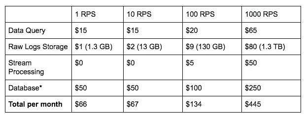

# 分析服务。无服务器分析

> 原文：<https://medium.com/hackernoon/analytics-services-part-3-e3981e694f99>

*无服务器和 AWS Lambda 操作指南*

这是我们关于分析系统的三部分故事的第三部分。在这里，您可以找到回答客户端分析问题的[第 1 部分](/poteha-labs/analytics-services-part-1-d25dd5339977)，以及关于传统服务器端分析实施的[第 2 部分](/poteha-labs/analytics-services-part-2-efba0a516fd9)。

在这一部分，我们将继续向您介绍服务器端分析，尤其是完全基于*云服务*的实现。在前一部分中，我们已经列出了实现的主要步骤。这些是:

1.  数据查询
2.  流处理
3.  数据库ˌ资料库
4.  聚合服务
5.  前端

这同样适用于这里，唯一的区别是每个步骤都尽可能地转移到云服务。因此，我们将按照上面列出的主要步骤的原始顺序，尝试描述潜在的云选项属性以及它们之间的差异。

## **1。数据查询**

在我们的工作中，我们一般更喜欢使用 [Kinesis](https://aws.amazon.com/ru/kinesis/) 。这是一个由亚马逊开发和管理的 SaaS 流媒体平台。这个解决方案比 Kafka 容易得多(包括其自托管和可管理的选项)。它允许实时和批处理，并可以轻松地将数据从客户端发送到流。与 Kafka 相比，使用 Kinesis 的最大好处是您不必操作和管理任何底层基础设施(服务器和集群)。Kinesis 可以通过编程和网络界面进行缩放。以每秒 100 个事件(每个事件 0.5 KB)的速度运行一个分片流的成本大约是每月 20 美元。它转化为每月 2.6 亿次活动(大约。130 Gb 的数据)。

可能的选择:可管理的 Kafka(这要困难得多)，RabbitMQ，或任何其他类似的 pub/子队列。

## **原始日志存储**

Raw logs storage

谈到原始日志存储，我们更喜欢亚马逊消防软管和 S3 的二重奏。

Firehose 是 Kinesis 的一部分，它从生产者那里接收事件，将它们保存一段特定的时间(比如说 5 分钟)，然后批量发送到目的地。反过来，S3 是一个高度持久和可扩展的云存储。值得提醒的是，存储原始日志的主要目的是为了在整个日志传输过程中出现问题时有一个相关的副本。

我们建议将对象分批上传到 S3，以减少上传操作的数量，因为您需要为每一个上传操作付费。这项服务是完全托管的，不需要任何管理。每秒 1000 个事件(每个 0.5 Kb)的成本是每月 9 美元。5 美元用于消防软管，另外 4 美元用于在 S3 存储 130 Gb 的数据。如果你不打算删除前一个月的原始日志，S3 的价格将每月上涨 4 美元。Athena 是一项附加服务，它允许对存储在 S3 存储桶中的数据进行 SQL 查询。

## **2。流处理**

为了处理连续生成的事件，我们需要包含一些允许自定义逻辑创建的平台。例如，Kinesis 对亚马逊 Lambda 很友好。

Lambda 是一个云服务，它允许运行用 Node.js、Python、Java、C#和 Go 编写的业务逻辑，而无需手动管理服务器。简而言之，Lambda 是一个响应触发器(HTTP 查询、计时器或 Kinesis 事件)而被调用的无状态函数。Lambda 会根据同时发生的事件数量自动增减。您只需为函数执行的时间付费:特别是调用和函数的生命周期(每 100 毫秒执行一次代码)。每秒处理大约 100 个事件的估计成本是每月 5 美元。

另一个可能的选择是使用 Docker 开发自己的基于容器的应用程序。Docker 是一个容器平台，它允许您在任何服务器上使用预定义的环境部署代码。与裸服务器相比，它大大减少了部署时间，并允许使用流行的 orchestrator(Kubernetes、Docker Swarm、Rancher 等)配置自动扩展。)不像 Lambdas，容器不设置任何限制(对使用的语言或外部库、持续时间、内存等)。)对于你的系统来说。然而，容器比 Lambda 需要更多的操作和管理。

**我们经常使用的无服务器功能如下:**

*   基本上，我们创建一个中央入口点和一个中央处理器，周围是其他微服务和插件。这是创建事件配置和路由方案的方法。
*   例如，您可以创建一个配置文件，将一整套事件发送到处理模块和指标计算:其中一个发送到聚合，另一个发送到不同的分析系统，等等。
*   因此，这些工作流的每一部分都可以被 Amazon lambda 函数替换。因此，你可以得到一组并行工作的功能，而不是大量的火花流。它们中的一些调用其他的，它表现为相关功能的有向图。

Lambda calls Lambda

Lambda 函数如何调用另一个？有两种方法:直接调用或通过 API。为了进行直接调用，我们使用 [boto3](https://boto3.amazonaws.com/v1/documentation/api/latest/index.html) (这是为 Lambda 内置的)。调用可以是同步和异步的，这样我们只为函数调用付费。相反，使用 API 时，可以使用 restful 接口。但是，API 是付费选项。

无服务器的重要之处在于使用它的方式多种多样。这些是以下方面的发展:

*   WSGI 应用程序(开发只需几个小时)
*   网站
*   聊天机器人
*   MapReduce 架构
*   按需计算

以及您应该考虑的一些限制:

*   运行密集型任务时的 CPU 或 GPU 使用率。这意味着人们不能通过 Lambda 运行高度复杂的计算任务。
*   只有 3 Gb 的内存配额，可以很容易地超过。
*   冷启动。如果很长时间没有人使用该应用程序，在下一次请求时，将发生容器调用，请求处理时间可能会增加 10 倍。要避免这种情况，请尝试使用预热方法:每小时向 lambda 函数发送一个测试事件，以便它保持“预热”。然而，冷启动问题还没有解决。我们相信在不久的将来，其中一个云提供商将会管理它。

## **3。数据库**

为了存储处理过的数据，我们提出研究以下已知的解决方案:Amazon RDS Postgres 和 ClickHouse。

AWS RDS 是一项服务，它消除了常见的数据库管理任务，如备份、安全更新和性能优化。它还有助于副本资源调配。它不是像 DynamoDB 那样完全托管的数据库，但仍然比自己运行 Postgres 方便。Postgres 是一个对象关系数据库，具有许多很棒的特性，但它不是存储尤其是查询分析事件的最佳选择。

幸运的是，有专门为在生产中构建分析系统而开发的列(面向列)数据库。它们对软件开发人员/devops 和数据科学家/分析师都很清楚。最流行的列数据库之一是 Apache 制造的 HBase。它专门针对高负载进行了优化，但是，它很难部署和扩展，并且有一个复杂的 API。

另一个柱状数据库是 ClickHouse。它是由 Yandex 专门为分析服务开发的。它是为使用类似 SQL 的语法进行极快的实时([基准](https://clickhouse.yandex/benchmark.html))查询而设计的。它有各种有用的内置分析功能。我们在 20 亿个条目的数据集上测试了 ClickHouse，大多数聚合查询的执行时间不到 1 秒。

Clickhouse 可以在单台机器上很好地工作，但也可以相对容易地部署到集群中。对于指定的工作负载(每秒 100 个事件)，在 EC2 上使用 ClickHouse 运行一个实例每月的成本从 50 美元到 120 美元不等，具体取决于分配的内存量。通过使用保留的实例，实例的价格可以显著降低:承诺在一年或三年的期限内使用相同的实例。SSD 存储每月每 Gb 0.11 美元。您也可以在自己的硬件上运行 ClickHouse。

## **4。聚合服务**

Big data analysis

由于在步骤 1 中，我们已经创建了一个用于路由所有应用程序事件的通用配置文件，因此现在可以轻松连接任何分析系统。例如，随着新应用程序版本的发布，我们可能会引入新的事件。假设，分析师想通过他们的分析系统界面，比如 Mixpanel 来查看它们。

为了实现这一点，我们应该添加一个用 Lambda 语言支持的[之一编写的新组件:Node.js (JavaScript)、Python、Java(与 Java 8 兼容)、C#(。网芯)而去。这是可以快速简单地完成的事情。请注意，所有模块都可以用 AWS Linux 编译，并且应该与应用程序同时部署，否则它将无法按预期工作。](https://aws.amazon.com/ru/lambda/faqs/)

下面是一个可能的最终架构方案，使用描述的亚马逊服务和几个成本估计。

## 体系结构

*Scheme showing how the final architecture may look*

## 费用

**Cost can be reduced 30–50% when using reserved instances (12 or 36 months commitment)*

# 结论

为企业实施分析解决方案可以通过多种方式实现。我们上面描述的解决方案是一种低成本且易于部署的变体。这是通过一系列 Amazon 和无服务器技术实现的，这些技术允许:

*   使用 lambda 函数微调事件；
*   显著降低和管理成本；
*   平滑缩放；
*   减少花在 devops 上的时间。团队领导自己可以管理和处理部署；
*   快速发布新版本。

**感谢您的阅读！请向我们提问，留下您的评论，敬请关注！在**[**https://potehalabs.com**](https://potehalabs.com)找到我们