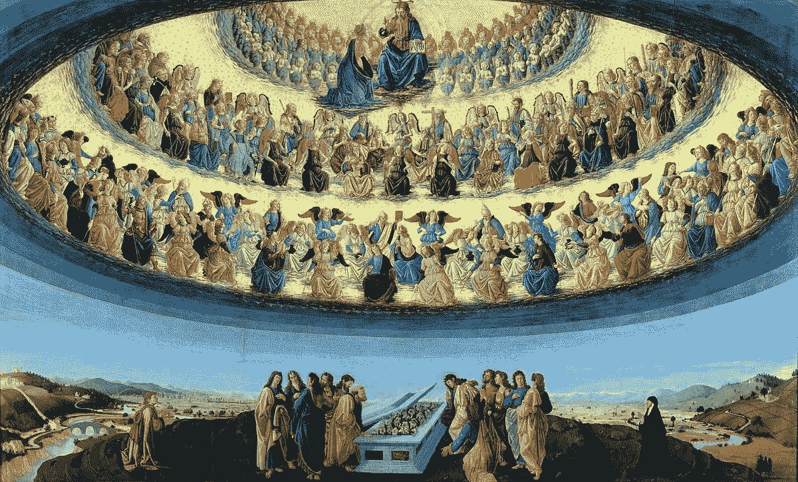

# 天使学和人工智能

> 原文：<https://medium.com/hackernoon/angelology-and-artificial-intelligence-5133f5ab641e>

## 人类思维与非人类思维的关系

The [Assumption of the Virgin](https://en.wikipedia.org/wiki/Assumption_of_the_Virgin_(Botticini)) by [Francesco Botticini](https://en.wikipedia.org/wiki/Francesco_Botticini).

当代关于人工智能的讨论并不是人类第一次与其他非人类大脑的可能性进行斗争。经院哲学家投入了相当大的努力去理解天使，天使被理解为在存在的大链条上高于人类。而[大存在链](http://geopolicraticus.tumblr.com/post/74204805712/beyond-the-great-chain-of-being)的链接代表了从根本上构成世界的不同种类的事物，而不是一个渐进的阶梯，这是今天人们经常解释的。

圣托马斯的 [*神学大全*](https://dhspriory.org/thomas/summa/) 中有很大一部分是关于天使学的:问题 50 到 64 是关于天使的[论文](https://dhspriory.org/thomas/summa/FP.html#TOC03)，它详细描述了天使的本质。在[圣经](https://www.biblegateway.com/passage/?search=Genesis+19&version=KJV)中，天使与人类互动，但人类与天使不是一类存在，所以这就产生了一定的问题。阿奎那(和其他经院哲学家)不畏艰险，直接与天使提出的这些问题搏斗。因为天使不需要呼吸，不需要喝水，不需要吃东西，而人类却需要，所以有些问题必须得到解答，例如，当罗得邀请两个天使到他在所多玛的家，并为他们准备了一顿饭时，发生了什么事。

虽然这些问题很有趣，但更有趣的是关于天使思维的问题——他们如何思考，他们知道什么，以及他们是如何知道的。阿奎那认为([第一部分](https://dhspriory.org/thomas/summa/FP.html)，[问题:54](https://dhspriory.org/thomas/summa/FP/FP054.html#FPQ54OUTP1) ，文章:5)，引用阿威洛依来强调他的论点，天使只是*智力和意志(暗示，天使的头脑没有感觉的成分)，因为他们没有身体自然地连接到他们:*

> “……在我们的灵魂中，有某些力量是通过肉体器官来运作的；这种能力是身体各部分的行为，如眼睛的视觉和耳朵的听觉。灵魂还有其他一些力量，它们的运作不通过身体器官来完成，比如智力和意志:它们不是身体任何部分的行为。现在天使们没有身体自然地与他们结合，正如已经说过的( [*问题【51】*](https://dhspriory.org/thomas/summa/FP/FP051.html#FPQ51OUTP1)*，* [*文章【1】*](https://dhspriory.org/thomas/summa/FP/FP051.html#FPQ51A1THEP1)*)。因此灵魂的力量只有智力和意志可以属于他们。”
> 
> “评论员(Metaph。xii)说同样的事情，即，分离的物质分为智力和意志。最高智慧的生物完全聪明是符合宇宙的秩序的；而不是像我们的灵魂一样。出于这个原因，天使被称为“智力”和“头脑”，正如上面所说(*[*【3】*](https://dhspriory.org/thomas/summa/FP/FP054.html#FPQ54A3THEP1)*，公元 1)。”*

对于来自主流的自然主义英美分析哲学(或多或少意味着我自己的哲学观点)的当代读者来说，托马斯关于天使的论文是一个思想实验，其前提是，“如果有这样的存在，这些存在的性质会是什么？”当我们今天思考强人工智能(或者，我认为更有趣的是，机器意识)的可能性时，我们同样在问，“如果存在这样的存在，即，可归因于机器的思维，这些思维会是什么样的？他们会怎么想？他们的动机会是什么？”

我们会说机器思维没有自然连接的肉体，还是说机器本身就是某种人工智能的肉体？关于人工智能的一个持久的想法是，由于缺乏化身，这将与人类的思想非常不同，阿奎那似乎指出天使与人类非常不同，不仅因为他们缺乏肉体，而且因为他们缺乏肉体意味着天使的思想不同于人类的思想。

困扰人工智能研究人员，尤其是那些推测超级智能的人的一个问题是[正交性问题](https://www.fhi.ox.ac.uk/wp-content/uploads/Orthogonality_Analysis_and_Metaethics-1.pdf)(由正交性论题产生的问题，即。最终目标和智力水平是独立的)。这个问题对于天使学来说是不存在的，因为我们可以确信，*从头开始*，人类和天使的动机，连同所有其他的创造，都与神的目的一致，所以不可能有一个由全知、无所不在和无所不能的神强加给历史的方向性的根本背离。

现在，这是真的，叛逆的人类意志违抗神的目的，事实上撒旦违抗神的目的，但是宇宙仍然按照神的计划展开，尽管有这些不端行为。追求这一点将把我们带入自由意志/决定论辩论的神学置换(值得注意的是，这不是今天提出或辩论的问题)，所以我们必须满足于上帝以神秘的方式工作的想法，并就此罢休。

我们的祖先在神学框架内解决[非人类思维](http://geopolicraticus.tumblr.com/post/72757431998/non-human-minds)的问题，取而代之的是一个自然主义和科学的框架，在这个框架内，我们思考机器的思维、ETI 的思维，以及我们人类在遥远的过去和未来的思维。在这个自然主义的框架中，存在着方向性的形式(尽管不是神的意志),所有的存在都必须与之一致，我指的是时间之箭，因为它们已经被不同地定义和区分。

已经产生了不同的时间箭头列表，我看到的所有列表都包括热力学时间箭头，从而指向一些共识。我认为可见宇宙不断增加的金属性就像热力学时间箭头一样强健，尽管我没有在这些时间箭头列表中看到它。无论你如何选择解析宇宙的不可逆性，如果你认识到时间之箭将不可逆性引入世界，那么这是一个最低限度的自然主义排列，适用于所有的思想，无论是人类、动物、ETI、机器还是其他。换句话说，这些头脑中的任何一个或全部都很少受到时间之箭不可逆转性的影响。

正如我所说，这是一个最小的自然排列。我强烈怀疑，对意识的分析将揭示任何意识与任何其他意识所共有的意识结构，这将意味着会有一些共同的意识结构，以及一些只为更小的意识主体子集所共有的结构。然而，正如我在[中提到的，心灵哲学一定是意识哲学吗？](/@jnnielsen/must-a-philosophy-of-mind-be-a-philosophy-of-consciousness-41d2d9076175)和[扩展认知主义和自然主义](/@jnnielsen/extended-cognition-and-naturalism-426feefe069e)，如果一种心灵哲学不也是一种意识哲学，我们可能不得不分别对待心灵和意识的问题。

如果我们这样做，识别出不同于意识-身体问题的精神-身体问题，这种区别给了我们一个理解机器智能的最小框架，而机器智能不是机器意识(我想，反之亦然)。这种区分有一些潜在的优势。虽然将扩展认知应用于人类或其他生物实现的思维的想法有时似乎有点牵强，但我会毫不犹豫地将扩展认知归因于机器思维。我们插入机器思维的每一个组件，或者我们与机器思维联网的每一个组件，都会构成一种扩展的认知。

在这里，我们可能会遇到机器思维特有的哲学问题，这些问题不适用于(至少现在还不适用于)生物实现的思维。例如，我们将在哪里区分机器思维本身和它的扩展认知？如果我们给机器头脑插入一个新的模块，这仅仅是一个更大的机器头脑，还是一个具有扩展认知的机器头脑？在让机器思维变大或变小的过程中，会出现索瑞特斯悖论的问题:我们能从机器思维中去掉多少组件，而它仍然是一个思维？

