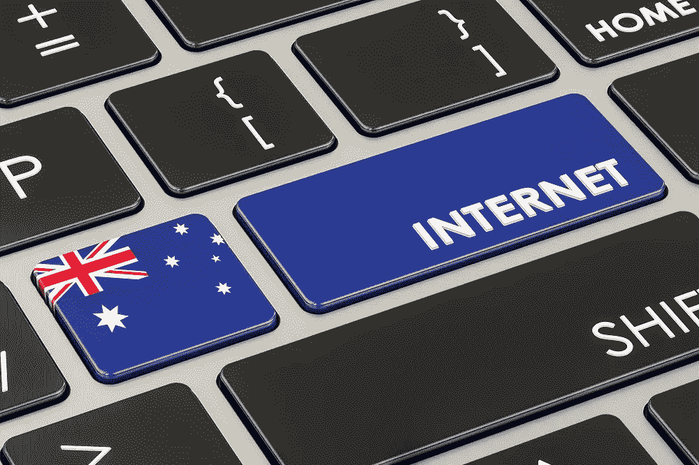

# 反审查活动人士现在应该关注澳大利亚

> 原文：<https://medium.com/hackernoon/anti-censorship-activists-should-be-paying-attention-to-australia-right-now-a7e2b574e74d>

Photo: ronstik / Adobe Stock

在世界上的一些地方，互联网用户有理由期待他们的活动受到私人或政府实体的监控。在一些地方，政府有权下令禁止公民访问它认为不良的材料，或者在强制某些内容下线的决策中给予私人利益很大的影响力。如果你问普通西方人，他们会把这种行为与中国、伊朗或朝鲜的专制政权联系在一起。不幸的是，它并不局限于此。

一些人可能会感到震惊，上述行为在西方民主国家也可能存在。例子包括像德国这样的国家要求互联网平台[在 24 小时内删除不良言论](https://www.politico.eu/article/germany-hate-speech-netzdg-facebook-youtube-google-twitter-free-speech/)，以及英国，自 2015 年以来[一直在打一场不断升级的打击网络色情的战争](https://www.wired.co.uk/article/porn-block-ban-in-the-uk-age-verifcation-law)。这些例子虽然让一些人感到惊讶，但与互联网审查政策最严格的西方民主国家澳大利亚相比就相形见绌了。这就是正在发生的事情，以及为什么它对西方世界的每个人都很重要。

# 在线下

Photo: alexlmx / Adobe Stock

当大多数人想到澳大利亚时，他们可能会描绘出一个有点进步的地方，并知道它是一个年轻但稳定的民主国家。这也是一个对互联网接入有着相当超前思维的地方， [NBN 的覆盖面](https://www.dodo.com/nbn/nbn-rollout-map)现已覆盖全国大部分地区。然而，当涉及到互联网内容时，他们有着接受或至少尝试审查的悠久历史。第一个明显的迹象出现在 2007 年，当时政府宣布所有的互联网服务提供商必须向所有家庭和学校提供所谓的“干净的信息”,这些信息已经被预先删除了不良内容。撇开这种请求的不可预测性，以及政府最终放弃该计划的事实，它标志着政府开始采取积极的方法来控制澳大利亚人在网上可以看到或做什么。

# 滑坡

失败的“清洁饲料”过滤计划绝不是澳大利亚政府阻止它认为有害的物质的最后一次尝试。事实上，2013 年美国企业监管机构屏蔽 1200 个与欺诈有关的网站的努力意外导致超过 25 万个其他网站在美国被屏蔽。然后，在 2015 年，政府赋予当地和国际版权所有者权力，[强迫互联网服务提供商屏蔽他们声称侵犯其受保护作品的整个网站。隐私和言论自由专家将该法律描述为越权，并抨击其为措辞模糊的法规，往好里说是无效的，往坏里说是被权利持有者滥用。](https://arstechnica.com/tech-policy/2015/06/australia-passes-controversial-anti-piracy-web-censorship-law/)

# 预言实现了

Photo: LP2Studio / Adobe Stock

碰巧的是，批评家们说得有道理。快进到 2018 年，根据 2015 年的法规，我们现在有了一项裁决，允许权利持有人要求互联网服务提供商屏蔽合法侵权网站中的一个网站，这个网站肯定会引起一些人的关注:【Opensubtitles.org。乍一看，屏蔽一个为电影提供众包字幕的网站可能会引起许多人的耸肩，但实际上，这树立了一个危险的先例。这项裁决实际上是将这样一种观点法律化了，即即使是出于公平使用的目的免费提供的作品，也可能被视为盗版并受到惩罚。

这一点很重要，因为澳大利亚的现行法律只允许在“网站的主要目的是侵犯或便利侵犯版权(无论是否在澳大利亚)”的情况下，在全国范围内屏蔽网站。认为字幕文件“助长了侵权”或者没有合理使用的论点可以让开放字幕不受影响，这似乎有点牵强，但不管怎样，这一裁决仍然有效。如果这就是故事的结局，那就够令人不安的了，但是版权所有者并不满意。他们想要更多，而且可能会得到。

# 夺权

目前，澳大利亚议会正在讨论一项对现有法律的修正案，该修正案将使版权所有者更容易迫使网站离线。提案草案将修改现有的法律语言，将“主要影响”是侵权的网站包括在内。这意味着像 YouTube 和其他大型视频提供商这样的网站在澳大利亚很容易受到虚假版权声明的攻击。

该提案还将允许索赔者寻求禁令，以防止搜索引擎包括他们声称侵犯他们权利的结果，网站所有者几乎没有追索权，公众也没有明确的方式知道什么被删除了。这将创造一个系统，用户几乎看不到滥用行为，他们将无法知道有多少互联网被屏蔽在他们的视野之外。

# 下一步

Photo: Stringer Image / Adobe Stock

虽然上面提到的变化足以让每个澳大利亚互联网用户担忧，但还有一个变化应该在整个国家和所有其他西方民主国家拉响警报。除了降低屏蔽网站的门槛，该语言还允许法院命令屏蔽“在禁令发布后开始提供在线位置访问的 IP 地址”。这意味着权利持有人可以要求进一步阻止，而不必诉诸法庭，他们可以要求阻止发生在 IP 级别，而不是通过 DNS 名称。这种模糊的语言可能会让索赔者基于他们正在“提供访问”被屏蔽网站的理论，屏蔽外国的 VPN 服务器等东西，而政府或法院不会进行监督。

# 底线

现在，还不知道当前提案中的语言是否会成为法律。如果是这样的话，这预示着澳大利亚的互联网未来，用户不仅可能被拒绝合法访问世界任何地方的合法网站和服务，而且他们甚至不会得到通知。对于其他西方民主国家的居民来说，他们可能认为这不是他们的问题，考虑一下这个——澳大利亚当前的互联网审查法律制度反映了一个在美国被[险胜的版本](https://techcrunch.com/2017/01/18/the-day-the-internet-stood-still/)和一个在欧盟被[击败的版本](https://www.euractiv.com/section/digital/news/goodbye-acta-eu-parliament-rejects-anti-piracy-treaty/)。

如果澳大利亚推进他们的提议，预计它将成为世界其他地方新的限制措施的典范。没有人能保证激进分子会在第二次全球斗争中获胜，所以澳大利亚发生的事情可能是“自由”世界将会发生的事情的预演。如果这听起来像是一个你不想成为其中一部分的世界，那就关注澳大利亚并传播这个消息。