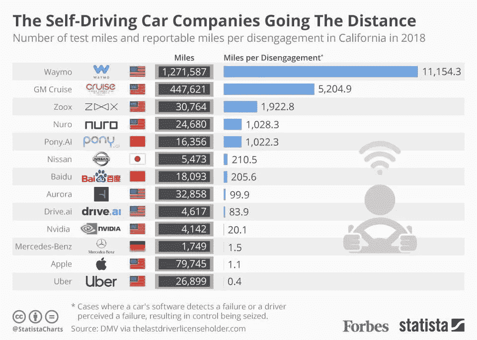

# 苹果和优步在自动驾驶汽车排行榜上落后

> 原文：<https://medium.com/hackernoon/apple-and-uber-lagging-in-self-driving-car-league-table-ac5162e8f43c>

自动驾驶汽车经常出现在新闻中。技术进步很快，但我们离“完美”还差得很远。有相当多的公司致力于测试车辆，特别是在加利福尼亚州，重点是提高安全性和汽车的软件功能。Statista 的数据分析师 Niall McCarthy 在《福布斯》上写道，“脱离接触及其原因是测试过程的关键部分。”什么是“脱离”？脱离是指当汽车的软件检测到问题，或者司机看到一些危险即将到来，然后能够控制汽车，所以它不再是自动驾驶。

根据网站[公布的来自加州车管所的数据，最后一个执照持有者](https://thelastdriverlicenseholder.com/2019/02/13/update-disengagement-reports-2018-final-results/)，测试车型经历了不同程度的脱离。例如，谷歌的 Waymo 在“完美的自主性”方面遥遥领先。该公司的汽车在 2018 年行驶了令人印象深刻的 127 万英里，但更令人印象深刻的是，测试车队每次脱离行驶了 11，154 英里。

去年，有 28 家公司在加州的公共道路上积极测试自动驾驶模型。这相当于 467 辆车在自动模式下行驶了 2，036，296 英里，发生了 143，720 次脱离。

从统计数据来看，谷歌做得很好。而且它比[苹果](https://hackernoon.com/tagged/apple)或[优步](https://hackernoon.com/tagged/uber)做得更好，这两家公司都在开发自动驾驶汽车。Niall McCarthy 报道，“优步的汽车行驶了近 27，000 英里，但每次脱开仅行驶了 0.4 英里。类似地，苹果每次脱离 1.1 英里，总共行驶了不到 80，000 英里。通用 Cruise 以 5205 英里位居第二，Zoox 以 1923 英里位居第三。

看到优步和苹果在 Statista 的排行榜上落后于最后一名确实有些奇怪，而梅赛德斯-奔驰与他们仅一步之遥。就连日产(Nissan)也在中间位置做得更好。的确，他们都有办法追上 Waymo！