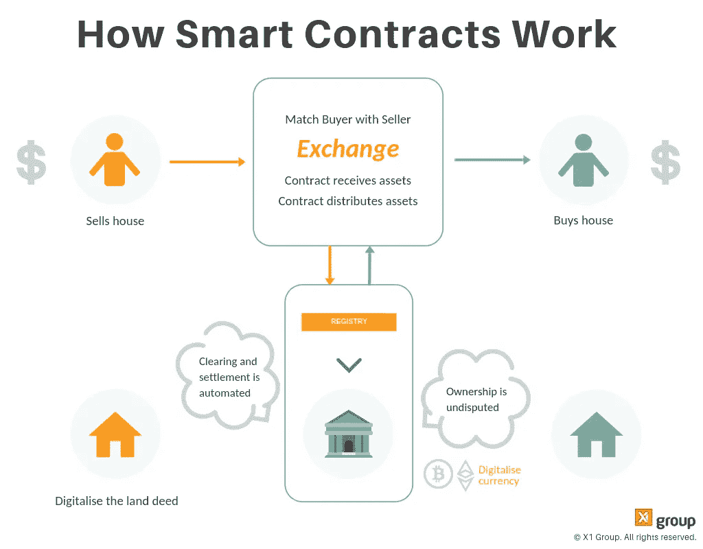

# 加密货币是真实的货币吗？

> 原文：<https://medium.com/hackernoon/are-cryptocurrencies-actual-currencies-55dc76111e9c>

Photo by André François McKenzie on Unsplash

加密货币现在是一个合法的时髦词，了解人们对它的看法非常有趣。不像区块链，人们还在努力解释他的意思，加密货币更多的是和钱联系在一起，只是以数字的形式。更有甚者，如果我们谈论的是硬币——它是钱，但可编程。而且也不代表一个随便的用户就掌握不了；相反，每个人现在都可以控制这种货币，只要他们知道如何管理它。[比特币](https://bitcoin.org/en/)(尽管它在过去几个月里大幅下跌)和[以太坊](https://www.ethereum.org/)(目前其价值远低于比特币)是两种最大的货币，已经吸引了无数之前不知道密码的用户。

但是为什么人们认为 CC 容易掌握呢？嗯，虽然它被许多编程术语所包围，但整个概念都是关于两个术语:硬币和代币。

两者都是加密货币，但主要区别在于，代币允许你成为项目网络的一部分:你可以获得它的份额，并访问特定生态系统内专用的特定功能。

另一方面，硬币更像是一种数字货币，由于被集成到众多支付系统中，它允许你购买某些东西。硬币可以被开采、发送或接收，并对任何想加入网络的人开放——一个公共开放的区块链欢迎任何人。
重点是:你可以用硬币购买代币和其他商品，反之则不行。

硬币的运作方式几乎没有限制；当你在数字领域运营时，它们可以无缝地取代真实货币，并给予某些好处——在进行交易时，缺少第三方是一个明显的优势。当然，它不会让你在小摊或杂货店买东西，但鉴于它接近支付系统市场的速度，你不可能找到更适合你网络活动的东西。虽然现金正在变得过时，我们距离它的消失只有几年的时间[，至少在最发达的国家](https://www.weforum.org/agenda/2018/11/sweden-cashless-society-is-no-longer-a-utopia/)，但常规的数字支付是你可以与 CC 正面交锋，看谁会胜出。

为了展示这种货币在我们日常生活中的实际用途，让我们来看看这种货币的一些常见用法:

# **直接数字支付**

我们经常将支付视为与银行相关的事情。但是，首先，不是每个人都能获得银行服务，更不用说账户或信用卡了。第二，许多用户仍然不信任银行——即使是透明的企业也不能保证他们会受到客户的喜爱。他们仍然依赖于无数可能阻碍资金顺畅流动的法规:一些交易类型只是受到限制或不被允许，加上人为因素可能导致管理用户资金时出现缺陷:无论是错误还是不忠实的管家。技术困难是另一个无法解决的问题，它只会导致某些银行产品的中断:如果服务器宕机，除了等待它们重新上线之外，没有其他办法。周末只是增加了银行服务在最近几年变得更加过时的原因。

另一方面，CC 没有这样的缺陷——你不必依赖一个值得信任的合作伙伴，可以在世界任何地方随时访问你的钱包，物理存在只是消失了。

# **智能合约**

有趣的是，使用区块链最聪明的方法之一是……聪明的合同。加密货币是可编程的，因此容易受到脚本的影响——它们遵循事先设定的条件。简而言之，整个概念都是关于做一些你认为是有大量变量的数字合同。让我们想象一下，你希望你的亲戚在他/她到了青春期的时候能收到一笔钱。一旦两个钱包都创建好了，钱也动起来了，发送者就把钱的控制权交给一个独立的数字信托，当条件满足时，这个数字信托就会自动触发。这消除了聘请律师和通过无数法律程序的需要，更不用说它是无诈骗的——区块链供电的系统是公正的，并及时支付款项。

Image courtesy: [X1 Group](https://x1group.com/)

智能合同已经在租赁、保险、法律和金融业务中占据了一席之地，以降低费用并为用户提供便利。例如，Insurtech 现在处于实施智能合同的最前沿——它们允许跟踪无数参数，并根据发生的事件和场景触发行动。

# **价值保障**

CC 现在是储存财富最安全的方式之一。你不仅可以从外部交易方那里获得自由，而且整个支付过程都有一个特殊的批准——一个“私钥签名”。这意味着持有者是唯一能控制他/她的钱的人，其他任何人都不能影响他/她的花费。

对于生活在经济不稳定国家的居民来说，这是一个很好的场景。**以委内瑞拉为例**；他们的悲惨遭遇刺激了许多人把钱存在银行之外，这个国家现在是使用 CC 的领导者之一。由于法律允许没收个人财富，CC 已经成为政府无法触及的避风港——私钥是他们保护收入的最佳保证。

另一个关键因素是通货膨胀:如果国家经济失败，政府发行的货币就没有任何意义。当一周内货币贬值，价格低于卫生纸时，CC 是保护这些财富价值的主要方式。虽然硬币的价格也会变化，但这是一个更安全的赌注，因为它不会变化得很快，也可能会增加(基本上是 50/50 的机会)。

Photo by Chris Liverani on Unsplash

由于最近的危机，乌克兰也看到了 CCs 的力量:其居民也是活跃的加密用户。虽然他们的经济经历了比委内瑞拉更少的衰退，但硬币成为了那些想要储蓄和增加财富的人的首选，特别是当许多银行失去执照或进入动荡阶段时。

这对经济繁荣的国家来说也很好。网络安全仍然是他们机构的主要担忧——银行需要大量个人数据来验证交易。这通常包括出生日期、信用卡号、姓名和凭据，这些信息随后可能会受到恶意软件的攻击。CCs 不受您个人数据的限制，只需最少的此类信息就能发挥作用，保护您的商业免受各种欺诈。

# **微交易**

在移动业务(主要用于应用和游戏)中变得流行之后，微交易开始在 CC 世界中站稳脚跟。

越来越多的公司倾向于这种类型的货币化:你不再需要以全价购买产品或支付昂贵的订阅费。相反，你只需要为那些你感兴趣的小内容付费。无论是游戏的数字副本还是被锁定在付费墙后的媒体渠道，现在你都可以在免费使用的模式下体验它们，但只需为你心爱的产品支付几分钱。然而，这带来了这些支付应该如何进行:当你确实需要支付一毛钱，但最低费用是 25 美分时——进行这样的购买只会让第三方更高兴，而不是卖家/买家二人组。此外，某些支付系统甚至不支持这种交易:可能会发生不到 5 美元的购买不被允许的情况，而这正是加密货币的优势所在。

> 因此，当交易价格在 0.01 美元到 3 美元之间时，最好使用低收费或免费模式，这种模式不需要大量相关的购买信息。

加密货币还可以实现计量购买——前提是你只需支付 1 分钟的 wi-fi 接入费用，以防你需要查看电子邮件，而不是 1 小时。你只需支付你所需要的，没有额外费用。

# **存储**

如果您需要存储一些可能会被当局删除的数据，该怎么办？你猜对了，区块链是个不错的选择。例如，如果管理得当，以太坊允许存储较小的数据。如果有，比如说，关于高层官员犯罪或腐败的信息，你可以确信当使用**以太坊**时，进一步暴露给更广泛的观众是安全的。

你可能会问，但是 CCs 呢？好吧，有一个巧妙的解决方案——只需将信息附加到交易元数据中，这样它就会在互联网上永久保存，任何外部方都无法跟踪。听起来像犯罪团伙如何使用现金作为上面有一些文字的纸币；现在这种技术变得又快又安全。

尽管一开始有点昂贵，[一些公司](https://storj.io/)几乎准备好以适中的价格提供一种分散的方式来存储你的文件，就像 Dropbox 一样。

# 那么，它们是真的吗？

通过上面提到的几个用例，我们认为很明显，当涉及到定期支付时，CCs 提供了大致相同的价值。数字化是不可避免的未来，CCs 是朝着正确方向迈出的一步——在过去，许多人不愿意用信用卡取代现金。基本上，它就像一种真实的货币，唯一的限制是货币进入支付系统的速度；我们离通过 CC 钱包购买任何商品还有一段距离。

就目前而言，它仍然不是为你考虑如何更好地投资的“聪明钱”，而是如果你想让你的交易安全的可靠投资。你当地的银行不会介意与当局分享你的数据，就像谷歌或脸书对研究和广告公司所做的那样，所以需要多少隐私由你决定。

考虑到这一点，最大的优势是 CC 解决了实际货币无法解决的问题:安全问题和交易费用。网络安全和微交易是 2018 年最常见的流行语之一，看起来它们的影响只会在未来增长——这是 CCs 增长并很快成为“货币”的另一个重要原因。