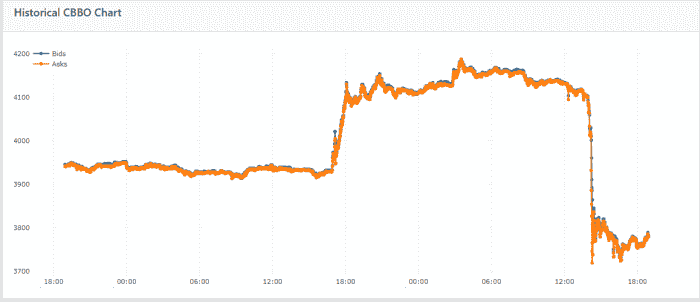
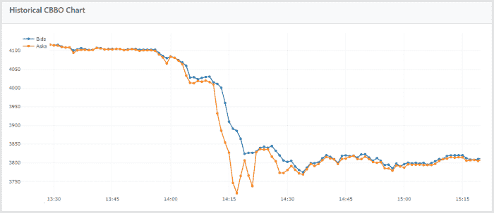
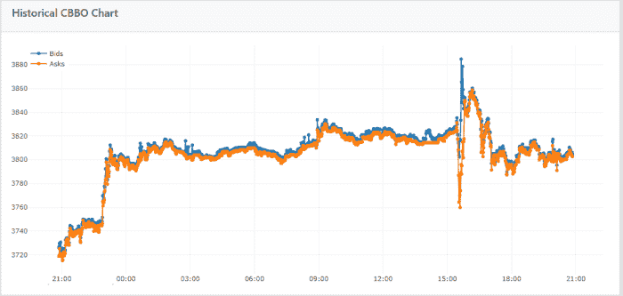
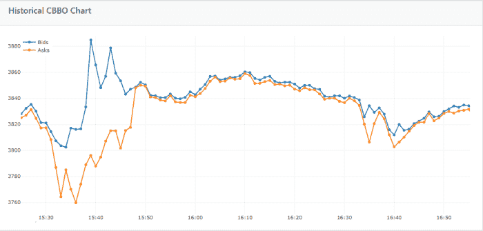

# 操纵市场的比特币交易者是邪恶的，还是愚蠢的？

> 原文：<https://medium.com/hackernoon/are-market-moving-bitcoin-traders-evil-or-just-dumb-850f3dfa6186>

在过去的一周里，我们已经看到了几个案例，在这些案例中，解释比特币价格波动的唯一方法是，交易员是愚蠢的、邪恶的，还是两者兼而有之。在深入研究细节之前，重要的是要明白，这种事情不再发生的唯一方式是交易者变得更聪明，开始使用整合所有相关市场数据的工具(如 CoinRoutes 提供的工具)。

本笔记将描述的两个例子是上周日上午超过 400 美元的价格下跌和昨天(周四)上午发生的价格背离，当时市场同时走向相反的方向。

**例子# 1:比特币在周日早上暴跌 400 美元……**

技术指标——BTC 在本周大部分时间持续走高后，周六出现了 200 美元的大幅协调反弹，然后在周日早盘结束后继续横向交易。然而当时比特币遭遇直线，草率的跌了 400 美元，随后企稳。

这是什么意思？首先，比较动作是有教育意义的。上涨幅度大约是下跌幅度的一半，而且是以协调的方式在多个交易所发生的。那次上涨大约是 200 美元的峰值，从外部角度看，这是买方检查多个场外交易柜台流动性的结果，结果是市场受到影响，这一举动发生了。我之所以假设这一点，是因为这一变动在交易所之间协调得很好，表明相对成熟的公司正在买入。

另一方面，周日的下跌很可能是愚蠢或操纵的例子。愚蠢，如果这是一个合法的卖家，因为他们不加选择地在交易所竞价，压低价格，同时由于草率的抛售创造套利机会。同样值得注意的是，下跌发生在交易周流动性最差的时候(美国时间周日上午，亚洲正在睡觉，大多数美国和欧元参与者没有交易)。

以下由 CoinRoutes 软件制作的“放大”图表很好地描述了这两个动作。首先，向上移动，最佳出价和最佳报价之间几乎没有区别:

接下来，我们放大向下移动，可以看到最低报价和最高报价之间的巨大差距，最高报价一度超过 150 美元:

这些图表显示，当下跌 400 美元时，卖方没有像买方那样注意他们的订单，很可能在市场上或通过他们使用的经纪人过于激进地出售。

然而，不幸的是，发生这种情况还有另一个潜在的原因，这相当令人不安(因此在标题中使用了“邪恶”一词)。这可能是市场操纵的一个例子。

为了解释操纵者可能使用的潜在策略，考虑以下情况。假设一家公司计划在周五开始积累 BTC，同时通过在 Bitmex 等市场建立空头期货头寸来对冲该头寸。当他们在现货市场积累了足够的 BTC 后，他们很可能会继续卖出期货几个小时，因为期货市场的流动性更大，尤其是在周末。周日早上，他们可能会尽可能草率地抛售他们在一周内积累的所有 BTC，目的是压低期货价格，以便他们可以从他们的空头头寸中获利。我想澄清的是，我并不直接知道采取了这样的策略，但可以肯定的是*可能已经被使用了。这种交易策略通常被称为“流动性套利”，如今被所有主要监管机构视为操纵行为。(尽管应该指出，这种交易策略在上世纪 90 年代由日本指数期货和股票等市场中的最大参与者相当定期地采用。)*

***例子#2:比特币交易者走向不同的方向***

*当我昨天早上(周四上午 10:40 左右)在演示 CoinRoutes 平台时，我们注意到 CoinRoutes RealPrice 显示比特币的出价高于出价。虽然比特币总价格的交叉市场很常见，但真实价格交叉的情况非常罕见。这是因为 RealPrice 考虑了费用以及账户上的订单规模，而在比特币中，费用通常远远大于价差。当我们调查所发生的事情时，我们看到比特币基地专业版的出价比 itBit、Gemini 和其他市场的出价低大约 90 美元。大约 20 分钟后，情况恢复正常，但来自 CoinRoutes 历史工具的图表很好地显示了差异。首先，让我们来看一下 24 小时图表，以了解这一变动的背景:*

**

*请注意看起来奇怪的波动，上下波动几乎同时发生，代表着买价和卖价之间大约 100 美元的差异。要了解实际发生了什么，我们可以放大到出现背离的特定时期:*

**

*正如你从图表中看到的，每个平台上的交易者在不知道其他市场正在发生什么的情况下行动，在一些市场上抬高比特币的价格，同时在另一个市场上压低比特币的价格。这当然造成了不必要的波动，但必须指出的是，那些以低价卖出或高价买入的投资者损失了相当多的钱。重要的是要明白，机构投资者对此类事件感到困扰，因为这种结果违反了最佳执行的合理原则。然而，好消息是，使用 CoinRoutes 等交易算法的交易者将拥有巨大的优势，因为他们将站在这种分歧交易的正确一边。*

*还值得注意的是，这个例子不太可能有恶意，因为很难看出这种交易如何被视为操纵。*

*结论:*

*虽然这两个事件的范围和可能的原因不同，但它们都指出，对于加密投资者来说，使用了解多个市场价格的系统进行交易是至关重要的。没有这样的认识，类似的事件将继续发生，损害投资者的信心。然而，如果大量加密投资者使用这类工具，这类算法在交易时系统利用价格差异的能力将削弱它们的影响。毕竟，这种发展是金融市场发展的自然组成部分，对于加密市场来说尤其受欢迎。*