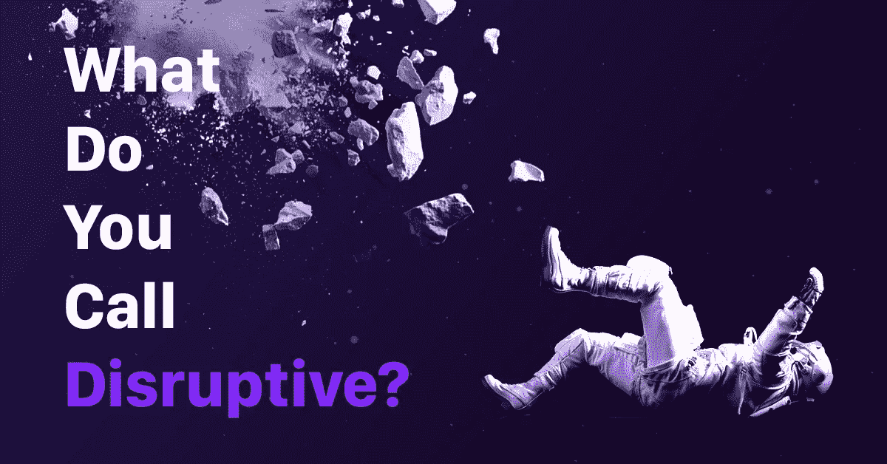
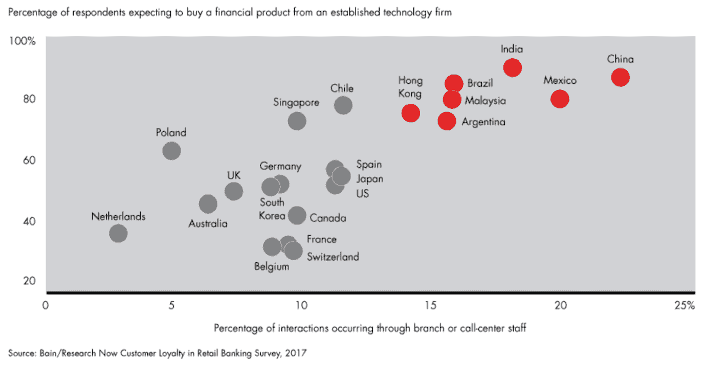
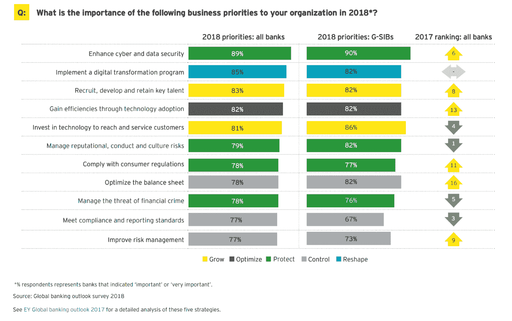

# 你是说苹果卡是“颠覆性的”吗？

> 原文：<https://medium.com/hackernoon/are-you-calling-the-apple-card-disruptive-ba122048ef3c>

## 科技巨头没有颠覆性。但是他们可以赢得与银行的“游戏”。

我和全世界数百万人一起，“虚拟地”站在詹妮弗·贝利面前，介绍新的苹果卡。花了几个小时，如果不是几分钟，媒体开始推出标题，描述这张信用卡为“[破坏性](https://irishtechnews.ie/how-apple-card-can-disrupt-the-decades-old-credit-card-industry/)”。但作为 Visa 的前总经理和一家领先数字支付解决方案的现任首席执行官，我想知道:“Apple Card 真的是支付行业的颠覆者吗？”

要回答这个问题，我们必须首先达成共识，至少在语言上。记者和博客作者现在用“破坏性”一词来描述任何一个行业被新的或现有的参与者动摇的情况。但是“动摇”并不意味着改变。有趣的是，几天前我在《哈佛商业评论》上看到了一篇[的文章](https://hbr.org/2015/12/what-is-disruptive-innovation)，题为“什么是颠覆性创新？”。根据定义，中断源于两个可能的“立足点”之一:

*   低端“立足点”:当市场参与者专注于为利润最高、要求最高的客户提供更好的服务时，低端客户往往被抛在后面，受困于平庸的服务。在这种情况下，颠覆者试图通过提供“足够好”的替代方案来抓住低端客户。
*   新的市场“立足点”:这是关于创造一个新的市场。以 Crypterium 为例，我们允许数字资产的持有者以简单、快速和低成本的方式离线和在线使用它们。迄今为止，这几乎是不可能的。在我们的例子中，破坏将非客户(密码持有者)变成了客户(密码用户)。

再看看苹果卡，它似乎不符合这两种情况。它既不是针对低端消费者，也不是创造一个新的市场。毕竟，自 1949 年弗兰克·麦克纳马拉在纽约外出就餐时忘记带钱包以来，信用卡就已经存在了。你好[食客俱乐部](https://www.dinersclubus.com/home/about/dinersclub/story)！

“当我看到公告时，我的反应是，首先，在竞争中，卡中的所有功能都是我们今天的产品，[……]卡本身的塑料刷卡，一直到移动和电子钱包，”美国银行的技术和运营总监凯茜·贝桑特在接受[美国消费者新闻与商业频道](https://www.cnbc.com/2019/03/27/bank-of-americas-tech-chief-says-nothing-new-about-the-apple-card.html)采访时说。

我的反应没有什么不同。“简单、透明和安全”作为一种价值主张并不是什么特别新颖的东西。看看我的手机，我有十几个银行和支付应用程序，都为我提供了这一主张。这让我想到了第二个问题:如果 Apple Card 不能提供真正革命性的产品，那为什么还要进入支付市场呢？

# **关于“基地”的一切**

苹果正试图使其收入来源多样化。他们并不孤单。科技行业的其他巨头，如谷歌、亚马逊和脸书，也在竞争通过将支付引入流量来利用他们现有的庞大客户群。

上周，我在伦敦非正式地会见了脸书支付团队的一个人。简短的会议证实了社交平台在支付领域的公共利益。扎克伯格在任何脸书的点对点支付解决方案背后的明确意图是最终在全球范围内推出社交支付，为创建社交市场打开大门——利用脸书的所有公司资产。

脸书旗下的 Whatsapp 已经在印度测试其电子支付服务 Whatsapp Pay，印度是该应用最大的市场之一(用户超过 2 亿)。选择印度作为测试市场的另一个原因是，当地银行对客户的数字化服务不足，贝恩公司(Bain & Company)的研究人员认为，这与公民直接使用科技公司金融服务的意愿直接相关。

回到【2018 年 2 月，Whatsapp Pay 面向有限数量的用户开放。自那以后，该公司一直在努力从印度监管机构获得全面部署的绿灯。

参加测试的“幸运儿”应该在一家支持统一支付接口(UPI)的银行拥有一个银行账户，该接口可以使用智能手机在银行账户之间进行实时转账。就像苹果与高盛一样，脸书也依赖于利用银行合作伙伴关系来实现生态系统，但可能会减少他们的潜在利润。

这很好地解释了围绕脸书发展自己的数字货币的强烈市场传言。我说的是[脸书币](https://www.bloomberg.com/news/articles/2018-12-21/facebook-is-said-to-develop-stablecoin-for-whatsapp-transfers)——据称是一种与美元挂钩的稳定货币，它将允许用户通过 Whatsapp，以及后来可能的 Facebook Messenger 即时收发资金。

这是一个明智的选择。以他们自己的加密货币进行交易将确保来自这一新收入流的所有利润都留在脸书的系统内，而不是进入合作伙伴。巴克莱互联网分析师罗斯·桑德勒估计，到 2021 年，脸书硬币可以产生 190 亿美元的额外收入。

如前所述，所有科技公司都想从拥挤的电子支付市场中分一杯羹。谷歌在 2017 年与四家大型银行合作，推出了 Tez——它自己在 UPI 上运行的移动支付系统。颠覆性？不。创新？也许吧。对于大型科技公司来说，它们的网络效应依赖于广泛的用户基础，通过引入 P2P 支付解决方案，还可以将所有人(或我们中的大多数人)带入一个单一的、高收入的生态系统。

# **然后就没有了**

许多人过去认为银行有点像中世纪的医生。他们中的大多数都很可怕，你很有可能会死在他们手里，但是还有什么呢？今天，情况不再是这样了。我们不仅有更多的银行选择，还有新的替代解决方案，如 PayPal、Apple Card 或 Crypterium 等真正的颠覆者。

德勤(Deloitte)“千禧一代和财富管理”的一项调查显示，近 57%的美国千禧一代受访者愿意为科技平台更换银行。然而，当“信任”一词发挥作用时，银行仍然受到高度重视。

比尔·盖茨在 1994 年说过:“虽然银行业是必要的，但银行不是。”银行的生存在很大程度上取决于它们的适应能力。随着大型科技公司迅速侵蚀行业之间的界限，提供更便宜、更快捷、更方便的服务，时间就是一切。银行是否以应有的速度改变了？

不确定“快”，但银行肯定在努力改变。他们在努力。安永会计师事务所(Ernst & Young)最近开展的一项研究显示，全球前 200 家银行中有 85%将实施数字化转型计划视为主要业务重点。

巴克莱银行是银行尝试新技术的一个很好的例子。在 [2016](https://www.reuters.com/article/us-banks-barclays-blockchain/barclays-says-conducts-first-blockchain-based-trade-finance-deal-idUSKCN11D23B) ，该金融机构在区块链进行了第一笔贸易交易。通常情况下，一项贸易协议至少涉及 20 方，需要 10 多天才能完全执行。利用区块链技术，一切都发生在眨眼之间。

作为一名前银行家，我知道传统银行的遗留系统让新技术的引入变得极其困难。即使在今天，发达国家银行使用的大部分核心银行系统都是几十年前的产品。这些系统无法轻松应对即时开户、快速交易处理、透明和即时的客户信息更新等。

另一个阻碍银行发展的因素是监管。尽管世界已转向后危机阶段，但政策制定者仍对银行监管框架持谨慎态度。安永的同一份报告指出，“银行不应指望合规要求会放松。事实上，银行面临的压力可能会增加，因为世界各地的监管机构都在实施各自特定版本的巴塞尔改革，而且监管机构也在制定银行必须应对新技术挑战的规则。”

我们以香港为例。该市最近开放了电子资金牌照，以便科技公司和银行可以在监管框架内运营。但是这些许可证并不便宜。你需要有超过 3 亿港元(约 4000 万美元)的资金才能得到一个。大部分初创企业都没有这样的资金。但科技巨头和银行会。渣打银行(我曾在该行担任客户体验主管)是申请牌照的主要机构之一，其他几家如腾讯和蚂蚁金服。

一旦香港金融管理局(Hong Kong Monetary Authority)发放牌照，渣打银行(Standard Chartered)及其合作伙伴将推出移动银行服务，以覆盖精通科技的千禧一代。

渣打银行(Standard Chartered Bank)首席执行官比尔温特斯(Bill Winters)表示:“在这个过程中，我们学到了很多东西[……]我们学到了很多关于建立合作关系的知识，试图创造一种超越传统银行产品的用户体验。”。

# **无基础，无资金，独特主张**

新进入者没有庞大的用户群，也没有现金。但他们拥有其他科技巨头或银行没有的东西:提供独特的、以客户为导向的价值主张的灵活性。这些是真正的颠覆者。

肯尼亚中央银行的最新记录显示，肯尼亚有【2,852 台自动取款机(2018 年 4 月)。M-Pesa 是一家基于手机的转账、信贷和小额信贷服务公司，拥有超过 12 万名代理人，分布在整个非洲国家。只需很少的费用，肯尼亚人就可以支付基本服务，互相转账，甚至获得薪水。都是虚拟的。如果他们需要现金或充值，有很多街角商店和售货亭可以满足他们的需求。该服务现已被 96%的肯尼亚家庭使用，该国近 25%的国内生产总值通过 M-Pesa 处理。这就是颠覆。

那么…M-Pesa 成功的背后是什么？在 Visa 工作期间，我们对 M-Pesa 模型进行了大量研究。我想说，M-Pesa 通过在正确的时间和地点，以正确的方式向正确的人提供正确的服务，获得了它的颠覆者“奖牌”。

它为大部分没有银行账户的人提供了一种使用手机进行货币兑换的数字方式，在这种情况下，汇款发挥了重要作用。M-Pesa 背后的电信运营商 Safaricom 拥有广泛的客户基础。这自然也有助于它的成功。此外，由于当地监管机构非常支持，这使得他们能够更快、更顺利地推出产品。虽然 M-Pesa 模式无法在许多其他地方复制，但我们可以从他们那里学到一点:初创企业必须以客户为中心的价值主张进入市场。我们现在也看到非洲的新区块链初创企业，如 Wala，将开放的金融服务提升到了一个新的水平。

以创新技术为基准，如区块链，也可以成为建立稳固竞争优势的重要方式，以吸引客户，或者在某些情况下，创造客户。这正是我们在 [Crypterium](http://crypterium.com/) 的整个团队正在做的事情:交付一个独特的客户驱动的提议。对我们来说，这使加密货币持有者能够将所有数字资产放在一个钱包中，在线和离线使用，或者以最低成本自由转移到银行账户或万事达卡账户。我们正在测试和引入贷款和存款等新服务，让客户能够将我们作为一种“加密银行”来使用。

总之，尽管不具备真正的颠覆性，但科技巨头完全有机会在金融服务业确立自己的稳固地位。财大气粗、庞大的用户群和网络效应是他们的优势，他们有能力利用这些资产构建支付生态系统。对于银行来说，它们需要弄清楚如何在这个新世界中“玩”，并能够利用技术提供的机会。他们拥有信任和忠诚客户的资产，但如果他们不想简单地成为公用事业公司，就需要更加灵活，减少风险厌恶。一种方法是与那些像其他小型初创企业一样了解客户的人建立合作伙伴关系，这些人是依靠敏捷性和以客户为中心的价值主张作为主要武器的颠覆者。在新的世界里，也许所有人都将以不同的方式颠覆和赢得胜利。

