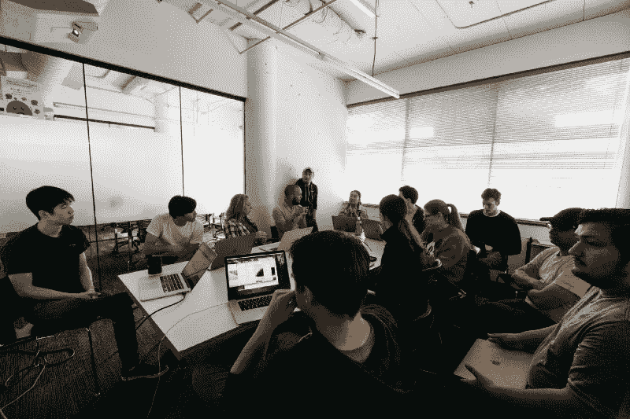

# 你是否陷入了为快速增长而招聘的第 22 条军规中？

> 原文：<https://medium.com/hackernoon/are-you-stuck-in-the-catch-22-of-hiring-for-hyper-growth-b63c7ab9df9e>

## Karat 首席技术官尼尔·库马尔分享了在不牺牲产品期限的情况下达到招聘目标的技巧

2018 年，投资的风险投资(VC)资金总额为[1310 亿美元](https://pitchbook.com/news/articles/a-breakout-year-for-venture-capital)，超过了[2017 年全年投资的 840 亿美元](https://nvca.org/pressreleases/record-unicorn-financings-drove-2017-total-venture-capital-investments-84-billion-largest-amount-since-dot-com-era/)。与 2017 年相比，所有投资阶段的风险投资交易规模中值都出现了两位数的百分比增长，这是自 2015 年以来的最高增幅。

这些基金的主要投资目标是软件驱动的公司，它们的产品和解决方案有望改变我们做一切事情的方式，从我们如何通勤到我们治疗癌症的方式。这些基金通常投资于短期内表现出巨大潜力的公司，将它们推向超高速增长模式。如果这些高速增长阶段的公司将资本投入到正确的团队并开发正确的产品，他们将在不久的将来推动收入的大幅增长。

对许多公司来说，这意味着雇佣软件工程师来进行产品开发。但是两个挑战很快浮出水面:

> **1。软件工程人才没有资本多。**
> 
> **2。内部目前没有足够的工程能力来进行招聘新工程师和实现产品目标所需的面试。**

在 Karat，我们看到处于高增长或超增长阶段的普通公司将在 2019 年将其软件工程团队的规模增加 117%。许多人的团队一开始就 100%致力于软件开发，没有面试的时间。

其结果是，工程领导们开始质疑是否有能力(或没有能力)雇佣员工并按时完成产品。我们当中有谁没有听过这样的问题，只是隔了一会儿:

*“你的团队本季度需要招聘 20 名新工程师，但你目前只提供了 5 份工作机会。这是怎么回事？”*

其次是:

*“为什么 X feature 的截止日期在推？客户都在求这个。”*

这个答案可能难以下咽。事实是，当你只有一部分现有团队规模来实现产品和相应的收入目标时，你很难同时实现这两个目标。

由于这种“第 22 条军规”,公司经常会错过多达 40%的招聘目标。这导致科技招聘经理和招聘人员非常焦虑。 [83%](http://blog.indeed.com/2016/12/05/impact-of-tech-talent-shortage/) 认为技术人才短缺损害了他们的业务，导致收入损失、产品开发缓慢、市场扩张和/或员工紧张和倦怠加剧。

随着人才和资本市场的波动，我一直负责在各种情况下发展软件工程团队。我帮助 Yelp 的软件工程团队从 12 人发展到 200 多名软件工程师。在这个过程中，我进行了数千次(也许是数万次)首轮面试和现场采访。那时候不容易，今天也不容易。

然而，在攀登陡峭的增长曲线时，你可以使用一些技巧来度过难关，优化招聘流程。以下是我过去采取的一些方法，今天仍然觉得很有帮助。

# 1.简化招聘流程，减少每次招聘的现场人数。

当我在 Yelp 担任工程副总裁时，我在我的软件工程团队中创建了一个招聘团队。这是必要的，因为我们寻找的技能非常专业。

我们发现，在这两个团队之间建立牢固的关系有助于他们就候选人可能带来的文化和技术技能做出明智的决定。招聘人员和招聘经理应该能够在面试过程的早期谈论这些话题。如果他们等到现场面试时才发现这一点，他们是在浪费时间。

然而，如果你试图将你的团队规模扩大 50%，甚至 150%，你可能需要寻找其他选择来提高整个招聘渠道的效率。这些选项可能包括通过越来越严格的首轮技术面试来减少现场面试的次数。

# 2.将结构化和一致的面试与灵活的候选人体验结合起来。

投资候选人的经历会给候选人留下深刻(积极)的印象。想想 [83%的人才](https://business.linkedin.com/content/dam/business/talent-solutions/global/en_us/c/pdfs/global-talent-trends-report.pdf)说负面的面试经历可以改变他们对曾经喜欢的角色或公司的看法，而 87%的人说正面的面试经历可以改变他们对曾经怀疑的角色或公司的看法。

致力于在招聘过程的早期建立面试成功的标准，并对候选人做出快速反应，会给你带来其他公司可能没有的速度优势。此外，与候选人建立关系的招聘人员可以更容易地跟踪那些在其他公司接受聘用的人，帮助你更好地了解你的招聘障碍。

技术面试应该是结构化的，并且在整个组织中保持一致，这样就可以对候选人的优点和技能进行评估。结构和一致性使重复性成为可能。如果多名工程师都知道这个过程和成功的标准，那么他们应该能够在现场循环中同等可靠地评估每项技能。因此，面试不会因为日程安排而推迟。

24/7 全天候面试，让候选人可以选择重做面试，并能够直接与面试官安排面试，这将使你的公司脱颖而出——不管你觉得你的产品有多性感或不性感。速度和灵活性对求职者的体验都至关重要。在 Karat，我们看到，如果有机会，60%的候选人会在工作时间之外进行面试，14%的人会重做他们的面试。

# 3.解锁软件工程时间，投入产品开发。

软件工程师被解决问题所激励。面试可能会分散对最初动机的注意力。我听软件工程师说过，面试的时候，他们一天大概只有一个半到两个有成效的编码小时。真遗憾。

你可以采取措施减少软件工程师花在面试上的时间，并奖励那些面试的人。

*   **分时段安排面试:**为了帮助最大化生产编码时间，考虑适应[制作者](http://www.paulgraham.com/makersschedule.html)的时间表。这种安排时间的方法认识到，像工程师一样，有创造力的员工在不被会议和面试打断的时候效率最高。相反，最好是按时间段预约，而不是一天中零星地安排 30 分钟的采访。
*   **测试你的技术面试，以验证他们能够准确地识别符合你的招聘标准的候选人:**你的团队最终会减少软件工程师需要参加的现场面试的数量。然后，一个快乐而专注的团队的创造力和时间可以被释放出来，重新投入到产品开发中。
*   将面试视为绩效评估中的一项技能:对于软件工程师来说，花时间进行面试，感觉这是对工作表现的一种负担，而不是对他们自己和团队的一种好处，这可能会非常令人沮丧。考虑在绩效评估中认可和评估面试技巧。这样，你既可以奖励它，也可以为团队成员寻找改进的机会。

2017 年，科技公司占据了美国 R&D 支出的前五名，投资总额为 760 亿美元。为了跟上最大的科技公司，当务之急是战略性地激励你的软件工程师并分配他们的时间。

# 摆脱高速增长的困境 22

确实没有足够的软件工程人才来满足需求。技术人才短缺是真实的，竞争不会变得缓和。但是，您可以通过以下方式找到竞争优势:

*   **与招聘同步工作以简化流程**
*   **测试你的第一轮技术面试，确保他们发现符合你要求的人才**
*   **确保你的面试是结构化的、一致的，但也是灵活快速的过程的一部分**
*   **减少软件工程师花在面试上的时间**

当你展望 2019 年的增长计划时，你可能会觉得在达到产品开发截止日期的同时实现招聘目标是不可能的。坦率地说，如果现有流程没有任何变化，情况可能就是这样。为了实现你的招聘目标和产品开发目标，你必须做你作为技术领导者一直在做的事情:通过找到更好的方法来解决一个非常大的问题，进行实验、创新和领导。

*要了解更多关于 Karat 以及我们如何提高软件工程团队的面试能力，请访问我们的*[*Karat.com*](http://karat.com)*。*