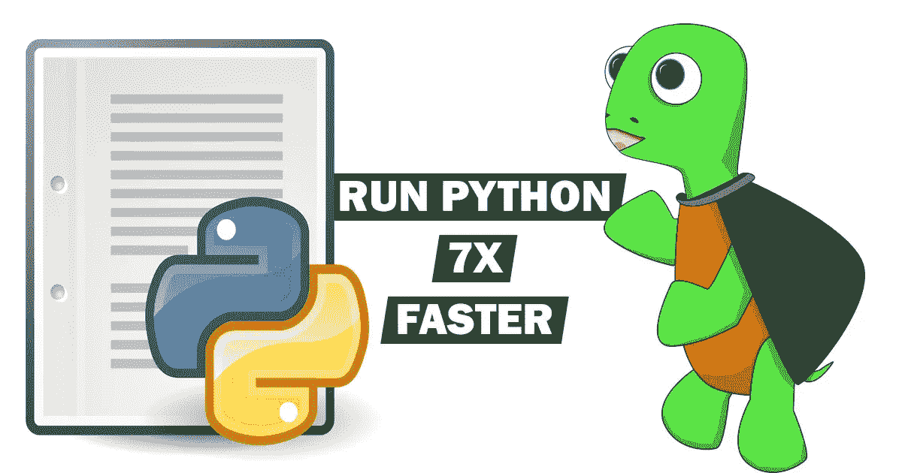
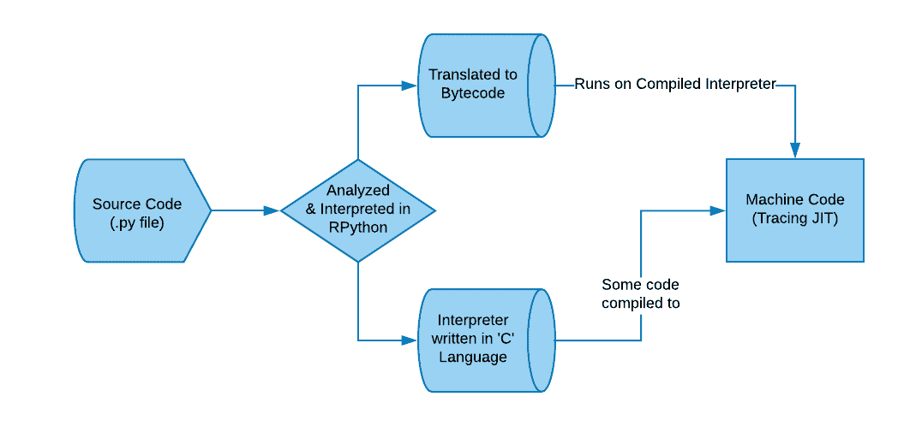

# 你的 Python 程序运行缓慢吗？以下是让它们速度提高 7 倍的方法。

> 原文：<https://medium.com/hackernoon/are-your-python-programs-running-slow-heres-how-you-can-make-them-7x-faster-3d6758cd3305>

我们都知道 Python 比静态类型的编程语言如 C、C++、Java 和一些动态语言如 JavaScript 和 PHP 要慢得多。让我们看看为什么 Python 比这些语言慢得多的原因，以及我们能做些什么来提高它的执行速度。

# Python 为什么慢？

Python ' **CPython** '的默认实现使用 **GIL(全局解释器锁)**同时恰好执行一个线程，即使运行在多核处理器上，因为 GIL 只在一个核上工作，而不管机器中有多少个核。CPU 中的每个内核都有自己的 GIL，所以一个四核 CPU 将有 4 个 Gil 分别运行，并有自己的解释器。为了让我们的 python 程序并行运行，我们使用了多线程和多重处理。

**多线程**使用相同的内存空间和单个 GIL，不会对执行时间产生太大影响，因此任何 CPU 限制的任务都不会对多线程程序的性能产生影响，因为锁是在同一内核中的线程之间共享的，当它们等待其他任务完成处理时，只有一个线程被执行。此外，线程使用相同的内存，因此必须采取预防措施，否则两个线程将同时写入相同的内存。这就是为什么需要全局解释器锁的原因。

**多重处理**提高了程序的性能，因为每个 Python 进程都有自己的 Python 解释器和内存空间，所以 GIL 不会成为问题。而且还增加了进程管理开销，因为多个进程比多个线程更重。此外，每次我们更新一个内存中的对象时，我们需要将对象从一个内存共享到另一个内存，因为这些内存彼此之间没有链接，而是单独执行任务。

## GIL 是问题的起因吗？我们为什么不去掉它？

由于 GIL 一次只允许一个线程执行，即使在具有一个以上 CPU 内核的多线程架构中，GIL 也获得了 Python“臭名昭著”特性的名声。因此，这限制了 Python 程序的执行速度，并且没有充分利用所提供的资源。

那么我们为什么不除掉 GIL 呢？ CPython 使用**引用计数**进行内存管理。这意味着在 CPython 中创建的对象有一个引用计数变量，它跟踪指向该对象的引用的数量。当这个计数达到零时，对象占用的内存被释放。

如果我们从 CPython 中移除 GIL，那么引用计数变量将不再受保护，因为两个线程可能会同时增加或减少它的值。如果发生这种情况，可能会导致永远不会释放的内存泄漏，或者更糟糕的是，在对该对象的引用仍然存在的情况下错误地释放内存。这可能会在我们的 Python 程序中导致崩溃或其他“奇怪”的错误。

此外，也有一些尝试从 CPython 中移除 GIL，但是单线程机器的额外开销通常太大。由于锁争用，有些情况下甚至在多处理器机器上也会变慢。

有一些替代 GIL 的方法，比如 **Jython** 和 **IronPython** ，它们使用底层虚拟机的线程方法，而不是 GIL 方法。

总之，GIL 现在对我们来说不是什么大问题，因为带有 GIL 的 Python 程序可以被设计成使用单独的进程来实现完全并行，因为每个进程都有自己的解释器，反过来也有自己的 GIL。

**在 Python 实现中使用 GIL 的好处**:

*   提高单线程程序的速度。
*   轻松集成通常不是线程安全的 C 库。
*   容易实现，因为拥有单个 GIL 比无锁解释器或使用细粒度锁的解释器更容易实现。

## Python 慢是因为它的动态性吗？

我们都知道 Python 是一种动态类型的编程语言，在这种语言中，我们在分配变量时不需要指定变量数据类型。数据类型在运行时分配给变量，因此每次读取、写入或引用变量时，都会检查其**数据类型**，并相应地分配**内存**。

而静态类型编程语言在这方面有优势，因为数据类型是已知的，所以它们不需要每次在程序中使用变量时都检查数据类型。这因此节省了他们大量的时间，并使整个执行速度更快。

Python 语言的设计使我们几乎可以制作任何动态的东西。我们可以在运行时替换对象上的方法，我们可以将低级系统调用修改为运行时声明的值。几乎一切皆有可能。所以不必声明类型并不是 Python 慢的原因，正是这种**设计使得优化 Python 变得非常困难**。

## " CPython 在运行时被解释."这是 Python 程序执行缓慢的问题吗？

一旦我们运行我们的 Python 程序，源代码。py 文件先用 CPython(用‘C’编程语言编写)编译成中间字节码`.pyc`文件保存在`__pycache__`文件夹(Python 3)中，然后由 Python 虚拟机解释成机器码。

由于 CPython 使用了一个**解释器**，它在运行时直接执行生成的字节码，这使得执行速度慢了很多，因为在程序执行时每一行都要解释。而其他编程语言，如 C、C++在执行前使用**提前(AOT)编译**直接编译成机器代码。此外，Java 编译成“中间语言”，Java 虚拟机读取字节码，**实时(JIT)** 将其编译成机器码。的。NET 通用中间语言(CIL)是一样的，**。NET 公共语言运行时(CLR)** ，使用**实时(JIT)编译**机器代码。

我们知道 **AOT 编译**比解释快，因为程序在任何执行发生之前已经被编译成机器可读的代码。但是**JIT 编译是如何比 CPython 实现的程序运行得更快呢？**

JIT 编译结合了两种传统的机器代码翻译方法——**提前编译(AOT)和解释**——并且结合了两者的一些优点和缺点。因此，JIT 编译通过编译程序中经常使用的某些部分来优化我们的程序，并在程序运行时进一步与其余代码一起执行。

Python 的一些实现如 PyPy 使用 JIT 编译，比 CPython 快 4 倍多。那么**CPython 为什么不用 JIT 呢？**

JIT 也有不利的一面，其中之一是启动时间延迟。与 CPython 相比，使用 JIT 实现的启动时间要慢得多。CPython 是一个**通用实现**，用于开发命令行(CLI)程序和项目，这些程序和项目不需要 CPU 做太多繁重的工作。在 CPython 中使用 JIT 是有可能的，但是由于它在 Python 中的硬实现和缺乏灵活性，已经被搁置了。

> "如果你想让你的代码运行得更快，你应该使用 PyPy . "—吉多·范·罗苏姆(Python 的创始人)

# CPython 的替代方案是什么？

PyPy 据称是 Python 最快的实现，支持流行的 Python 库，如 Django，并与现有的 Python 代码高度兼容。PyPy 有一个 GIL，并使用 JIT 编译，所以它结合了两者的优点，使整体执行速度比 CPython 快得多。几项研究表明，它比 CPython 快 7.5 倍左右。

## PyPy 是怎么工作的？

PyPy 首先获取我们的 Python 源代码，并将其转换为 **RPython** ，这是 Python 的一个静态类型的受限子集。RPython 更容易编译成更高效的代码，因为它是一种静态类型语言。PyPy 然后**将生成的 RPython 代码**翻译成一种字节码的形式，还有一个用 C 编程语言编写的**解释器**。这些代码中的大部分被编译成机器码，字节码在编译后的解释器上运行。

下面是这种实现的可视化表示:

它还支持**可插拔垃圾收集器**，以及可选地启用**无堆栈 Python** 特性。最后，它包括一个**实时(JIT)生成器**，给定解释器源代码中的一些注释，它将一个实时编译器构建到解释器中。生成的 JIT 编译器是一个**跟踪 JIT** 。

这是对实现如何工作的简单解释，如果你想了解更多关于 PyPy 的知识，你可以在这里阅读更多。

## 为什么我们不用 PyPy 作为 Python 中的标准实现呢？

正如我们讨论 JIT 的缺点是它的启动时间延迟，PyPy 遵循这个套件。此外，PyPy 与许多 C 扩展不兼容，因为 CPython 是用 C 编程语言编写的，PyPI 上的第三方扩展利用了这一点。Numpy 就是一个很好的例子，Numpy 的大部分都是用优化的 C 代码编写的。当我们`pip install numpy`时，它使用我们的本地 C 编译器并构建一个二进制库供我们的 Python 运行时使用。

PyPy 是用 **Python** 编写的，所以在我们的项目中实现 PyPy 之前，我们需要确保我们的项目所需的模块受 PyPy 支持。

这些就是 Python 中不使用 PyPy 作为默认实现的原因。除了 PyPy 之外，Python 还有许多其他的实现，可以用来使 Python 运行得更快，所以你可以选择最适合你的一个。

# 结论

我所展示的发现表明，与其他静态类型的语言如 C、C++、Java 相比，Python 确实是一种缓慢的语言，因为它的动态本质。**但是，我们应该关心它吗？**

可能不会，因为我们都知道在我们的项目中使用 Python 可以节省多少开发时间。初创公司已经在他们的项目中广泛使用 Python，只是为了让他们的产品尽快进入市场。这为他们节省了大量在单一产品上花费的**劳动力成本**和**工时**。像 Django 这样的框架已经提供了很多基本特性，使得全栈开发成为可能。

Python 开发者现在**采用 Python 的最优实现**，如果性能对他们来说是一个约束，同时将机器学习、大数据、人工智能作为一个整体。如今，Python 包索引(PyPI)提供了超过 100，000 个库的巨大支持，使用这种现代动态语言的可能性是无穷无尽的。这使得开发人员的工作更容易，同时也更快。

# 进一步阅读

如果您想了解更多关于 Python GIL、Python 实现、Python 字节码及其工作原理的信息，我推荐以下资源:

*   您可以从 Python wiki 页面查看更多关于 [Python 实现](https://wiki.python.org/moin/PythonImplementations)的信息，了解各种可用的 Python 实现。
*   如果你想知道 [Python 字节码](https://opensource.com/article/18/4/introduction-python-bytecode)到底是如何工作的，那么这是我目前为止找到的最好的资源。
*   此外，请务必查看大卫·比兹利关于[理解 Python GIL](https://youtu.be/Obt-vMVdM8s) 2012 视频版本的演讲。
*   你也可以查看之前 2009 年大卫·比兹利在 GIL 的 PDF 版本
*   如果你想了解更多关于 PyPy 的知识，那么你可以从这个 [PyPy 文档](http://doc.pypy.org/en/latest/)开始。