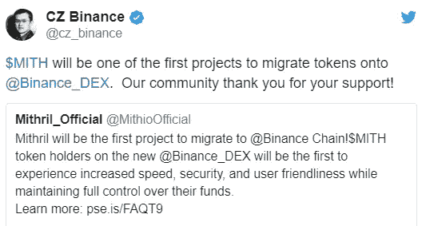

# 币安连锁、DEX 能超越监管者和以太坊吗？

> 原文：<https://medium.com/hackernoon/armageddon-binance-chain-dex-ethereum-7bb867ea71cb>

**关注我们:** [**伊姆兰·汗**](https://twitter.com/lmrankhan) **&** [**穆罕默德·福达**](https://twitter.com/MohamedFFouda)

*在*[*token daily*](http://tokendaily.co)*的研究团队最近讨论了币安团队如何采用了类似于脸书早期战略的快速突破模式。自 2017 年成立以来，他们选择马耳他作为其总部* *管辖区，进行全球扩张。另一方面，比特币基地正与币安展开激烈竞争，双方都将国际增长视为未来的收入来源。这意味着总的潜在市场有更大的增长空间。因此，随着交易所争夺国际市场，这些市场的客户增长将成为一家交易所是否会占据主导地位的主要指标。币安已经确立了自己作为人们使用的全球加密交易所之一的地位，在监管机构迎头赶上之际，它能保住自己的头衔吗？*

# 机会

币安可以智胜监管者，同时围绕其链条和 DEX 创造机会。这是一个机会，也是减轻来自世界各地的潜在监管审查的一种方式。我们可以将链和 DEX 分解为两个独立的机会。第一个机会是，通过转向自己的指数，它将有效地放弃对交易所的部分控制权。这一举措将使监管者更难将币安作为一个中央集权的实体。第二个机会是通过创建自己的链，他们可以有效地吸引计划在以太坊或其他链上推出的项目。币安可以将项目锁定在其链中，同时利用 DEX 作为一种方式，获得对用户潜在网络效应及其带来的流动性的敞口。

通过瞄准当前的以太坊项目，它可以为其链带来大量的用户和活动。例如，在宣布 Mainnet 发布时，CZ 宣称至少有 8 个项目已经从以太坊转到了它的链上，如社交平台 Mithril。正在寻找兴奋剂的项目将币安链家视为首选平台。CZ 和他的团队设计的策略听起来很吉利，就像其他事情一样，可能会因为纯粹的规模和不屈不挠而奏效。但根据我们的研究，存在一些阻碍其增长的障碍。

**具体来说**:

1.币安对区块链的控制引发了对 BNB 和其他 BEP2 令牌的监管担忧

2.平台风险和集中化，因为币安是唯一获准发行挂钩代币的实体。

3.当币安持有本地资产时，为比特币、以太坊发行挂钩代币的交易对手风险。

在本文中，我们分析了已注意到的风险。 **但首先，我们需要了解币安链和德克斯的基本面，并了解为什么 CZ 的战略可能会出错，如果不加检查。**

# 什么是币安连锁和德克斯？

币安 DEX 建立在币安链的基础上，其预期用例是促进快速的非托管交易，可以达到集中式交易所的性能。这允许用户持有自己的私钥，同时能够在平台上与其他人进行交易。对用户来说，高级别的好处是隐私保证、exchange 黑客保护和成为 DEX 列表社区的一部分。币安的好处是，他们拥有从链到 DEX 应用程序的整个堆栈。

这将使他们对用户体验有更多的控制权，并有能力创造新的盈利方案。他们选择在 Cosmos 上运行，并且正在实现一个[实用的拜占庭容错](http://pmg.csail.mit.edu/papers/osdi99.pdf) (pBFT)共识算法，这是 [Tendermint](https://www.tendermint.com/) 的一个分支。目前的目标是用有限的验证器(目前有 11 个验证器在运行)部署 pBFT 算法，但最终引入一个委托利益证明(dPOS)共识。与 EOS 类似，这将在不牺牲可用性的情况下为他们提供他们所寻求的吞吐量。

# 币安链条的监管问题

在全球范围内的任何司法管辖区运行集中的加密交换会花费数百万美元的开销和永无休止的法律纠纷。为了克服这一点，币安采取了一种有趣的方式，与马耳他、新加坡和尼日利亚等国家建立了合作关系。这给了他们在一些国家的初步批准，以便它可以奠定基础。最终，如果他们想扩张到其他国家，继续成为一家全球加密交易所，就必须与监管机构合作。与监管机构合作可能成本高昂、耗时，而且会阻碍发展，因为你是在根据司法管辖区的需求重组一家交易所。

这就是币安 chain & DEX 的亮点，它有效地放弃了对交易所的一些控制，允许网络促进用户活动。它的连锁店& DEX 可以追逐任何规模的市场。这种策略不会在一夜之间取得成功，需要预先进行大量的控制。通过最初控制链，用户可以拥有一个稳定的平台，但也可能使交易所面临监管风险。

> CZ 概述如下，“我们对网络和验证器有很大的影响力吗？是的，我们有。所以，最初，我们希望这个链条更加集中，与其他网络相比，我们会有更大的影响力。但我认为在早期阶段保持这种影响力对我们来说很重要。随着时间的推移，会有越来越多的验证者加入，我们的影响力会降低。”

当一个项目决定加入币安链并开发自己的令牌时，它将发布一个 BEP2 令牌。你可以把 BEP2 令牌实现想成类似于以太坊上的 ERC20 令牌实现。币安正在打造这一链条，并迁移其交换令牌 BNB。由于币安在早期主要控制了连锁店和 DEX，SEC 可以认为 BNB 代币是一种证券，因为 SEC 根据经验[声明](https://www.sec.gov/news/public-statement/statement-framework-investment-contract-analysis-digital-assets)如果一个项目没有足够分散，同时让散户投资者接触利润分享机制，那么它就是一种证券。

[实现 BTC 原子交换与 ERC-20 令牌](https://medium.com/u/b6275cb6116#Appendix)。然而，这些努力需要进一步的技术变革，这将需要相当长的时间来实施。 ***因此，我们认为短期内不太可能实现 BEP2 令牌与其他非本地资产之间的跨链原子互换*** 。

原子互换的另一个问题是价格发现，在原子互换中，买方和卖方必须在执行交易之前协商价格。然而，这个问题最近通过[阿尔温](https://www.arwen.io/)实施的技术得到了缓解。阿尔温技术栈允许将原子掉期与集中交易指令簿相集成，从而实现公平高效的价格发现。该技术实现了基于区块链的 escrows，它持有交易者的硬币，并在交易者在中央交易所执行交易时，以市场价格执行原子掉期。

阿尔温技术[被整合到库币交易所](https://www.coindesk.com/kucoin-exchange-traders-can-now-self-custody-their-crypto-assets)以允许非托管交易。同样，同样的技术也可以集成到币安集中交易所。然而，与其 DEX 的整合将要求阿尔温支持币安链 escrows，并在币安链和基于比特币的资产之间实施原子互换。如果这种发展能够实现，币安 DEX 上真正的非托管交易所将成为现实。

# 结论

币安·德克斯公司及其连锁公司的实施是币安的一项雄心勃勃的举措，旨在引领密码交易行业的变革。虽然我们同意长期目标的巨大潜力，但重要的是要认识到并强调实现这一愿景的主要障碍。具体而言，币安完全控制了其链条以及链条上发行的资产，从监管和执行的角度来看，这可能会带来重大风险。此外，发行 BTC、瑞士联邦储蓄银行(ETH)和 ZEC 等主要加密货币的挂钩资产以允许其 DEX 交易并没有为当前的集中交易体验提供任何切实的改善。在这两种情况下，币安都持有在交易所交易的原始资产。

**关注我们:** [**伊姆兰·汗**](https://twitter.com/lmrankhan) [**穆罕默德·福达**](https://twitter.com/MohamedFFouda) [**令牌每日**](http://twitter.com/tokendaily)

***披露:本文中的信息仅供参考。在撰写本文时，我们在币安、阿尔温库科恩没有投资，在 KCS BNB 也没有头寸。***