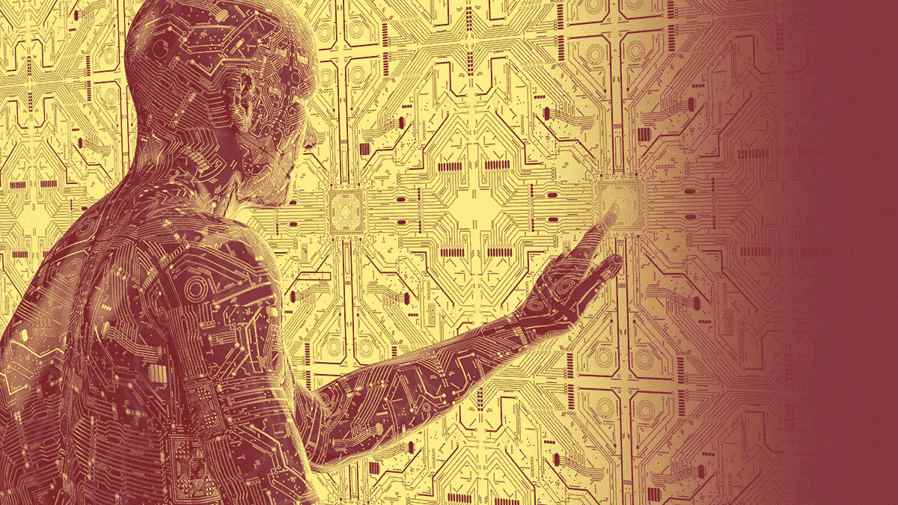
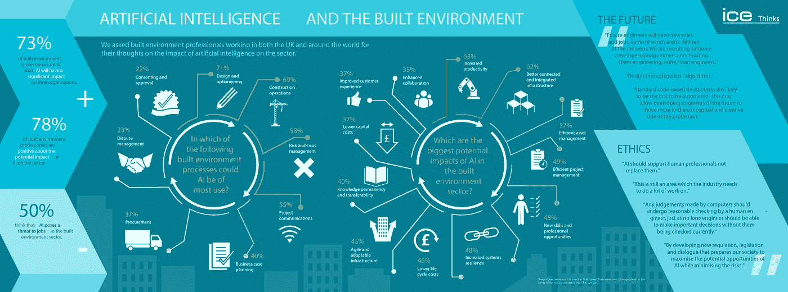
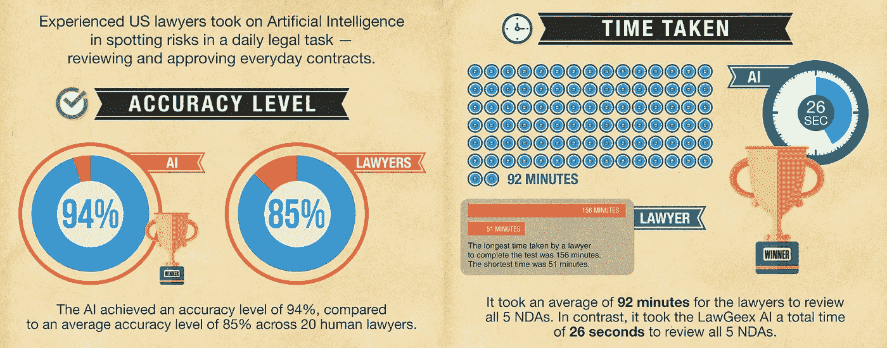

# 人工智能正变得比人类专业知识更好

> 原文：<https://medium.com/hackernoon/artificial-intelligence-is-becoming-better-than-human-expertise-16903f4fc3c0>

人们认为，在 20 世纪和 21 世纪之交，人工智能技术发展有三次不同的浪潮。第一次浪潮是试图借助逻辑思维的形式规则创造普遍智能。第二是专家系统的开发。现在我们正处于第三次浪潮的顶峰，其主要特征是计算机学习，它已经成功地帮助人工智能在大规模决策的有效性和质量方面绕过顶级专业专家。

研究人员已经学会如何创建系统来改进算法本身，然后接收新数据。这项发明创造了一个新产业。据普华永道称，到 2030 年引入人工智能将使全球 GDP 增长 14%，约 15.7 万亿美元。他们指出，这比中国和印度目前的工业总产量还要多。根据 Teradata 的一项研究的[结果](http://assets.teradata.com/resourceCenter/downloads/ExecutiveBriefs/EB9867_State_of_Artificial_Intelligence_for_the_Enterprises.pdf)，绝大多数大公司(80%)正在投资人工智能技术，根据 Gartner 的预测，到 2020 年，它们将出现在几乎所有新的软件产品和服务中。

# 人工智能的优势是什么？

直到最近，解决复杂问题的唯一方法是与专业专家合作。平均而言，他们的经验和能力优于普通人，但有许多因素可以影响他们的有效性。

人脑的生产力有天然的局限性。在评估投资一家初创公司的潜力时，我们可以向专家寻求帮助，但如果我们需要分析的不仅仅是一家公司，而是几千家公司的潜力，该怎么办呢？没有一个专家，甚至一群专家，能够有效地处理如此大量的信息，而人工智能的使用使这些问题完全可以解决。例如， [Squilla Capital](https://stat.squilla.io) 现在使用人工智能和大数据来分析 8，000 多家初创公司，使用的指标包括网络和社交媒体分析、交易数据、区块链数据等。

[斯奎拉资本](https://stat.squilla.io)的联合创始人丹尼尔·米亚金表示:

> 人们总是保持偏见和情绪化，不管他们是否意识到这一点。每个人都知道人会犯错。在我看来，依靠猜测和直觉要糟糕得多，而不是依靠数据和统计。我们现在准备为投资者提供评估海量数据的方法，而无需数据分析技能和重型工具。不要猜测。用数据。

像所有人一样，专家也会受到认知扭曲的影响，这从根本上影响了结果的质量。偏见、错误的假设、简化的愿望、忽略矛盾，当然还有情感成分——所有这些都会影响结果，而所有这些弱点都可以通过在分析过程中引入人工智能来避免。而且，专家的意见太难明确解读；他们保护自己，避免特定的细节和清晰的短语，这也排除了产生干数的算法。

世界上最成功的[投资者之一沃伦·巴菲特](https://www.cnbc.com/2017/07/25/warren-buffett-once-auctioned-off-a-wallet-with-stock-advice.html)说:

> 你不需要成为火箭科学家。投资不是智商 160 的人打败智商 130 的人的游戏。理性至关重要。即使你的智商是 160，你也应该给别人 30 分。干这行不需要太多脑子。你需要的是稳定的情绪。你必须能够独立思考。

在未来几年，谷歌、脸书、优步和苹果等科技巨头将主要从人工智能的引入中赚取利润。在计算机学习的帮助下，他们将能够解决创建计算机视觉、运动控制模块、无人驾驶汽车、语音识别以及组织和提供信息访问的复杂问题。

对于第三次浪潮中较小的参与者来说，也有极好的前景。潜力在于将人工智能应用于特定的本地任务。我将提供几个使用技术的潜力最明显的例子。

# 人工智能 vs 专业专家

## 1.金融

金融行业仍然是相关项目数量的领先者。在这里，技术允许行业降低成本，最小化风险，防止欺诈，验证借款人和评估他们的偿付能力，以及进行预测等任务。

在股市中赚到高于平均水平的钱几乎是不可能的；即使是华尔街最有才华的投资者也不是以他们的一致性而闻名的。交易员和对冲基金经理无法与 AI 相比具有竞争力，他们的问题在于他们只是人类，而机器人做出的所有决定都严格基于数据和统计。

德国埃尔兰根-纽伦堡大学的一个研究小组开发了许多算法，这些算法利用市场的历史数据来复制实时投资。

其中一个模型[考虑到交易成本，允许](https://www.seeker.com/artificially-intelligent-investors-rack-up-massive-returns-in-stock-ma-2321650774.html)从 1992 年到 2015 年每年 73%的投资回报率。相比之下，实际市场回报率为每年 9%。在 2000 年(545%的收益率)和 2008 年(681%的收益率)的市场震荡期间，利润特别高，这证明了在情绪主导市场的高波动时期，量化算法的效率有所提高。

Eurekahedge 一月份在 T4 对 23 家使用人工智能的对冲基金进行的研究表明，它们比那些由人管理的基金有更好的结果。

过去 6 年，这些基金的年收益率为 8.44%，而传统基金的年收益率为 1.62%至 2.62%。该研究的作者将人工智能在行业中的主导地位与它不断进行重复测试的事实联系起来，而不仅仅是积累数据。这也可能是由于传统量化方法的缺点，以及使用基于历史数据的无利可图的回溯测试建立的交易模型，这些模型无法实时产生利润。

文艺复兴技术公司(Renaissance Technologies)的梅达莲基金(Medallion Fund)使用定量股票市场分析技术，[拥有投资史上最好的业绩。20 年来，该基金能够产生 35%的年回报率。这意味着如果你在 1997 年投资 10，000 美元，今天你手里会有 404 万美元。](http://www.nanalyze.com/2017/02/artificial-intelligence-stock-trading/)

一些公司使用人工智能通过算法交易来确保盈利。在短短几分钟内，Sentinent Technologies Fund [可以模拟](https://www.forbes.com/sites/forbestechcouncil/2017/04/17/its-time-to-embrace-ais-superior-prediction-powers/) 1800 个交易日，让数万亿虚拟交易者相互对战。

## 2.软件创作

谷歌的人工智能学会了如何创建比人类创建的系统更高效的机器学习软件。这个[是在《连线》杂志上写的](https://www.wired.com/story/googles-learning-software-learns-to-write-learning-software/)。该系统需要识别一幅图像中的几个对象。计算机训练的算法识别了其中的 43%,而人类创造的最好的只有 39%。

正如谷歌首席执行官[桑德尔·皮帅](https://en.wikipedia.org/wiki/Sundar_Pichai)在该公司的最新发布会上所说，该公司已经为自己设定了帮助人工智能开发者开发新系统的目标。他说，AutoML 是必要的，不是为了取代人类开发人员，而是为了在自学系统的初始设置过程中帮助他们。

桑德尔·皮帅指出:

> 今天，这些都是由机器学习科学家手工制作的，实际上全世界只有几千名科学家能够做到这一点。我们希望成千上万的开发者能够做到这一点。

**事实上，开发者现在已经到了人工智能本身在创造人工智能方面已经超越人类的地步。**

## 3.法律实践

初创公司 LawGeex [进行了一项研究](https://www.lawgeex.com/resources/AIvsLawyer/)，比较律师和人工智能在评估保密协议质量方面的有效性。这项研究涉及 20 名律师，他们在高盛(Goldman Sachs)、思科(Cisco)等公司以及 LawGeex 的专有人工智能平台拥有数十年的经验。参与者通过寻找 30 个具体的法律要点来评估五个不同的 NDA 协议中包含的风险。

根据研究结果，人工智能的平均准确率为 94%，而人的平均准确率为 85%。与此同时，人工智能的最高准确率为 100%。94%的律师。平均而言，人们需要 92 分钟来完成这项任务，而人工智能在 26 秒内分析了所有文件。

## 4.医学

来自美国国立卫生研究院和全球公益组织的一个研究小组开发了一种基于人工智能的方法，这种方法将有助于分析女性子宫颈的数字图像，并准确识别需要医疗护理的癌前病变

该研究的资深作者 Mark Schiffman 表示:

> 我们的研究结果表明，深度学习算法可以使用常规宫颈癌筛查期间收集的图像来识别癌前病变，如果不进行治疗，可能会发展成癌症。事实上，计算机对图像的分析在识别癌前病变方面比人类专家在显微镜下对巴氏试验(细胞学)的审查更好。

总的来说，该算法在预测哥斯达黎加研究中诊断的所有病例方面比所有标准筛查测试都要好。自动视觉评估以比人类检查(AUC = 0.69)或常规细胞学检查(AUC = 0.71)更高的准确度(AUC = 0.91)揭示了癌前疾病。AUC 值为 0.5 表示测试并不比随机测试好，而 AUC 值为 1.0 表示测试在检测疾病方面具有完美的准确性。

## 5.军事用途

新的阿尔法人工智能[能够打败](https://www.sciencedaily.com/releases/2016/06/160627125140.htm)一个模拟空战的专业专家。人工智能本身是由辛辛那提大学的毕业生出于研究目的开发的。

阿尔法由退役的美国空军上校吉恩·李(Gene Lee)进行测试，他拥有丰富的战斗经验，是空战战术专家。根据开发者的说法，人工智能在控制系统领域提供了突破，其工作是基于模糊逻辑的应用。李上校不仅无法在虚拟空战中击败该程序，而且每次与它进行长时间的战斗时都会被“杀死”。据这位军方人士说，他很惊讶阿尔法似乎预见到了他的意图，并立即对他的行动做出反应。