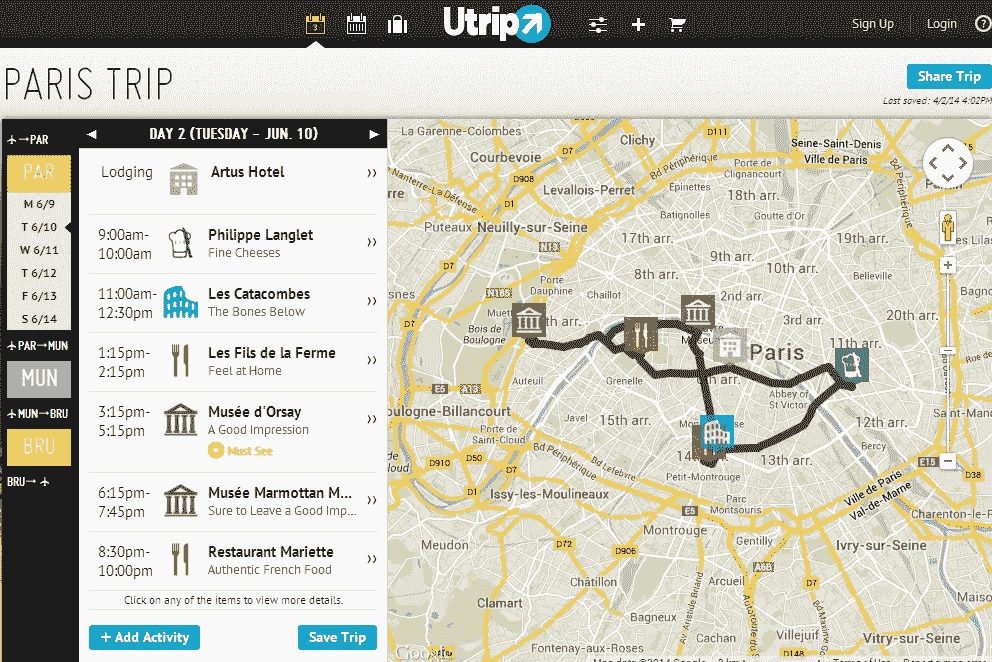
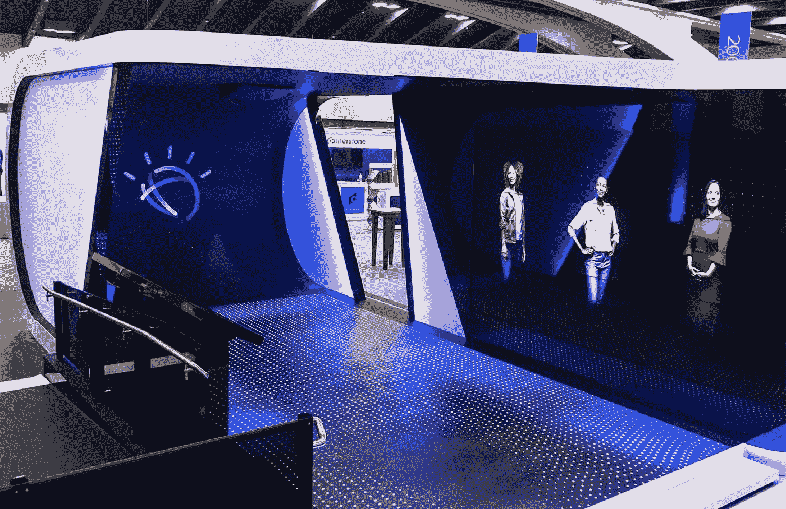

# 人工智能:旅游业的未来

> 原文：<https://medium.com/hackernoon/artificial-intelligence-the-future-of-travel-industry-42b8e2641118>

机器可能还没有接管世界，但它们正在渗入我们的生活，并使它变得更好。人工智能正在改变我们生活的方方面面。从自动驾驶汽车到会说话的机器人，今天有太多人工智能的例子在使用。这项技术正在颠覆许多行业，旅游业也不例外。你不得不依靠旅行社来计划下一个假期的日子已经一去不复返了。你不再需要为了你的旅行安排而和你的代理人进行那一系列令人厌烦的对话。AI 现在渗透到了旅游行业的方方面面。借助这项技术，你可以根据自己的需求，获得个性化、智能化的出行解决方案。

谷歌航班已经在利用人工智能预测航班延误，甚至在航空公司之前宣布。但这只是 AI 能做的一小部分。从数据处理到改善客户服务，这项技术可以完成很多事情。让我们看看人工智能是如何变革旅游行业的。

# 旅行计划

根据 T2 booking.com 的调查，29%的旅行者愿意让电脑根据他们的旅行历史来计划他们的下一次旅行，而 50%的旅行者表示，只要他们的所有问题都得到回答，谁来计划旅行并不重要。无论是浪漫的巴黎之旅，还是攀登 T4 乞力马扎罗山寻求刺激，你都可以和专家一起去，或者电脑可以为你计划一切。品牌还可以使用人工智能技术，根据旅行者的需求为他们提供量身定制的建议。

途易集团和 Utrip 已经创建了一个个性化的旅行计划服务，要求用户对他们的喜好进行分类，如“食物”、“饮料”、“自然”等。并从数百万个选项中挑选出个性化的路线。你将会得到一个要去的地方、要尝试的活动等等的列表。

为了获得更好的体验，您可以随时添加更多活动。当用户注册时，人工智能系统还可以帮助你从提供乘车服务的网站上找到免费乘车服务。对于那些很难抽出时间来计划下一次旅行的人来说，这些工具确实非常有用。

# 改善客户体验

人工智能在旅行中最令人兴奋的应用之一是在线帮助客户。客户不喜欢等待，聊天机器人可以通过即时回答他们的查询来改善客户体验。在人工智能的帮助下，企业可以全天候运营。对更智能的酒店客房的需求一直在上升。高级人工智能助手可以执行客人的请求，提供实时推荐等。IBM 的[沃森助手](https://skift.com/2018/03/25/ibms-new-watson-assistant-helps-hotels-build-smarter-voice-and-chat-platforms/)，专注于酒店和汽车行业，可以非常有助于酒店满足对更智能房间的需求。

与 Alexa 不同，Watson Assistant 不会捕获用户数据。所以，酒店不用担心用户数据。拉斯韦加斯的大都会酒店引进了一个名叫罗斯的[聊天机器人，它有着轻浮的个性。Rose 为 Cosmopolitan 内部的酒吧和餐厅提供建议。它还可以陪你玩游戏，以防你觉得无聊。世界各地的酒店里还有许多其他聊天机器人，在几个方面帮助顾客。](https://www.travelandleisure.com/hotels-resorts/cosmopolitan-las-vegas)

# 数据处理和分析

人工智能的应用不仅限于客户服务。人工智能可以用于数据收集和分析。使用这些数据，可以得出关于客户、定价策略等各种结论。它允许行业内的企业提高转化率，制定更好的商业计划。

人工智能可以快速高效地整理海量数据。多切斯特精选连锁酒店已经开始使用人工智能来识别他们的顾客想要什么。人工智能系统在线阅读成千上万的客户评论，并找出对客户来说什么是重要的。如果由人来完成，这个过程通常需要几天甚至几周。人工智能的实施将有助于制定关于客人行为的战略决策，并自动化许多流程以提高业务绩效。

# 提高生产率

墨西哥航空公司一直在使用 Facebook Messenger bot 来回复基本的用户查询。这个想法是为了迎合 80%的用户问题，这些问题都是重复性的，比如“托运行李要收费吗？”机器人用 500 个常见的回答来回答查询。无论如何都不需要人工干预。总的来说，航空公司可以从这些机器人中受益匪浅。汉莎航空公司的机器人[米尔德里德](https://www.digitaltrends.com/mobile/mildred-lufthansa-chatbot/)可以帮助顾客找到最便宜的航班。荷兰皇家航空公司也采用人工智能技术来回应用户在推特、脸书等网站上的查询。它允许航空公司利用他们的劳动力来完成需要人类关注的创造性任务。

# 在线声誉管理

人们更相信网上评论。因此，留意客户对你的业务的评价是非常重要的。负面评论会伤害企业。使用人工智能，公司可以监控客户评论、社交媒体评论和其他关于品牌的提及。酒店和航空公司可以对负面反馈做出反应，观察趋势，更好地了解用户的需求。这有利于提高销售额和利润。

人工智能让我们的生活变得简单多了。我们不必在机场登记时排队等候的日子不远了。这个想法是明智地使用人工智能，以便它在旅行生态圈中帮助人类完成各种任务，而不是取代他们。