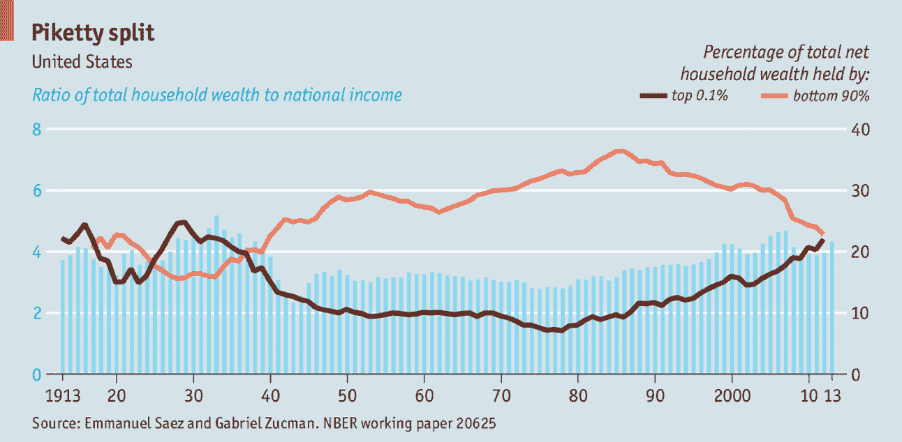

# 自动化和共享经济

> 原文：<https://medium.com/hackernoon/automation-and-the-sharing-economy-de19658e45c>

## 人类生产正处于巨变之中。全球连通性的增长，加上自动化的进步，正在催生一种新的经济，共享经济。

S 共享经济不是一个新现象。事实上，由优步和莱夫特推动的现代共享经济，经常被吹捧为创新，是最原始的经济结构的衍生:贸易和易货贸易。优步和莱夫特 S-1 揭示了支撑其商业模式的经济脆弱性。这引发了关于这些业务长期可行性的讨论，粗略评估一下财务状况，人们会得出这样的结论是有道理的。然而，这种分析的问题在于，它从近视的角度来看待长期游戏。

优步和莱夫特是多面平台，有两个客户:服务消费者(乘客)和服务提供商(司机)。他们一直在倾注大量的激励和补贴来保持司机的参与，同时保持对乘客的低成本服务。华尔街正确地认定这是不可持续的。共同的线索是，优步和莱夫特将不得不提高价格以实现盈利，这是不可避免的一天。人们极度怀疑，当这一天到来时，他们是否能够维持客户群。但是我不确定那一天会不会到来。

优步和莱夫特在驾驶时并没有睡着，对这些挑战一无所知。恰恰相反。问题不在于商业模式，问题在于他们目前对低效资源的依赖:人。然而，这不是系统性的挑战。用会计术语来说，这是一个时差。

就像披着羊皮的狼一样，优步和莱夫特实际上是单边平台业务，把自己伪装成多边平台业务。很快将会有一个阶段的转变，他们将会在通往经济繁荣的道路上，将等式的一边抽离。在“一个词”变得可行之前，司机只是一座短期桥梁。自动化正在飞速发展，一旦它到来，这些平台将能够摆脱与众多司机相关的膨胀的可变成本的重负，并最终成为单边服务提供商。难怪司机没有股权；他们不被视为网络的长期参与者。

这一行动手册与大多数平台业务背道而驰，这些业务从单一玩家模式开始，发展到多面平台。正如 Chris Dixon 所说:为工具而来，为网络而战。然而，在像优步和莱夫特这样的纯游戏服务网络中，网络的另一端被商品化了。只要我高效安全地从 A 点到 B 点，我就不在乎是谁开车送我。事实上，通常情况下，我更喜欢机器人开车送我——对我最近的优步司机来说，这并不算什么冒犯。

优步和 Lyft 都认识到，最重要的事情是积累一批热爱这项服务的忠实消费者，即使这意味着在短期内过度扩张。在像移动性这样基本的领域占据市场领导地位的长期前景太美好了，不能等待。因此，当自动化军备竞赛开始时，最好是收集等式中有价值的部分(骑手)，并找到一种方法，将未来沉浸在自动化中的消费者经济学带到现在。一旦自动化到来，成本将会下降，这些平台将能够继续以相同的成本向消费者提供相同的服务，并将收回多年的亏损。

与我在前面独白中的语气相反，我认为自动化从根本上来说是一件好事。有些事情是自动化无法取代的，直到人工智能达到普遍智能(在后面的文章中会有更多的介绍)。人类拥有机器无法复制的独特品质，因此，如果我们能够自动化流程，让更多人获得自由，最大限度地发挥他们的独特才能并将其商业化，这本身就是一件好事，也是我们应该接受的事情。只有当我们拒绝适应时，自动化的威胁才会出现。

在本帖中，我将概述由于劳动力市场实体生产效率低下而导致系统性不平等的领域，以及这种向自动化的转变如何能够带来知识工人的新经济，从而带来全球平等的更大平衡。

人类繁荣的基础始于三样东西:食物、住所和水。在人类历史的大部分时间里，我们一直对自己生产这些产品负责(除了上帝在以色列人逃离以色列的迫害时向他们提供吗哪)。

集中生产可以提高效率，但这种集中也会产生导致不平等的系统性问题。大型企业拥有大部分资源和生产资料，然后通过规模经济从价值链的贡献者那里榨取最多的利润，将非现有企业边缘化。随着规模经济带来的更高回报率，这种恶性循环将继续下去，将越来越多的人推到一边，同时让顶层的在职者更加富裕。同样的事情也把前面提到的以色列人赶出了埃及(抛开上帝提供的应许之地)。埃及人拥有生产资料，因此可以剥削以色列人，以色列人的每一单位投入，埃及人都获得了不相等的单位产出。这意味着富人和穷人之间的差距在扩大——不是线性的，而是对数的。

同样的现象在每个时代都有所体现
**古希腊罗马:**贵族与庶民
**中世纪:**领主与农奴
**明朝:**史与农
**后现代:**精英与工人阶级

尽管我们取得了进展，但我们仍然看到分歧。

世界银行的这张地图用基尼系数来衡量每个国家的不平等程度。你会注意到，美国处于全球不平等的中间值，但当与美国境内的不平等率相比时，我们看到“平均水平”很难追求。即使拥有全球最高的 GDP，最富有的 1%和最贫穷的 90%也只拥有同样的%财富。财富和权力的集中加速了顶层百分位数的轨迹，而中产阶级正在消失。

不仅仅是国内的不平等在加剧(如上所述)，更重要的是，国际间的不平等在加剧，购买力平价的差距越来越大就是明证。在一个由实物生产主导的市场中，向上流动的承诺是一个谬论。这都是中央集权的系统性问题造成的。鉴于资本和生产能力所有者的回报率更高，财富和权力的集中产生了复合效应，使越来越多的全球劳动力边缘化。

许多人发现自己正从“富人”变成“穷人”,因为他们不再拥有生产资料。自动化的速度有可能使更多的人从“熟练”劳动者变成“非熟练”劳动者，在这种情况下，产出回报率是一个更低的阶梯函数:

一种说法是实施更严格的反垄断法，拆分公交业务。另一个可能是你看到的更多草根运动，它们推动着“购买本地货”的社会潮流。问题是，大企业以太低的成本创造了太好的服务，效率越来越高，客观理性行为者不会对此置之不理。

最近的一项研究表明，尽管自 1979 年以来，在制造业工作的人数减少了 40 %[ 1 ],但制造业的产出却几乎翻了一番[2]。抵制这种进步是愚蠢的，然而如此多的专家忽视了 100%的生产增长，而关注 40%的工作岗位流失。

我们应该接受这一点有两个原因:(1)它在其他地方释放了更多的人力，以及(2)它模糊了人类对实物生产的参与，在实物生产中，不平等是如此普遍，因为生产手段的集中控制带来了超额回报。

我们要么抵制，要么进入这个独特的自动化时代，以及与之相关的工作分流，以创造一种新的人类生产方式。一种更具包容性、更能创造价值的生产方式。

## 沉浸在旧原则中的新经济学

我们可以从优步和 Lyft 这样的企业学到的是点对点价值转移的力量。互联网的普及以及移动性摩擦的减少为全球连接奠定了基础，在全球连接中，价值转移不局限于网络中距离很近的节点。这些现代的创新，加上经济学的周期性，汇聚成一种现代的物物交换经济学，我们称之为共享经济或零工经济。

这种微型创业将权力放回了公地手中，让它们自己成为生产者，而不仅仅是集中生产中心的代言人。

共享经济在当前状态下的问题是，它一只脚在门里，一只脚在门外，平台的固有中心化促进了联系。在工业时代，生产能力的集中导致财富集中在拥有工厂、材料等的人手中。信息时代，财富集中在垄断分配的人手里。

推动共享经济的平台与消费者和生产者不一致，在这个过程中榨取租金。继续我们的拼车例子:像优步和 Lyft 这样的集中式平台通过价格竞争争夺消费者市场份额，然后从每笔交易中提取很大一部分。对消费者的集中控制:生产者关系使这种共享经济的参与者边缘化，微型企业家的承诺仅仅是一种错觉。([最近的研究显示，司机的净收入低于平均最低工资](https://www.theguardian.com/technology/2018/mar/01/uber-lyft-driver-wages-median-report)

这并不是说我们应该解散优步和 Lyft 这样的公司，创建一个司机和乘客在开放协议下互动的分散市场。如果有的话，我们应该更多地使用这些服务，并希望它们能够更快地达到自动化的最终状态。这也延伸到许多其他的物理生产工作:制造业、农业等。

我承认这种观点可能不受欢迎，因为它最初会取代一大批劳动力。我的观点是，这是我们释放更高长期生产潜力的必要阶段。

## **数字经济**

这可能看起来违反直觉，因为当我们想到自动化时，我们想到的是数字；但是数字世界实际上是人类能够产生巨大价值的地方。

物质世界有着与生俱来的隔离机会的障碍。规模经济使那些不拥有生产资料的人边缘化。拥有实物资产的人的投资回报率高于贡献劳动力的人。

在数字世界中，规模经济被中和，生产手段更容易获得。我们已经从工业时代发展到信息时代。随着超过 50%的世界通过互联网连接起来，像非洲这样的地区以抛物线速度上网(自 2000 年以来增长了 10，000%)，数字世界是一个日益增长的、开放的、无国界的市场。

每个人都有独特的才能，独特的见解，以及他们可以分享的独特价值。我设想的共享经济不是共享商品化的资源，而是共享我们人类独有的价值。数字化的力量在于每个联网的人都有平等的参与机会。

学习变得无界。接受高等教育不再局限于古老而昂贵的机构。由于生活成本上升或移民法不完善，在交通不便的高密度城市，合作不再受到物理存在需求的限制。

数字世界的前景是光明的，但为了发挥其潜力，它必须建立在分散网络的基础上。不可能有一个集中的参与者来控制网络的连通性。我们看到像中国和朝鲜这样的民族国家限制对全球网络的访问。鉴于不完全信息的隐性成本，这不仅对那些网络中的人有害；考虑到没有充分参与的隐含机会成本，这对网络的其他部分是有害的。

我们在北美看到了不那么极端的例子，大型社交网络控制着谁能看到什么信息，谁能联系到谁。

这就是为什么我对加密网络和开放互联网协议的结合感到兴奋。具有分散价值转移的分散网络为数字世界中的新兴经济提供了火种，在数字世界中，价值创造和价值获取是非歧视性的。

随着那些为现在优化的人适应未来，可能会有一个混乱的过渡。但是这个未来将释放更高的潜力，这对我来说是令人兴奋的。

## **消息来源**

[1]https://fred.stlouisfed.org/series/MANEMP#0

[2][https://fred.stlouisfed.org/series/OUTMS](https://fred.stlouisfed.org/series/OUTMS)