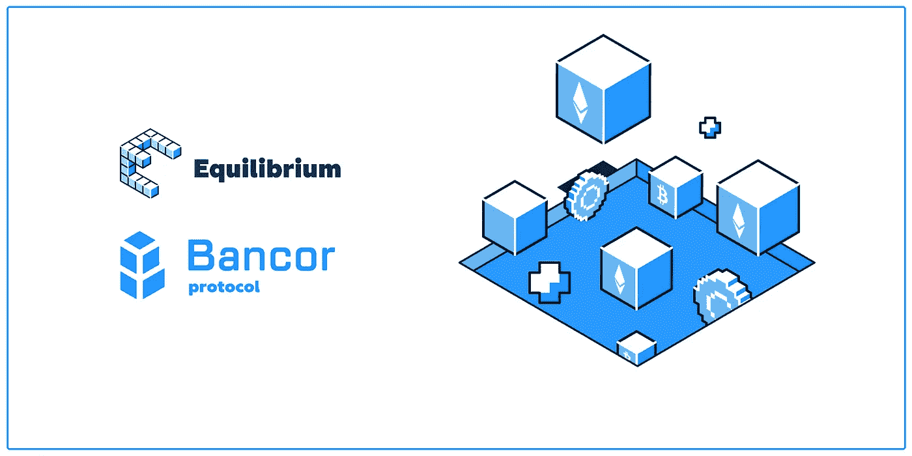

# Bancor 的做市协议:既不做市也不做市

> 原文：<https://medium.com/hackernoon/bancors-market-making-protocol-neither-market-nor-making-146ca0533aee>

Dan Larimer 最近介绍了基于 Bancor 协议的新稳定硬币追踪算法的想法。新成立的[均衡实验室](https://equilab.io/?utm_source=medium&utm_medium=referral&utm_campaign=hackernoon_bancor),[均衡框架](https://eosdt.com/?utm_source=medium&utm_medium=referral&utm_campaign=hackernoon_bancor)的研发部门，正在为分散金融市场研究价格稳定协议和代币。他们对威胁稳定币市场采用技术和基于技术的产品的主要问题提供了一些见解。

# 了解 Bancor 协议

Bancor 协议是一种开源标准，它让连接到该协议的每个令牌都可以自动转换为任何其他连接的令牌，在此过程中将它们转换为智能令牌。Bancor 网络令牌(BNT)是集线器令牌，Bancor 网络互连中的[流动性通过该令牌汇集。这些流动性池被称为](https://blog.bancor.network/why-bnt-is-crucial-to-the-bancor-network-e102c964bcbf) [Bancor relays](https://blog.bancor.network/how-bancor-relays-work-c712a374374f) ，形成了 Bancor 的分散式“流动性网络”，其中集成的代币可以立即相互转换，而最终用户无需持有 BNT。

每个 Bancor 中继管理两个连接器，每个连接器包含大量令牌。中继提供给用户的价格[反映了每个连接器中持有的令牌数量的比率](https://twitter.com/Bancor/status/1110482403338924034)。例如，平衡框架的稳定币(EOSDT)和 BNT 之间的 Bancor 中继将显示 BNT/EOSDT 的价格，该价格仅基于 Bancor 网络中两种币的供给和需求。

# 拉里默的想法是关于什么的？

拉里默设计了一个 Bancor 中继模拟，实际上是一个包装这个链接令牌。这是一种令牌，可以将一种令牌的格式转换为另一种，但增加了利润分享和安全令牌功能——他称之为 MMS。它有两个连接器作为 Bancor 中继包装器——一个用于基础资产(产生价值的基础资产),另一个用于报价资产(与之交易的成对资产)。每个连接器的市场价值基于可信的价格馈送(或 24 小时中值)，系统的目标是保持两个连接器的市场价值相等，或接近 2%的狭窄范围。这是通过管理超额抵押准备金和报价资产供应来实现的。通过构建，产生的价格接近可信的饲料价格。

# 拉里默解决方案的利弊

尽管这些“做市令牌”的名称，Bancor 协议和钉住算法还不是做市框架。做市机制主要是为了盈利，应该有风险观念。没有风险，框架就没有产生收入的动力。反过来说，没有风险就没有收益:没有免费的午餐。

拉里默指出，那些持有 MMS 代币的人“愿意在抵押品资产(如 EOS)中略微杠杆化”换句话说，他们持有库存风险。那么他们的偏好和动机是什么呢？

这些人会在库存风险约束下寻求利润最大化——做市商应该因为容忍他们的库存风险而得到回报。但他们也有其他偏好:例如，他们会担心库存耗尽，在这种情况下，他们无法既报价(如果他们用完了报价资产)又报价(如果他们用完了基础资产)。

Bancor 协议是一种分散的交换机制，它允许任何人显示一个透明确定和透明支持的价格。这是交易所的概念支柱。价格比率必须反映市场参与者的有形供应比率，但有形供应比率可能反映参与者的偏好。

换句话说，Bancor 产生的价格只是冰山一角——它可能只是一个做市商决定公布的价格，或者一个中央银行想要持有的挂钩。我们知道 Bancor 价格不是一个虚假的价格，因为它是由实际数量支持的，但数量可以由做市商或中央银行调整，以反映他们的偏好或决定。

# 市场价格:爱上变化

Bancor 价格完全由其连接器中可用的令牌数量决定。价格对代币数量比率的依赖性让人想起了迪克西特-斯蒂格利茨模型，它是一些最先进的经济模型的核心。它遵循一个简单的假设:经济主体喜欢多样性。

在经济理论中，代理人的偏好由称为效用函数的数量函数来建模。一个有思想的代理人会在至少一个约束条件下最大化他的效用:预算。效用函数的解给出了两种资产之间的无差别价格。

Bancor 算法是迪克西-斯蒂格利茨模型的一个极限情况。因为库存永远不会耗尽，所以总会有混合库存。对于类似的连接器位置，Bancor 将始终显示相同的一致价格，而不考虑偏好。如果资产的连接器数量下降，资产的 Bancor 价格将飙升。如果外部卖家出现，价格运动可能会逆转，因为他认为价格运动没有选定的基本面或行为指标支持。

迪克西-斯蒂格利茨让有经验的做市商给出更积极的报价，希望在外部卖家之前卖出，如果他们认为价格会回到均值。它给了做市商更多的自由。

Dan Larimer 的 MMS 概念从根本上向我们展示了如何围绕一个可靠、透明的 Bancor 框架设计做市智能合约。像简单的迪克西特-斯蒂格利茨命题一样，我们可以探索这种结构的潜力，并为任何人购买 MMS 令牌(或构想自己的令牌)建立认真的激励，相信它们的效用将被最大化。

丹·拉里默的结构，作为一个整体，可以为设计先进的做市策略而得到加强。然而，做市并不是丹·拉里默模型的唯一潜力。这种结构的一些特性，单独考虑，对于任何资产支持的 stablecoin 框架也有令人兴奋的应用。引入的最简单、也是最激进的特征之一，可能有助于资产支持的稳定货币控制潜在的恶性通胀。

在货币贬值的情况下，实行钉住汇率政策的央行可以用其外汇储备回购和支撑本币。拉里默的钉住算法同样会用多余的抵押品回购稳定的债券。这是一个挑战:一个稳定的 coin 头寸持有人会接受在通胀市场中出售他的超额抵押品吗，而在这种情况下，抵押品最有可能保持其最佳的表现潜力。

一个更温和的选择可能是，强制要求以抵押品货币定期支付稳定费。这些款项将被用来回购和烧毁稳定的硬币。是否足够有效？这些是我们新推出的平衡实验室将探索的一些选项。