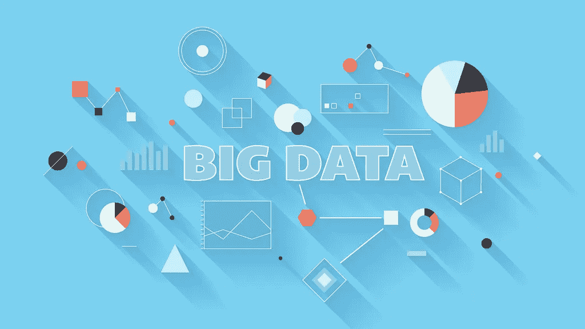

# 大数据分析:为什么公司使用它？

> 原文：<https://medium.com/hackernoon/big-data-analytics-why-companies-use-it-a0298be7e095>

## *想知道如何掌握大分析软件？在本指南中，了解公司如何利用这些数据。*

**大数据定义** 实时大数据是在数据到达时进行处理的数据。一旦它到达，要么用户在不超过为决策分配的时间段的情况下获得可消耗的洞察力，要么分析系统触发通知或行动。

由于实时被误解为瞬时，让我们解释一下数据响应和输入的时间框架。就数据输入而言，处理引擎可以设计为拉或推数据。

大容量流动数据(即流)的推送选项的最常见示例。然而，实时引擎并不总是能够使用流数据。或者，它可以通过询问是否有新数据到达来接收(拉取)数据。这些查询之间的时间取决于业务需求，可以从几毫秒到几个小时不等。

相应地，响应时间也发生变化。例如，[无人驾驶汽车](https://hackernoon.com/self-driving-cars/home)的响应时间很快——几毫秒。如果我们正在处理安装的传感器，并且连接它们的是风力涡轮机，并且它们在高于平均水平的缓慢增长的齿轮箱油温中通信，我们将需要一分钟的响应时间来改变叶片桨距，这将卸载涡轮机并防止机器发生故障或着火。

然而，银行的分析系统至少需要几分钟来测试申请人的素质；零售价格需要一个多小时来更新。尽管如此，这些都是实时分析的例子。

**优势** 

不是所有的公司都使用实时分析。原因各不相同:资金不足、缺乏专业知识、管理团队的不情愿以及对相关挑战的恐惧。然而，[像 Famoid](https://famoid.com/buy-instagram-followers/) 这样使用实时分析的知名公司将获得竞争优势。

假设你是一家时尚零售商，想要提供高质量的客户服务。分析大数据有助于实现这一愿景。例如，一旦顾客经过一家零售商的商店，他们就会在智能手机上收到通知，激励他们进入商店。

一旦顾客进入商店，工作人员就会在他们的应用程序上收到通知。这让他们了解顾客的风格偏好、最新购买情况、对促销的兴趣。看起来对零售商和顾客来说是双赢的局面，不是吗？

电子商务零售商可以通过[实时分析数据](https://www.cio.com/article/3238475/adopt-real-time-data-analytics-or-get-left-behind.html)获得更好的业绩。例如，它可以减少废弃手推车的数量。例如，假设一位客户已经走了这么远，但由于某种原因没有完成购买。

不过，这是一个激励你的客户改变主意的好机会。该系统转向客户的简档数据以及他们的冲浪和购买历史，以将客户的行为与来自相同细分市场的客户的行为以及他们对类似情况的反应进行比较。基于他们的分析，系统创建最可能的解决方案—例如，创建折扣。

**大数据分析的未来是什么？** 随着大数据分析的发展，我们将开始看到更多解决日常业务问题的方案。这使公司能够预测行为，并根据提供给他们的数据创建解决方案。大数据将会有一个光明的未来，我们迫不及待地想知道在那之前会发生什么样的进步。