# 数据专业人员使用 GCP 的大数据和机器学习基础。

> 原文：<https://medium.com/hackernoon/big-data-and-machine-learning-fundamentals-using-gcp-for-data-professionals-44f249cdb168>

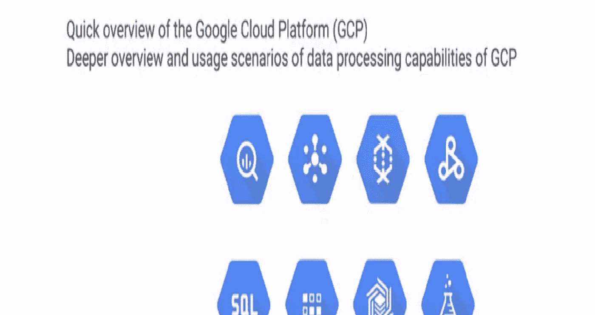

您将获得 GCP 的简要概述以及在 GCP 推动机器学习和大数据的工具。

# 那么什么是 GCP 呢？

GCP 代表谷歌云平台…简单地说就是谷歌提供可能的解决方案。现在我希望你已经了解了什么是云。如果您曾经在拥有自己的数据中心的组织中工作过，您就会对云有所了解。它仅仅意味着允许你用一台机器做你想做的事情，但是限制你的物理级别的访问。那么，作为一个组织，你如何从云获得好处，因为你没有任何物理访问它的机会，所以所有关于机器的物理障碍(硬件、网络)都立即消失了。

那么 GCP 为数据处理提供了什么产品呢

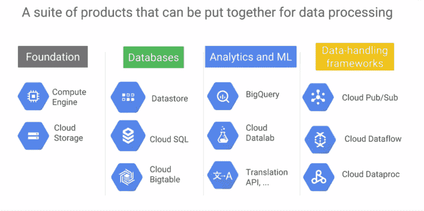

现在让我们从云上的计算机开始…..高层次的物理计算机由计算引擎、存储选项和网络组成。云计算机也不过是物理废弃的复制品。

google cloud 的设计目标是基于无操作策略，即最大限度地减少对机器的操作。例如，假设您想要为您的工作创建一个虚拟机，那么您应该转到云控制面板，单击计算引擎，将会出现这样的屏幕

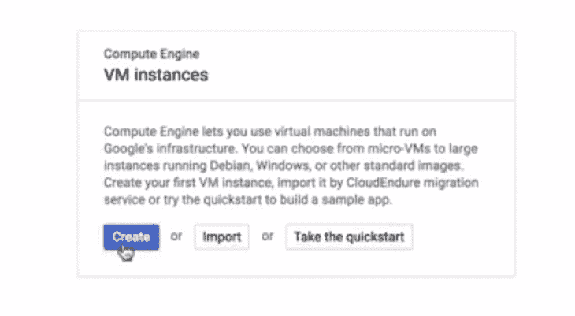

点击创建，你会看到这样一个页面

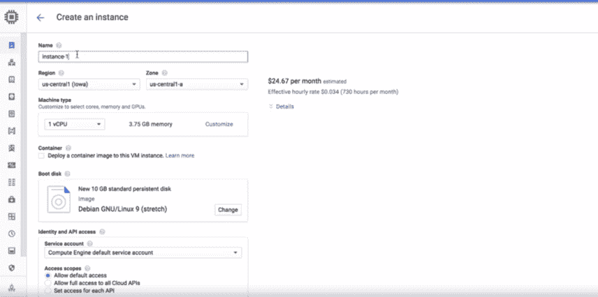

填写表格(开玩笑)/要求并排检查账单以调整您的预算，然后单击创建。一旦点击，你会得到这样一个页面

点击 ssh 访问，你会看到这样一个窗口

只需点击几下，您的新虚拟机就在您面前了。

要检查您的机器详细信息，请键入 cat/proc/cpuinfo，您将得到如下结果

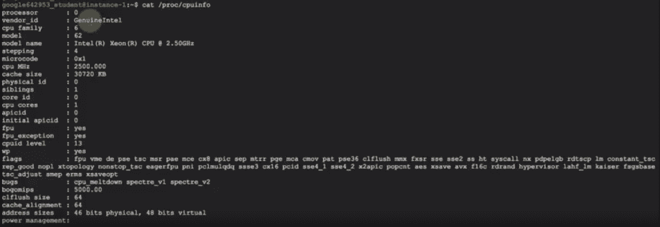

现在，随着您的计算问题得到解决，我们的下一个问题是存储不要紧张，我们有多个不同文件类型的选项，但作为一个中转地，您可以将所有内容存储在云存储上。

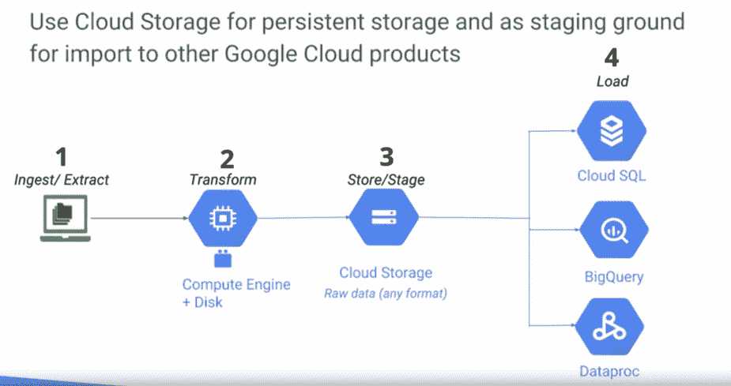

那么，为什么不将数据存储在计算引擎的永久磁盘上呢？答案是，磁盘与计算引擎相连，因此，如果引擎消失，那么数据就会消失。但是，假设您只需要一个项目的计算引擎，而其他大多数项目都需要数据，那么您会每次都上传数据吗？不会。您会将云存储用作主要解决方案，并将其用于其他服务。

现在，如何将文件从本地传输到云存储，要在云上存储数据，您需要提供一个存储桶(保存数据的容器)，为此您将使用 gsutil 命令行工具，例如将文件从本地复制到云，您将键入**gsutil CP local _ files _ address cloud _ bucket _ address**。

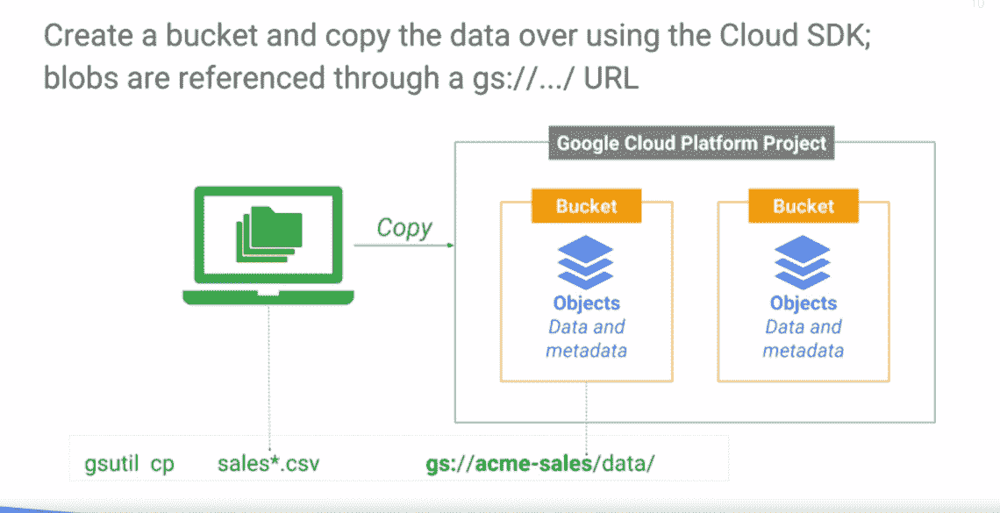

你可以认为 bucket 作为域名需要是唯一的，一般规则是使用某种与你的组织相关的名称。

您可以使用 ls 以分层的方式列出文件。mv 用于在存储桶之间移动文件，mb 用于创建存储桶，rm 用于删除所有基于 unix 的命令。要了解云存储，让我们首先通过键入以下命令将数据接收到我们的虚拟机中

我们正在做的是从我们的永久磁盘中删除任何文件名地震. csv，并重新下载地震. csv。您可以使用。sh 扩展。要运行 bash 文件，请点击 bash file_name.sh 命令。使用分层文件视图命令 ls 来检查您是否确实下载了数据，您将看到

现在，为了使用转换，我们将以 python 的方式进行转换和操作，您可以通过手动下载在您的计算机(vm 实例)中安装包，或者将其放在 bash 文件中并运行脚本。用于转换输入文件(地震. csv)的 python 文件如下所示

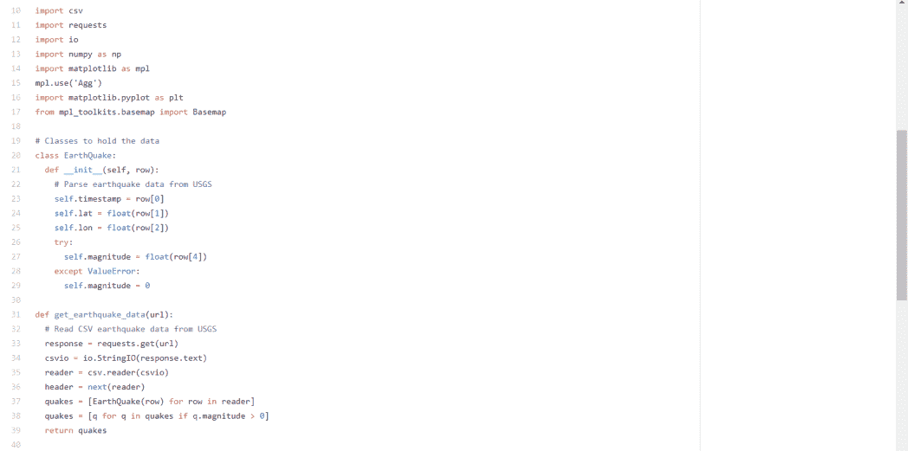

如果你理解代码，你会注意到最终产品是一个 png 文件，如果你不像我一样理解它，就运行它。所以在终端中运行它

现在，如果你输入 ls，你会看到这样的文件

正如我们之前所说的，我们需要在云存储中存储这些文件，因此我们需要 bucket。转到云控制台 webUI 在存储中搜索点击桶记住它需要是全球唯一的(使用项目 ID +一些随机废话)

现在转到控制台键入 gsutil cp 文件名云存储地址复制文件。

你的桶应该像这样

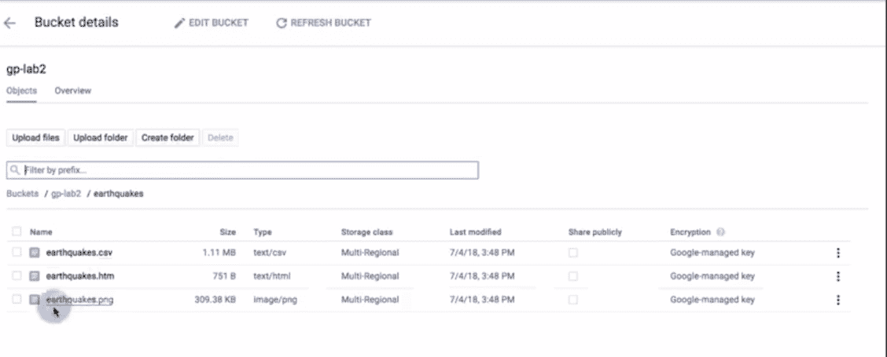

现在世界上任何一个拥有相同网址的人都可以访问你在 earthquakes.png 的作品

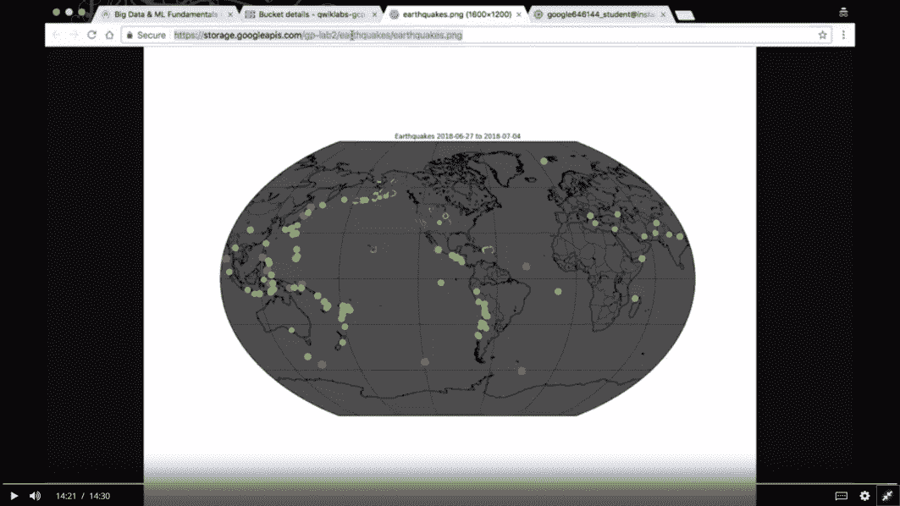

现在看看谷歌云提供的一些存储解决方案

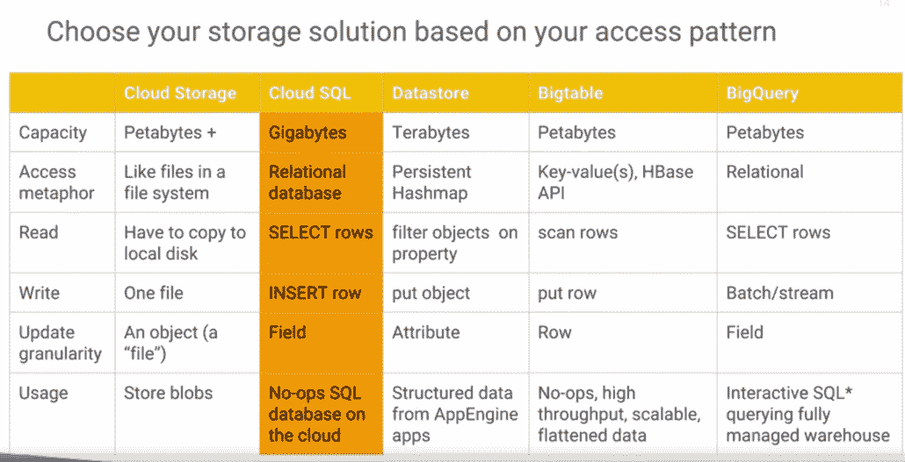

云 SQL 是

这些原因是你和你的市场 mysql 之间的瓶颈，就像如果你喜欢像 cloud launcher 一样在你的虚拟机上安装 mysql，你将会错过 Google 提供的所有这些好处。

因此，让我们使用一些云 SQL 特性

首先从控制台 UI 获取您的项目 id，或者在 shell 上键入 **gcloud config 项目列表**

现在，由于云 SQL 是 MySQL 或 postgreSql 的一个实例，我们将编写一个 Sql 命令来生成表。同样，您需要一个存储桶来将您的数据主要存储在云上。

再次创建一个 bucket，通过 gsutil cp 或 mv 命令将您的文件从虚拟机传输到云存储，您可以看到 bucket 中的文件如下所示

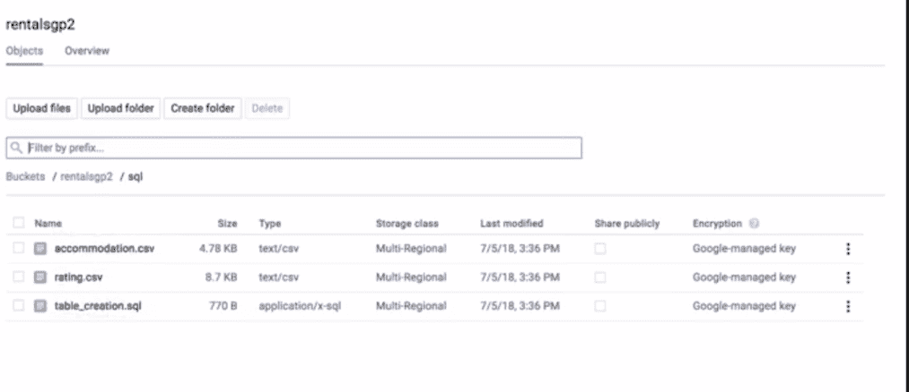

现在，创建一个 sql 实例，并转到它，您将看到如下概述

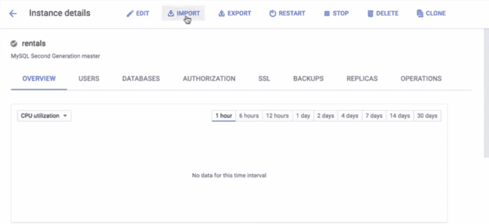

现在导入 sql 语句来制作表和视图

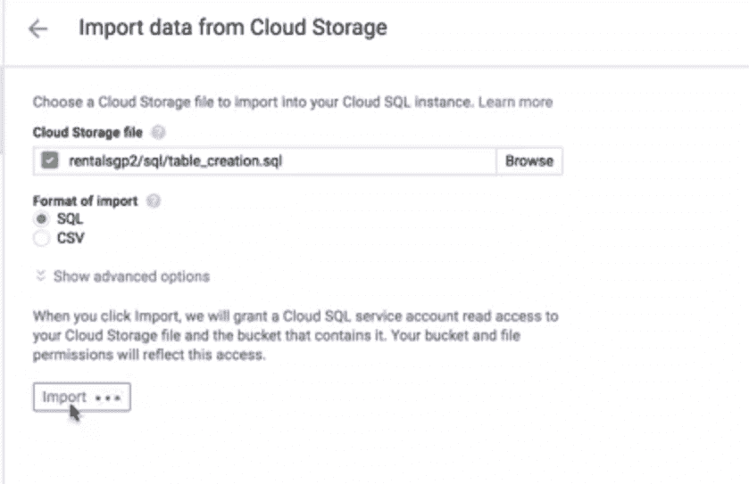

现在将数据导入表中

现在打开您的数据库连接

现在，您可以在云 sql 上轻松运行您的 sql 作业

在接下来的帖子中，我们将会发现 hadoop 框架和其他 ml 的内容，敬请关注，你可以在[媒体](/@ssatyajitmaitra)上关注我。

如果你喜欢这个帖子，并希望你的同事或朋友也能学习，点击“喜欢”按钮，在 linkedin、facebook、twitter 上分享它，让我们共同成长，创造一个没有偏见的机器-人类编译的未来。