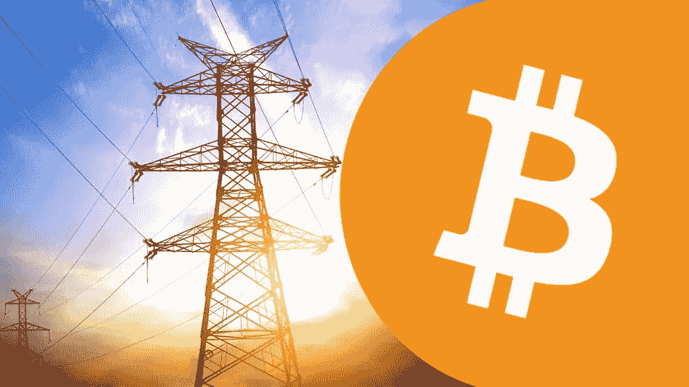
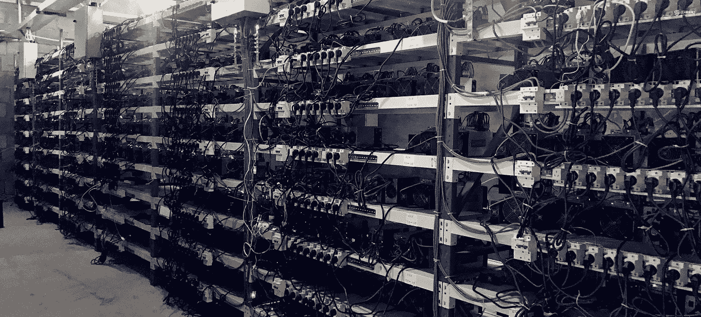

# 比特币和电力:你不知道的事——第一卷

> 原文：<https://medium.com/hackernoon/bitcoin-and-electricity-things-you-dont-know-vol-1-e287b392cabd>

**前言**:

我是一个加密货币的爱好者，更准确的说是半专家爱好者，中等初学者。另外，我对金融、经济和投资有所了解，可能比你们中的许多人更了解亚洲(尤其是如果你来自欧洲或美国)。我总是愿意并准备分享我的知识、想法和个人观点，尤其是在加密货币领域。现在欢迎你加入我们的讨论！

比特币是世界上最大、运行时间最长的加密货币。

比特币使用 POW 机制，消耗电力(电能)来保证系统安全。

这两者结合在一起，比特币至今已经消耗了大量能量。这的确是一个值得我们仔细观察和深入研究的真理。

早在六个月前，比特币的总功耗可以与一个欧洲中小国家(如爱尔兰和捷克)相媲美。更可怕的是，有人认为在不久的将来，比特币的功耗完全有可能超过任何一个欧洲国家。

巨大的电力消耗使比特币这种加密货币超出了单纯的技术解决方案的范围，而是将其纳入了整个社会面临的问题。围绕这个问题，我看到了太多的误解、争论、谬误，甚至激烈的对抗。所有这一切让我意识到有必要分享我对一些值得讨论的话题的想法(我将在下文中概述和总结)。无论你是加密货币领域的新人还是老手，我相信，这里总会有一些果实为你而结！

# **话题一:比特币是否浪费了太多能量？**

这其实是一个很基本的问题，但也是关于比特币最复杂最微妙的问题。

如果你只是从上面瞥了一眼比特币，或者对它有一点混淆的信息，我相信，这也将是你心中的想法。这就是为什么我把它放在整个系列的前面，不仅因为它是吸引几乎所有新人的一个必须关注的问题，而且它对于理解比特币的本质非常重要。即使你对比特币非常了解，这也值得你三思！

比特币挖矿(或者技术上说——区块生产)是基于一种表现出高度随机性的算法，即 SHA256 哈希算法。你通常没有机会预测一个给定的输入会把你带到哪里。这意味着，在大多数情况下，输出值是完全随机的。

在挖掘过程中，挖掘者将争先恐后地枚举数量惊人的随机数，期望散列输出满足非常苛刻的要求，例如，散列值小于 0.0000000000001。一旦一名幸运的矿工碰巧发现了这样一个随机数，他就可以获得当前区块的记账权，成为该区块的生成器，并在比特币基地获得新的比特币奖励。

然而，比特币基地奖只是一个额外的奖励，却戏剧性地成为了整个经济体系的动力源。这使得整个比特币 POW 机制如此迷人，也是中本聪真正天才的完美体现。因此，战俘背后的深刻哲学值得我们深思熟虑。

这种机制对矿工提出了一个要求，即他/她必须使用一个计算单元(一个芯片，或一个专门设计的电路)来计算散列函数，以便通过昼夜不停地工作来连续地枚举随机数，从而不会错过任何可能的机会来获取给定块的记账权限。

比特币真的是在浪费大量的能量吗？争论的核心是比特币背后的 SHA256 计算是否真的有意义。对于那些反对 SHA256 的人来说，他们声称 SHA256 不能产生价值，因此比特币纯粹是浪费能源。而那些 SHA256 的维护者却认为，虽然 SHA256 本身就是一个伪随机，但计算能力的竞争增强了比特币的安全性，使其不可篡改，以至于计算能力(以及背后消耗的电力)应该被视为比特币维护所付出的必然和必要的成本。

the Hash beast: huge electricity consumers

这些都是陈词滥调。所以我想分享我的一个版本。比特币的安全性、市值、功耗共同构成了一个正反馈的回路。任何单一因素既不是原因也不是结果。比特币计算能力的由来已久的稳健发展，或者说它此刻的实时能力，只是提振了人们对比特币的信心，间接提高了其市场价值的结果。

但与我们的直觉相反，市值绝不是权力积累的必然结果。我们不接受也永远不会接受这样的约束。大胆地说，比特币即使积累了如此庞大的哈希计算，也完全有可能在未来的某个时间依然走到归零的结局。尽管发生的可能性很小(我认为在可预见的未来不会发生)，但这种逻辑仍然有效。我们必须准备好面对它，接受它。

所以我对耗电问题的回答是，比特币消耗的电力实际上代表了用于维护比特币总账系统安全的“日常开支”，是系统以合理、稳定、可持续的方式所需要的。有些人认为，超出这一维护范围的服务可能无法成比例地提高安全性和网络价值。因此，如果现在的比特币账本已经被市场认为是“不可篡改”的，我认为现在再给它增加 10 倍的权力也不会有什么特别的意义。

# **话题二:比特币市值决定挖矿成本还是反之？**

这有点像先有鸡还是先有蛋。但其实不是。

如前所述，矿工的开采是自发的。这是一种基于经济理性人假设的行为。这一点非常重要。

中本聪在每个区块的比特币基地交易中隐藏了固定数量的比特币，正是那些拥有会计权利的幸运矿工将转账交易记到了自己的地址。

所以矿工们的行为完全是利益驱动，仿佛一个设置好的程序，等着玩家陆续加入。当矿工过剩，计算能力过剩，随之而来的收入减少，自然会赶走一部分在成本上不占上风的矿工。这也是为什么对于电力开采来说，集中化是如此难以避免。然而这是另一个问题，不在这里讨论。

Today, Bitcoin holds more than 60E Hash/s power that keeps the ledger secure.

这种程式化的行为给了我们一个清晰的逻辑。比特币的市场价值决定了区块发电机作为奖励获得的法定货币的数量，这进一步促使矿工计算他们的成本和收益(注意:矿机的硬件成本和电力一样是由法定货币计算的，所以这样的计算是真实的，不是编造的)。因此，这种简单的成本效益计算可以决定矿工是否选择继续开采。当然，真实的情况可能更复杂。矿工可能需要结合静态和动态条件或考虑沉没成本(已投资的固定资产及其折旧)和持续投资(电力，本质上是资产负债表上的成本)。

然而，我们并没有使整个事情复杂化。如果你真的对资产负债表毫无概念，那也没关系，因为它背后的原理相当简单。也就是说，比特币市值的变化会引发每个矿工的思考:我是否应该坚持采矿？一般来说，更高的市场价格会吸引矿工去采矿，这也包括新矿工数量的增加和对电费敏感度的降低……反之亦然。在这种自发的市场调节机制下，矿商自然会将成本调整到刚好有利可图的水平。所有的矿工将永远保持这样的平衡。这是微观经济的宏观表现，一如既往的有效。

在这一点上，我们的逻辑已经完美地解释了决定开采成本的是比特币的市场价值，而不是相反。这可能有点违背直觉，但我的结论非常符合我的逻辑。你这样认为吗？