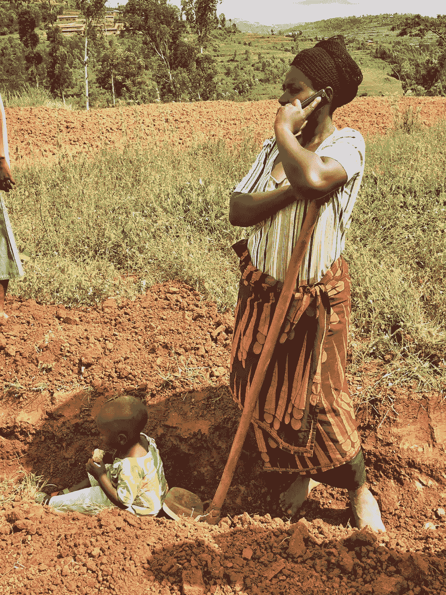
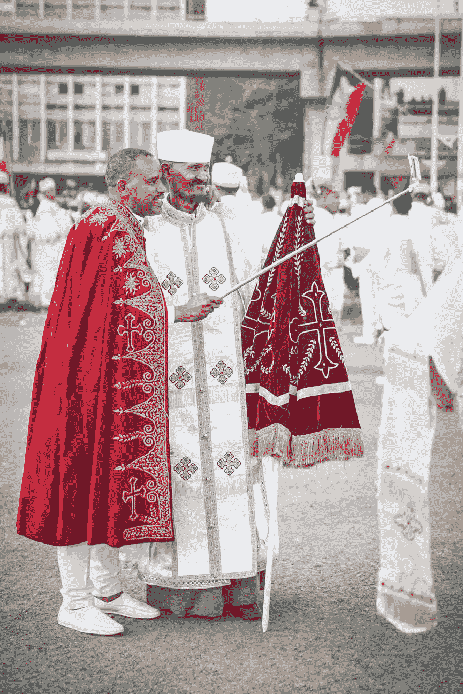
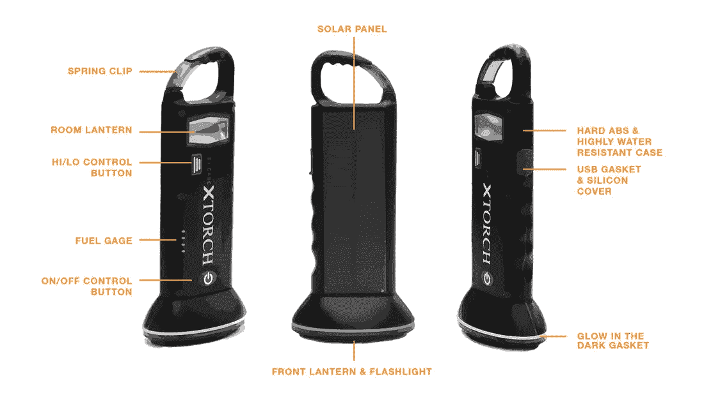

# 无银行账户者的比特币:网络和小额信贷如何终结我们所知的贫困

> 原文：<https://medium.com/hackernoon/bitcoin-for-the-unbanked-how-mesh-and-microfinance-could-end-poverty-as-we-know-it-547bf22c2e1e>

Image courtesy of Barak Bruerd

*注意:我没有从本文中列出的任何产品获得任何补偿。以下内容并非投资建议，应视为纯粹的假设练习。*

在过去的 30 年里，T4 每天生活费不足 1 美元的人口数量减少了一半以上。这是一个不可思议的里程碑，许多人都没有意识到，但仍有许多工作要做——根据世界银行的世界发展指标，生活在撒哈拉以南非洲的人们的平均收入仍然只有每天 1 美元。

虽然非洲国家确实很穷，特别是那些脆弱的撒哈拉以南非洲国家，但也经常看到赤脚的非洲人挥舞着智能手机。事实上，根据全球系统移动协会在 2018 年 7 月进行的一项研究，[到 2025 年](https://www.gsma.com/newsroom/press-release/more-than-half-of-sub-saharan-africa-to-be-connected-to-mobile-by-2025-finds-new-gsma-study/)，超过一半的撒哈拉以南非洲地区将订阅移动服务。虽然智能手机的采用率确实低于标准移动设备，但皮尤研究中心发现[撒哈拉以南非洲的智能手机拥有率仍在增长](http://www.pewglobal.org/2018/10/09/majorities-in-sub-saharan-africa-own-mobile-phones-but-smartphone-adoption-is-modest/)。

令人惊讶的是，其中许多国家以令人难以置信的速度经历了工业革命，并正在迅速走向一场前所未有的技术革命，这可以归功于就在他们家门口的智能手机制造。

2012 年[非洲智能手机的价格是 230 美元](https://pctechmag.com/2018/02/will-2018-year-smartphone-africa/)，而在 2018 年人们偶尔会发现[价格低至 50 美元的手机。贫困的减少和新技术的引入正在世界上一些人们最意想不到的地方创造新兴市场。](https://pctechmag.com/2018/02/will-2018-year-smartphone-africa/)

> 今天，16 个非洲国家拥有运作良好和透明的股票市场，2008 年市场资本总额约为 2000 亿美元。-丹比萨·莫约·死援

虽然非洲经济的增长令人钦佩，但传统的股票市场系统存在两个主要问题:资源和可及性。

即使推出了廉价智能手机，大多数非洲人也无法投资自己的新兴市场，因为他们的财务利润率为零。丹比萨·莫约在她的书 *Dead Aid* 中指出，“7 亿非洲人中有超过一半的人每天生活费不到 1 美元，撒哈拉以南非洲的贫困人口比例是世界上最高的——约占世界贫困人口的 50%。”在这些水平上，简单地把食物放在你的桌子上并把你的孩子送到学校几乎是不可能的。

此外，Moyo 强调了非洲经济增长的另一个障碍:政府。目前，“非洲大陆约 50%的地区仍处于非民主统治之下。根据 Polity IV 数据库，非洲仍然是至少 11 个完全独裁政权的家园。

事实上，非洲几乎没有自由，普遍的共识是，现状解决不了全球南方面临的问题。那么接下来呢？

在我们深入梦想家对加密货币、太阳能电池板和撒哈拉以南非洲网状网络的理想应用之前，有必要简要了解一下扶贫方法。这种干预就是小额信贷。

小额信贷在二战后的马歇尔计划中被大量使用，通常指的是向那些由于各种原因无法获得传统贷款的个人提供小额贷款(通常只有 25 美元)的做法，这些原因包括:缺乏信贷、缺乏抵押品(或无法提供所述抵押品的所有权文件)、银行系统腐败等。

授予机构通常是利用低利率的非营利组织，主要依靠关系作为抵押。成功的小额信贷业务往往使用储蓄团体模式，让个人对其社区的其他成员负责，因为因拖欠贷款而变得关系贫困的后果非常高。

2015 年，[世界银行估计](http://www.worldbank.org/en/news/feature/2015/03/30/does-microfinance-still-hold-promise-for-reaching-the-poor)全球小额信贷行业规模约为 600-1000 亿美元，拥有 2 亿客户。虽然对小额信贷的有效性有各种各样的评论(这超出了本文的范围)，但最成功的干预往往包括商业小额信贷中没有的教育和关系方面。这对我们的目的很重要，因为这意味着小额信贷需要发展以解决两个重要问题:法定货币和个人责任。

首先，小额信贷系统很容易被中央控制的通货膨胀和政府腐败所操纵。小额信贷储蓄组织的表现取决于它用来储蓄的法定货币，而独裁政府很少宣扬强有力的法定政策(比较一下撒哈拉以南非洲的平均通胀率(T1，约 8%，T2)和美国的平均通胀率(T3，约 3%)。抵押品的证明在这方面也是一个问题；农民很少有文件证明他们拥有自己的农田，这在最好的情况下会导致贷款被拒，在最坏的情况下会导致政府没收财产。

第二个问题是个人问责制，这在很大程度上是商业小额信贷的一个问题。即使有储蓄集团的社会责任，小额信贷对投资者来说也是有风险的。宗教团体已经成功地将干预与传教结合起来，这往往会产生长期的结果([甚至从世俗学者的角度来看](https://www.jesuit.org.uk/fr/node/7372))，但是如果没有这种被认为是“精神安全网”的东西，投资者几乎无法对冲拖欠的小额贷款。

最后，许多这样的储蓄团体将他们辛苦赚来的现金存放在一个成员家中的容器里，这本身就带来了一系列问题。

那么*加密货币和网状网络如何帮助撒哈拉以南非洲呢？*

Image courtesy of Barak Bruerd

要让加密货币(特别是比特币)成为撒哈拉以南非洲的可行解决方案，我们必须解决两个突出的问题:电力和互联网。快速浏览一下世界银行的用电国家图表就能看出需求的严重性。

1990 年，乍得全国 0%的人口有电力供应。2016 年，这一数字上升到了 9%。刚果民主共和国也好不到哪里去，2016 年仅有 17%的公民拥有权力。相比之下，埃塞俄比亚有 43%。在整个撒哈拉以南非洲，1990 年只有 16%的人用上了电，到 2016 年这一数字将上升到 43%。

虽然有许多令人难以置信的干预措施可以帮助向非洲国家输送电力，但让我们考虑允许个人尽快开始加密货币交易的选项。我发现的一个这样的选项是 [XTorch](https://www.xtorch.org/our-product.html) 。

Image taken from [https://www.xtorch.org/our-product.html](https://www.xtorch.org/our-product.html)

XTorch 通过太阳能电池板充满电只需 22 小时，通过墙壁适配器只需 1.5 小时，一次充电就可以将智能手机电池充满电(对于撒哈拉以南非洲使用的简单手机，一次电池寿命可以为三个设备充电)，保质期为 6-10 年。

利用 XTorch 的配套 2.5 瓦太阳能电池板附件，一次充电可以在短短 6 小时内完成。XTorch 本身非常适合紧急救援情况，而额外的外部太阳能电池板通常用于长期发展情况，如我们正在考虑的情况。这种工具比一套独立的太阳能电池板更加实用和持久，易于使用和运输。

有了 XTorch，我们暂时解决了电力问题。我们可以为我们的智能手机充电，并为世界偏远地区的其他设备供电。但是，正如人们所怀疑的那样，哪里缺少电力，哪里就缺少互联网，这阻碍了加密货币的交易。这就是本地网状网络的用武之地。

网状网络是一种局域网，其中网络节点在没有任何等级结构的情况下直接在彼此之间中继信息，并且其中节点尽可能高效地合作传输信息。因为网络不完全依赖于任何一个节点，每个节点都平等地参与信息的传递。由于这种类型的工作分配，一个节点故障很少会导致网络受损。

一种用于创建本地网状网络的设备是 GoTenna T1，这是一种使用无线电频率和蓝牙技术来广播信息的低功耗节点。GoTenna 最近与 [Samourai Wallet](https://samouraiwallet.com/) 合作，创建了“ [TxTenna](https://txtenna.com/) ”，这是一种物理技术和软件的结合，允许人们在不需要互联网连接的情况下交易比特币([点击这里查看他们的网站](https://txtenna.com/)查看该过程如何工作的简洁图形)。

这种 GoTenna 设备可以通过 USB 电缆通过 XTorch 供电，如果连接到太阳能充电设备，可能会无限期地运行。这项技术是如此新颖和创新，以至于你很难理解它——我偶然发现了[这个有帮助的分步演练](https://billfodl.com/blogs/fodl-blog/a-guide-to-setting-up-txtenna),它帮助我离线交易了我自己的比特币。负责开发的人出现在[比特币杂志](https://medium.com/u/da165ee059da?source=post_page-----547bf22c2e1e--------------------------------) [的一篇文章中。](https://bitcoinmagazine.com/articles/no-connection-required-how-one-dev-sent-bitcoin-while-grid/)

在一个理想的世界中，当地社区和小额信贷储蓄团体可以在没有外部影响的情况下，在各自的网状网络上独立运作，从而提高效率，加强责任感和安全性。一个简单的冷藏钱包可以消除对纸币容器的需求，而一个 [multisig 比特币钱包](https://99bitcoins.com/multisig-a-beginners-guide/)可以确保没有一个成员在没有大多数成员明确同意的情况下进行交易。

在现实世界中，这个系统看起来像这样:

*   非营利组织 A 向阿玛迪发放了 0.1 BTC 的小额贷款，阿玛迪是一位在衣索比亚经营储蓄团体的女性。Amadi 将她的贷款存放在一个冷藏钱包中，她可以通过智能手机访问这个钱包。
*   由于 Amadi 是她的储蓄小组的领导，她负责通过她当地的网状网络分发所需的资金，该网络由 GoTenna 和挂在她小屋门口的太阳能 XTorch 供电。
*   每当储蓄小组的成员需要从他们的基金中提取比特币时，他们都会提醒 Amadi，Amadi 会通过 WhatsApp 将提议的需求发送给小组的其他成员。在多数投票的情况下，资金可以从储蓄集团的 multisig 比特币钱包转移到收款人的私人钱包。

XTorch/GoTenna 系统的美妙之处在于，它有可能解决我们到目前为止讨论过的许多问题，甚至一些我们还没有解决的问题:

*   防止腐败政府的保护
*   防止中央控制的菲亚特
*   储蓄小组问责制
*   快速、免费的国际货币转账
*   创造了以前不存在的自给自足的地方经济

诚然，这种投机系统存在几个明显的问题，包括需要互联网连接*最终*才能广播交易(尽管偏远社区通常需要旅行才能解决这样的问题)，撒哈拉以南非洲当地人的高昂进入成本(非政府组织和小额贷款可能有助于缓解)，以及加密货币被接受为支付手段的背景很小。但是允许明显的问题阻止投机性的解决方案没有任何好处。

XTorch 首席执行官 Gene Palusky 提出的一个推测性解决方案可能是这样的:

*   像谷歌或脸书这样的大公司可以与当地互联网服务提供商合作，帮助将最后一英里的互联网连接带到世界上尚未到达的地区，因为这有明显的商业优势
*   小额融资非政府组织可以提供贷款，资助与创建当地网状网络相关的小企业
*   当地非营利伙伴可以与社区合作促进和管理项目，同时整合鼓励整体和可持续变化的干预措施(例如，捐赠 GoTennas 或 XTorches 作为对良好学校表现的奖励)

我们知道，全世界都迫切需要金融自由和创新，我们也知道，从现在到最终消除贫困，还有巨大的障碍。但是在过去的 30 年里，我们已经取得了如此多的成就，人类的创造力没有止境(谁知道我们甚至能够用比特币这样的货币进行离线数字交易！).

随着像我们在这篇文章中回顾的想法的开始，没有人知道我们在未来 30 年将能够完成什么。你会如何调整这个系统，使它更好地工作？我们如何利用网状网络和加密货币来结束贫困，让世界变得更加自由？请在评论中告诉我！唯一阻碍进步的是无所作为；贫穷的唯一希望是我们的自满。