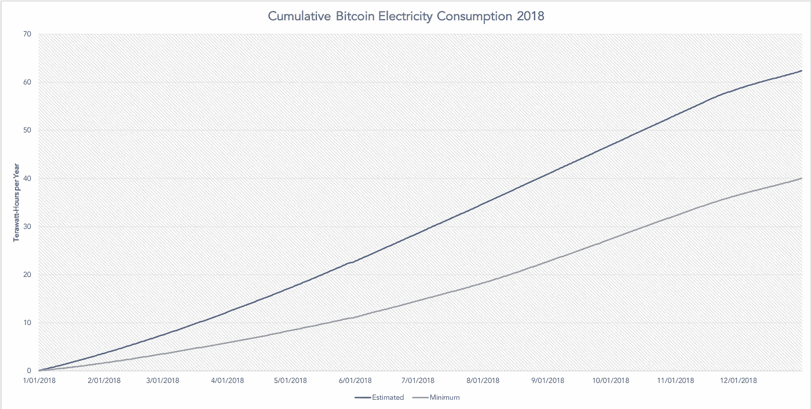

# 比特币不可逃避、难以忽视的真相

> 原文：<https://medium.com/hackernoon/bitcoins-inescapable-inconvenient-truth-da0f0219cda6>

## 比特币有一个肮脏的秘密，社区很快就找不到借口了。

It’s time to start making Bitcoin environmentally sustainable.

当中本聪创造数字货币比特币时，他也决定不会有超过 2100 万枚硬币。这些硬币将随着时间的推移慢慢发行，作为对那些参与比特币基础区块链区块创建过程的人的奖励。Satoshi 将“新硬币数量的稳定增加”描述为“类似于金矿工人花费资源将黄金添加到流通中”，并指出“在我们的情况下，消耗的是 CPU 时间和电力”。

## 不断增长的能源消耗

目前还不知道 Satoshi 在写这篇文章的时候，是否曾经设想过比特币已经变成了一个耗能的噩梦。在 2018 年全年，比特币矿工负责的总电能消耗**至少** [40 太瓦时](http://bitcoinenergyconsumption.com) (TWh)。这相当于像[匈牙利](https://www.iea.org/publications/freepublications/publication/KeyWorld2017.pdf)这样的国家消耗的电量，以及全球数据中心消耗的总电量的 20%(每年 200 TWh )。后者包括负责处理全球银行业交易的数据中心消耗的电能。目前还不清楚到底哪一部分用于银行业，但即使我们把一切都归因于银行业，经营规模的巨大差异也确保了比特币相比之下并不好看。

Minimum and estimated Bitcoin electrical energy consumption over 2018 (source: [BitcoinEnergyConsumption.com](http://bitcoinenergyconsumption.com)). The methodology for both approaches is detailed in the peer-reviewed academic article “[Bitcoin’s Growing Energy Problem](https://www.cell.com/joule/fulltext/S2542-4351(18)30177-6)” published in Joule on May 16, 2018.

全球银行业每年处理大约 5000 亿笔非现金交易。由于总能源需求为 200 TWh，因此每笔交易的最大能源足迹为 400 瓦时(Wh)。这将是一个极端的数字，因为单笔 VISA 交易的能源足迹约为 1-2 瓦时(VISA 作为一个整体每年仅需要 0.20 瓦时，其数据中心占该数量的一半)。与此同时，比特币在 2018 年仅处理了[8140 万](https://www.blockchain.com/charts/n-transactions-total?timespan=2years)笔交易。这使得比特币交易的最小能源足迹为 491.4 千瓦时，是传统非现金交易最大能源足迹的 1200 多倍，是 VISA 交易的 25 万多倍。

这种灾难性的表现不足为奇。一天中的每一秒，比特币网络都在通过 [45 万亿次](https://www.blockchain.com/charts/hash-rate) (45 * 10^18)哈希运算运行。这是为比特币区块链创建新交易区块过程的一部分。每年有 8140 万笔交易，但每秒处理的交易量仅为 258 笔。这是一个超过 17 万亿分之一的比率。

## 进入网络的能源不是“绿色”的

比特币的支持者随后开始辩称，尽管网络可能需要大量电力，但其对环境的影响是有限的。根据他们的说法，该网络利用了过剩的可再生能源，[主要是在中国的四川省](https://coinshares.co.uk/wp-content/uploads/2018/11/Mining-Whitepaper-Final.pdf)，否则这些能源无论如何都会被浪费掉。因此，比特币开采的环境影响可以忽略不计。不管这是真是假(没有提供有力的支持)，即使大多数矿工确实在四川，这种说法也不成立。

比特币的支持者不愿透露的部分事实是，四川的水力发电产量极其不稳定，因此过剩充其量只是暂时的。在多雨的夏季，产量是干燥的冬季的三倍。这是一个涉及可再生能源的问题。阳光并不总是明媚，风也不总是吹拂，干旱限制了水力发电的可用性。**可再生能源生产本质上是不稳定的。**

与此同时，一个比特币矿工将永远有一个恒定的全年需求。比特币挖矿设备一旦开启，就不会被关闭，直到它发生故障或变得无利可图。随着新的机器不断被添加到网络中，一个矿工根本不能停止工作。这很快稀释了采矿设备可以产生的收入(因为固定的区块奖励必须在更多的机器之间分享)。关闭，即使是很短的一段时间，都会导致不可挽回的收入损失。

Bitcoin network total hashrate versus the average amount of Bitcoin expected to be generated per day, by several types of Bitcoin mining devices. As more machines are introduced into the network, the proportional share of a single device (and therefore potential generated income) falls rapidly towards zero.

这使得可再生能源生产和比特币能源需求**从根本上不兼容**。在四川，水力发电产量的波动通常被煤电抵消。事实上，新的燃煤电厂仍在为此而建设，比特币矿工的存在只会成为这方面(或保持现有电厂运营)的额外激励。由于电网基础设施差，四川无法从更偏远的地方进口更清洁的电力；与水力发电暂时过剩的原因一样(因为没有适当的出口能力)。

毫不奇怪，四川购买电力的碳强度比瑞典(那里的发电通常是核能或水力发电)高得多。瑞典发电的排放系数约为[每千瓦时 13 克二氧化碳](http://www.compareyourcountry.org/climate-policies?cr=oecd&lg=en&page=2)，四川购买电力的排放系数为[每千瓦时至少 265 克二氧化碳](https://pubs.acs.org/doi/abs/10.1021/acs.est.7b01814)。因此，进入比特币采矿网络的可再生能源也不能被视为“绿色”。如果所有比特币矿工都在四川，比特币每笔交易 491 千瓦时的最低能源足迹仍将转化为至少 130 千克二氧化碳的碳足迹。这相当于一辆特斯拉 model S 行驶 500 英里的碳足迹，或者消耗近 5 公斤牛肉的碳足迹。每笔交易。在最乐观的情况下。相比之下，一次谷歌搜索只相当于 0.8 克二氧化碳，一次 VISA 交易相当于 0.4 克。你试过吃~0.015 克牛肉吗？

## 再多的“绿色”能源也无法解决电子垃圾问题

比特币的支持者们视而不见的另一件事是，无论比特币开采的能源有多“绿色”，网络仍然有一个丑陋的电子垃圾足迹。用于比特币挖矿的机器多为专用集成电路(ASIC)挖矿机。顾名思义，它们是为一个单一的目的而硬连线的，因此在它们的使用寿命结束后不能重新使用。像大多数电子垃圾一样(全球只有 20%被回收)，它们最终会被送到对环境有害的垃圾填埋场和焚化炉。整个比特币网络产生的电子垃圾相当于卢森堡这样的国家，每一笔独特的比特币交易都会产生令人震惊的 135 克电子垃圾足迹(相当于四个标准的六十瓦灯泡)。这比一项非常悲观的 VISA 交易的电子废物足迹估计至少高 30，000 倍(假设每台 VISA 服务器重 100 公斤，每年更换一次)。再多的“绿色”能源也无法解决这个问题。

## 是改变的时候了

没有办法把这件事往好的方面想。人们只能说，像所谓的闪电网络(扩展比特币的第二层解决方案)这样的发展可能有助于减少每笔交易的环境足迹，但这在不久的将来肯定不会发生(如果在任何时候发生的话)。最近闪电网上的一个“概念验证”[闪电披萨](https://ln.pizza/)，只能算失败。第一天只有 10%的订单成功，其他 90%的订单[都失败了。如果这是一个值得认真对待的支付系统，这些数字将不得不转向。但是，即使闪电网络神奇地开始正常工作，减少每笔交易的环境足迹也不是一个必然的结论。闪电交易使用的增加应该与比特币采用率和比特币价值的增加相关，因此也与矿工的资本和能源支出增加相关。在比特币价值没有任何实质性增长的情况下，只有当前网络吞吐量提高 100，000%，才是将每笔交易的足迹恢复到可接受水平的良好开端。](https://breakermag.com/i-ordered-lightning-pizza-and-lived-to-tell-the-tale/)

另一个论点是，比特币的挖掘机制提供了无与伦比的安全性，这完全是错误的。基于采矿的加密货币在过去一年中一直受到大多数攻击的困扰，包括成功的双倍消费[比特币黄金](https://www.zdnet.com/article/bitcoin-gold-hit-with-double-spend-attacks-18-million-lost/)和[以太坊经典](https://cointelegraph.com/news/coinbase-ethereum-classic-double-spending-involved-more-than-11-million-in-crypto)。在比特币本身，据称优越的安全机制无法防止[CVE-2018–17144](https://bitcoincore.org/en/2018/09/20/notice/)，这是一个可能允许比特币矿工夸大比特币供应量的关键漏洞。由于缺乏适当的测试，该错误进入了代码，这表明即使是由极度耗能的网络保护的数十亿美元的货币，在其开发中仍可能有业余时间。完美的安全是不存在的。最后，也不清楚比特币的挖掘机制能否长期持续。国际清算银行的一份报告描述了比特币设计中的重大经济问题。矿工收入下降将导致“流动性大幅下降”，其结果是“可能需要几个月才能最终支付比特币”。后者的解决方案是将确认过程转换为利益证明协议。

解决比特币的环境影响也需要同样的开关。利害关系证明不依赖于计算能力，因此没有动力花费大量的电力或开发专门的(单一用途)硬件。像这样的替代品，目前已经被各种加密货币使用，表明区块链技术即使在公共领域也可以是“绿色”的(私人区块链通常根本不利用采矿，所以环境影响不是这些的问题)。比特币社区只需要效仿其他人已经树立的榜样。在那之前，货币灾难性的环境表现是无可避免的。

*这个故事基于 2019 年 3 月 14 日发表在 Joule 上的一篇新的同行评审学术文章“* [*可再生能源不会解决比特币的可持续性问题*](https://www.cell.com/joule/fulltext/S2542-4351(19)30087-X) *”。我在普华永道(PriceWaterhouseCoopers)工作，这是一家会计和咨询公司，为银行业和区块链/加密货币初创企业提供服务。去年我***(在另一篇题为《* [*比特币日益增长的能源问题*](https://digiconomist.net/bitcoin-energy-consumption#validation) *】的同行评议文章中)正确预测，比特币网络工作的能源消耗将增长到相当于 2018 年奥地利的电力消耗。我没有加密货币投资。**