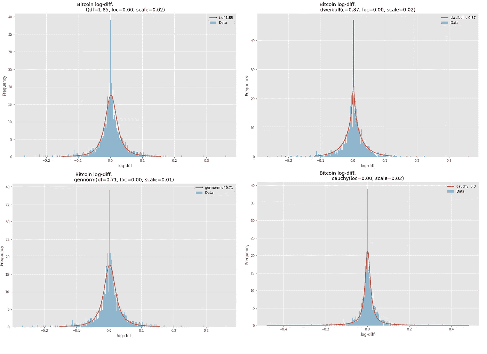
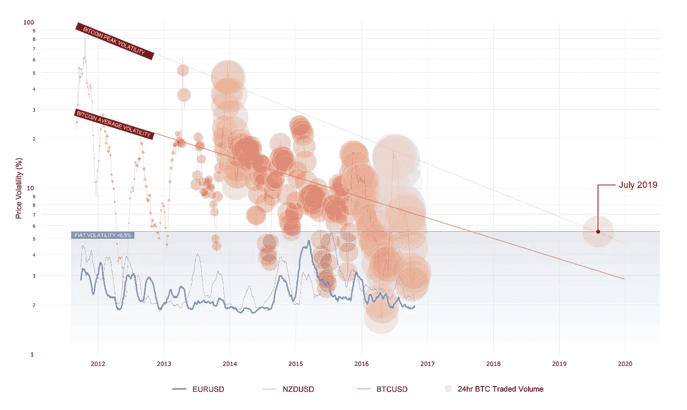
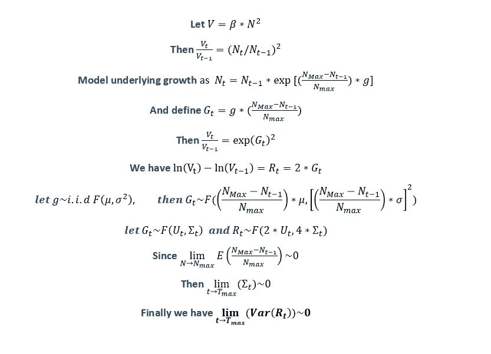

# 比特币的波动性:无限和超越！

> 原文：<https://medium.com/hackernoon/bitcoins-volatility-to-infinity-and-beyond-f00b71fb7895>

> “你们中那些认为这是泡沫的守旧派根本没有理解区块链的新数学……在这种新范式下，泡沫在数学上是不可能的。”—约翰·麦卡菲，美国第 46 任总统

嗯，当约翰提出上述观点时，大多数参与加密货币投资的人，至少就我所见，都一笑置之，认为这种说法毫无意义。从经验上看，这种情况也不太好，比特币现在每单位约 3500 美元。然而，如果我们纯粹从数学和统计学的角度来看这件事，他实际上比那些不这么认为的人更正确。

金融泡沫的定义已经有缺陷，泡沫通常意味着基础价格在很短的时间内从其基本价值大幅膨胀，变得不可持续，随后最终恢复到基本价格，也就是破裂。但是，如果没有人知道基本价值，多高可以说是过度膨胀，在什么时间范围内？

如果一个人不能在一定程度上肯定地回答上述问题，他又怎么能确定你所看到的是一个泡沫呢？

我想没有人知道以上问题的真实答案。只有在事后，人们才发现“泡沫”显然已经破裂。即使气泡很难被发现，否则不应该有任何气泡。从统计数据来看，如果(而且是一个非常大的假设)潜在回报的统计分布满足三个条件，金融泡沫仍有可能形成并破裂。

1、均值是确定的。

第二，方差是确定的。

第三，分布的形状是确定的和对称的。

上述标准依次暗示，(1)某种基本面价值存在，(2)可能存在过高定价(虽然很难说)，(3)给定足够的数据，对于金融序列，这意味着有足够的时间，它返回到基本面价值。(好吧，最后一点很容易被误解，也不严谨，但就目前而言)

迄今为止，我所见过的对比特币进行的最好的统计分析不是别人，正是伟大的[塔勒布本人](https://twitter.com/nntaleb/status/1034050292948639744)。他指出，比特币的回报符合对称的、有限均值无限方差的稳定分布。

如果比特币回报的真实形状确实如塔勒布所指出的那样，那么可检测泡沫的标准都得到了满足，只有一个除外——方差是无限的，这意味着在“区块链的新数学”中，没有什么东西是被高估的！此外，目前所有为比特币定价的尝试都不够有效，因为信噪比可能会无限大。但这也表明，在这种启发下，“在这种新范式中，泡沫在数学上是不可能的”。(我猜想那些质疑约翰的人根本没有理解他思想的深度；).

虽然我没有塔勒布(或约翰)工作的完整图片，但我设法复制了一些最适合的，见下文。(数据来源于 [coinmetrics.io](https://coinmetrics.io/) )


*The chart above demonstrates 5 most fitting distributions to bitcoins daily return from 2013–5–5…till 2018–11–17, out of the 5 distributions, 2 of them have an undefinable variance(Cauchy and T-distribution)*

这里有一个每个人适合的特写镜头。



从 2013 年 5 月 5 日到 2018 年 11 月 17 日的比特币日志回报被分成 200 个区块，并根据相应的 pdf 创建的 200 个区块进行拟合，通过最小化 SSE 的方式，从近百种不同的形状中手工挑选出最佳拟合分布的前 5 个。在 5 个最佳拟合中，t 分布和柯西都具有不可定义的方差。从经验上看，比特币的日平均对数收益率约为 0.002。

尽管比特币对数回报的真实分布还存在争议，但我相当确信比特币的对数回报是极其厚尾的。如此之大，以至于它是前所未见的，前所未有的。下跌 90%后出现剧烈反弹并非不可能，只要时间足够长，这种情况肯定会发生。

这种波动性意味着投资比特币不适合胆小的人，并将最终阻碍比特币成为世界无主权货币储备的追求， ***鉴于这种波动性在时间上的持续性*** ，它是**而不是**一种可接受的价值储存手段，至于不仅需要对比特币的长期价值抱有狂热的信念，投资的时机也极其重要。正如我之前提到的，如果一个人以 20，000 美元的价格买入比特币，鉴于目前的水平和 0.002/天的预期对数回报，比特币在未来 2 或 3 年内**预计**不会触及该水平。此外，如果用夏普比率(Sharpe ratio)等经典的风险回报衡量标准来衡量，比特币只是一种还算不错的投资，主要原因是其极端的波动性。

但有一些比特币传道者认为，比特币的波动性最终会逐渐消失。例如， [willy woo](https://woobull.com/bitcoin-volatility-will-match-major-fiat-currencies-by-2019/) 提交的研究表明，比特币的波动性最早将于今年减弱。见下表，直接从威利的研究中复制过来。



Source:[https://woobull.com/bitcoin-volatility-will-match-major-fiat-currencies-by-2019/](https://woobull.com/bitcoin-volatility-will-match-major-fiat-currencies-by-2019/) where Willy extrapolated Bitcoins historical highest volatility.

这是比特币波动性的最新图表。


10 days standard deviations on bitcoins daily log-diff, rolling

结合上面两张图表，我们可以观察到，这些年来，我们确实经历了越来越低的最大波动性。但是，根据这些历史数据得出比特币的波动性将会减弱的结论，严格来说，是有缺陷的，也是数学上无法证实的。然而，有一些方法可以测试数据是否随着时间的推移遵循相同的分布形状。(*对于统计知情或感兴趣的人，我指的是平稳性测试&遍历性，我跳过了平稳性测试，log-diff 过程是平稳的，但不是遍历性的，你可以自己验证一下*


Log-return of bitcoin from 2013 till 2018, in two graphs

这里有几行代码来测试比特币 log-diff 的分布形状是否会随着时间的推移而变化。

```
import statsmodels.sandbox.stats.runs as runs
import numpy as np
import pandas as pd
*#download coinmetrics bitcoin data*
df=pd.read_csv('btc.csv', sep=',' ,index_col=0,header=0,encoding="utf-8-sig")
P=df["price(USD)"]
dP=np.diff(np.log(P))
d1=dP[:int(len(dP)/2)]
d2=dP[int(len(dP)/2)+1:]
runs.runstest_2samp(d1,d2)
ties detected
#null hypothesis that d1 and d2 are from the same distribution is rejected
**Out[61]: (-5.116167239251087, 3.1180662016738176e-07)**
```

在这里，我使用沃尔德-沃尔福威茨运行测试来衡量比特币的分布形状在不同时期是否一致。从统计数据来看，我能从中得出的最佳结论是，比特币 log-diff 的形状和波动性不会随着时间的推移而保持不变。

我不能说波动性是随着时间的推移而减少了还是增加了。但是只要形状随时间变化。它为发现比特币价格过程和建模的真实测量带来了希望。

虽然在现阶段，我无法严格证明比特币价格过程背后的真实模型是什么，但有一种情景和建模选择很好地融合了理论上不断下降的波动性。也就是说，梅特卡夫定律和潜在的增长遵循一个逻辑斯蒂人口增长轨迹。见吹。

v 被定义为比特币的网络价值，N 是被建模为逻辑人口增长函数的比特币协议的总用户数。我们做了一个简单的假设，比特币的价格与网络价值单调线性相等。作为单一误差源的人口增长率的方差。



无论你如何建模，该模型永远无法与真实世界的复杂性相匹敌，但像所有其他东西一样，误差会累积起来，至少**如果**梅特卡夫定律可以在某种程度上用来解释比特币价格过程的一部分，我们有信心这一部分的误差会逐渐减少。

以上还在于比特币成功率为 100%的僵化设定，这显然是一个备受争议的话题。

有趣的是，比特币 log-diff 的经验方差是使用动态的 log-diff 的经验方差的 **5.8 倍**。从上面可以看出，我推断比特币的方差是活跃地址的 **4** 倍。嗯，我至少在方向上是对的…..

参考:

[](https://en.wikipedia.org/wiki/Economic_bubble) [## 经济泡沫-维基百科

### 经济泡沫或资产泡沫(有时也被称为投机泡沫、市场泡沫、价格泡沫…

en.wikipedia.org](https://en.wikipedia.org/wiki/Economic_bubble) [](https://en.wikipedia.org/wiki/Cryptocurrency_bubble) [## 加密货币泡沫-维基百科

### 2018 年开始，加密货币出现了大规模抛售。2018 年 1-2 月……的价格

en.wikipedia.org](https://en.wikipedia.org/wiki/Cryptocurrency_bubble) [](https://en.wikipedia.org/wiki/Population_dynamics#Logistic_population_growth) [## 人口动态-维基百科

### 种群动力学是生命科学的一个分支，它研究种群的大小和年龄组成

en.wikipedia.org](https://en.wikipedia.org/wiki/Population_dynamics#Logistic_population_growth) [](https://woobull.com/bitcoin-volatility-will-match-major-fiat-currencies-by-2019/) [## 到 2019 年，比特币的波动性将与主要法定货币相当

### 比特币是 2009 年由一个神秘人物创造的，他声称这是一个支付网络。但与大多数其他人不同的是…

woobull.com](https://woobull.com/bitcoin-volatility-will-match-major-fiat-currencies-by-2019/) 

[https://coinmetrics.io/](https://coinmetrics.io/)

Grazzini，Jakob (2012)“涌现特性分析:平稳性和遍历性”，人工社会和社会模拟杂志 15 (2) 7。10.18564 美元

沃尔德和沃尔福威茨(1943)。基于序列相关的非参数情形下随机性的精确检验。*《数理统计年鉴》*， *14* (4)，378–388 页。