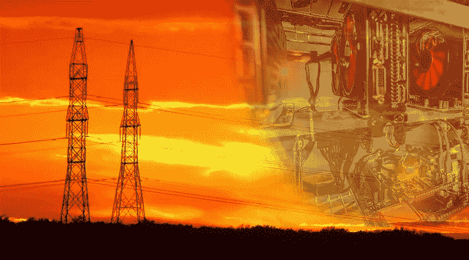

# 新技术如何让全球能源市场变绿

> 原文：<https://medium.com/hackernoon/blockchain-energy-green-technology-climate-change-27c24ea2f556>

## 区块链财团将开发一个交易能源系统，为加拿大多伦多的电动汽车和充电站提供动力。

现代生活是能源密集型的，对更多能源的需求呈指数增长。与此同时，应对气候变化的需要日益紧迫。然而，满足这些需求的重担落在了一个一个世纪或更长时间都没有发生重大变化的行业中的集中电力生产商身上。这一领域显然需要彻底和快速的创新。

## 气候变化碰壁

科学清楚地表明，世界必须迅速采取行动来减轻气候变化的影响。人类活动通过释放更多的温室气体，如二氧化碳，正在改变我们大气的组成。我们通过我们的能源和运输系统、农业和废物处理系统以及其他活动来做到这一点。

气候变化已经在引发极端的全球事件，如火灾、疾病传播、洪水、海洋酸化和大规模移民。在过去的十年里，气候变化的影响每年给美国经济造成至少 2400 亿美元的损失，而在未来十年，这一数字可能会增加到 3600 亿美元。

简而言之，世界在应对人类不断增长的能源消耗方面已经达到了极限。有些事情必须改变。

## **能源市场的现状**

使能源部门更加绿色的一个主要挑战是价值链。虽然世界上许多国家都有开放和放松管制的能源市场，但全球能源市场的特点是集中的价值链造成了巨大的低效率。

价值链也是多层次的，包括与终端消费者相联系的能源供应商、配电基础设施运营商、输电基础设施运营商和能源生产商。这些各方必须相互通信，从而产生一个复杂的系统。

> 虽然传输、通信和控制层面的自动化程度有所提高，但电网仍在使用老派技术。这需要电网运营商投入大量资金，他们必须投资扩展通信和控制基础设施，以监控和管理网络。

这些因素都会影响能源价格、服务质量，尤其是效率。此外，随着气候变化引发自然灾害，后果可能是灾难性的。当电网瘫痪时，会引发连锁反应，因为社会中的一切都依赖于电力。例如，在地震中，一个地区所有形式的基础设施都可能倒塌。

## 区块链的好处

气候变化增加了提高能源效率和可持续性的紧迫性。区块链技术有能力提供这些结果。它可以从根本上简化和提高能源价值链的可靠性，因为它可以直接将生产者与消费者联系起来，同时优化能源的分配。

分散式基础设施使用自动执行的合同，直接约束消费者和生产者。虽然电力仍然需要通过由不同公用事业公司集中拥有的基础设施来传输，但区块链提供了使这种基础设施变得更加高效的可能性。

## **加拿大是能源创新的领导者**

一个财团[最近在加拿大多伦多成立](https://www.globenewswire.com/news-release/2019/03/19/1757095/0/en/Insolar-to-cooperate-with-Toronto-s-Hero-Engineering-to-test-blockchain-for-transactive-energy-systems.html)，测试区块链的智能能源系统。该联盟包括[英索尔](https://insolar.io/)区块链平台、多伦多和区域保护局、约克大学和英雄工程公司。

该合作伙伴关系的目标是开发一个区块链能源智能电网和概念验证平台，用于传统(电网到车辆)和车辆到电网(V2G)模式下的电动汽车充电管理。该平台还将为当地公用事业提供辅助服务，如电压调节和需求响应。

区块链将为该系统提供主干技术。Insolar 正在建立一个公共和私人的区块链平台，通过简化和改善能源分配系统来加速绿色技术的发展。

最近，Insolar 被 Start Up Energy Transition 评为对能源行业做出贡献的[100 强](https://www.startup-energy-transition.com/)高科技创业公司之一。

Insolar 正在与加拿大的 Hero Engineering Inc .合作，这是一家专门为智能电网开发软件的工程咨询公司。迄今为止，Hero 已经参与了加拿大和美国 20 多个智能电网项目的设计、开发和交付。

该联盟优先考虑可再生分布式能源和电动汽车，目标是创建本地化的能源市场和集成智能电网原型。该集团将共同开发和测试 Insolar 位于区块链的平台，目标是为多伦多的电动汽车创建一个交互能源系统。该联盟的平台将使经济目标与提高能源效率的目标相一致。

2019 年 3 月，该联盟成功[推出了其 Testnet 1.1](/insolar/insolar-launches-testnet-1-1-with-public-nodes-8397cb71df00) ，在 20 个节点上的吞吐量超过每秒 19，000 个事务。许多节点上如此高的吞吐量对于交易型能源平台是必不可少的，其中有许多分散的参与者。

参与节点在内部由 Insolar 托管，在外部由企业和学术联盟伙伴托管。

## 区块链技术和能源领域

区块链技术可以用于创建“智能”能源电网，因为它具有高效的共识机制，整合了工作证明和利益证明元素。

Insolar 的区块链是可编程的，因此该电网可以与自动传感器和软件一起开发，以重新路由和分配电力。智能设备可以连接到区块链智能电网，包括电动汽车。通过区块链技术，电动汽车可以使用智能合同自主访问充电站并与之通信，反之亦然。

太阳能电池板等可再生能源也可以连接到这样的智能电网。因此，为一个开放的市场创造了一个基础设施，在这个市场上，能源生产商(无论大小)可以出售他们生产的过剩能源。扩展这项技术将使家庭和企业中的智能电表能够端到端地管理电力消耗。例如，电价全天波动。有时贵，有时便宜。人们可以设置智能机器在价格周期的不同点运行。这不仅能省钱。通过根据需求和成本平衡分配，它将使能源消耗总体上更有效率。

## 结论

加拿大财团将在加拿大多伦多市的区块链和本地电动汽车管理概念验证平台上开发智能能源电网。然而，区块链技术使全球能源部门绿色化的潜力超出了单个城市的范围。前景在于通过为能源部门创造可行的绿色技术，在全球范围内应对气候变化。

*订阅我的* [*中*](/@minadown) *和* [*推特*](https://twitter.com/minad21) *频道如果你喜欢我的文章，想了解更多关于区块链和加密货币项目的信息，

如果你对本文有任何疑问，请在下方评论区评论。谢谢大家！*