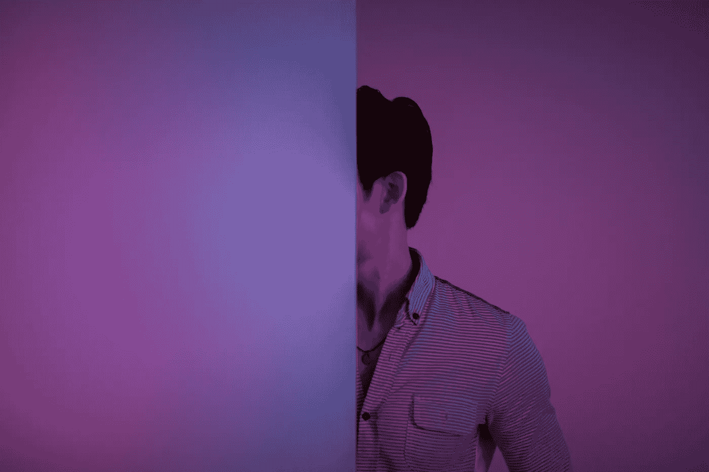
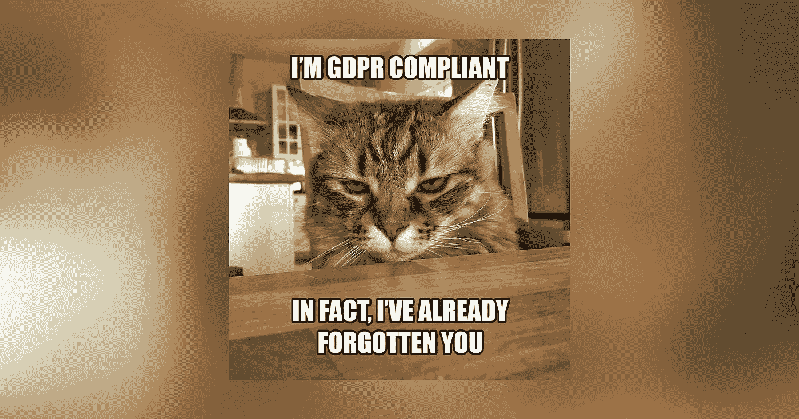
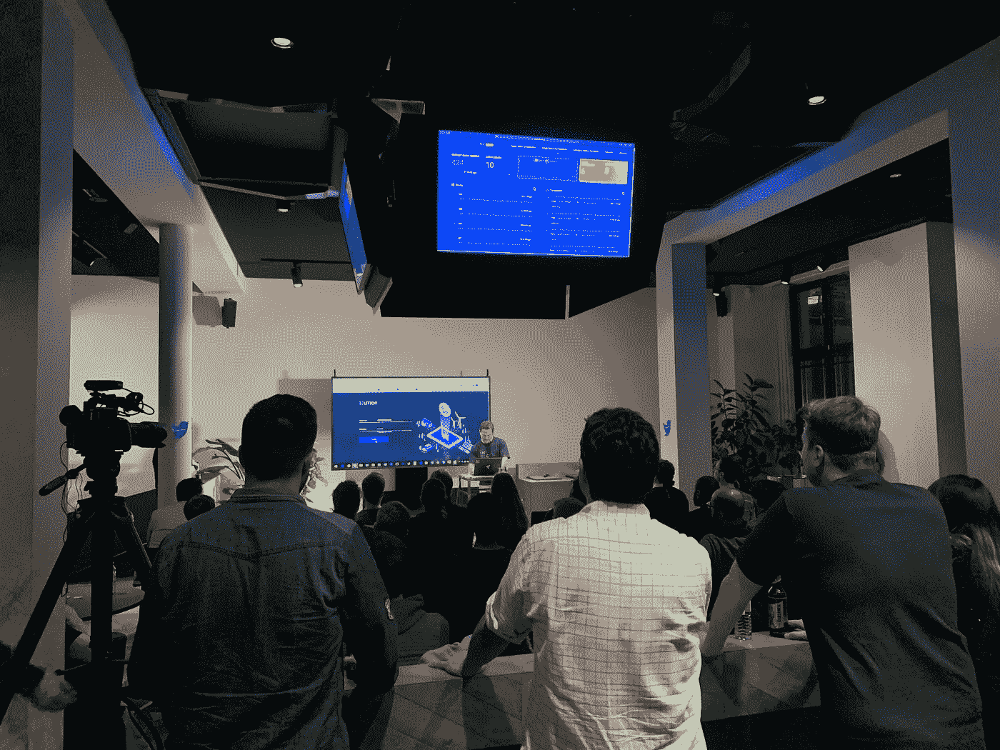
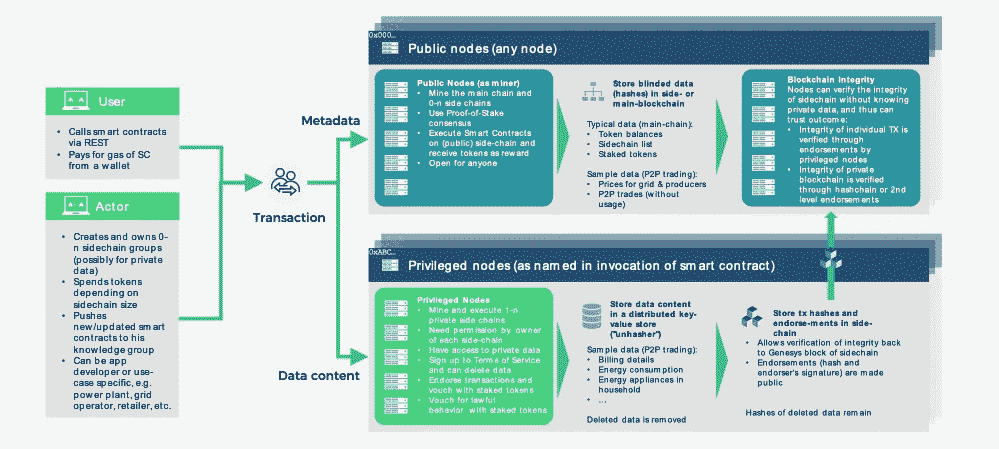

# 区块链需要记住遗忘的权利

> 原文：<https://medium.com/hackernoon/blockchain-needs-to-remember-the-right-to-forget-635a49a2c344>

## GDPR 协议下的分布式账本技术

Photo by [Raj Eiamworakul](https://unsplash.com/photos/IaSRjVkB6tE?utm_source=unsplash&utm_medium=referral&utm_content=creditCopyText) on [Unsplash](https://unsplash.com/search/photos/hidden?utm_source=unsplash&utm_medium=referral&utm_content=creditCopyText)

上周，我会见了区块链初创公司**，该公司承诺在技术层面解决区块链与 GDPR 的冲突。你为什么要在乎他们要说什么？**

*   **这些人与**最大的德国软件公司 SAP** 合作**
*   **他们推出了一个面向消费者的分散能源市场**
*   **他们最近与德国政府讨论了 STO 法规**

****

**Icons by Freepik and Smashicons via [Flaticon](https://www.flaticon.com/)**

****

**让我们直接进入 Lition 首席执行官 Richard Lohwasser 关于(A)****GDPR**、( B) **使区块链 GDPR 合规的四个现有合规解决方案**以及 Lition 提出的第五个解决方案**的专家意见。******

# ****A.GDPR 的背景****

****2018 年 5 月，在区块链狂热接近顶峰时，欧盟(EU)推出了《一般数据保护条例》(GDPR)，试图防止互联网巨头**脸书**、**谷歌**和**亚马逊**对数据的粗暴利用。****

****GDPR 通过为公司的数据使用和管理制定严格的规则来保护个人，包括“**被遗忘权**”和要求数据留在本国境内。“被遗忘权”迫使公司在个人离开网络后删除用户数据。****

********

****违反 GDPR 可能导致高达公司全球年收入 4%的罚款，对大公司来说可能高达数亿美元。****

****GDPR 有助于解决我们数字世界中一个极其紧迫的问题。公司已经从用户数据中获利太久了。在某种程度上，脸书已经与你能想到的几乎每一家科技公司合谋规避自己的隐私政策。****

****但是 GDPR 有一个缺点。这项立法与另一项授权用户收回数据控制权的努力直接冲突:区块链。****

****随着过去十年左右用户数据滥用的猖獗，欧盟似乎不太可能在短期内让步并修改他们的立法，但区块链技术如何才能向前发展并遵守规定，而不破坏最初使其如此有用的系统？****

# ****B.现有合规解决方案****

****让我们来看看几种可能的解决方案…****

********

****这种策略使敏感用户数据远离区块链，允许连续的区块链记录和数据被删除的能力。不幸的是，通过传统方法存储数据，离线系统在很大程度上违背了区块链的目的，这意味着数据更容易受到黑客攻击、编辑和其他欺骗。****

********

****删除加密密钥会将敏感数据保留在区块链上，但会失去访问这些信息的能力。这个方法*本质上是*通过使数据不可访问来删除数据，但是从技术上来说并没有擦除它。GDPR 明确要求删除数据，虽然立法中没有明确定义删除，但使某些东西无法访问和全部销毁并不是一回事。****

********

****虽然有几种不同的方法来匿名化数据，但大多数解决方案都涉及我们已经废弃的离线存储方法的相同版本。链上指针将主链信息连接到敏感的链外信息。一旦外链数据被破坏，链接就中断了，外链信息也就匿名了。然而，这种方法仍然会将数据留在主链上，虽然很难，但仍然可以从区块链获得识别信息。****

********

****另一个提议是彻底改革区块链的概念，创建集中式后端系统，允许数据匿名化，而不中断任何链。虽然这将允许 GDPR 和区块链和平共处，但你这样做基本上已经破坏了区块链的基本原则。集中式后端将数据控制权交还给公司，并要求用户再次信任公司，关起门来提供他们的信息。第一次效果很好？****

****更好的解决方案？**公私合营的区块链基础设施**。****

********

****公私可删除区块链基础设施可以通过保留区块链功能，同时根据 GDPR 保护用户数据，来弥补区块链和 GDPRs 的不兼容性。****

****软件巨头 [SAP](https://www.sap.com/index.html) 的首席技术官 Juergen Mueller 博士一直在为德国科技初创公司 [Lition](https://www.lition.io/) 提供建议，通过使用源自主链的私有侧链，开发真正可删除的区块链平台。该团队于 2 月 21 日在柏林的 SAP Data Space 展示了他们的 [MVP。](https://www.meetup.com/de-DE/Lition-I-Blockchain-Use-Cases-I-Development/events/258677964/)****

********

****Lition’s MVP launch event****

****Lition 的网络跟踪主链中的元数据，以确保网络功能。这是维护共识、跟踪令牌余额和提供透明度的地方。智能合同在主网络上执行，但是调用私有许可的保存敏感数据的侧链。可以删除这些侧链，销毁其中包含的信息，同时保留块哈希以保持网络完整性。****

********

****Source: [What Does Lition’s Blockchain Architecture Look Like?](/lition-blog/how-does-litions-blockchian-architecture-look-like-7fd4a57903b9)****

****公私基础设施是第一个既允许真正删除数据又遵守区块链基本原则的协议。****

****GDPR 和区块链的举措都是为了收回我们的信息，结束硅谷大佬们长期以来精心策划的数据滥用。尽管他们来自不同的意识形态领域，永久删除还是不可篡改的透明，但最终目标是一致的。****

****通过使用公私可删除平台，我们将能够使我们的工具集多样化，以夺回我们的数字身份。GDPR 不会削弱区块链，相反，它挑战 it 创新和整合所有最佳策略，以确保我们的数据安全和受保护。****

****想深入探讨这个话题吗？在[**Linkedin**](https://www.linkedin.com/in/lohwasser/)**或上与 Lition 的首席执行官 Richard Lohwasser 取得联系，在 [**Twitter**](https://twitter.com/rich_lohwasser) 上关注他。******

****

**Let’s stay in touch******