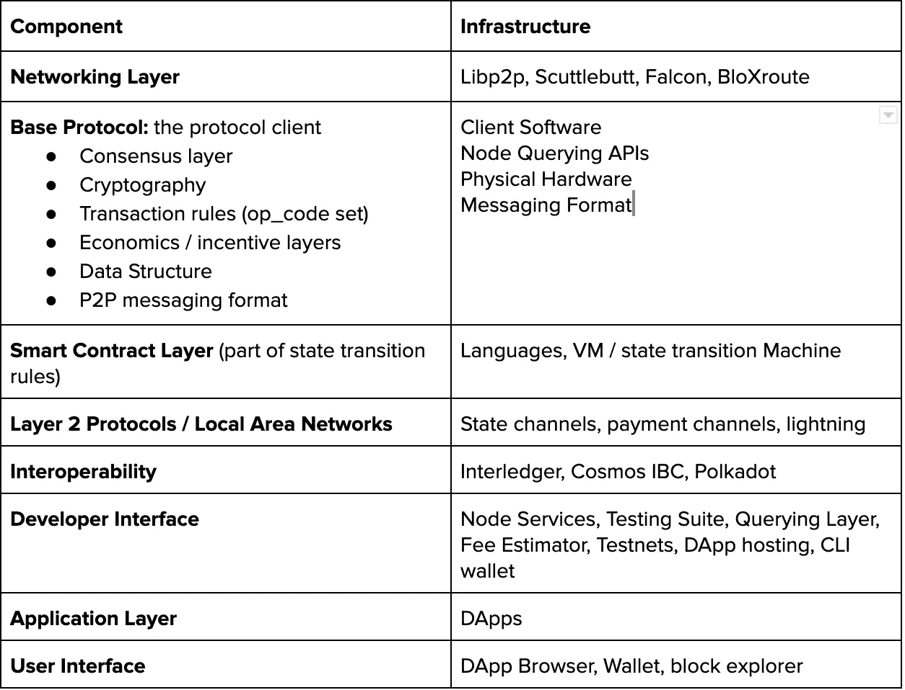

# 区块链可用性清单

> 原文：<https://medium.com/hackernoon/blockchain-usability-checklist-5c5e1409183d>

区块链是如何从协议层和周围的基础设施开始变得更加可用的？

Figure: Usability Checklist

为了帮助抵制审查、不可改变和没有许可的区块链获得广泛的市场采用，必须做出许多改变。从基础协议到最终用户界面，生态系统的每一层都需要变得更加可用。这些层必须利用区块链的独特属性，以便进行有意义的采用。因为如果界面是审查的，那么使用抗审查的区块链有什么意义呢？

今天是详述不同区块链层的区块链可用性的一系列文章的第一篇(我们已经完全地、适度地模仿了 OSI 模型)。在这里，我们将把重点放在基础协议上，并在后续的文章中逐步展开。

# 区块链抽象层

互联网遵循 [OSI 模型](https://www.cloudflare.com/learning/ddos/glossary/open-systems-interconnection-model-osi/):

> 一种概念模型，用于描述和标准化电信或计算系统的通信功能，而不考虑其内部结构和技术。它的目标是用标准协议实现不同通信系统的互操作性。该模型将通信系统划分为抽象层。一个层为它上面的层服务，也被它下面的层服务。

这些层作为一种隔离机制而存在，**在最顶层工作的人不应该关心它下面发生的事情，**反之亦然；这完全是抽象的。这是一个基本的现代发展实践。过去，机器人手臂的开发者必须知道每个硬件设备如何相互通信。但是现在有了通用的 API，所以开发人员不需要担心寄存器格式、I2C 地址等，允许代码重用、更快的开发等。虽然是以较低的性能为代价，但是开发速度远远超过了这一点。这同样适用于区块链。

在堆栈的较低层仔细的设计决策会极大地影响较高层的可用性。没有一个稳固的基础，任何事物都是不稳定的。如果密码被破解，用户就无法信任协议:)。

分类法可以通过多种方式建立，这些层次反映了 UX 当前的心智模型，请寻求建议。为了获得一些灵感: [Multicoin 的 Web3 栈](https://multicoin.capital/2018/07/10/the-web3-stack/)、[一篇来自过去的 Vitalik 帖子](https://blog.ethereum.org/2014/12/31/silos/)、 [Web3 基金会](https://github.com/w3f/Web3-wiki/wiki#web-3-tech-stack)、 [Evan Schwartz 的 5 层 Interledger 架构](/xpring/layer-3-is-for-interoperability-ca387fa5f7e2)、[区块链应用栈](https://www.coindesk.com/blockchain-application-stack)和 [7 层金融密码术](http://iang.org/papers/fc7.html)。

**Figures:** Blockchain layers of usability

# 什么环境下的可用性

在我们确定什么使区块链可用之前，我们需要理解协议的目的。如果协议仅用于跟踪和管理[银行的](https://en.wikipedia.org/wiki/Overnight_market)隔夜市场的资产，则该协议可以是许可的或联合的。然而，如果协议旨在用于不可替代资产的无许可基础设施，则可用性的要求就大不相同了(BFT 共识等)

人们经常说事务低终结时间、高事务吞吐量和低事务成本对于任何区块链都是至关重要的，但实际上它们与可用性无关，取决于协议的目标是什么。对于共识规则也是如此，如果网络是许可的或联合的，区块链不需要拜占庭容错。考虑到这一点，我们小心翼翼地只讨论了可以超越这些不同设计目标的共同可用性属性。

# 从底层开始

从底层开始，我们可以确保构建在顶层的层能够继承已经被原生集成到基础协议中的可用性特征。这里构建的内容会影响顶层的开发人员和最终用户。

协议设计者应该采取什么步骤才能对其他人产生最积极的下游影响？我们将承认，这些反映了我们的观点，并且有支持和反对每个特定特征的论点。

# 协议应包括的特征

## **功能**

*   **SPV 证明/轻型客户端:**协议的所有用户不太可能使用完整节点与区块链接口，更常见的是使用托管节点服务。它们运行良好，但代表了一个失败、审查和缺乏隐私的单点。使用 SPV 证明或轻型客户端，用户可以自己验证和发送交易，而不必信任他人。如果这些轻客户端占用很少的资源，这就给了用户更多的自主权。Coda 协议是这一领域的领导者。
*   **基于账户的建模**:虽然 UTXO 模型有很多好处，但是基于账户的建模更加用户友好，因为只有一个规范账户，这使得密钥管理更加简单。用户不需要担心[最优 UTXO 选择](/@lopp/the-challenges-of-optimizing-unspent-output-selection-a3e5d05d13ef)会有隐私、费用、灰尘等顾虑。更好的是，如果一个人可以在账户中注册多个密钥对，那么如果他们丢失了一个密钥对，还有其他密钥对可用。 [Near 协议目前正在处理这个](/nearprotocol/an-industry-set-for-change-978cc255f389)。
*   **分叉友好性:**一些协议认为不应该有分叉，并内置了机制，使其难以分叉。人们总是会找到一种方法来派生协议，因此协议设计者应该认识到恶意参与者/有争议的硬派生，并内置工具来同时实现[信号派生](http://diyhpl.us/wiki/transcripts/stanford-blockchain-conference/2019/spork-probabilistic-bitcoin-soft-forks/)和防止[事务重放](https://bitcointechtalk.com/how-segwit2x-replay-protection-works-1a5e41767103)。
*   **分级确定性钱包:**也称为 [HD 钱包](/bitcraft/hd-wallets-explained-from-high-level-to-nuts-and-bolts-9a41545f5b0)，这些钱包允许一个种子或助记短语生成无限量的公钥私钥。因此，用户不必存储他们所有的私钥，他们只需要存储种子。
*   **一致性:**[费希尔·林奇·帕特森](https://groups.csail.mit.edu/tds/papers/Lynch/jacm85.pdf)不可能性结果(FLP)陈述了确定性异步一致性系统最多可以具有以下三个属性中的两个:安全性(结果在所有节点上都是有效且相同的)、活性(没有失败的节点总是产生一个结果)、容错性(系统可以在任何节点失败时存活)。没有共识机制可以拥有所有的特征，任何互联网上的分布式共识系统必须牺牲这些特征中的一个。因此，在为协议选择共识机制时，设计者必须确定他们重视什么，以及它如何影响用户体验。一些来自[恒星的灵感影响了他们的设计决策](https://www.stellar.org/blog/safety_liveness_and_fault_tolerance_consensus_choice/)。
*   **灰尘处理:**由于[交易费大于 UTXO](https://www.reddit.com/r/btc/comments/5wg5qa/is_it_possible_to_build_a_tool_that_scan_the_utxo/) 的价值，存在不能再被主人使用的硬币。从用户的角度来看，这是不理想的，因为他们已经被剥夺了他们的资金，如果有一个聪明的方法来避免这种情况，将不胜感激。

## **网络维护人员的特点**

*   **全节点激励:**用户运行全节点应该有一个理由，无论他们是因为网络是许可的还是因为有[加密经济激励](https://ethresear.ch/t/incentives-for-running-full-ethereum-nodes/1239)这样做。如果没有完整的节点，网络的安全性会降低，支持也会减少。激励应该涵盖协议中最重要的特征，在比特币的中本聪共识中，只有开采出最长链上区块的矿工才能获得奖励。但是没有动力去传播块，不幸的是导致了[自私的挖掘](https://www.cs.cornell.edu/~ie53/publications/btcProcFC.pdf)。也许一个[激励措施来鼓励接力](https://ethresear.ch/t/incentivizing-a-robust-p2p-network-relay-layer/1438)会解决这个问题，但是这代表了[激励措施](https://fc18.ifca.ai/bitcoin/papers/bitcoin18-final18.pdf)的冰山一角。
*   **实现细节:**实现一个协议的规范有很多种方式，开发者必须小心检查角落情况，防止[意外攻击](/@dsl_uiuc/fake-stake-attacks-on-chain-based-proof-of-stake-cryptocurrencies-b8b05723f806)和[未知膨胀](https://en.bitcoin.it/wiki/Value_overflow_incident)。

## **协议内 vs 协议外特性**

这些功能也应该集成到区块链协议中，以提高其可用性。然而，它们可以在几个级别上实现，这些应该是协议固有的，并可能成为共识规则的一部分，还是应该存在于智能契约层甚至链外？一些协议在这一点上已经表明了立场，但是我们将让您从这场辩论中解脱出来，而是讨论为什么这些特定的特性不管它们位于堆栈的哪一部分都是强大的。

*   [**费用委托/元交易:**](https://blockchainatberkeley.blog/layer-1-economic-abstraction-7e967282748e) 对于最终用户来说，他们甚至需要知道他们正在使用区块链吗？除非交易费用委托给第三方，否则用户永远都知道他们在使用区块链，必须购买硬币，这增加了一层摩擦。以太坊正在致力于基于[智能合同的费用委托](/@austin_48503/ethereum-meta-transactions-90ccf0859e84)(与普通交易相比，它有 2-3 倍的气体成本，dApps 特别需要支持它)，而其他协议( [Stellar](https://www.stellar.org/developers/guides/channels.html) 和 [VeChain](/@cometpowered/evolving-the-dapp-user-experience-with-meta-transactions-23619db42565) )本身就有。尽管如此，现在用户可以在协议之上使用资产，甚至不知道是什么在驱动它。
*   **人类可读地址:**还记得那次你打了个“O”而不是“0”，烧了一堆钱吗？EOS 本身就有这种功能(注意这是强制性的，注册需要花费令牌，这会降低可用性)，以太坊使用的是智能合约 ens。现在这种情况不会再发生了。但是我们知道恶意的人会利用重命名，看看去年 Twitter 上有许多伪装成 Vitalik Buterin 的诈骗账户请求乙醚。
*   本地多重签名:对于一个协议来说，拥有一个本地的或者智能的契约是非常重要的。它们可以在脚本(BTC P2SH)或密码门限签名中实现。尝试找不到协议不应该有协议的理由。
*   **天然气市场/区块空间期货:**交易费是一种第一价格拍卖，无论在理论上还是实践中，都容易导致不完善的定价和参与者之间的博弈。几个不同的[模式](https://github.com/zcash/zcash/issues/3473)已经被提出来缓解这个问题，比如改变[拍卖类型](https://ethresear.ch/t/first-and-second-price-auctions-and-improved-transaction-fee-markets/2410)或[引入天然气市场](https://gastoken.io/)或街区空间期货。这些变化应该是协议的一部分还是存在于契约层？
*   **本地交换:**当特性被本地实现到核心协议和共识时，它们通常更具性能，因为代码被编写为客户端的一部分，而不是使用更高级别的智能契约语言。Stellar 有一个[本地分布式交换](https://www.stellar.org/developers/guides/concepts/exchange.html)，由于协议的资产性质，它是有意义的，但是注意，这个特性不应该为非基于资产的协议实现。

# 复杂性转移

有些特性是协议天生就需要的，比如多重签名(在我看来，可以随意不同意)。然而，它位于哪一层:基础层或智能合同层或第 2 层，以及特定的实现极大地改变了用户体验，并将复杂性转移到不同的层和方。有没有把基础协议做得极轻的愿望？还是应该整合一切？我们可以假设用户对交互协议没有意见，还是应该假设这种行为是不受欢迎的？这是功能还是必备？这些是任何协议设计者必须问自己的一些基本问题，他们必须认识到复杂性将一直存在。谁应该面对复杂性，谁应该承担责任？

# 核心开发者和社区之间的平衡

为了合法地消除风险，协议不能拥有整个生态系统。如果开发协议的公司运行几乎所有的节点，开发所有的辅助组件，等等，很难说该协议是集中的。该公司可能会被追究法律责任。

因此，外部开发是必不可少的，但是如何平衡他们对项目远景的贡献呢？一个项目必须有一个具体的叙述，以确保社区的所有发展都有一盏指路明灯可以遵循。那么安全性或者信任度呢，一个钱包是公司更容易信任还是外人更容易信任，如果一个是开源的，另一个不是呢？这些都不是容易走的路。

# 前进

在决定每层实现哪些可用性特性时，要认识到协议的设计目标是什么。

特别感谢 Kevin Britz (Totient Capital)、Martina Long (Primitive Ventures)、Dan Elitzer (IDEO CoLab)的评论和/或谈话。