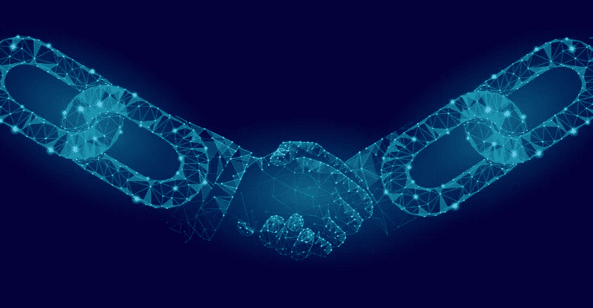

# 区块链转变信任的潜力

> 原文：<https://medium.com/hackernoon/blockchains-potential-to-transform-trust-7195bdd8f2fa>

## *分散数字权力是一个显著的优势*

在 2017 年升至前所未有的高度后，比特币的价值在 2018 年遭遇了戏剧性的[自由落体](https://www.technologyreview.com/s/612659/cryptocurrencies-crashed-in-2018-now-theyre-right-where-they-should-be/)——许多其他数字货币也是如此。伴随崩溃而来的是新一轮的批评和大量的欺诈案件。市场潮起潮落，就像其他任何事物一样，加密也受潮流影响。在 2019 年的黎明，在所有残骸中仍然闪亮和坚实的是基本的加密技术:区块链。

代币的短期价值可能会发生变化，但区块链的价值不会减少。去中心化技术比以往任何时候都更有可能挑战强大机构的霸权，这些机构标榜为社会信任、交换和商业的守护者。毕竟，比特币是在 2008 年金融崩溃后不久产生的，当时对我们政府和金融系统的信任度处于历史最低点。

**民主化信任**

从大的方面来看，crypto 并不是 2018 年唯一遭受打击的社区。在金融方面，中央集权的机构面临着自身信誉受损的定期冲突(最近的头条新闻是摩根大通、花旗银行、富国银行等等)。

在科技界，像谷歌和脸书这样的数据把关巨头的行为和动机也越来越受到质疑。信任似乎受到了围攻。

尽管传统机制受到侵蚀，但几个世纪以来，我们全球经济的基础一直是在信任的基础上得到保证的——这一点不会改变。这是密码生态系统在未来一年只会变得更加强大的原因之一。长期以来，在经济学中，不平等-信任假说认为，收入不平等通过影响人们的心理健康对健康产生直接影响。此外，社会信任被认为是收入不平等和健康之间联系的中介。以巴西为例，这个国家自然资源丰富，但信任度极低，腐败严重，是社会经济不平等程度最高的国家之一。然而，日本，一个自然资源非常少但却充满信任的国家，已经发展成为一个科技和全球超级大国。最终，社会民众、金融体系和政府之间的双边信任，是第一世界国家与第三世界市场的区别所在。

在一个信任的中央治理薄弱的世界里，区块链本质上产生信任，并为治理经济交易和协议的过时方法提供了一种替代方法。其分布式账本技术(DLT)允许同行协作建立信任，并消除了对可疑或昂贵的第三方验证的需要。这是一个民主化信任的模型。

**从灰烬中崛起的颠覆性区块链公司**

2018 年的一份报告发现，区块链项目的平均寿命约为 15 个月。在超过 80，000 个区块链项目中，只有 8%仍在运行。这个可怕的统计数据实际上说明了加密崩溃的一些重要问题——小麦和谷壳正被高效地分离。

合法创新的区块链公司将会生存并成熟，而没有商业计划的过度炒作的伪装者将会失败。在很大程度上，试图快速赚钱的加密初创公司已经破产，而使用区块链解决实际问题的公司才刚刚开始获得动力。

这种转变是显而易见的:从与 PayPal 竞争的支付和金融服务公司，到为 Twitter 提供抗审查替代方案的社交媒体服务。在区块链上组建的公司正在利用去中心化作为差异化优势，并将继续悄悄地扩大它们的足迹。

**与有意识的消费者建立联系**

透明度现在是企业责任的一个标志。目前，大多数公司缺乏安全、详细地跟踪供应链和数据交易的能力，这使得很难确定是否符合道德标准，更不用说确保产品的真实性或原产地了。我相信到 2020 年，区块链会改变这一切。

区块链技术通过让消费者深入了解供应链，已经在倡导道德商业实践——从在斐济捕获的大量黄鳍金枪鱼到在当地杂货店购买的新鲜绿叶蔬菜。DLT 可以提供不可变的、细粒度的出处跟踪和合规性保证。在脸书数据泄露及其令人震惊的剑桥分析(Cambridge Analytica)丑闻中， [SteemIt](https://steemit.com/) 等安全的去中心化社交网络在日常运营交易中的影响力超过了比特币。

区块链最引人注目的特征之一是促进“智能合约”的能力，即在满足特定条件时生效的自动化协议，以提供一种自我验证、自我执行和防篡改的方法来执行基础协议的条件。随着消费者对透明度、公平贸易、道德采购和可持续商品的需求持续增长，DLT 支持企业责任倡议并支持品牌完整性。

**走向分散技术的大规模采用**

在 2018 年加密崩溃之后，我们将看到成功的区块链应用程序从行业绒毛演变成真实的用例，显示出超过传统方式的有形财务结果和收益。这一改进过程将促进领先的跨国公司在试点测试之外的广泛采用。

像亚马逊和沃尔玛这样的企业已经开始对区块链进行实验，但是我们还需要一年多的时间才能看到这些实验在沙盒之外进行。当企业(和政府)最终大规模部署 DLT 项目时，他们会很谨慎，最初会专注于内部或企业对企业的用例。

那是可以预料的。DLT 可能会改变世界，但这不会在一夜之间发生。区块链创新者仍然面临着解决可扩展性、应对新兴监管格局以及增强用户体验以支持增长的任务。

2019 年，点对点分布式网络和 DLT 将继续重新定义我们的信任和诚信概念。区块链将被进一步利用，以更公平的数字范式转变社会的运作方式。

加密市场在 2018 年崩溃，但区块链没有。它仍然有潜力催化全球合作，让个人更好地管理个人数字身份——而不是依赖银行、信用结算所或硅谷科技巨头。基于区块链的分布式系统将帮助我们创建更加透明和道德的公司、机构和习俗。