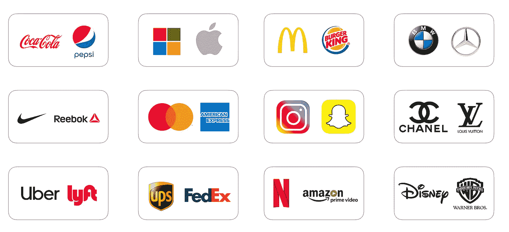
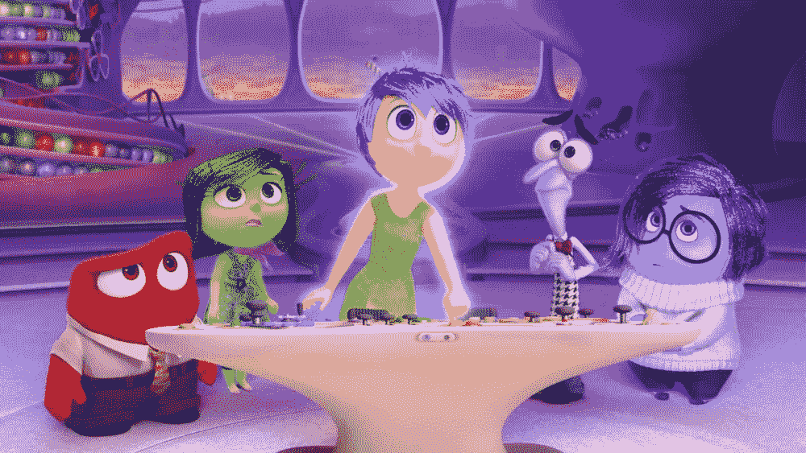
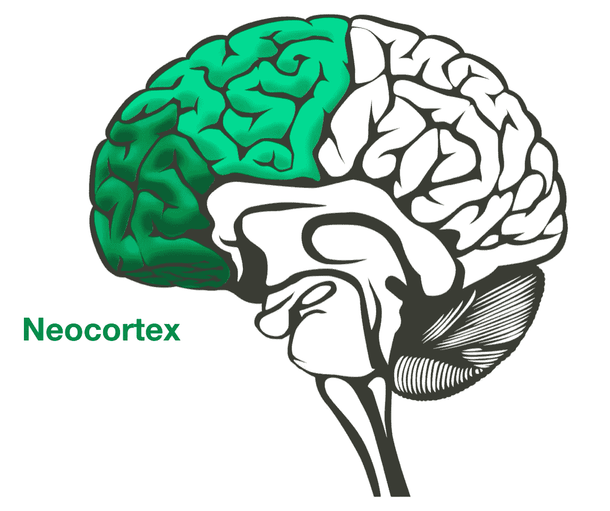
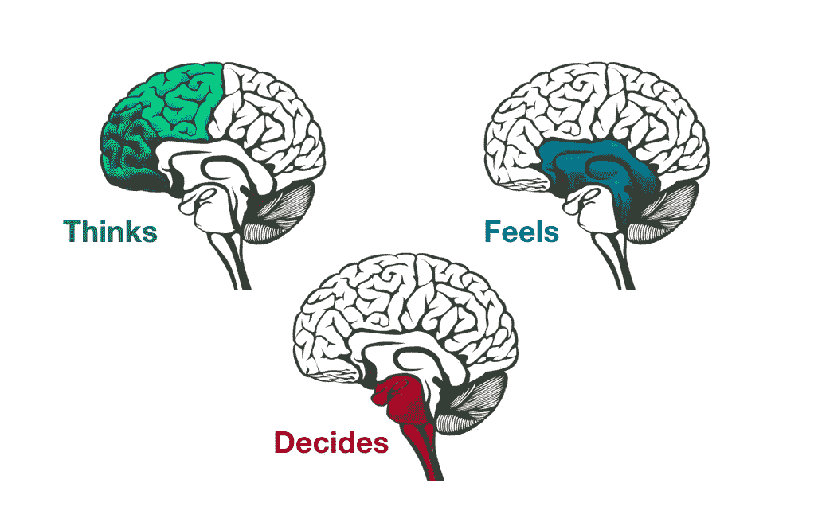

# 品牌与大脑:消费者决策背后的神经科学

> 原文：<https://medium.com/hackernoon/branding-and-the-brain-the-neuroscience-behind-consumer-decision-making-bd96d6cfcda8>

## 为什么绩效营销是不够的

我最近和一群非常聪明的绩效营销人员谈论了品牌营销的重要性。这是一个非常注重分析的小组，所以我决定尝试通过谈论神经科学和大脑在做决策时是如何工作的来降低品牌营销的虚名。

首先，我向小组展示了一张幻灯片，上面有以下成对的徽标。当我们一个接一个地检查每一组时，我让他们**选择一个**，我希望你们也这样做。快点。不要想为什么，各选一个就好。

(现在没有更多关于这个的评论——我们稍后将回到这个问题上)

[理性选择理论](https://en.m.wikipedia.org/wiki/Rational_choice_theory)告诉我们，消费者是理性的代理人，他们使用大脑的理性部分(新大脑皮层)，在考虑了所有可用的信息、成本、收益和事件概率后做出选择。

当然可以。你的星巴克咖啡、巴厘岛之旅、香奈儿包——都非常理性，对吗？

当然不是，这个我们都知道。我们每个人都可以想到我们购买了一些我们没有理性选择的物品，这种情况每天都在发生。虽然有些消费者比其他人更有规划意识，但即使是我们中最理性的人也会一直这样做。

有趣的是理解**为什么我们在购买点**(最后一刻或其他时候)决定选择我们选择的品牌。当我在杂货店买冰淇淋时，为什么我会选择本和杰里的而不是哈根达斯的？我可能会告诉自己，这是特定的味道、价格或包装，或者在我的大脑中以一百万种其他方式对其进行后期合理化。但出于某种原因，我立刻选择了一个而不是另一个。这就是**品牌凸显**。品牌突出是你大脑中的一个触发器，当要买的时候，它会说，选那个吧。

[**神经营销**](http://fac.ksu.edu.sa/sites/default/files/neuromarketing_1.pdf) **，**也被称为**消费者神经科学**，是一个较新的领域，它认为**消费者的决定实际上是在大脑**中较老或更无意识的部分做出的。根据哈佛商学院教授乌玛·r·卡玛卡尔的说法:

> “人们相当善于表达他们想要什么，他们喜欢什么，甚至他们愿意为一件商品支付多少钱。但是**他们不太擅长评估这种价值从何而来**，或者这种价值如何以及何时受到商店陈列或品牌等因素的影响。[神经科学]可以帮助我们理解决策过程中那些隐藏的元素。”

大警告:我不是神经科学家。虽然许多神经科学家相信这一点，但有些人不相信！你需要自己拿主意，自己做决定。

为了让这些有意义，你需要对大脑有一个快速的了解。这是基于神经科学家保罗·麦克莱恩的[三位一体大脑理论](https://www.interaction-design.org/literature/article/the-concept-of-the-triune-brain)。

根据这一理论，大脑由 3 部分组成:爬行动物大脑、边缘脑和新皮层。

## **爬行动物的大脑**

Credit: Conscious Discipline Brain State Model

爬行动物的大脑也被称为旧脑，蜥蜴脑，或 R-Complex。你大概可以猜到，这是我们大脑中最古老的部分，可以追溯到很久以前！大约在 5 亿年前它首次出现在鱼类身上[。](http://thebrain.mcgill.ca/flash/d/d_05/d_05_cr/d_05_cr_her/d_05_cr_her.html)

爬行动物的大脑包括脑干和小脑，它控制着身体的核心功能，如心率和呼吸。它驱动原始行为，如生存本能、直接刺激反应、战斗或逃跑、竞争和攻击。它给了我们的祖先生存所需的技能。基本上，你大脑的这一部分是关于冲动和本能的，因为它们对生存至关重要。

杂货店的收银台基于本能和冲动购物而繁荣起来。现在，电子商务零售商会在你购物之旅的最后在线复制这一点。它对低价商品非常有效，但也有很多方法可以让大脑的同一个部位对高价商品采取行动。这就是房地产经纪人告诉你还有一个买家也非常感兴趣的原因。或者网上零售商告诉你只剩下一件商品了，所以你应该在它卖完之前买下来。所有这些推动紧迫感的策略都吸引着我们爬行动物般的大脑。

## **边缘脑**

Credit: Conscious Discipline Brain State Model

也被称为边缘系统或哺乳动物的大脑，大脑的这一部分在爬行动物的大脑之后进化而来。当然，这里的“下一个”在我们的生物进化中要晚得多，大约 2 . 5 亿年。

大脑的这一部分包括海马体、杏仁核和下丘脑。这就是**情绪**的来源。如果《从里到外的 T2》中的角色真的生活在你的大脑中，他们的总部就会牢牢地植入大脑边缘。

Credit: Disney/Pixar

你大脑的这一部分负责感觉、记忆、价值判断、信任、忠诚、希望和梦想。你的边缘大脑*喜欢*浪漫喜剧。它产生并调节产生情绪的化学物质和化学反应的流动。当你买彩票的时候，你会想到如果你中奖了，你会做什么？上面写满了边缘脑。

边缘脑没有语言能力。因此，如果你对一个情绪化的决定进行后理性化(*事实上这是正确的，因为……*)你是在你的新大脑皮层中这样做的，这是我们将要讨论的。由于边缘脑(或者说爬行动物的大脑)没有语言能力，你只能根据直觉而不是理性逻辑来做决定。边缘脑是你的一部分，驱使你去创新和尝试新事物。这样做实际上也不符合逻辑，但你大脑的这一部分明白，它给你带来的好处是值得的。

边缘大脑是你买机票去世界另一端的异国目的地的原因。这就是为什么你要花钱在因特拉肯跳伞和在大堡礁潜水。这就是为什么你会从奢侈品牌购买真正漂亮但昂贵的风衣，而不是从商场购买便宜的风衣。这就是为什么你离开稳定的工作回到学校寻求职业改变。

That’s me in blue the moment before I jumped out of a plane in Interlaken / Credit: My Limbic Brain

这些都不是理性的决定，但你会这样做，因为高风险带来高回报。你的边缘脑教会了你这些。

## **大脑皮层**

Credit: Conscious Discipline Brain State Model

新皮层也被称为大脑皮层，人脑或新大脑。这是大脑最后进化的部分。新大脑皮层执行高级大脑功能，如认知、感官知觉、语言、抽象思维、想象和意识。这包括逻辑、理性、科学、艺术、音乐和创造力。

与大脑的老部分不同，新大脑皮层喜欢比较和对比，喜欢隐喻性思维。它分成两个半球:

*   左脑:分析，逻辑
*   右脑:创造力，直觉

新大脑皮层使用有形的因素和语言来合理化我们在大脑其他部分无法合理化的东西。

所以，如果我选择本和杰里的冰淇淋，我的大脑皮层可能会告诉我，这是因为我与他们的价值观一致，或者因为巧克力饼干面团味道太好了。但是决定已经作出，这种合理化已经到来。这同样适用于你在本文开头所做的各种品牌标识的练习。你的直觉让你选择一个而不是另一个——新大脑皮层只是让它对你有意义。

虽然看起来很疯狂，但是[前额叶皮层](https://en.wikipedia.org/wiki/Prefrontal_cortex)(它是你大脑中理性、合理的部分，是新皮层的一部分)只负责决策过程的 5%。效果营销活在这里。事实上，绝大多数消费者决策来自边缘脑和爬行脑。

> *《[*情绪经济学:利用情绪获得商业成功*](https://www.amazon.co.uk/Emotionomics-Leveraging-Emotions-Business-Success/dp/0749461896) *的作者丹·希尔说，*“我们在三秒或更短的时间内就会有本能的反应。事实上，**情绪处理感官输入的时间只有我们有意识的认知大脑吸收相同输入时间的五分之一。快速的情绪处理也会产生连锁反应。我们对刺激的情绪反应在大脑中的回响比我们的理性反应更响亮，从而引发后续行动。”***

Credit: Conscious Discipline Brain State Model

## **如何在整个消费过程中充分利用大脑**

到目前为止，我希望你已经思考过这将如何影响你自己的消费行为。想想你认为自己是理性消费者还是感性消费者(实际上，根据产品类别和生命中的时间，这将因人而异)。当你 10 岁、20 岁和 30 岁时，你可能有不同的购物方式。

作为营销人员，这对你意味着什么？

品牌有很多定义，但我最喜欢的是**品牌是人们想起你时想起的独特故事**。我特意选择了“人”这个词，而不是“顾客”或“消费者”。与品牌的关系是基于对*人*的接触、体验和相关感受的集合。这些感觉储存在你的边缘大脑中，给爬行动物的大脑输入它需要的信息来做最后的呼叫。这些经历的理性成分存在于新大脑皮层中，所以当爬行动物的大脑告诉它是时候了时，它们准备好合理化你的决定。

这里有一些具体的方法，可以帮助你瞄准客户大脑中的决策部分:

以客户为中心:爬行动物的大脑非常以自我为中心(考虑到它必须主要关注不死，我认为这是公平的)。所以你需要卖的是好处，而不是功能。企业很容易关注内部而不是外部，所以在每个接触点都要注意这一点。仔细考虑你的措辞:重要的不是公司提供什么，而是客户会得到什么。确保清楚为什么你卖的东西对顾客有价值。

**想想你到底在卖什么**:人类大脑对决策进行后理性化，但实际上，这些决策是基于感觉和直觉做出的。是的，你在销售产品或服务。但是你*到底在卖什么？幸福？时间？控制？自由？一旦你知道你实际在卖什么，沟通就变得容易多了。*

**展示为什么更好**:根据[哈佛商业评论](https://hbr.org/2012/07/stimulate-your-customers-lizar)，大脑渴望对比，以便做出决定。让消费者容易理解产品或服务之间的区别(不要让他们为之工作)。

**使用熟悉的东西**:记住爬行动物和边缘大脑没有语言能力。因此，根据作者 Christophe Morin 的说法，他们扫描的是具体的和可识别的东西。他们不需要思考，所以用熟悉的概念和图像让他们容易理解你的观点。您是否知道，人们在寻找产品时选择点击搜索结果的首要因素[是因为他们之前听说过该品牌？为了从你的绩效营销中获得最大收益，事先创造这种熟悉感是至关重要的。](https://searchengineland.com/brand-bias-70-of-consumers-look-for-known-retailers-when-doing-product-searches-179570)

**保持一致**:说到最后一点，一致性是创建强势品牌的最重要因素之一。您的团队需要深刻理解，虽然他们可能会一次又一次地看到关键信息，但消费者只会在一小段时间内看到这些信息。当你的团队开始认为它变得无聊时，那就是它在工作的时候！

**关注开始和结束**:大脑喜欢[的开始和结束](https://en.wikipedia.org/wiki/Serial-position_effect)，并且倾向于忽略它们之间的东西。关键信息需要放在开头(首要的)和结尾(最近的)，以便你有最好的机会成功地抓住你的观点。

**使用强烈的视觉效果**:爬行动物的大脑对视觉效果的反应比语言快得多。第一印象将基于视觉刺激。根据《大脑规则》这本书，72 小时后，只有 10%的人能记住文字传达的信息，而如果加入视觉效果，65%的人能记住。确保你投入了大量的时间/金钱/精力在强大的设计、一致性和保护你的视觉形象上，因为这对你的品牌来说至关重要。最强大、最令人难忘和最具标志性的品牌超越了语言和地理，吸引了全世界大脑最原始的部分。

**重视情绪**:情绪在大脑中产生电化学反应，影响我们处理信息的方式。作为情感上被说服的人，利用我们的人性来做决策符合公司的利益。**强势品牌最重要的组成部分之一是它们代表某种东西并坚持不懈**。这通常是让他们有机会与观众进行情感交流的地方。也就是说，只有当它是真的时，它才会长期有效。公司需要愿意在起起落落中坚持自己的价值观，不管它是否流行。如果一家公司真的关心对其客户重要的东西，它可以利用这种情感联系来推动长期忠诚度。最能激发购买行为的情感是爱、骄傲、恐惧、内疚和贪婪。为了增加[积极的品牌回忆](https://www.bigcommerce.com/blog/marketing-psychology/#how-to-speak-directly-to-emotions-the-limbic-system)，从理性语言转向感性语言，包括讲故事、隐喻、移情措辞、背书和社会证明。

**如何利用大脑的不同组成部分将因公司所处的阶段和你愿意投入的资源水平而异**。事实是，如果你是一家早期创业公司，你就像我在本文开头提到的绩效营销人员一样，可能会更关注漏斗的末端和只占决策过程 5%的前额叶皮层。你会这样做，因为这是获得足够多的初始受众来开发你的产品适应市场的最快最简单的方法。随着你从初创企业成长到扩大规模，这是你可以开始尝试如何在整个消费者旅程中吸引大脑的不同部分的时候。最后，随着你从规模扩张转向超高速增长，差异化和品牌建设将成为你的核心关注点。这就是**不能忽视了解决策是如何制定的地方**。

建立品牌的主要目的是建立品牌的显著性——让**成为消费者在购买**时选择的品牌。如果你只关注大脑皮层和漏斗末端的活动，你只会得到一小部分你正在寻找的积极决策。

更新:写完这篇文章后，有人找我写一篇关于消费者神经科学和电子咨询数字营销的更深入的报告。我与神经科学家和领先的全球专家合作，深入研究消费者神经科学如何被数字营销人员应用。[看一看](https://econsultancy.com/reports/consumer-neuroscience-and-digital-marketing/)！