# 用 Nodejs 和标准库在 10 分钟内构建一个个人 Facebook Messenger Bot

> 原文：<https://medium.com/hackernoon/build-a-personal-facebook-messenger-bot-in-10-minutes-a7a237f3f018>

拥有一个可以全天给你发送酷毙了的东西的个人聊天机器人不是很棒吗？也许在**上更新你家庭设备的状态**或者从 [Reddit](https://www.reddit.com/r/catsstandingup) 上发送**可爱猫咪的照片**？

让我们构建一个向您发送您最喜欢的 [**子编辑**](https://www.reddit.com/r/catsstandingup) 中的**热门帖子的程序。你当然可以用你想发送的任何内容来扩展它。**

The bot will send you top posts from the subreddits you specify

为此，我们需要三样东西:

1.  [**脸书**](https://www.facebook.com) **页面**
    *一个 Facebook 信使机器人与一个脸书页面相关联。你需要注册成为* [*开发者*](https://developers.facebook.com) *然后创建一个页面。*
2.  [**Dialogflow**](https://dialogflow.com/)
    *一家谷歌公司，dialog flow 在 NLP(自然语言处理)方面有帮助。这将有助于以后您扩展您的机器人来响应特定的事情。*
3.  [**代码上标准库**](https://code.stdlib.com/)
    *自面包片以来最伟大的事情，* [*代码上标准库*](https://code.stdlib.com/) *帮助你在云端运行代码。这将是我们行动的大脑。*

现在，让我们开始吧。

# 设置脸书页面

前往[**developers.facebook.com**](https://developers.facebook.com)用你的脸书凭证登录。登录后，点击**开始**并按照说明**添加新应用。**

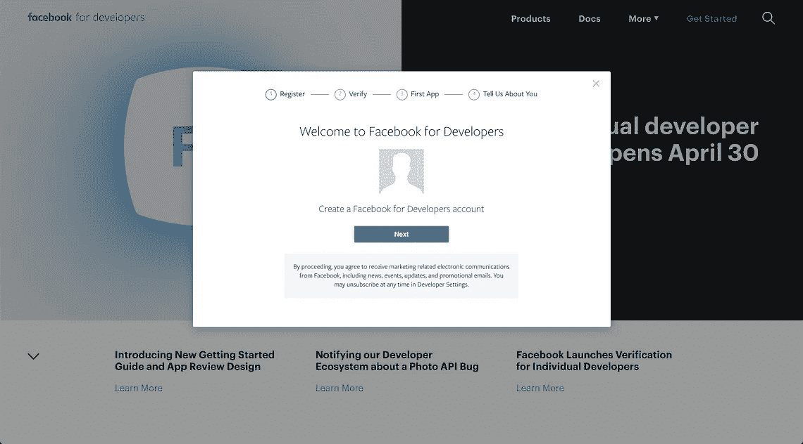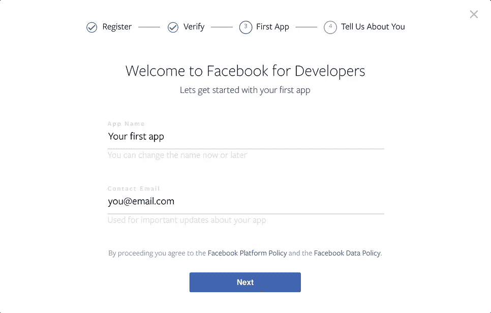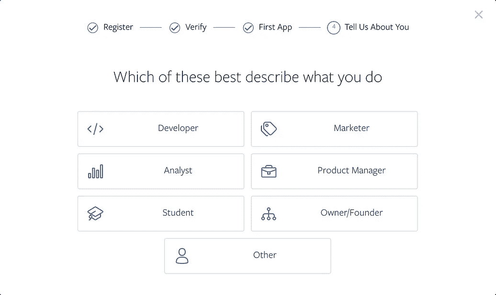

Create a new App on FB Developer Portal

给你的应用命名。这是您接收通知时使用的名称。做一些酷的东西，比如**达斯·维德**。

然后导航到左侧栏菜单上的**仪表板**选项卡。向下滚动找到**信使**并选择**设置**。在添加 Messenger 集成之前，您需要创建一个脸书页面。

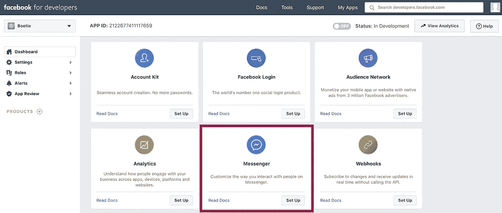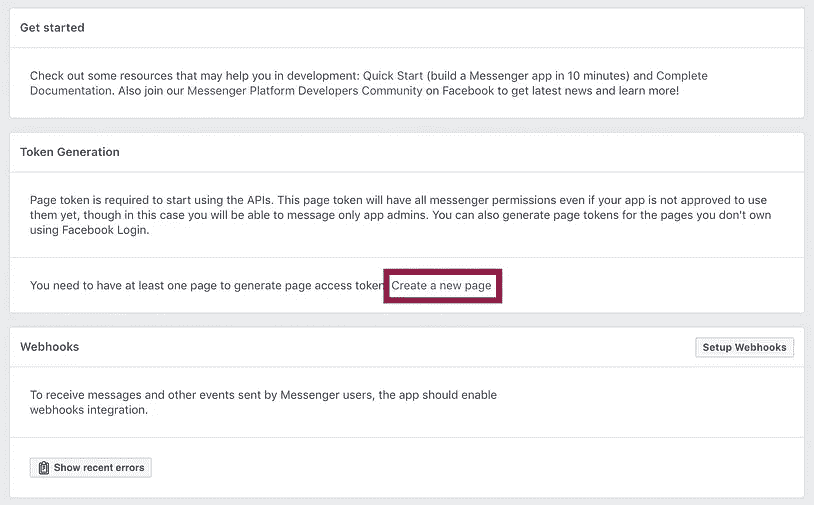

On the Dashboard tab, choose Set Up on the Messenger card and then Create a new page

这会带你去脸书。按照说明创建一个**社区或公众人物**页面。

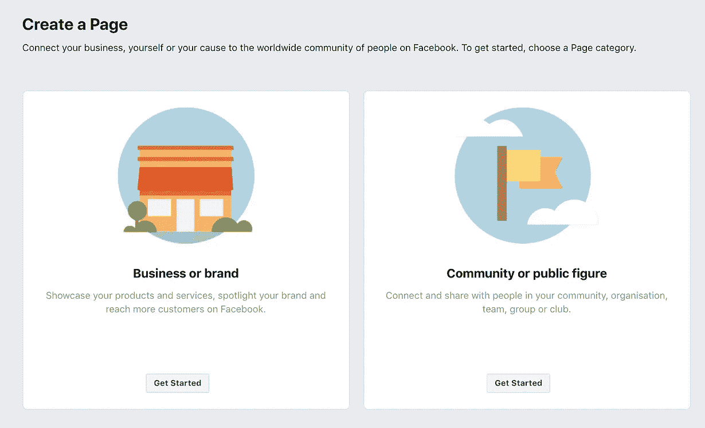

Create a Community or public figure Facebook page

一旦你的页面创建完毕，**切换回 FB 开发者门户**并刷新页面。现在你应该看到你的页面在下拉列表中列出**选择一个页面**。

Refresh the page and then choose your Facebook page name from the dropdown to generate a token

现在让我们设置[对话流](https://dialogflow.com/)。点击**进入控制台**，用你的谷歌凭证登录。

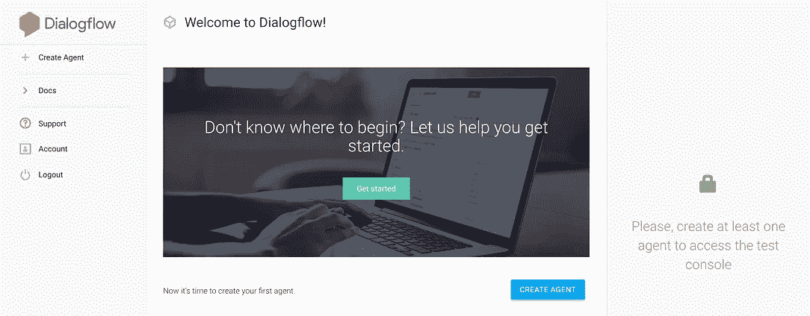

Dialogflow uses Natural Language Processing to understand chat conversation

点击**创建代理**并填写详细信息。给你的代理一个名字。它可以与您的脸书页面同名。

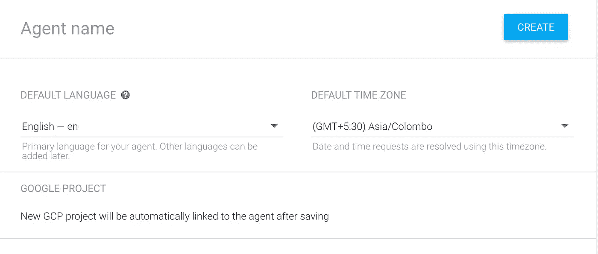

Give your agent a name and choose the right time zone

当您的代理被创建时，它将自动添加两个意图。点击**默认欢迎意向**进行编辑。

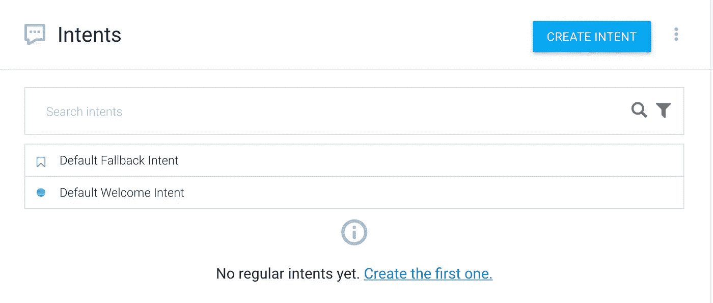

You can add more intents if you want.

在**事件**部分，添加事件 FACEBOOK_WELCOME。这使您的机器人能够在用户第一次与机器人交互时识别用户。

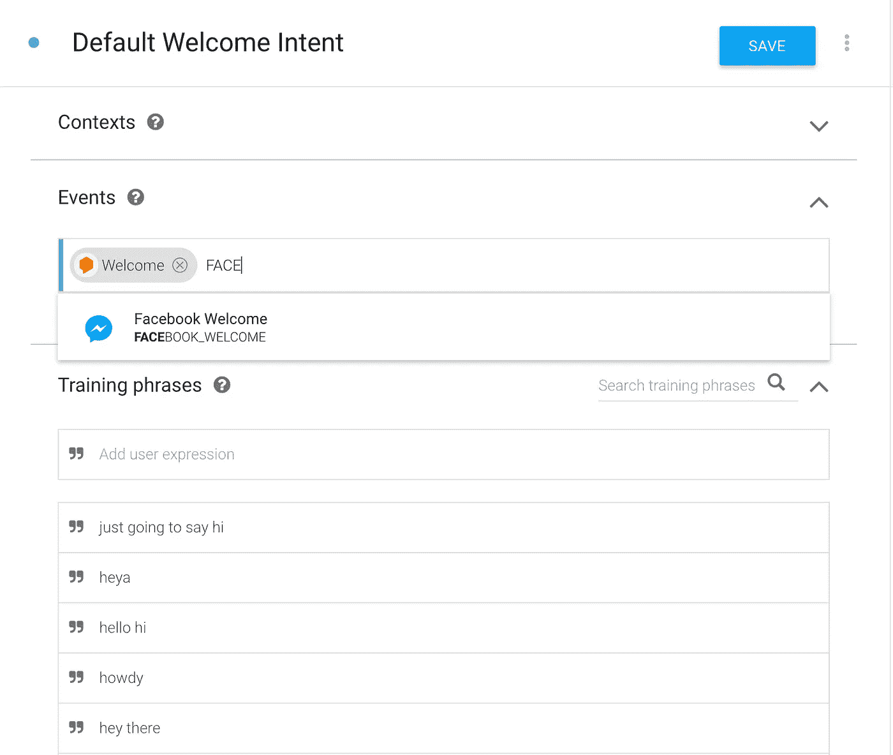

Add Facebook Welcome to Events

向下滚动页面，点击垃圾桶图标**删除默认响应**，因为我们将从代码中响应用户。

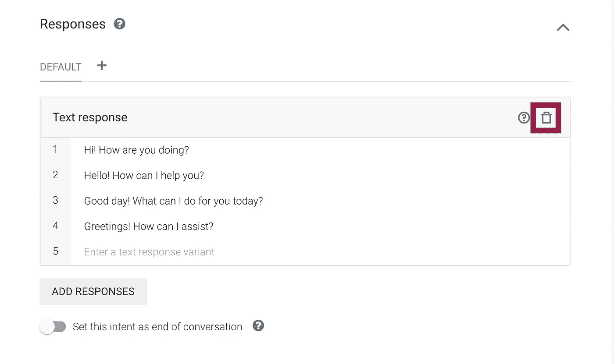

Click on the Trash icon to delete the default responses

进一步向下滚动**启用履行**。这确保了所有请求都通过我们在标准库 的 [**代码上的聊天机器人函数进行路由。**](https://code.stdlib.com)

Enable Fulfillment to receive messages on your webhook

接下来，我们需要将 Facebook Messenger 连接到 Dialogflow。点击**集成**。

Integrations allow the agent to work with a variety of different services including Facebook Messenger

打开**信使整合**。这将打开一个模态窗口。你需要在这里输入两件事。第一个是**验证令牌**，它可以是任何文本，第二个是**页面访问令牌**。

**切换到脸书开发者门户**复制页面访问令牌。

Choose your Page name from the dropdown to generate a Page Access Token

在 Dialogflow 模式窗口中粘贴页面访问令牌，并输入您的验证令牌。点击**开始**按钮开始整合。现在**点击剪贴板图标复制回调 URL** 。

Click on the Clipboard icon to copy the Callback URL

现在切换到脸书开发者门户。是时候设置 **Webhooks 集成**了。选择位于**令牌生成**部分下方的**设置 Webhooks** 。将您复制的 URL 粘贴到**回调 URL** 字段，并输入您在上一步中指定的**验证令牌**。勾选所有订阅字段。

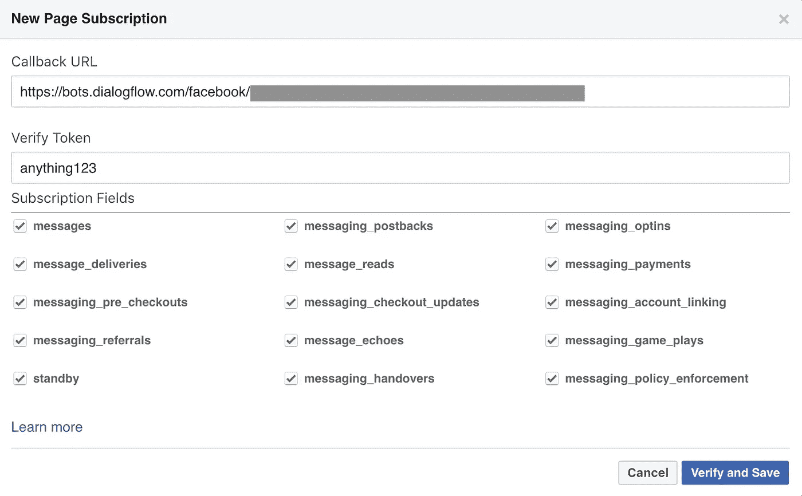

Not all are required, but Dialogflow will take care of the unnecessary ones and send you only the relevant ones

点击**验证并保存**，如果你设置正确，你应该会看到一个绿色的**和完整的**。现在从下拉列表中选择您的页面名称，并点击**订阅**。

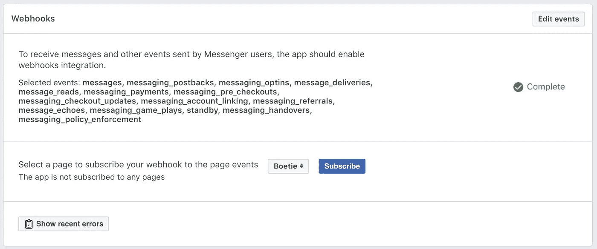

Choose your page name from the dropdown and then click on Subscribe to subscribe to your page

要完成设置，您还需要做一些事情。进入*设置* > *基本*添加一个**隐私政策 URL** 并为你的应用选择一个**类别**。隐私策略 URL 可以是任何有效的 URL。

> 您也可以使用代码中包含的隐私政策，如下面的标准库代码部分所示

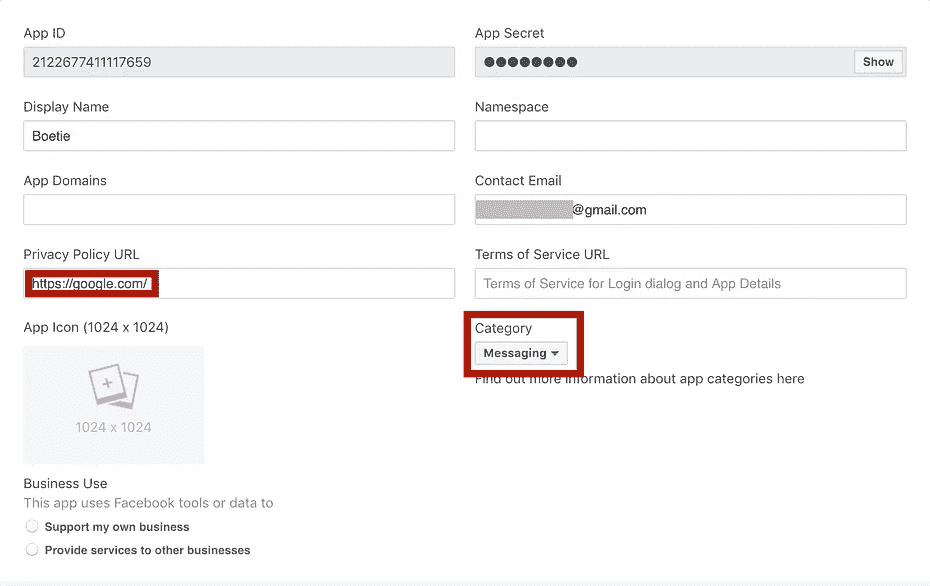

Enter the Privacy URL and choose a category for your page

保存更改并切换上的**状态按钮，使您的应用程序上线。**

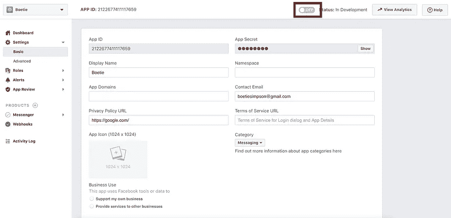

图标将显示状态为**实时**。你可能会认为这意味着整个世界都可以看到你的应用程序并与之互动。**没有**。

Your App is Live

# [标准库](https://code.stdlib.com)设置上的代码

这是我们的代码所在的地方，它将**支持所有的通信**。当我们向脸书上的机器人发送消息时，它将首先进入[对话流](https://console.dialogflow.com)。 [Dialogflow](https://console.dialogflow.com) 会把它路由到正确的目的地，然后转发给我们的函数——这个函数。

首先在社区 API 源代码中搜索`fb-messenger-bot`。点击**创建新的 API** 。

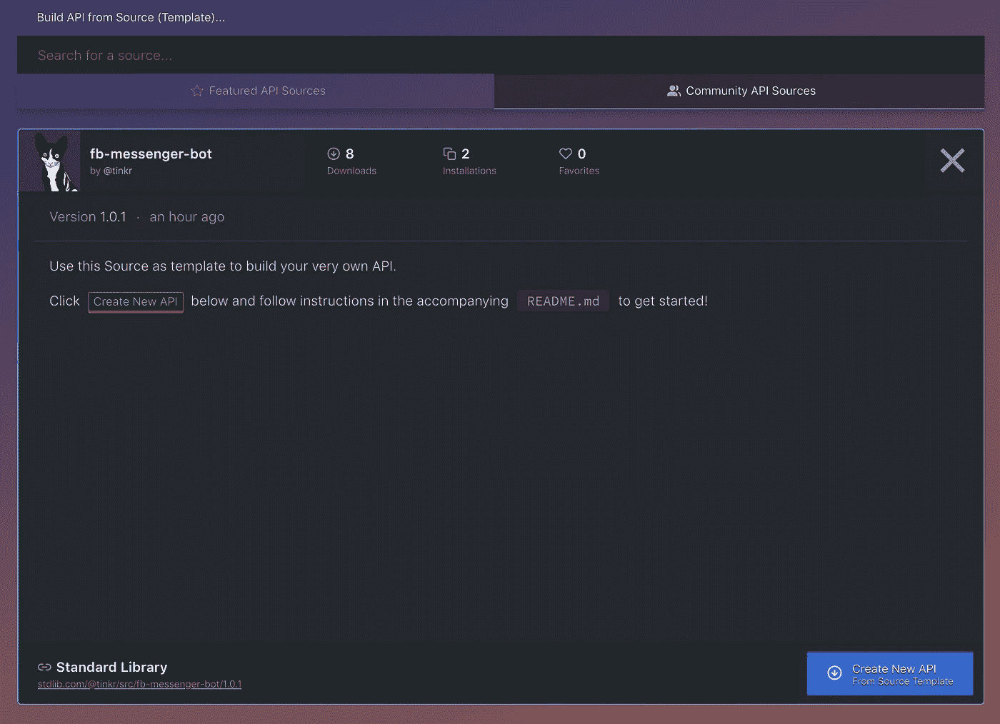

创建完成后，您会在**功能**文件夹中看到三个文件。

1.  `__main__.js`
    主函数**获取 Reddit 帖子**并发送给用户。修改函数顶部的`multi`对象，以**定制子编辑**。
2.  `webhook.js`
    该函数将处理来自 Dialogflow 的所有 **webhook 请求。如果你想**扩展机器人**的功能，这里是你添加自定义意图的地方。**
3.  `privacy.js`
    你知道标准库上的[代码**可以返回 HTML 文件**吗？这是一个**隐私文件**，你可以在](https://code.stdlib.com) [FB 开发者门户](https://developers.facebook.com)上使用。该 URL 看起来类似于`[https://username.lib.id/fb-messenger-bot@dev/](https://boetie.lib.id/tinkr-fb-messenger-bot@dev/)privacy`。你应该在这份文件的底部加上你自己的电子邮件。

现在，导航到`env.json`文件，用您的**标准库令牌**和**脸书页面访问令牌**填充环境。

> 要检索标准库令牌，请将光标放在黄色引号之间，然后右键单击。从下拉菜单中选择您的标准库令牌，变量应该会自动填充。

Enter your FB Access Token and the Standard Library Token in your env.json file

一旦保存了`env.json`文件，点击**运行**。

Click Run to deploy the service

> 请记住，每次您更改任何代码时，您都需要**保存**，然后**运行**它，以部署新代码。

部署完成后，**复制显示的 API 端点 URL** 。这是你的 webhook 端点。

现在让我们完成 [**对话流程**](https://console.dialogflow.com) **设置**。切换到[对话流](https://console.dialogflow.com)并点击**履行**并打开 Webhook。

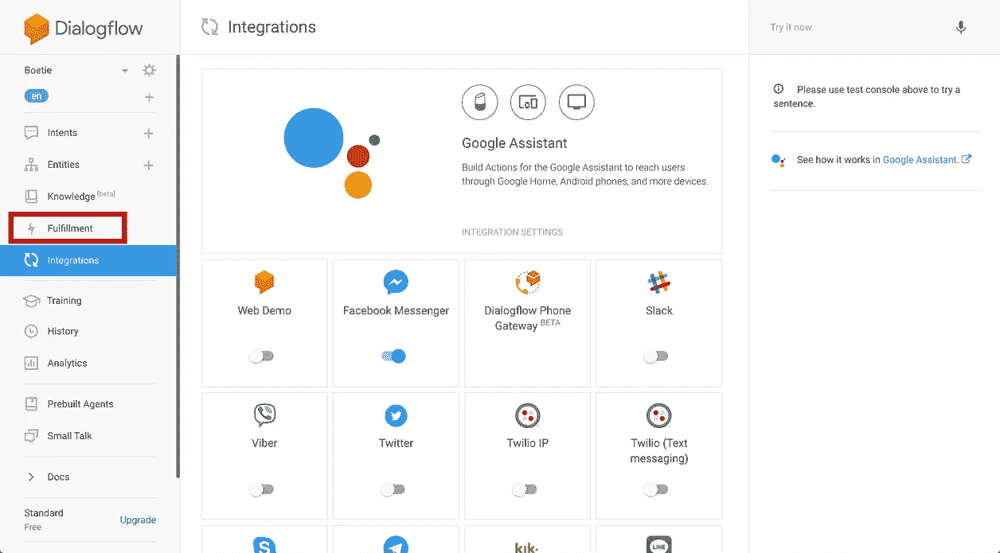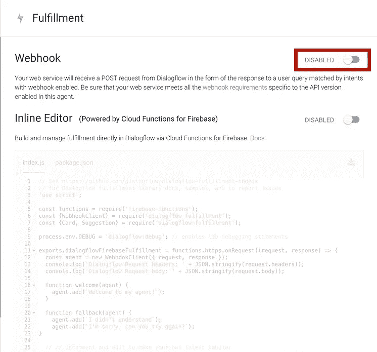

Enable the webhook and add URL

在复制的网址后面加上 ***/webhook/*** ，点击页面底部的保存。你的网页挂钩网址应该看起来像`[https://username.lib.id/fb-messenger-bot@dev/](https://boetie.lib.id/tinkr-fb-messenger-bot@dev/)webhook/`

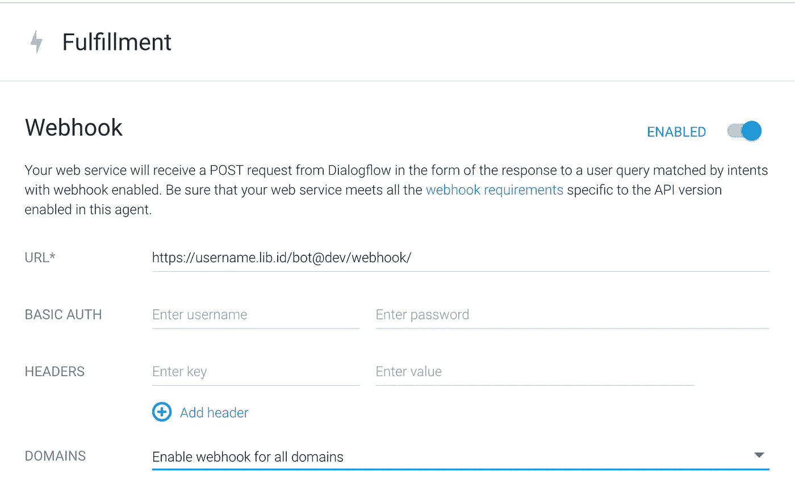

Append /webhook/ to your base URL

我们差不多完成了。我们现在需要做的就是在脸书页面上启用我们的机器人。进入你的脸书页面，点击**添加一个按钮**。选择**发送信息**，完成详细信息并保存。

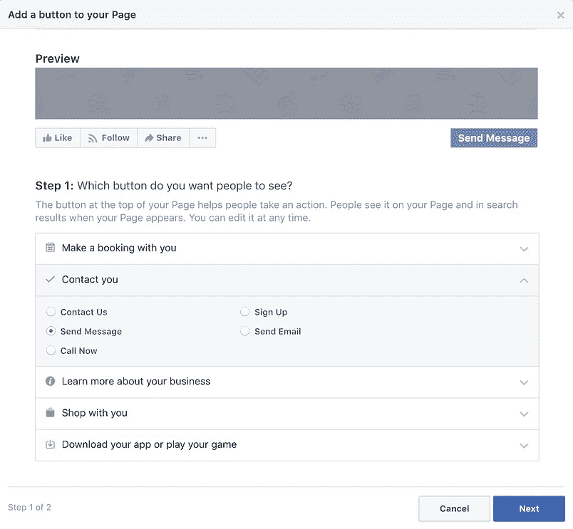

Add a Send Message Button to your Facebook Page

现在，当你悬停在**发送消息**按钮上时，会显示一个下拉菜单。点击**测试按钮**。

Click on Test button to Test your bot

这将打开一个带有**开始按钮**的聊天。点击它，如果你已经设置正确，你会看到" *Woohoo！。欢迎{Name}。您已被添加到数据库中。*”。

这意味着您已经作为用户被添加到标准库本地存储的[代码的函数中。](http://code.stdlib.com)

如果您再次向您的机器人发送“嗨”消息，它将回复“*嗨{Name}”，您已经被添加到数据库中。*

现在来设置**任务**。

# 关于标准库代码的任务

标准库上[代码最酷的特性之一是**任务**。设置任务使您的**代码按照指定的时间表自动运行**。](https://code.stdlib.com)

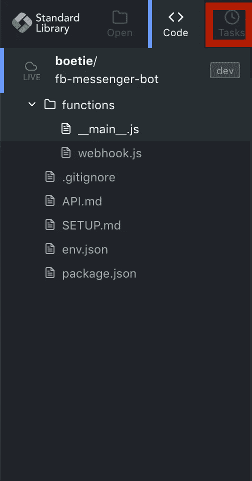

Click on Tasks to set up your code to run on a schedule

> 我目前设置了一天四个通知的功能。你可以把它改成你喜欢的任何数字。请记住，您还需要更改函数顶部的 **max_notifications 变量**，并在 cron 规范中添加相同数量的可重复任务。

在任务窗口中，**选择您的 bot 函数**来添加一个时间表。

Choose your function to add a Task schedule

您可以使用计划下拉菜单设置任务计划。但是我们想要更多一点的控制，所以我们使用**高级(cron)** 。

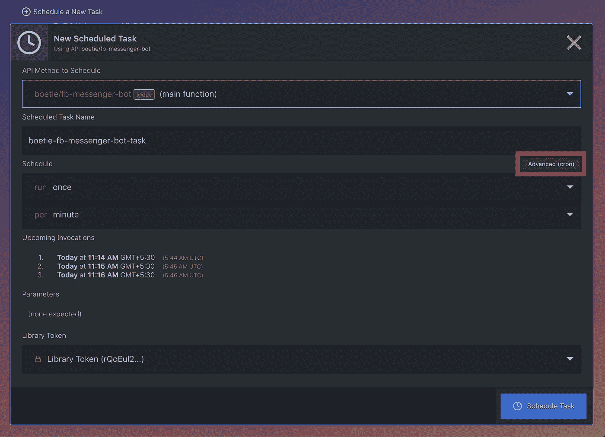

Click on Advanced (cron) to use cron expressions for task schedule

cron 表达式很难理解。该表达式有 5 个值—* * * * * *。第一个是**分钟**值，第二个是**小时**值。

因此，如果您输入`30 5,8,11,15 * * *`，它将转化为在`05:30`、`08:30`、`11:30`和`15:30`运行的 4 个任务，每天重复。时间是用世界协调时(UTC)的**表示的，所以你需要加上或减去你的**时区偏移量**来得到正确的当地时间。**

因为我住在印度，我的时区偏移量是`+05:30`，这个时间表将在当地时间`11:00`、`14:00`、`17:00`和`21:00`运行。

If the cron expression is valid, the next three invocation times are shown below it

点击**计划任务**就大功告成了。现在，您应该会在预定的时间在 messenger 上收到通知。

> 如果您想测试任务计划，请选择每分钟一次。一旦你得到了正确的消息，关掉它，使用上面的 cron 表达式或类似的东西来定制时间表。

**恭喜你！**你现在有一个**个人聊天机器人**。*在接下来的几个月里，我会添加更多关于聊天机器人*还能做什么有趣事情的教程。

查看[创建一个 Alexa 电台技能](https://hackernoon.com/create-an-alexa-radio-skill-in-5-minutes-with-standard-library-and-nodejs-93dc32b08c42)，如果你想**用你的个性化电台建立一个 Alexa 技能**。