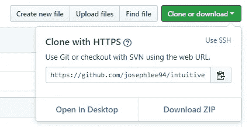
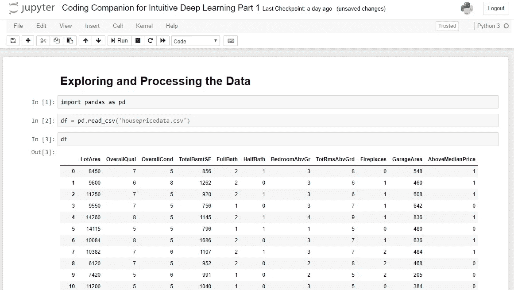
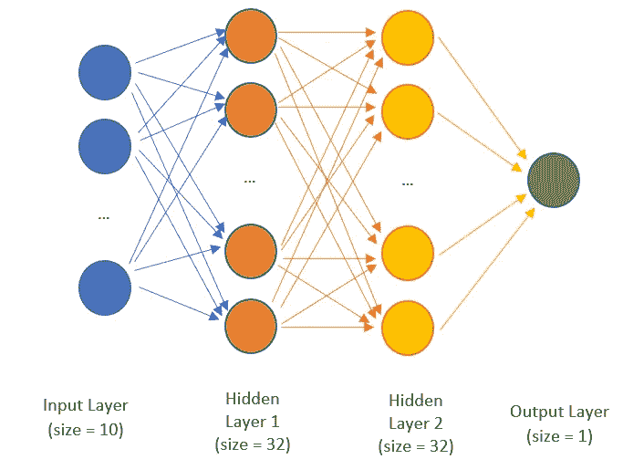
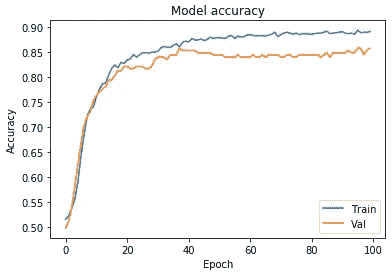
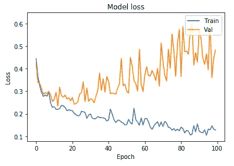
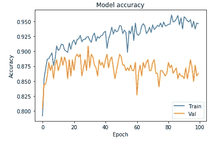

# 用 Keras 建立你的第一个预测房价的神经网络

> 原文：<https://medium.com/hackernoon/build-your-first-neural-network-to-predict-house-prices-with-keras-3fb0839680f4>

## 一步一步完整的初学者指南，像深度学习专家一样用几行代码构建你的第一个神经网络！


编写你的第一个神经网络只需要几行代码！在本帖中，我们将探索如何使用一个名为 Keras 的包来构建我们的第一个神经网络，以预测房价是高于还是低于中值。特别是，我们将通过完整的深度学习渠道，从:

*   探索和处理数据
*   建立和训练我们的神经网络
*   可视化损失和准确性
*   将正则化加入我们的神经网络

只需 20 到 30 分钟，你就可以像深度学习实践者一样编写自己的神经网络了！

**先决条件**:

这篇文章假设你已经在 Jupyter 笔记本上安装了 *keras* ， *tensorflow* ， *pandas* ， *scikit-learn* 和 *matplotlib* 软件包。如果您还没有这样做，请按照下面教程中的说明进行操作:

*   [深度学习和数据科学 Python 入门](/intuitive-deep-learning/getting-started-with-python-for-deep-learning-and-data-science-9ca785560bbc)

我们假设您对神经网络及其工作方式有一些直观的了解，包括一些基本细节，如什么是过度拟合以及解决它们的策略。如果您需要复习，请阅读这些直观的介绍:

*   [直观深度学习第 1a 部分:神经网络简介](/intuitive-deep-learning/intuitive-deep-learning-part-1a-introduction-to-neural-networks-d7b16ebf6b99)
*   [直觉深度学习第 1b 部分:神经网络简介](/intuitive-deep-learning/intuitive-deep-learning-part-1b-introduction-to-neural-networks-8565d97ddd2d)

你需要的资源:

我们今天要用的数据集改编自 [Zillow 的房屋价值预测 Kaggle 竞赛数据](https://www.kaggle.com/c/zillow-prize-1/data)。我们减少了输入要素的数量，并将任务改为预测房价是高于还是低于中值。请访问下面的链接下载下面的修改数据集，并将其放在与您的笔记本相同的目录中。下载图标应该在右上角。

[下载数据集](https://drive.google.com/file/d/1GfvKA0qznNVknghV4botnNxyH-KvODOC/view?usp=sharing)

或者，你也可以下载一个带注释的 Jupyter 笔记本，它包含了这篇文章中的所有代码: [Jupyter 笔记本](https://github.com/josephlee94/intuitive-deep-learning/blob/master/Part%201/Coding%20Companion%20for%20Intuitive%20Deep%20Learning%20Part%201%20Annotated.ipynb)。

注意，要从 Github 下载这款笔记本，你得去[首页](https://github.com/josephlee94/intuitive-deep-learning)下载 ZIP 下载所有文件:



现在，让我们开始吧！

# 探索和处理数据

在我们编写任何 ML 算法之前，我们需要做的第一件事是把我们的数据转换成算法想要的格式。特别是，我们需要:

*   读入 CSV(逗号分隔值)文件并将它们转换为数组。数组是我们的算法可以处理的一种数据格式。
*   将数据集分为输入要素(我们称之为 x)和标注(我们称之为 y)。
*   缩放数据(我们称之为*归一化*)，使输入要素具有相似的数量级。
*   将我们的数据集分成训练集、验证集和测试集。如果您需要复习为什么我们需要这三个数据集，请参考[直观深度学习第 1b 部分](/intuitive-deep-learning/intuitive-deep-learning-part-1b-introduction-to-neural-networks-8565d97ddd2d)。

所以让我们开始吧！从[深度学习和数据科学 Python 入门](/intuitive-deep-learning/getting-started-with-python-for-deep-learning-and-data-science-9ca785560bbc)教程中，您应该已经将 pandas 包下载到您的环境中。我们需要告诉我们的笔记本，我们将通过导入来使用该包。键入以下代码，然后按键盘上的 Alt-Enter 键:

```
import pandas as pd
```

这仅仅意味着，如果我想引用包‘pandas’中的代码，我将用名称 pd 来引用它。然后，我们通过运行这行代码读入 CSV 文件:

```
df = pd.read_csv('housepricedata.csv')
```

这一行代码意味着我们将读取 csv 文件' [housepricedata.csv](https://github.com/josephlee94/intuitive-deep-learning/blob/master/Part%201/housepricedata.csv) '(它应该与您的笔记本在同一个目录中)并将其存储在变量' df '中。如果我们想知道 df 中有什么，只需在灰色框中键入 df，然后单击 Alt-Enter:

```
df
```

您的笔记本应该是这样的:



在这里，您可以稍微探索一下数据。前十列中有我们的输入特性:

*   地块面积(平方英尺)
*   总体质量(从 1 到 10 分)
*   总体状况(从 1 到 10 分)
*   地下室总面积(平方英尺)
*   全浴室数量
*   半个浴室的数量
*   地上卧室的数量
*   地上房间总数
*   壁炉数量
*   车库面积(平方英尺)

在我们的上一篇专栏文章中，我们有一个想要预测的特性:

*   房价到底是不是中值以上？(1 表示是，0 表示否)

既然我们已经看到了我们的数据的样子，我们想把它转换成数组供我们的机器处理:

```
dataset = df.values
```

为了将我们的数据帧转换成数组，我们只需将 df 的值(通过访问 *df.values* )存储到变量‘dataset’中。要查看变量“数据集”中的内容，只需在笔记本上的灰色框中键入“数据集”并运行单元格(Alt-Enter):

```
dataset
```

如您所见，它现在都存储在一个数组中:


Converting our dataframe into an array

现在，我们将数据集分为输入要素(X)和我们希望预测的要素(Y)。要进行这种分割，我们只需将数组的前 10 列赋给一个名为 X 的变量，将数组的最后一列赋给一个名为 y 的变量。

```
X = dataset[:,0:10]
```

这可能看起来有点奇怪，但让我解释一下方括号内的内容。逗号之前的所有内容都是指数组的行，逗号之后的所有内容都是指数组的列。

因为我们没有拆分行，所以我们在逗号前放了“:”。这意味着将数据集中的所有行放入 x。

我们希望提取出前 10 列，因此逗号后面的‘0:10’意味着取第 0 到第 9 列并放入 X 中(我们不包括第 10 列)。我们的列从索引 0 开始，所以前 10 列实际上是列 0 到 9。

然后，我们将数组的最后一列赋给 Y:

```
Y = dataset[:,10]
```

好了，现在我们已经将数据集分为输入要素(X)和我们想要预测的内容的标注(Y)。

我们处理的下一步是确保输入要素的比例相似。现在，像地段面积这样的特征是以千计的，整体质量的分数范围是从 1 到 10，壁炉的数量倾向于 0、1 或 2。

这使得神经网络的初始化变得困难，从而引起一些实际问题。扩展数据的一种方法是使用 scikit-learn 的现有包(我们已经安装在[入门](/intuitive-deep-learning/getting-started-with-python-for-deep-learning-and-data-science-9ca785560bbc)帖子中)。

我们首先必须导入我们想要使用的代码:

```
from sklearn import preprocessing
```

这表示我想在 sklearn 包的“预处理”中使用代码。然后，我们使用一个名为最小-最大缩放器的函数来缩放数据集，以便所有输入要素都位于 0 和 1 之间(包括 0 和 1):

```
min_max_scaler = preprocessing.MinMaxScaler()
X_scale = min_max_scaler.fit_transform(X)
```

现在，我们的缩放数据集存储在数组‘X _ scale’中。如果您希望看到“X_scale”的样子，只需运行单元格:

```
X_scale
```

您的 Jupyter 笔记本现在应该看起来有点像这样:


现在，我们到了处理数据的最后一步，即将数据集分成训练集、验证集和测试集。

我们将使用来自 scikit-learn 的名为“train_test_split”的代码，顾名思义，它将我们的数据集分成一个训练集和一个测试集。我们首先导入我们需要的代码:

```
from sklearn.model_selection import train_test_split
```

然后，像这样分割数据集:

```
X_train, X_val_and_test, Y_train, Y_val_and_test = train_test_split(X_scale, Y, test_size=0.3)
```

这告诉 scikit-learn 您的 val_and_test 大小将占整个数据集的 30%。如变量名所示，代码将把拆分的数据存储到等号左边的前四个变量中。

不幸的是，这个函数只能帮助我们将数据集一分为二。由于我们想要一个单独的验证集和测试集，我们可以使用相同的函数在 val_and_test 上再次进行分割:

```
X_val, X_test, Y_val, Y_test = train_test_split(X_val_and_test, Y_val_and_test, test_size=0.5)
```

上面的代码将 val_and_test 的大小平均分配给验证集和测试集。

总之，我们现在将使用的数据集总共有六个变量:

*   X_train *(10 个输入特征，70%的完整数据集)*
*   X_val *(10 个输入要素，15%的完整数据集)*
*   X_test *(10 个输入特征，全部数据集的 15%)*
*   Y_train *(1 个标签，全数据集的 70)*
*   Y_val *(1 个标签，15%的完整数据集)*
*   Y_test *(1 个标签，15%的完整数据集)*

如果您想查看每个数组的形状(即它们的维度)，只需运行

```
print(X_train.shape, X_val.shape, X_test.shape, Y_train.shape, Y_val.shape, Y_test.shape)
```

你的 Jupyter 笔记本应该是这样的:


如您所见，训练集有 1022 个数据点，而验证和测试集各有 219 个数据点。X 变量有 10 个输入特征，而 Y 变量只有一个要预测的特征。

而现在，我们的数据终于准备好了！唷！

**总结**:在数据处理过程中，我们:

*   读入 CSV(逗号分隔值)文件并将它们转换为数组。
*   将数据集分割成输入要素和标注。
*   缩放数据，使输入要素具有相似的数量级。
*   将我们的数据集分成训练集、验证集和测试集。

# 建立和训练我们的第一个神经网络

在[直觉深度学习第 1a 部分](/intuitive-deep-learning/intuitive-deep-learning-part-1a-introduction-to-neural-networks-d7b16ebf6b99)中，我们说过机器学习由两步组成。第一步是指定一个模板(一个架构)，第二步是从数据中找出最好的数字来填充这个模板。从现在开始，我们的代码也将遵循这两个步骤。

**第一步:建立架构**

我们要做的第一件事是建立架构。我们先来思考一下我们想要什么样的神经网络架构。假设我们想要这个神经网络:



Neural network architecture that we will use for our problem

换句话说，我们想要这些层次:

*   隐藏层 1: 32 个神经元，ReLU 激活
*   隐藏层 2: 32 个神经元，ReLU 激活
*   输出层:1 个神经元，乙状结肠激活

现在，我们需要向 Keras 描述这个架构。我们将使用顺序模型，这意味着我们只需要按顺序描述上面的层。

首先，让我们从 Keras 导入必要的代码:

```
from keras.models import Sequential
from keras.layers import Dense
```

然后，我们在 Keras 序列模型中指定如下内容:

```
model = Sequential([
    Dense(32, activation='relu', input_shape=(10,)),
    Dense(32, activation='relu'),
    Dense(1, activation='sigmoid'),
])
```

就这样，上面的代码片段定义了我们的架构！上面的代码可以这样解释:

`model = Sequential([ ... ])`

这意味着我们将把我们的模型存储在变量“model”中，我们将在方括号中依次(一层一层)描述它。

`Dense(32, activation='relu', input_shape=(10,)),`

我们的第一层是一个密集层，有 32 个神经元，ReLU 激活，输入形状是 10，因为我们有 10 个输入特征。请注意,“密集”是指完全连接的层，这是我们将使用的层。

`Dense(32, activation='relu'),`

我们的第二层也是致密层，有 32 个神经元，ReLU 激活。请注意，我们不必描述输入形状，因为 Keras 可以从第一层的输出中进行推断。

`Dense(1, activation='sigmoid'),`

我们的第三层是具有 1 个神经元的致密层，即乙状结肠激活。

就这样，我们用代码编写了我们的模型架构(模板)!

**第二步:填入最佳数字**

既然我们已经指定了我们的架构，我们需要为它找到最佳的数字。在我们开始培训之前，我们必须通过以下方式配置模型

*   告诉它你想用哪种算法来进行优化
*   告诉它使用什么损失函数
*   告诉它除了损失函数之外，你还想跟踪哪些指标

用这些设置配置模型需要我们调用函数 model.compile，就像这样:

```
model.compile(optimizer='sgd',
              loss='binary_crossentropy',
              metrics=['accuracy'])
```

我们将以下设置放在 model.compile 后面的括号中:

`optimizer='sgd'`

‘SGD’指的是随机梯度下降(这里指的是小批量梯度下降)，我们已经在[直观深度学习第 1b 部分](/intuitive-deep-learning/intuitive-deep-learning-part-1b-introduction-to-neural-networks-8565d97ddd2d)看到过。

`loss='binary_crossentropy'`

取值为 1 或 0 的输出的损失函数称为二进制交叉熵。

`metrics=['accuracy']`

最后，我们希望在损失函数之上跟踪精度。现在，一旦我们运行了单元，我们就可以开始训练了！

对数据的训练非常简单，只需要我们写一行代码:

```
hist = model.fit(X_train, Y_train,
          batch_size=32, epochs=100,
          validation_data=(X_val, Y_val))
```

该函数被称为“拟合”,因为我们将参数与数据进行拟合。我们必须指定我们正在训练的数据，即 *X_train* 和 *Y_train* 。然后，我们指定我们的小批量的大小以及我们想要训练它多长时间(epochs)。最后，我们指定我们的验证数据是什么，这样模型将告诉我们在每个点上我们是如何处理验证数据的。这个函数将输出一个历史，我们将它保存在变量 hist 下。我们稍后在可视化时会用到这个变量。

现在，运行细胞，看它训练！您的 Jupyter 笔记本应该是这样的:


你现在可以看到模型正在训练！通过观察这些数字，您应该能够看到随着时间的推移，损耗在减少，精度在提高。此时，您可以试验超参数和神经网络架构。再次运行单元格，查看调整超参数后，您的训练有何变化。

一旦你对你的最终模型满意，我们可以在测试集上评估它。为了找到测试集的准确性，我们运行以下代码片段:

```
model.evaluate(X_test, Y_test)[1]
```

我们之所以在 model.evaluate 函数后使用索引 1，是因为该函数返回损失作为第一个元素，精度作为第二个元素。要仅输出精度，只需访问第二个元素(索引为 1，因为第一个元素从 0 开始索引)。

由于我们分割数据集的方式以及权重初始化的随机性，每次运行笔记本时，数字和图形都会略有不同。尽管如此，如果您遵循了我上面指定的架构，您应该可以获得 80%到 95%之间的测试准确率！


Evaluating on the test set

现在你有了，你已经编码了你的第一个神经网络并训练了它！恭喜你！

**总结**:编写我们的第一个神经网络只需要几行代码:

*   我们用 Keras 顺序模型来指定架构。
*   我们用 *model.compile* 指定一些设置(优化器、损失函数、要跟踪的指标)
*   我们用 *model.fit* 的训练数据来训练我们的模型(为我们的架构找到最佳参数)
*   我们用*模型在测试集上评估我们的模型*

# 可视化损失和准确性

在[直觉深度学习第 1b 部分](/intuitive-deep-learning/intuitive-deep-learning-part-1b-introduction-to-neural-networks-8565d97ddd2d)中，我们谈到过拟合和一些正则化技术。我们如何知道我们的模型目前是否过度拟合？

我们可能要做的是绘制训练损失和 val 损失在经过的时期数上的曲线。为了显示一些漂亮的图形，我们将使用 matplotlib 包。像往常一样，我们必须导入我们希望使用的代码:

```
import matplotlib.pyplot as plt
```

然后，我们想要可视化训练损失和验证损失。为此，请运行以下代码片段:

```
plt.plot(hist.history['loss'])
plt.plot(hist.history['val_loss'])
plt.title('Model loss')
plt.ylabel('Loss')
plt.xlabel('Epoch')
plt.legend(['Train', 'Val'], loc='upper right')
plt.show()
```

我们将解释上面代码片段的每一行。前两行表示我们要绘制损失和 val_loss。第三行指定了该图的标题“模型损耗”。第四行和第五行告诉我们 y 轴和 x 轴应该分别标注什么。第六行包括我们图表的图例，图例的位置在右上方。第七行告诉 Jupyter notebook 显示图形。

您的 Jupyter 笔记本应该是这样的:


A graph of model loss that you should see in your Jupyter notebook

我们可以用下面的代码做同样的事情来绘制我们的训练精度和验证精度:

```
plt.plot(hist.history['acc'])
plt.plot(hist.history['val_acc'])
plt.title('Model accuracy')
plt.ylabel('Accuracy')
plt.xlabel('Epoch')
plt.legend(['Train', 'Val'], loc='lower right')
plt.show()
```

您应该会得到一个看起来有点像这样的图表:



Plot of model accuracy for training and validation set

由于我们的模型对训练集的改进看起来与对验证集的改进有些匹配，所以过度拟合似乎不是我们模型中的一个*大问题。*

**总结**:我们使用 *matplotlib* 来可视化训练和验证随时间的损失/准确性，以查看我们的模型中是否存在过度拟合。

# 将正则化加入我们的神经网络

为了将正则化引入我们的神经网络，让我们用一个会严重过度适应我们的训练集的神经网络来公式化。我们称之为模型 2。

```
model_2 = Sequential([
    Dense(1000, activation='relu', input_shape=(10,)),
    Dense(1000, activation='relu'),
    Dense(1000, activation='relu'),
    Dense(1000, activation='relu'),
    Dense(1, activation='sigmoid'),
])model_2.compile(optimizer='adam',
              loss='binary_crossentropy',
              metrics=['accuracy'])hist_2 = model_2.fit(X_train, Y_train,
          batch_size=32, epochs=100,
          validation_data=(X_val, Y_val))
```

如果我们运行此代码，并使用下面的代码绘制 hist_2 的损失图(注意，除了我们使用“hist_2”而不是“hist”之外，代码是相同的):

```
plt.plot(hist_2.history['loss'])
plt.plot(hist_2.history['val_loss'])
plt.title('Model loss')
plt.ylabel('Loss')
plt.xlabel('Epoch')
plt.legend(['Train', 'Val'], loc='upper right')
plt.show()
```

我们得到了这样一幅图:



Loss curves for over-fitting model

这是过度拟合的明显标志。训练损失正在减少，但是验证损失远远高于训练损失，并且还在增加(超过第 20 个时期的拐点)。如果我们使用下面的代码绘制精度图:

```
plt.plot(hist_2.history['acc'])
plt.plot(hist_2.history['val_acc'])
plt.title('Model accuracy')
plt.ylabel('Accuracy')
plt.xlabel('Epoch')
plt.legend(['Train', 'Val'], loc='lower right')
plt.show()
```

我们还可以看到训练和验证准确性之间更明显差异:



Training and validation accuracy for our overfitting model

现在，让我们尝试一些减少过度拟合的策略(除了将我们的架构改回我们的第一个模型)。记得在[直观深度学习第 1b 部分](/intuitive-deep-learning/intuitive-deep-learning-part-1b-introduction-to-neural-networks-8565d97ddd2d)中，我们介绍了三种减少过度拟合的策略。

在这三者中，我们将在这里合并 L2 正规化和辍学。我们在这里没有添加早期停止的原因是因为在我们使用了前两个策略之后，验证损失不会呈现我们上面看到的 U 形，所以早期停止不会那么有效。

首先，让我们导入 L2 正则化和辍学所需的代码:

```
from keras.layers import Dropout
from keras import regularizers
```

然后，我们指定第三个模型，如下所示:

```
model_3 = Sequential([
    Dense(1000, activation='relu', kernel_regularizer=regularizers.l2(0.01), input_shape=(10,)),
    Dropout(0.3),
    Dense(1000, activation='relu', kernel_regularizer=regularizers.l2(0.01)),
    Dropout(0.3),
    Dense(1000, activation='relu', kernel_regularizer=regularizers.l2(0.01)),
    Dropout(0.3),
    Dense(1000, activation='relu', kernel_regularizer=regularizers.l2(0.01)),
    Dropout(0.3),
    Dense(1, activation='sigmoid', kernel_regularizer=regularizers.l2(0.01)),
])
```

你能看出模型 3 和模型 2 的区别吗？有两个主要区别:

**区别 1** :要添加 L2 正则化，请注意，我们已经在每个密集层中添加了一些额外的代码，如下所示:

`kernel_regularizer=regularizers.l2(0.01)`

这告诉 Keras 将这些参数的平方值包括在我们的总损失函数中，并在损失函数中将它们加权 0.01。

**差异 2** :为了添加漏失，我们添加了一个新图层，如下所示:

`Dropout(0.3),`

这就意味着前一层的神经元在训练时有 0.3 的概率会掉线。让我们编译它，并使用与我们的模型 2(过度拟合的模型)相同的参数运行它:

```
model_3.compile(optimizer='adam',
              loss='binary_crossentropy',
              metrics=['accuracy'])hist_3 = model_3.fit(X_train, Y_train,
          batch_size=32, epochs=100,
          validation_data=(X_val, Y_val))
```

现在，让我们绘制损耗和精度图。你会注意到，损失在开始时要高得多，这是因为我们改变了损失函数。为了绘制窗口在 0 和 1.2 之间放大的损耗，我们在绘制时添加了一行额外的代码(plt.ylim):

```
plt.plot(hist_3.history['loss'])
plt.plot(hist_3.history['val_loss'])
plt.title('Model loss')
plt.ylabel('Loss')
plt.xlabel('Epoch')
plt.legend(['Train', 'Val'], loc='upper right')
plt.ylim(top=1.2, bottom=0)
plt.show()
```

我们将得到一个损失图，如下所示:


您可以看到验证损失与我们的培训损失非常接近。让我们用类似的代码片段来绘制准确性:

```
plt.plot(hist_3.history['acc'])
plt.plot(hist_3.history['val_acc'])
plt.title('Model accuracy')
plt.ylabel('Accuracy')
plt.xlabel('Epoch')
plt.legend(['Train', 'Val'], loc='lower right')
plt.show()
```

我们会得到这样一幅图:


与模型 2 中的模型相比，我们大大减少了过度拟合！这就是我们如何应用正则化技术来减少对训练集的过度拟合。

**总结**:为了处理过度拟合，我们可以将以下策略编码到我们的模型中，每个策略大约一行代码:

*   L2 正则化
*   拒绝传统社会的人

如果我们将训练/验证损失和准确性可视化，我们可以看到这些增加有助于处理过度拟合！

**综合摘要**:在这篇文章中，我们编写了 Python 代码来:

*   探索和处理数据
*   建立和训练我们的神经网络
*   可视化损失和准确性
*   给我们的神经网络添加正则化

我们经历了很多，却没有写太多行代码！构建和训练我们的神经网络只需要大约 4 到 5 行代码，并且试验不同的模型架构只是交换不同的层或改变不同的超参数的简单问题。Keras 确实使构建我们的神经网络变得更加容易，我们将继续将其用于计算机视觉和自然语言处理中更高级的应用。

**下一步**:在我们下一个[编码伴侣第 2 部分](/intuitive-deep-learning/build-your-first-convolutional-neural-network-to-recognize-images-84b9c78fe0ce)中，我们将探索如何编码我们自己的卷积神经网络(CNN)来进行图像识别！

[](/intuitive-deep-learning/build-your-first-convolutional-neural-network-to-recognize-images-84b9c78fe0ce) [## 建立你的第一个卷积神经网络来识别图像

### 一步一步的指南，建立自己的图像识别软件与卷积神经网络使用 Keras 上…

medium.com](/intuitive-deep-learning/build-your-first-convolutional-neural-network-to-recognize-images-84b9c78fe0ce) 

一定要先在这里对 CNN 有个直观的了解:[直观的深度学习第二部分:计算机视觉的 CNN](/intuitive-deep-learning/intuitive-deep-learning-part-2-cnns-for-computer-vision-24992d050a27)

**关于作者:**

你好，我是约瑟夫！我最近从斯坦福大学毕业，在那里我和吴恩达一起在[斯坦福机器学习小组](https://stanfordmlgroup.github.io/)工作。我想让深度学习概念尽可能直观，尽可能容易被每个人理解，这激励了我的出版:[直观的深度学习](https://medium.com/intuitive-deep-learning)。