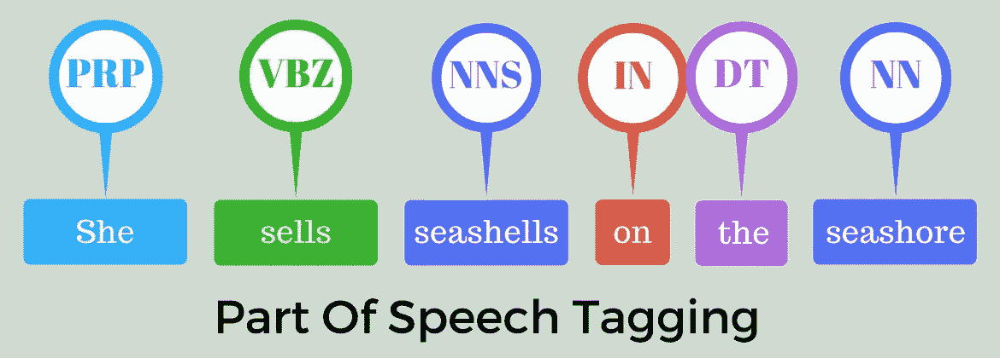
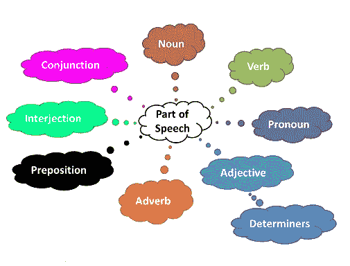
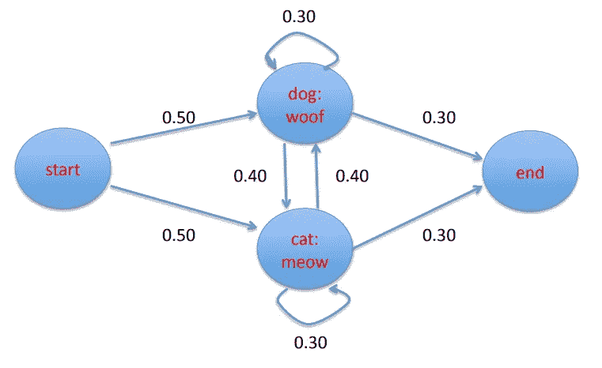
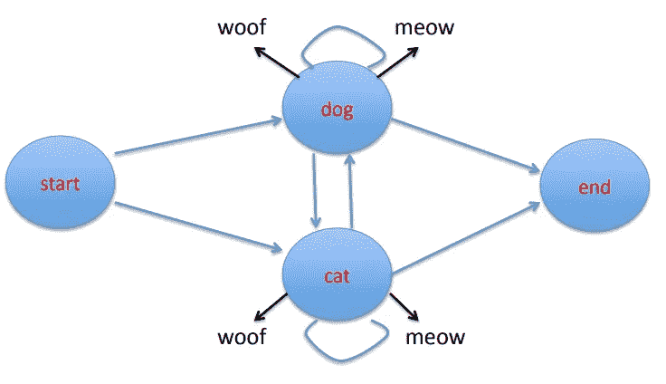
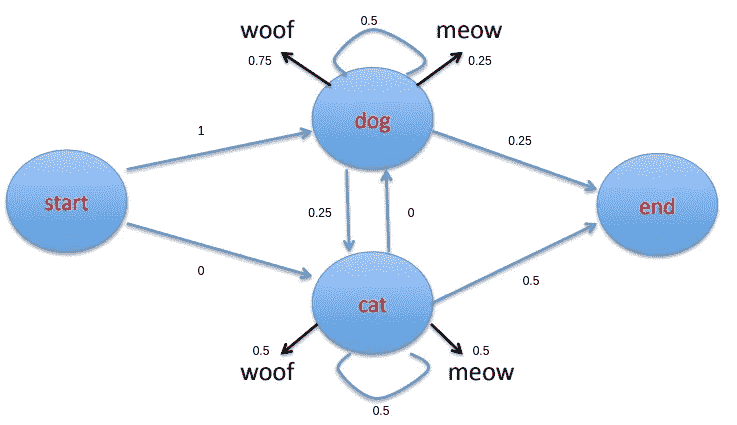
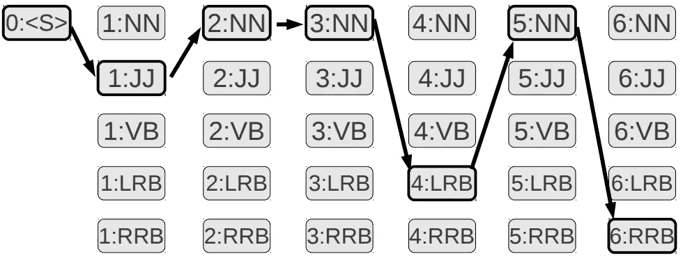
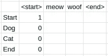
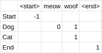

# 构建词性标注的二元隐马尔可夫模型

> 原文：<https://medium.com/hackernoon/building-a-bigram-hidden-markov-model-for-part-of-speech-tagging-1b784a87ab2c>



Image credits: Google Images

词性标注是许多自然语言处理管道的重要组成部分，其中句子中的单词用它们各自的词性来标记。词性标注的一个例子是组块。组块是标记句子中的多个单词以将它们组合成更大的“组块”的过程。这些组块随后可以用于诸如命名实体识别之类的任务。让我们深入探讨词性标注，看看如何使用隐马尔可夫模型和维特比解码算法来构建一个词性标注系统。

在这篇文章的底部可以找到一个示例实现的链接。

## 什么是 POS 标签？

如下图所示，有 9 个主要的词类。



Image credits: Google Images

大多数 NLP 应用程序中使用的 POS 标签比这更细粒度。这方面的一个例子是 NN 和 NNS，其中 NN 用于单数名词，如“桌子”，而 NNS 用于复数名词，如“桌子”。最突出的标记集是由 36 个 POS 标记组成的 Penn Treebank 标记集。


Subset of the Penn Treebank tagset

完整的宾州树木银行标签集可以在[这里](https://www.ling.upenn.edu/courses/Fall_2003/ling001/penn_treebank_pos.html)找到。

## 隐马尔可夫模型

幸运的是，我们不必手动执行 POS 标记。相反，我们将使用隐马尔可夫模型进行词性标注。

> 对于我们这些从未听说过隐马尔可夫模型(hmm)的人来说，hmm 是具有隐藏状态的马尔可夫模型。那么什么是马尔可夫模型，我们所说的隐藏状态是什么意思呢？

马尔可夫模型是一种随机(概率)模型，用于表示未来状态仅取决于当前状态的系统。出于词性标注的目的，我们进行简化假设，我们可以使用有限状态转移网络来表示马尔可夫模型。



A finite state transition network representing a Markov model. Image credits: Professor Ralph Grishman at NYU.

有限状态转移网络中的每个节点代表一个状态，离开节点的每个有向边代表从该状态到另一个状态的可能转移。请注意，每条边都标有一个数字，代表当前状态下给定转换发生的概率。还要注意，从任何给定状态转移出来的概率总和总是 1。

在上面的有限状态转移网络中，每个状态都是可观察的。我们可以看到一只猫在一只狗汪汪叫后喵喵叫的频率。如果我们的猫和狗是双语的。也就是说，如果猫和狗都能喵叫和汪汪叫呢？此外，让我们假设给定了狗和猫的状态，我们想要从这些状态预测喵喵叫和汪汪叫的序列。在这种情况下，我们只能观察狗和猫，但我们需要预测未被观察到的喵喵叫声。喵喵叫是隐藏状态。



A finite state transition network representing an HMM. Image credits: Professor Ralph Grishman at NYU.

上图是一个有限状态转移网络，代表我们的 HMM。黑色箭头代表未被观察到的状态“汪”和“喵”的发射。

现在让我们来看看如何计算我们状态的跃迁和发射概率。回到猫和狗的例子，假设我们观察到以下两个状态序列:

```
dog, cat, cat
dog, dog, dog
```

那么可以使用最大似然估计来计算转移概率:


在英语中，这表示从状态 i-1 到状态 I 的转移概率由我们观察到状态 i-1 转移到状态 I 的总次数除以我们观察到状态 i-1 的总次数给出。

例如，从状态序列中，我们可以看到序列总是以 dog 开始。因此，我们处于起始状态两次，两次都是狗，从不猫。因此，从起始状态到 dog 的转移概率是 1，从起始状态到 cat 的转移概率是 0。

让我们再试一次。我们来计算一下从状态狗到状态端的转移概率。从我们的示例状态序列中，我们看到 dog 只转换到结束状态一次。我们还看到有四个观察到的狗的实例。因此，从狗状态到结束状态的转移概率是 0.25。其他转移概率可以用类似的方式计算。

也可以使用最大似然估计来计算排放概率:


在英语中，这表示给定状态 I 的标签 I 的发射概率是我们观察到状态 I 发射标签 I 的总次数除以我们观察到状态 I 的总次数。

给定上述两个状态序列的以下发射，让我们计算狗发射 woof 的发射概率:

```
woof, woof, meow
meow, woof, woof
```

也就是说，对于第一个状态序列，狗汪汪叫，然后猫汪汪叫，最后猫喵喵叫。我们从状态序列中看到，狗被观察了四次，我们可以从发射中看到，狗汪汪叫了三次。因此，假设我们处于狗的状态，woof 的发射概率是 0.75。其他发射概率可以用同样的方法计算。为完整起见，完整的有限状态转移网络如下所示:



Finite state transition network of the hidden Markov model of our example.

那么我们如何使用 hmm 进行词性标注呢？当我们执行词性标注时，我们的目标是找到标签 T 的序列，使得给定单词序列 W，我们得到


在英语中，我们说的是我们想要找到给定单词序列的概率最高的 POS 标签序列。由于在我们的隐马尔可夫模型中没有观察到标签发射，我们应用 Baye 规则将这种概率改变为我们可以使用最大似然估计来计算的方程:


第二个等式是我们应用贝耶法则的地方。看起来像一个被切掉一块的无穷符号的符号意味着与成比例。这是因为对于我们的目的来说 P(W)是一个常数，因为改变序列 T 不会改变概率 P(W)。因此，丢弃它不会对最大化概率的最终序列 T 产生影响。

在英语中，概率 P(W|T)是给定标签序列，我们得到单词序列的概率。为了能够计算这个，我们仍然需要做一个简化的假设。我们需要假设一个单词出现的概率只取决于它自己的标签，而不取决于上下文。也就是说，该单词不依赖于相邻的标签和单词。那么我们有


在英语中，概率 P(T)是获得标签序列 T 的概率。为了计算这个概率，我们还需要做一个简化的假设。这个假设给了我们的二元模型 HMM 它的名字，所以它通常被称为二元模型假设。我们必须假设得到一个标签的概率只取决于前一个标签，不取决于其他标签。那么我们可以计算 P(T)为


注意，我们可以使用三元模型假设，即一个给定的标签依赖于它之前的两个标签。事实证明，由于需要平滑，计算 HMM 的三元模型概率比计算二元模型概率需要更多的工作。三元模型确实比二元模型有一些性能优势，但是为了简单起见，我们使用二元模型假设。

最后，我们现在能够使用


这个等式中的概率应该看起来很熟悉，因为它们分别是发射概率和跃迁概率。


因此，如果我们要为这个 HMM 画一个有限状态转移网络，观察到的状态将是标签，单词将是发出的状态，类似于我们的 woof 和 meow 示例。我们已经看到，我们可以使用最大似然估计来计算这些概率。

给定一个由句子组成的数据集，这些句子用相应的词性标签进行标记，训练 HMM 就像计算上述的发射和转移概率一样简单。对于一个示例实现，请查看这里实现的[二元模型](https://github.com/AaronCCWong/HMM-POS-Tagger-with-Viterbi-Decoding/blob/master/src/viterbi/BigramModel.java#L195)。这种实现的基本思想是，它主要记录训练期间最大似然估计所需的值。然后，该模型在评估过程中使用训练过程中收集的计数来计算概率。

一个敏锐的读者会想，面对训练中没有看到的单词，模型会做什么。我们稍后将回到处理未知单词的主题，因为我们将看到，能够正确处理未知单词对于模型的性能至关重要。

## 维特比解码



Image credits: Google Images

HMM 给了我们概率，但是我们想要的是实际的标签序列。我们需要一种算法，在给定一个单词序列的情况下，它能给出正确概率最高的标签序列。一种称为贪婪解码的直观算法会为每个单词选择概率最高的标签，而不考虑上下文，如后续标签。正如我们所知，贪婪算法并不总是返回最优解，事实上，在词性标注的情况下，它会返回次优解。这是因为在为当前单词选择了标签之后，下一个单词的可能标签可能是有限的和次优的，从而导致整体次优的解决方案。

相反，我们使用动态规划算法称为维特比。维特比从创建两个表开始。第一个表用于跟踪到达给定小区所需的最大序列概率。如果这还没有意义，那也没关系。我们将看一个例子。第二个表用于跟踪导致第一个表中给定单元概率的实际路径。

让我们看一个例子来帮助解决这个问题。回到我们之前的汪汪和喵喵的例子，给定序列

```
meow woof
```

我们将使用维特比来寻找导致该序列的最可能的状态序列。首先我们需要创建我们的第一个维特比表。在我们的有限状态转换网络中，每个状态都需要一行。因此，我们的表有 4 行用于状态开始、狗、猫和结束。我们试图解码一个长度为 2 的序列，所以我们需要四列。一般来说，我们需要的列数就是我们试图解码的序列的长度。我们需要四列的原因是因为我们试图解码的完整序列实际上是

```
<start> meow woof <end>
```

第一个表包含从先前状态到达给定状态的概率。更准确地说，表中每个单元格的值由下式给出


让我们使用我们为 HMM 模型的有限状态转移网络计算的概率来填写我们的示例的表格。



请注意，除了起始行之外，第一列的所有位置都是 0。这是因为我们例子中的序列总是以<start>开始。从我们的有限状态转移网络中，我们看到起始状态以概率 1 转移到狗状态，并且永远不会进入猫状态。我们也看到狗发出喵的概率是 0.25。同样重要的是要注意，我们不能从开始状态到达开始状态或结束状态。因此我们得到下一列值</start>


注意，我们不能从初始状态到达的所有状态的概率都是 0。此外，喵列到达狗状态的概率是 1 * 1 * 0.25，其中第一个 1 是前一个单元的概率，第二个 1 是从前一个状态到狗状态的转移概率，0.25 是从当前状态狗发出喵的概率。因此 0.25 是目前最大的序列概率。继续下一列:


注意，我们不能从狗的状态到达开始状态，结束状态也不会发出汪汪声，所以这两行的概率都是 0。同时，狗和猫状态的单元得到概率 0.09375 和 0.03125，计算方法与我们之前看到的相同，前一个单元的概率 0.25 乘以各自的跃迁和发射概率。最后，我们得到


至此，猫和狗都可以到<end>。因此，我们必须计算猫和狗到达终点的概率，然后选择概率较高的路径。</end>


从狗到终点的概率比从猫到终点的概率高，所以这是我们走的路。因此，我们得到的答案应该是

```
<start> dog dog <end>
```

在 Viterbi 实现中，在我们填写概率表的整个过程中，还应该填写另一个被称为后指针表的表。backpointer 表中每个单元格的值等于导致当前状态的最大概率的前一状态的行索引。因此，在我们的示例中，后指针表中的结束状态单元将具有值 1 (0 起始索引),因为行 1 处的状态 dog 是给予结束状态最高概率的前一状态。为了完整起见，下面给出了我们例子的后指针表。



请注意，起始状态的值为-1。这是我们在回溯反向指针表时使用的停止条件，以获得给定 HMM 时为我们提供正确概率最高的序列的路径。为了得到状态序列 <start>dog dog <end>，我们从表格右下角的结束单元格开始。这个单元格中的 1 告诉我们 woof 列中的前一个状态在第 1 行，因此前一个状态必须是 dog。从 dog 中，我们看到单元格再次标记为 1，因此 dog 之前的喵列中的先前状态也是 dog。最后，在 meow 列中，我们看到 dog 单元格被标记为 0，因此前一个状态必须是第 0 行，也就是<start>状态。我们看到-1 所以我们停在这里。我们的顺序是<end>狗狗<start>。逆转这一点给了我们最有可能的序列。[查看示例实现](https://github.com/AaronCCWong/HMM-POS-Tagger-with-Viterbi-Decoding/blob/master/src/viterbi/Viterbi.java)。</start></end></start></end></start>

当使用一个算法时，知道算法的复杂度总是好的。在维特比的情况下，时间复杂度等于 O(s * s * n ),其中 s 是状态的数量，n 是输入序列中的字数。这是因为对于概率表中的每个 s * n 条目，我们需要查看前一列中的 s 条目。所需的空间复杂度为 O(s * n)。这是因为有 s 行(每个状态一行)和 n 列(输入序列中的每个单词一列)。

## 性能赋值

让我们看看当我们试图在 WSJ 语料库上训练 HMM 时会发生什么。我没有被允许分享文集，所以不能在这里给你指出一个，但如果你寻找它，应该不难找到…

训练 HMM，然后使用 Viterbi 进行解码，在验证集上获得了 71.66%的准确率。与此同时，当前基准分数为 97.85%。

## 处理未知单词

我们如何缩小这一差距？我们已经知道，使用三元模型可以带来改进，但最大的改进来自于正确处理未知单词。我们使用 Brants 在论文 [TnT 中采用的方法——一种统计词性标注器](http://www.coli.uni-saarland.de/~thorsten/publications/Brants-ANLP00.pdf)。更具体地说，我们执行后缀分析来尝试猜测未知单词的正确标签。

我们创建了两个后缀树。一个后缀树跟踪小写单词的后缀，一个后缀树跟踪大写单词的后缀。(Brants，2000 年)发现，对大写单词和小写单词使用不同的概率估计对性能有积极的影响。这是有道理的，因为大写的单词更有可能是首字母缩写词之类的东西。

我们只使用出现在语料库中的频率小于某个指定阈值的单词的后缀。要使用的最大后缀长度也是一个可以调整的超参数。根据经验，[当使用最大后缀长度 5 和最大词频 25 时，这里的](https://github.com/AaronCCWong/cs-2590/tree/master/viterbi)标记器实现表现最佳，在验证集上给出 95.79%的标记准确度。

为了计算给定单词后缀的标签的概率，我们遵循(Brants，2000)并使用


在哪里


是使用最大似然估计来计算的，就像我们在前面的例子中所做的那样


在英语中，给定后缀的标签的概率等于给定后缀的所有后缀的最大似然估计的平滑和归一化和。

因此，在计算维特比概率的过程中，如果我们遇到 HMM 以前没有见过的单词，我们可以使用未知单词的后缀来查询我们的后缀树。在给定未知单词后缀的情况下，我们使用后缀树来计算标签的发射概率，而不是使用 HMM 来计算单词标签的发射概率。

要查看后缀树的示例实现，[查看这里的代码](https://github.com/AaronCCWong/HMM-POS-Tagger-with-Viterbi-Decoding/blob/master/src/viterbi/SuffixTreeBuilder.java)。如前所述，这将验证集的准确率从 71.66%提高到了 95.79%。

## 示例实现

[点击此处试用一个 HMM POS 标记器，该标记器带有在 WSJ 语料库上训练的 Viterbi 解码](https://www.aaronccwong.com/pos-tagger)。

[点击这里查看模型实现的代码](https://github.com/AaronCCWong/HMM-POS-Tagger-with-Viterbi-Decoding)。

[点击此处查看托管 POS tagger](https://github.com/AaronCCWong/hmm-pos-tagger-service) 的 Spring Boot 应用程序的代码。

[点击这里查看原帖。](https://blog.aaronccwong.com/2019/building-a-bigram-hidden-markov-model-for-part-of-speech-tagging/)