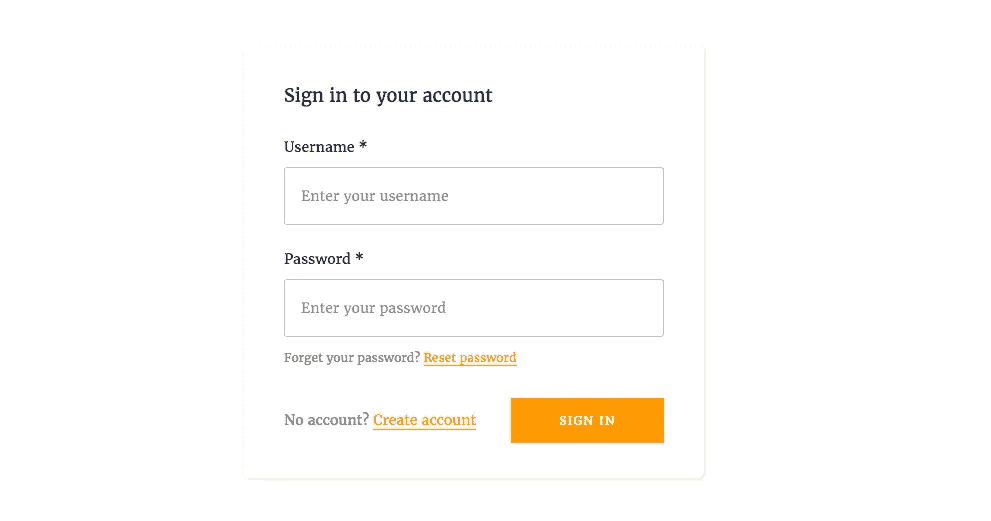
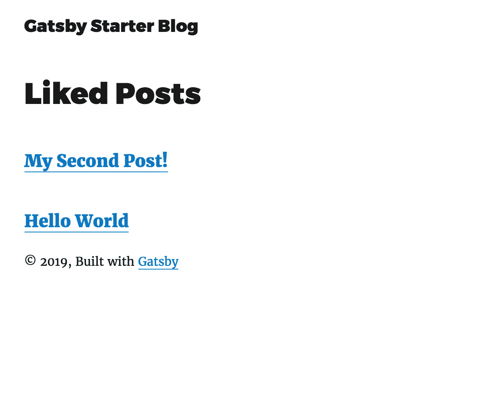
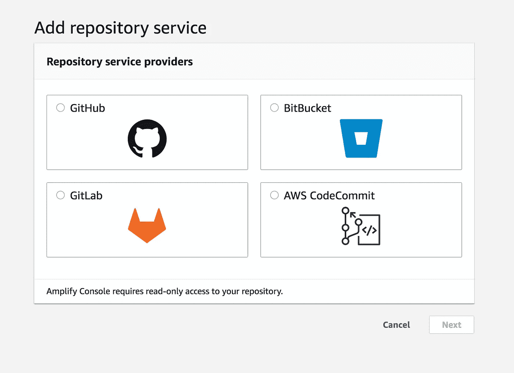
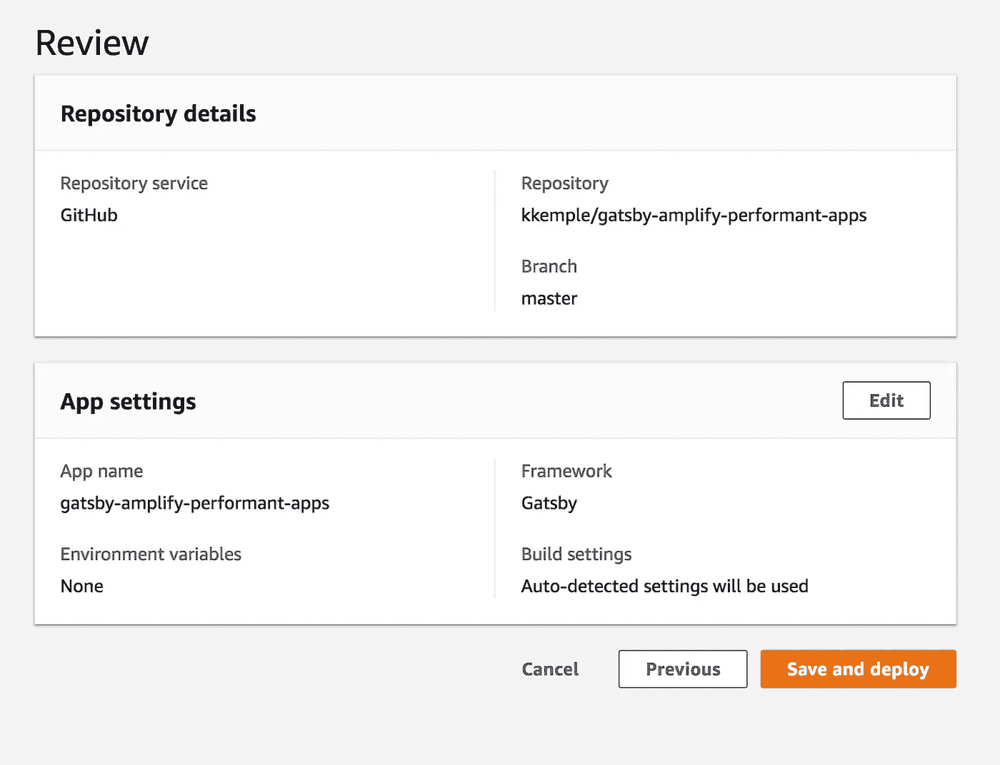

# 用 Gatsby 和 AWS Amplify 框架构建 JAMstack 应用程序

> 原文：<https://medium.com/hackernoon/building-jamstack-applications-with-gatsby-and-aws-amplify-framework-d7e2b9e7117e>


如今，当谈到性能时，经常会听到“JAMstack”这个术语。JAMstack 代表 JavaScript、API 和标记。想法是用 JavaScript 创建静态标记，通过与 API 通信来提供支持。

这种堆栈变得如此受欢迎的原因是因为它允许网站或应用程序捆绑在一起，并通过 CDN 在“边缘”提供服务。再加上一个理想的高性能应用程序，它可以与高性能 API 对话，这样你就可以获得快速的用户体验。

对于用 JavaScript 创建标记来说，GatsbyJS 是一个很好的解决方案，但是对于 API 部分和为世界提供服务来说呢？嗯，真的，这取决于你，但在这篇文章中，我将走过你如何可以:

*   使用[AWS amplifier](https://aws-amplify.github.io/)和 [AWS Cognito](https://aws.amazon.com/cognito/) 设置认证
*   使用 [AWS AppSync](https://aws.amazon.com/appsync/) 创建强大的 API，让你的应用程序做各种令人惊奇的事情
*   如何使用 [AWS Amplify Console](https://aws.amazon.com/amplify/console/) 来构建和部署你的应用，让它可以通过 AWS 的全球 CDN、 [Amazon CloudFront](https://aws.amazon.com/cloudfront/) 向全世界开放。

## Amplify 和 AppSync 快速入门

**Amplify** 让您快速创建复杂的无服务器后端。CLI 包括对身份验证、分析、函数、REST/graph QL API 以及更多功能的支持。它使用 AWS CloudFormation，使您能够添加、修改和共享配置。

**Amplify Console** 是一款针对移动网络应用的持续部署和托管服务。AWS Amplify 控制台使您更容易快速发布新功能，帮助您避免应用程序部署期间的停机时间，并处理同时更新应用程序前端和后端的复杂性。

**AppSync** 通过安全处理所有应用数据管理任务，如在线和离线数据访问、数据同步和跨多个数据源的数据操作，轻松构建数据驱动的移动和 web 应用。AWS AppSync 使用 GraphQL，这是一种 API 查询语言，旨在通过提供直观、灵活的语法来描述数据需求，从而构建客户端应用程序。

## 动态应用的盖茨比

因为 Gatsby 尽可能生成静态文件，所以它通常被归类为静态站点生成工具，但它实际上远不止如此。因为它是建立在 React 之上的，一旦你的应用渲染，它的行为就像任何其他 React 应用一样。这意味着可以做无限列表、实时更新和创建授权墙之类的事情。添加完全客户端呈现的站点部分并不罕见，像仪表板或管理门户都是可能的。这意味着您可以静态生成任何不依赖于任何动态内容(如用户信息或私人数据)的内容，但仍能提供完整的应用体验。

这篇文章将带你创建一个博客，让人们“喜欢”一篇文章。未登录的用户将无法喜欢帖子，但仍可以看到它们。博客帖子仍然是静态生成的，允许更快的交付和适当的 SEO 支持，但用户仍然可以动态地“喜欢”帖子。我们将使用 AppSync 来存储 likes 和 Amplify 来设置身份验证并创建 AppSync API。


Example of dynamic blog

## **建立盖茨比博客**

需要做的第一件事是确保您已经安装了`gatsby-cli`包，以便您可以创建一个新的 Gatsby 项目。

```
npm i -g gatsby-cli# ORyarn global add gatsby-cli
```

现在您可以创建一个项目。这个例子将使用[“启动博客”启动器](https://www.gatsbyjs.org/starters/gatsbyjs/gatsby-starter-blog/)。

```
npx gatsby new blog gatsbyjs/gatsby-starter-blog
```

> 您可以在此查看所有可用的首发[。](https://www.gatsbyjs.org/starters/?v=2)

接下来，您需要设置客户端应用程序，用户可以登录并查看他们喜欢的帖子。

要创建仅客户端路由，您首先需要用下面的代码片段更新`gatsby-node.js`(有关仅客户端路由的更多信息，请点击[这里的](https://www.gatsbyjs.org/docs/building-apps-with-gatsby/#client-only-routes--user-authentication)):

> 这告诉 Gatsby，这些路线应该只在客户端呈现。虽然在这个例子中您不一定需要这个功能，但是如果您的仪表板有许多路由，这将阻止 Gatsby 试图呈现这些页面，这将会出错，因为它们不存在于 Gatsby 寻找要呈现的页面的`pages`目录中。

接下来，您需要为仪表板添加一个页面。在`src/pages`中，创建一个名为`dashboard.js`的新文件，并添加以下内容:

如果您运行`yarn start`并访问`[http://localhost:8000/dashboard](http://localhost:8000/dasboard)`，您应该会看到类似这样的内容:


## 设置放大器

既然您已经设置了博客来支持仪表板，那么您需要设置 Amplify，这样您就可以做一些事情，比如添加身份验证和创建 API。为此，您需要首先安装 Amplify CLI。

```
npm i -g @aws-amplify/cli# ORyarn global add @aws-amplify/cli
```

一旦安装了 CLI，您需要在您的 Gatsby 博客项目中初始化 Amplify。从项目运行的根源`amplify init`。

当您运行此命令时，会发生以下两种情况之一。如果您的计算机上有一些 AWS 用户配置文件，它会询问您是否要使用配置文件。(如果您有一个具有管理和编程权限的配置文件，请随意选择。)如果您还没有创建任何用户配置文件，或者您不确定当前的配置文件是否有效，那么 CLI 将指导您如何创建一个用户配置文件，甚至会为您打开 AWS 控制台并预先填充任何字段。(你基本上只需要点击几个按钮，很简单。)

> 要更深入地了解如何创建新的用户资料，请查看来自 Nader Dabit 的这个信息丰富的视频。

现在 Amplify 已经配置好了，您可以开始在您博客中设置 AWS 服务了！

## 设置身份验证

Amplify 使得添加 Cognito 等认证服务变得非常简单和直接。要设置身份验证，请运行以下命令:

```
amplify add auth
```

运行该命令后，系统会询问您是否要使用默认配置来设置应用程序的身份验证。这是 AWS 的推荐身份验证设置。(如果您不熟悉如何配置自己的用户池和 Cognito 配置，请选择此选项。)接下来您需要运行`amplify push`，以便可以在 AWS 中创建和配置资源。

在 Amplify 为您的认证服务创建了远程资源之后，您需要在您的博客中设置 Amplify。为此，您需要:

安装必要的依赖项:

```
npm i aws-amplify aws-amplify-react# ORyarn add aws-amplify aws-amplify-react
```

接下来，您需要导入由 Amplify 在`src/aws-exports.js`中创建的配置，并将其传递给 Amplify 客户端。在`gatsby-browser.js`中添加以下内容:

然后，您可以使用“[with authenticator](https://aws-amplify.github.io/docs/js/react#add-auth)”HOC 更新仪表板。这个组件为您处理整个注册流程！这是一个非常棒的组件，但是如果你需要更具体的东西，你可以创建自己的登录流程，并使用`aws-amplify`包中的`[Auth](https://aws-amplify.github.io/docs/js/authentication)`模块。

> 关于使用授权模块的示例，请点击[此处](https://github.com/kkemple/zero-to-deploy-aws-amplify/blob/master/src/Login.js)。

将`src/pages/dashboard.js`更新如下:

一旦你重启 Gatsby，当你访问`[http://localhost:8000/dashboard](http://localhost:8000/dashboard)`时，你应该会看到以下内容:



withAuthenticator rendered by Gatsby

我们要做的最后一件事是从所有其他页面添加到仪表板的链接。我们可以将它添加到`Layout`组件中。注意，在更新后的`Dashboard`组件中，我们现在传入了一个`isDashboard`道具。我们可以在`Layout`组件中使用它来决定我们是否应该呈现仪表板链接。用以下内容更新`src/components/Layout.js`中的返回语句:

现在我们有了一个到仪表板的链接，用户可以在那里登录。继续并通过认证流程，以确保一切正常。如果你对幕后发生的事情感到好奇，你可以在这里查看你的新用户群。

恭喜你！任何访问您博客的人现在都可以登录了！🎉

虽然这很令人兴奋，但他们真的还不能做太多，所以现在让我们让喜欢帖子成为可能！

## 通过 AppSync 创建 GraphQL API

在你允许用户喜欢帖子之前，你需要一个存储这些信息的地方。下一步是设置一个 [AppSync](https://aws.amazon.com/appsync/) API，这样您就可以使用 GraphQL 来获取和存储数据。如果你不熟悉…

> GraphQL 是一种 API 查询语言，也是一种用现有数据完成这些查询的运行时语言。GraphQL 为 API 中的数据提供了完整且易于理解的描述，使客户能够准确地要求他们需要的东西，使 API 更容易随时间发展，并支持强大的开发工具。—[graphql.org](https://graphql.org/)

要将`API`服务添加到您的博客，请运行`amplify add api`。系统会提示您几个选项:

*   使用 GraphQL
*   提供一个 API 名称(我使用了 **amplifygatsbyexample** )
*   选择“Cognito 用户池”进行认证(这将自动连接到我们在认证步骤中创建的用户池)。
*   对于带注释的模式，选择“否”
*   选择“是”以指导模式创建
*   为模板类型选择“带字段的单个对象”
*   选择“是”立即编辑模式

现在用以下内容替换`TODO`类型:

> 如果您查看类型，您会注意到在`PostLike`类型上使用了两个指令。第一个是`model`，它告诉 AWS 这是一个数据类型，因此将为这个实体创建一个表。第二个是`auth`，这个指令允许我们在 GraphQL API 上设置粒度认证或访问。这里我们指定只有所有者可以访问他们自己的帖子，所有者由该实体的`userId`值决定。有关 GraphQL 转换的更多信息，请访问[此处](https://aws-amplify.github.io/docs/cli/graphql#graphql-transform)。

完成后，在终端中点击 enter，然后再次运行`amplify push`。您可以选择生成必要的代码来进行查询和变更，以及订阅。我建议让 Amplify 为您创建代码。

你知道有一个 API，你可以用它来存储你喜欢的东西！如果你想检查你的 API，你可以在这里做[！](https://console.aws.amazon.com/appsync/home)

## 把所有的放在一起

既然您已经设置了 API，那么是时候为您的 Gatsby 博客添加对 time 的支持了。第一步，添加喜欢一个帖子的能力。

为了能够喜欢一篇博文，你首先需要在每篇博文的`frontmatter`中添加一个`id`字段。为此，打开`content/blog`文件夹，为每篇博客文章添加一个`id`属性(我使用了 1、2、3 等递增数字)。它应该是这样的:

```
---title: Hello Worlddate: '2015-05-01T22:12:03.284Z'id: 1---
```

下一步是检查是否有登录的用户，如果找到了，那么检查登录的用户是否“喜欢”这篇文章。有了这些信息，你就可以正确地设置你的突变来创建或删除类似的东西。状态，以便在等待处理变异时可以对 UI 进行乐观更新。

将`src/templates/blog-post.js`替换为以下内容:

这里我们使用的是由`aws-amplify`提供的`API`模块，但是`aws-amplify-react`也提供了一个`Connect`组件。我们将在下一节中利用这一点。

> 需要注意的一点是，我们不必在突变输入中指定`userId`属性。原因是 AppSync 将使用在发出请求的关联身份上找到的用户。你可以在这里了解更多关于那个[的信息。](https://aws-amplify.github.io/docs/cli/graphql#auth)

所以现在访问者可以喜欢你的帖子了，让他们看到所有他们喜欢的帖子会很好。让我们用以下内容更新`src/pages/dashboard.js`:

在这里，您可以看到博客帖子现在正通过 Gatsby 被拉入，我们使用我们的 AppSync 数据结合博客帖子来呈现喜欢的帖子列表！继续点击一些帖子，然后访问仪表盘，您应该会看到类似这样的内容:



A list of liked posts rendered by Gatsby

太棒了。现在所有的功能都设置好了，剩下的唯一事情就是部署这个令人敬畏的博客了！

## 展开以放大控制台

通过 Amplify 控制台部署这个博客的第一步是让它处于源代码控制中。在您选择的源代码控制提供程序中创建一个新的存储库(我使用 GitHub，但是您也可以使用 GitLab、BitBucket 或 AWS Code Commit。)

一旦你把你的博客推送到你的源码控制提供者，下一步就是把这个库连接到 Amplify 控制台。这个过程简单得令人难以置信。转到 AWS 控制台的[放大控制台部分](https://console.aws.amazon.com/amplify/home)并点击“部署”按钮。

接下来选择您的源代码管理提供程序:



Picking a source control provider in Amplify Console

然后，您可以选择想要部署的存储库和分支:


Selecting a repository and branch in Amplify Console

Amplify Console 将自动检测这是一个 Gatsby 项目，因此对于构建配置的下一步，只需按“下一步”！

最后，检查您的设置并点击“保存和部署”:



Reviewing settings for the deployment in Amplify Console

> Amplify Console 将构建您在 Amplify 配置中指定的后端基础设施，然后它将跨 CloudFront 构建和部署您的静态站点。Amplify Console 支持分支部署，这意味着您可以为任何分支创建环境。这使得测试或创建临时环境变得非常容易。它还允许您为任何部署设置基本的身份验证，从而可以保持事情的私密性，只允许那些需要的人访问。

您的博客现已上线，全世界都可以欣赏了！恭喜你！🎊 🎉

**这个例子的代码可以在这里**[](https://github.com/kkemple/gatsby-amplify-performant-apps)****找到，部署的博客可以在这里** **找到** [**。**](https://master.d3ax2rhs5siznl.amplifyapp.com/)**

****你可以在这里玩 CodeSandbox 里的代码:****

**[](https://codesandbox.io/s/github/kkemple/gatsby-amplify-performant-apps) [## 盖茨比-入门-博客-代码沙盒

### 盖茨比和 Markdown 发起的博客

codesandbox.io](https://codesandbox.io/s/github/kkemple/gatsby-amplify-performant-apps) 

> 如果你喜欢这篇文章，我强烈推荐你看看你能用 Amplify 和 AppSync 做的更多惊人的事情！你可以在这里和这里找到更多精彩的资源[。](/search?q=aws%20amplify)
> 
> 另外，如果你想了解我正在写的或正在做的最新事情，请在推特上关注我！**