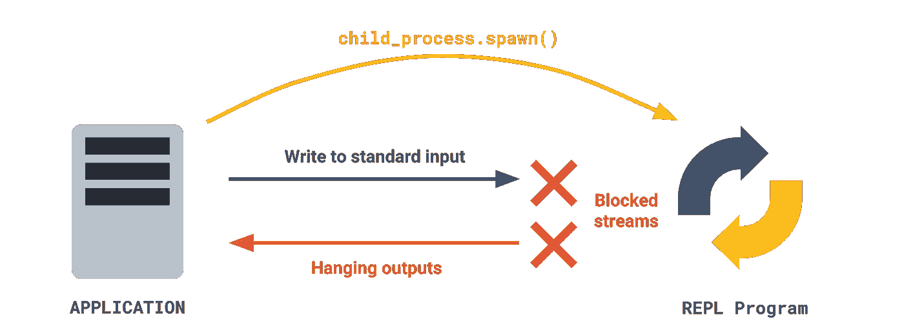
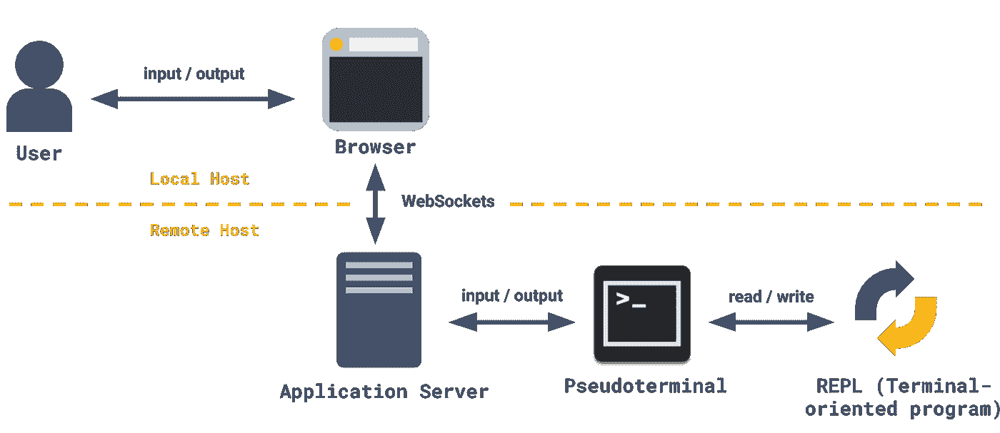
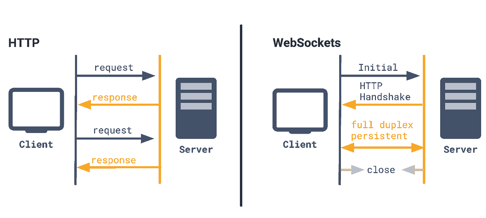
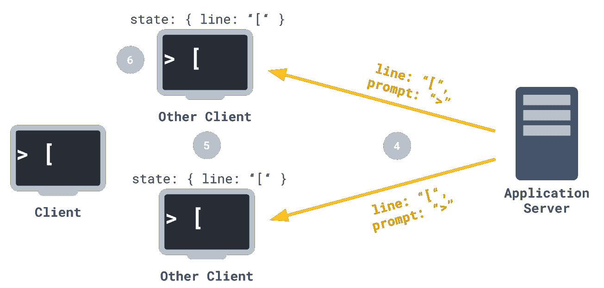
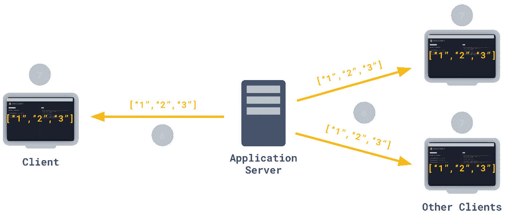
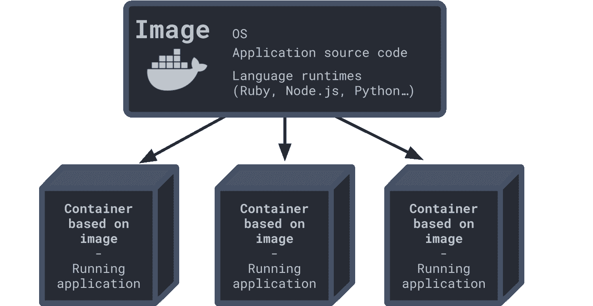
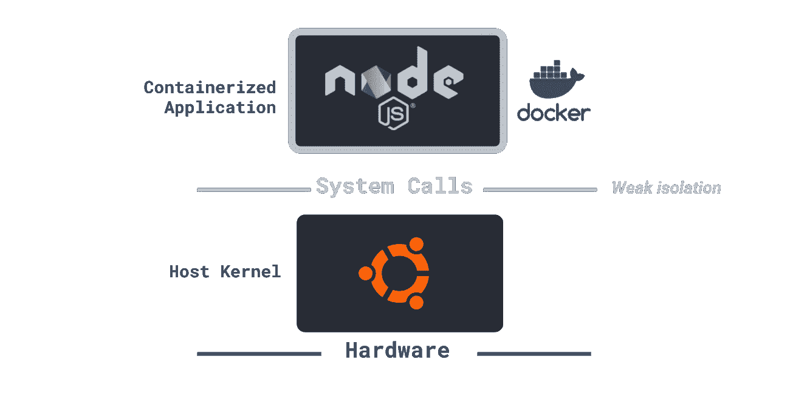
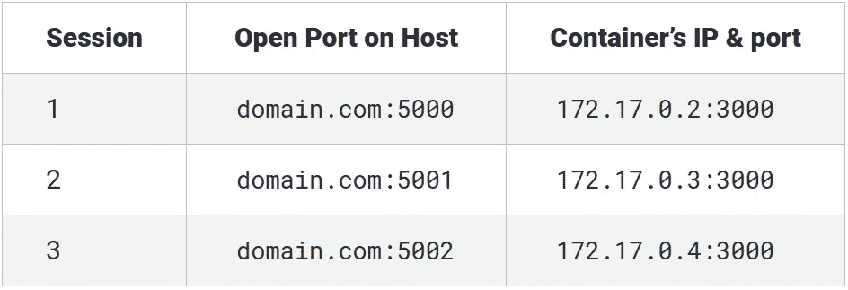
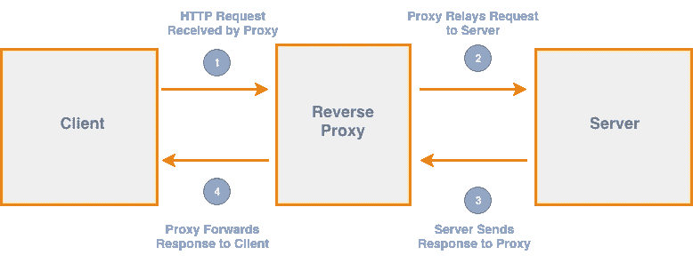
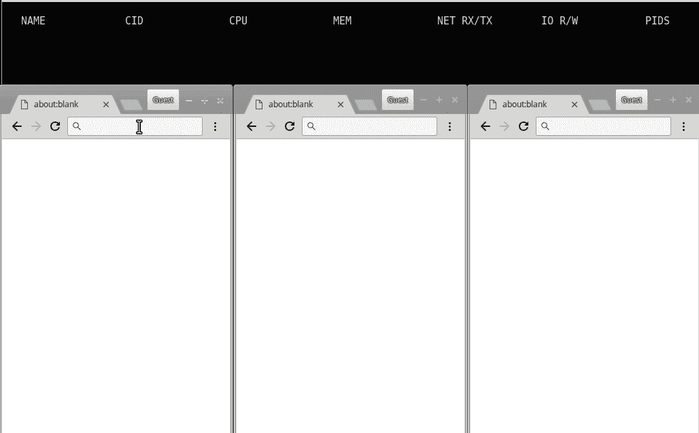

# 建造宇宙飞船:实时合作 REPL

> 原文：<https://medium.com/hackernoon/building-spacecraft-a-real-time-collaborative-repl-deebcf084ed9>

## 使用 Nodejs、Docker 和 WebSockets

[在这里试用飞船](http://repl.space)

[点击此处阅读我们的深入案例研究](https://spacecraft-repl.com/whitepaper)

# 介绍

今天，在浏览器中运行的协作编程环境比以往任何时候都更加流行。它们受欢迎的一个重要原因是它们对于远程技术面试非常有效。有了这些平台，候选人的编程能力可以比仅仅通过电话面试和在计划现场面试之前得到更准确的评估。

此外，拥有这样的环境消除了结对编程所需的任何设置。它迎合了远程开发者能够立即开始结对编程的需求。

目前最大的两个平台是 *Repl.it* 和 *Coderpad.io* 。如果你没注意到的话， *Repl.it* 最近宣布推出*多人*。它使多个用户能够在同一个 IDE 或终端界面上协作。

我们在同一时期建造了宇宙飞船。

航天器是一个浏览器内的 REPL(阅读-评估-打印-循环)，使用户之间的合作。REPL 是一个交互式编程环境。它接受用户输入，对其进行评估，并将结果返回给用户。我们的解决方案是一个使用 Node.js、Docker 和 WebSockets 从头构建的开源替代方案。

这篇文章详述了我们建造宇宙飞船的旅程。它强调了我们面临的挑战，并介绍了我们选择的每种解决方案的利弊。

我们希望到最后，你会知道如何建立自己的协作 REPL。您还将了解构建这样一个系统所涉及的工程概念。

你也可以在这里阅读我们更深入的案例研究。

# 见见团队

在我们开始之前，我们想让你见见飞船背后的三位软件工程师:

我们通过美国各地的合作，远程建造了[宇宙飞船](https://spacecraft-repl.com)。如果您有任何问题，或者对谈论软件工程感兴趣，请随时联系我们:

*   Ying Chyi Gooi — [网站](https://gooi.tech) / [LinkedIn](https://www.linkedin.com/in/ying-chyi-gooi-89ba5095/)
*   朱利叶斯·泽威克— [网站](https://rouxcaesar.github.io/) / [LinkedIn](https://www.linkedin.com/in/julius-zerwick-842000b2/)
*   尼克·约翰逊— [领英](https://www.linkedin.com/in/nick-johnson-6565837a/)

# 建造航天器作为一种开源的选择

我们已经使用了诸如 *Coderpad.io.* 这样的合作结对编程平台，但是我们很好奇是否有任何开源的替代方案。我们也希望找到一个不需要注册的网站，这样用户就可以马上开始编码。令我们惊讶的是，我们什么也没找到。通过构建开源版本，我们鼓励其他人开发和[部署他们自己的](https://github.com/spacecraft-repl/SpaceCraft#deploying-with-heroku)协作 REPL。

## 目标

我们的目标是为用户提供编码语言的选择。我们为他们提供了一个类似终端的 REPL 和文本编辑器来编写和评估他们的代码。我们还希望用户邀请其他人加入他们的会话进行协作。可以想象，构建这样一个系统会带来几个有趣的工程挑战:

1.  构建评估多语言代码的 REPL。
2.  在所有协作用户之间实时同步显示。
3.  防止任何用户输入的恶意代码影响我们的系统。
4.  扩展我们的应用程序以支持多用户会话。

让我们深入每一个挑战，并探索解决它们的方法。

# 建设一个 REPL

建设一个正常运转的 REPL 是我们项目的核心组成部分。我们可以将 REPL 分量分成两部分:

1.  前端终端接口
2.  与 REPL 程序交互的后端机制

## 创建用户界面

对于 REPL 终端，我们利用了 [Xterm.js](https://github.com/xtermjs/xterm.js/) ，这是一个供用户编写代码的浏览器内终端模拟器。对于文本编辑器，我们利用 [CodeMirror](https://codemirror.net/) 来支持语法高亮显示。

The user interface of SpaceCraft. Left: REPL terminal. Right: text editor

当用户点击终端界面中的 *Enter* 或文本编辑器上的 *Run* 按钮时，他们的代码被发送到我们的服务器进行评估。然后，评估输出将被发回并显示在终端上。

通过利用 Xterm.js 和 CodeMirror，我们能够集中精力开发丰富的 REPL 体验。

我们的目标是支持 Ruby、JavaScript 和 Python 的多语言评估。有了用户界面，我们需要弄清楚如何处理用户的输入，并在我们的后端评估它。

## 与 REPL 计划互动

在我们直接进入如何在后端评估用户代码之前，我们需要理解用户与交互式 REPL 控制台的交互是如何工作的。例如，下图显示了当用户运行交互式 Ruby Shell (IRB)或节点 Shell 会话时会发生什么。

Regular interaction between a user and a REPL program via a terminal

上图显示用户输入和输出由终端处理。然后，终端将输入写入 REPL 程序，并从中读取任何评估输出。

然而，对于航天器，由于我们决定完全在远程后端执行代码评估，我们的应用服务器必须能够在没有终端的情况下执行上述操作。

A missing component between our application server and the REPL program

此外，我们还必须考虑与不同语言的 REPLs 交互所带来的复杂性。

我们将探索一些方法来帮助设置我们的应用程序与 REPL 程序进行交互。

## 方法 1:使用该语言的 REPL API 库

例如，Node.js 提供了`repl`模块，可以从应用程序代码中评估 REPL 代码。

然而，使用这种特定于语言的 API 有一个问题。对于支持的每种语言，我们都需要用那种语言重写逻辑。因此，我们需要使用与语言无关的东西来处理各种运行时。

## 方法 2:直接在 REPL 子进程上执行读/写

从本质上来说，REPL 项目只是简单的过程。通过产生 REPL 进程，它解决了必须处理特定于语言的 API 的问题。为此，我们利用了 [Node.js 流](https://medium.freecodecamp.org/node-js-streams-everything-you-need-to-know-c9141306be93#4fc8)。这使我们能够访问 REPL 子流程的标准输入(可写流)和标准输出(可读流)。

我们可以天真地期望，写入 REPL 进程的标准输入将允许执行代码评估。但是，由于输入和输出流的阻塞，输出可能会挂起。

Streams may be blocked when trying to perform read/write operations on the REPL process

这种阻塞的一个可能原因是，`read()`函数的低级实现将挂起，直到新数据被写入相应的输入流:

> 如果某个进程打开管道进行写操作，并且 O_NONBLOCK 被清除，`*read()*`将阻塞调用线程，直到一些数据被写入，或者管道被所有打开管道进行写操作的进程关闭。— [阅读(3) Linux 手册页](https://linux.die.net/man/3/read)

尽管有[技术](http://eyalarubas.com/python-subproc-nonblock.html)来解除读写过程的障碍，但它们并不是所有语言都通用的。因此，这种方法不能为多种语言的代码评估提供良好的可扩展性。

## 方法 3:伪终端

为了解决这些限制，我们决定使用一个*伪终端—* 一个连接到子进程的终端设备。

REPL 程序本质上是面向终端的程序，这意味着它们期望与终端连接和工作。现在的问题是:

> 我们如何使用户能够与远程主机上面向终端的程序进行交互？

In order to handle a remote user’s input and output, we need to address the connection to a terminal-oriented program.

面向终端的程序期望终端处理它的输入和输出。这种操作绕过了由标准输入/输出功能执行的默认块缓冲。此外，这允许为程序生成与终端相关的信号(如 SIGINT)。

A pseudoterminal provides the missing link for creating a connection to our REPL program.

伪终端提供了这个基本的通信通道，这样我们的应用程序和底层的 REPL 程序就可以相互通信。此外，我们还获得了以下好处:

*   允许向 REPL 输入控制序列(如 Ctrl-C ),有效地向运行时发送中断信号
*   捕获 REPL 计划的全部输出(包括颜色)
*   标准化我们的应用程序与不同语言的 REPLs 交互的方式，从而为将来添加更多语言增加可扩展性

使用伪终端的代价是它在我们的应用程序和底层 REPL 程序之间增加了一个处理层。尽管如此，我们还是选择了这种方法，因为它解决了我们的问题，并给我们带来了几个重要的好处。

在我们继续之前，让我们花点时间意识到我们已经走了多远。在旅程的这一部分，航天器团队已经构建了一个在单用户模式下工作的 REPL！它还支持 Ruby、JavaScript 和 Python 等语言的代码评估。

# 实时同步协作用户

支持用户之间的实时协作是我们项目的另一个核心。在我们进入状态同步之前，我们需要考虑我们的网络架构和网络协议。接下来让我们谈谈这些。

## 网络体系结构

我们选择了客户端-服务器架构，在这种架构中，用户连接到中央服务器，而不是客户端直接相互通信的对等架构。我们对此的推理是:

*   集中式服务器提供了单一的授权来源，由同时更新引起的冲突可以很容易地解决
*   更易于扩展，因为所有语言运行时都可以在一个位置管理和运行
*   更容易隔离和包含我们的应用程序，以防止恶意代码影响主机系统

## 网络协议的网络套接字

我们最初开始使用 HTTP 让客户端与我们的服务器通信，但是很快发现了一些问题:

*   每个请求/响应都有很大的开销( [~200 字节](http://www.diva-portal.se/smash/get/diva2:1133465/FULLTEXT01.pdf)的报头有效负载)
*   当客户端为每次按键发送请求时，这种开销就会增加
*   没有简单的方法来自动检测客户端断开连接。

作为解决方案，我们使用 [WebSockets](https://www.ably.io/concepts/websockets) 来解决上面提到的这些问题。WebSockets 的主要特性是它通过单个 TCP 连接在客户机和服务器之间提供双向通信。在建立 TCP 连接的初始 HTTP 握手之后，我们的客户机和服务器将获得以下好处:

*   更低的额外开销 [~每条消息 10 字节](http://www.diva-portal.se/smash/get/diva2:1133465/FULLTEXT01.pdf)
*   我们的服务器随时向客户端传输数据的能力
*   轻松检测用户何时从我们的应用程序断开连接——当没有用户连接时，我们可以拆除应用程序实例
*   允许我们在每台服务器上维护 1024 个或更多的连接，而不是 HTTP 的 6 个连接

A full duplex persistent connection is possible with WebSockets. The connection stays open until either the client or server disconnects. Reference: [WebSockets — A Conceptual Deep-Dive](https://www.ably.io/concepts/websockets)

至于在航天器中实际合并 WebSockets，我们使用了流行的库 [Socket.io](https://socket.io/) 。

## 同步输入

现在我们已经组装好了网络架构，我们需要弄清楚如何在同一个会话中的协作用户之间同步当前的命令行。我们选择在客户端跟踪当前的输入行，以便本地编辑可以立即更新和显示。

我们的同步机制包括以下步骤:

1.  命令行在任何更改之前的状态。
2.  用户按下在前端 REPL 终端中显示的键。该状态在用户的客户端中被更新。
3.  用户的客户端发送一条带有当前输入行和终端提示的消息，通知应用服务器当前行已被更改。
4.  我们的应用服务器向其他客户机广播一条包含当前行的消息。
5.  当其他客户端收到消息时，它们的本地状态会更新为包含当前的输入行。
6.  客户端通过首先清除终端的最后一行来更新它的 UI。由于提示也被删除，它必须在写入当前输入行之前重写提示。

在客户端之间并发更新引起冲突的情况下，我们需要处理它们，以便所有客户端都达到相同的状态。

与任何协作环境一样，并发更新可能会引起冲突。我们需要处理这些冲突，以便每个用户到达相同的状态。

航天器依靠[最终一致性](https://en.wikipedia.org/wiki/Eventual_consistency)来解决冲突。对于我们的文本编辑器，我们使用了 [*Yjs*](https://github.com/y-js/yjs/files/1752526/YjsPaper.pdf) 。Yjs 是一个共享的编辑框架，使用无冲突复制数据类型(CRDT)来解决冲突。

## 同步输出状态

接下来，我们需要为同一个会话中的协作用户同步输出。为了同步输出，我们的应用服务器向当前连接的客户机广播评估输出。输出同步的流程如下:

1.  客户端请求评估一行代码。
2.  我们的应用服务器接收当前代码行。
3.  我们的应用服务器将代码行发送到连接到 REPL 程序的伪终端。
4.  REPL 程序评估代码行，并将适当的输出数据发送到伪终端。
5.  应用服务器从伪终端读取评估输出。
6.  Application server 将输出广播和流式传输到所有连接的客户端。
7.  客户端接收输出并在前端终端上显示它们。

在这一点上，我们有一个 REPL，它不仅能够评估代码，而且还为多个用户提供了实时协作的能力！

# 防止用户输入恶意代码

现在，我们需要考虑防止用户输入的任何潜在恶意代码影响我们的系统和其他用户的挑战。

这个挑战之所以存在，是因为我们用一个伪终端来连接用户，这个伪终端有助于在我们的服务器上执行用户输入。这使得我们和我们的用户面临任何直接提交到我们后端的恶意代码的风险。我们需要想办法保护我们自己和我们的用户。

克服这种风险的一种方法是对照一系列可能的恶意命令，比如`rm -rf /`，对所有用户输入进行检查。然而，这太详尽了，无法确保我们不会错过每一种可能性，而且还会因我们支持的语言的任何特定语言输入而变得复杂。

## 通过容器隔离

我们选择使用[容器](/@spacecraftrepl/a-beginners-guide-to-containers-a5686ab109c2)来隔离每个用户的会话，从而隔离他们的代码。这有助于我们遏制任何恶意代码远离我们的主机系统和其他用户。

通过容器，我们能够为每个用户提供一个隔离的完整的应用程序副本。我们可以有效地将用户彼此分开，轻松地添加安全层来遏制恶意代码，并确保一个容器只使用固定数量的资源。

让我们从我们如何通过容器来细分用户开始。

我们使用 Docker 来创建我们的容器，其中保存了我们应用程序代码的完整副本。这样，我们的会话初始化工作流程如下:

1.  一个新用户向我们的应用程序发出请求。
2.  当我们的服务器收到请求时，一个新的容器基于一个包含我们的应用程序、必需的依赖项和操作系统的映像被创建。
3.  然后，服务器将用户的请求重定向到容器。
4.  然后，用户与作为其会话的容器建立一个活动连接，他们可以开始使用我们的 REPL 进行编码。

通过这种设计，每个用户都有自己的独立环境来编写和评估他们的代码。如果任何用户试图提交恶意代码来破坏我们的应用程序，他们只会影响他们在容器中的应用程序代码副本，而我们的主机系统不会受到影响。

然而，这仅仅是一个开始。容器并不是一个完整的解决方案，因为有很多方法可以打破它们。我们需要添加更多的安全措施来解决这些漏洞。

## 保护容器

Docker 容器的主要问题是，默认情况下，用户被授予 root 访问权限。这使得用户可以完全访问容器中的文件，并能够进行一些真正的恶意活动。

保护我们的容器的第一步是移除默认的根级访问，并防止用户能够执行有害的命令，例如我们的应用程序中的`rm -rf /`。为了实现这一点，我们创建了一个具有受限权限的用户，它将作为容器中任何用户的默认配置文件运行。

还有一个安全问题。容器可以像非容器化的应用程序一样访问系统资源。这允许它们直接对主机内核进行特权系统调用。这意味着成功的特权提升攻击仍然可能导致容器逃逸。一个例子是 [Dirty Cow](https://en.wikipedia.org/wiki/Dirty_COW) (写入时复制)漏洞，该漏洞给予攻击者对只读文件的写入权限，从而给予他们对 root 的访问权限。

Containerization alone provides weak isolation. Source: [gVisor Github](https://github.com/google/gvisor)

为了解决这个问题，我们使用了容器运行时沙箱来提供更强的隔离级别。运行时沙箱通过拦截应用程序系统调用来实现这一点。除此之外，它还采用基于规则的执行来限制应用程序对资源的访问。这样，任何试图调用特权系统的行为都会被拦截，直到它有机会到达我们的主机系统。

我们选择利用谷歌开发的开源容器运行时沙箱 [gVisor](https://github.com/google/gvisor) ，因为它提供了上面提到的安全优势，并与 Docker 很好地集成。

使用容器运行时沙箱的代价是它会显著增加我们的内存消耗。这减少了每台主机可以运行的应用程序实例的最大数量。尽管如此，我们愿意牺牲资源可用性来支持更强大的安全模型。

# 扩展我们的应用程序以支持多用户会话

此时，我们已经成功地构建了我们的协作 REPL，并将我们的应用程序的完整实例隔离到容器中。现在，我们需要评估如何将客户端连接到远程主机上的相关容器，以及允许用户邀请其他人在他们的会话中进行协作。

## 天真的方法:端口转发

每个容器都有一个唯一的 IP 地址和与之关联的端口号，问题是我们如何将用户的会话请求路由到容器并形成连接。我们首先考虑使用端口转发，它从客户端获取初始 HTTP 请求，并将其转发到现成容器的 IP 地址和端口号。

Mapping multiple open ports to container destinations

这种技术很简单，因为它是客户机到容器目的地的直接映射。然而，这带来了一些安全风险。通过运行端口扫描器来探测打开的端口，用户有可能访问任何会话。这将导致我们的用户完全缺乏隐私，他们只希望与他们邀请加入他们会话的人合作。

我们需要一种更好的方法来保护用户的隐私，并屏蔽与容器的连接。谢天谢地，这是通过反向代理实现的。

## 使用反向代理

反向代理背后的想法是，在我们的客户端和服务器之间有一些中间件，充当两者之间的中介。当客户端向我们的服务器发送 HTTP 请求时，反向代理接收该请求，并与我们的服务器通信以获取必要的信息。

服务器将使用容器的 IP 地址和端口号来响应反向代理，然后反向代理将获取这些信息，并将客户端的请求转发到该容器进行连接。因此，我们的反向代理将处理客户端和服务器之间的所有流量。

虽然这听起来像是处理请求和响应的迂回方式，但好处是我们可以抽象出地址和端口的连接，以确保会话的私密性。从客户端的角度来看，它们连接到适当的容器，而不知道它们的 URL 与特定容器的关联。

此外，我们的代理服务器可以为创建的会话分配随机 URL，从而防止其他不需要的用户通过端口嗅探或猜测预先确定的 URL 来访问当前会话。

Mapping multiple randomly generated URLs to container destinations ensures the privacy of sessions.

随着用户群的增长，反向代理不仅解决了我们的隐私问题，还为我们的应用程序提供了更好的可伸缩性。当我们添加更多服务器时，它可以充当负载平衡器，并且它可以提供内容缓存，以减少特定内容在建立客户端-容器连接之外的延迟。

## 会话管理

现在，为了将不同的用户组连接到不同的会话，我们的反向代理服务器还必须负责:

1.  初始化一个会话并启动一个新容器
2.  将请求转发到适当的容器
3.  销毁会话及其关联的容器

由于实现上述特性需要灵活性和定制，我们选择使用 Node.js 从头开始构建反向代理，只有以下基本库可以帮助我们入门:

*   [node-http-proxy](https://github.com/nodejitsu/node-http-proxy) 转发 http 和 WebSocket 请求
*   [Dockerode](https://github.com/apocas/dockerode) ，一个使用容器的 Node.js Docker API

要了解更多关于我们如何实现会话管理特性的信息，请阅读我们案例研究中的[这一节。](https://spacecraft-repl.com/whitepaper#7-session-management)

# 看看它的实际效果

实现了上述所有功能后，以下是我们项目的最终结果:

**The top section displays container metrics.** We run two instances of our application by making requests to our reverse proxy server.

你可以在这里尝试太空船。

# 结论

我们希望您喜欢阅读我们的旅程，就像我们喜欢旅程本身一样！宇宙飞船对我们来说是一次不可思议的经历，我们将继续努力。

如果你对我们在这里讨论的任何主题感兴趣，并想了解更多，请查看我们的[案例研究](https://spacecraft-repl.com/whitepaper)，在那里我们深入探讨了航天器是如何建造的。还有一份我们使用的参考文献列表，您可以查看一下。

最后，如果你有兴趣为航天器做贡献，或者想阅读我们的代码，可以查看一下 [GitHub Repo](https://github.com/spacecraft-repl/SpaceCraft) 。

目前，我们都对全职机会开放。如果您认为我们中的一员非常适合您的团队，请联系我们！

*   Ying Chyi Gooi (NYC) — [网站](https://gooi.tech) / [LinkedIn](https://www.linkedin.com/in/ying-chyi-gooi-89ba5095/)
*   朱利叶斯·泽威克(纽约)——[网站](https://rouxcaesar.github.io/) / [LinkedIn](https://www.linkedin.com/in/julius-zerwick-842000b2/)
*   尼克·约翰逊(旧金山)——[LinkedIn](https://www.linkedin.com/in/nick-johnson-6565837a/)