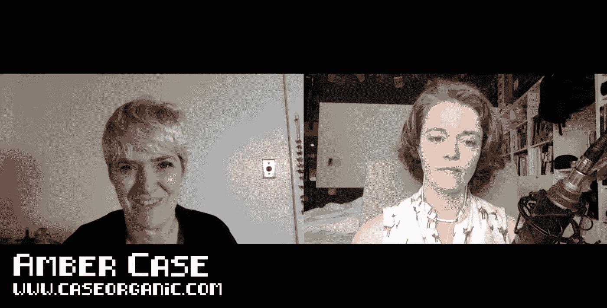

# 用琥珀盒增强人类能力的建筑技术

> 原文：<https://medium.com/hackernoon/building-technology-that-augments-human-abilities-with-amber-case-ddde631a9a67>

# 黑客正午播客第 47 集:采访 Amber Case，cyborg 人类学家，用户体验设计师和麻省理工学院媒体实验室研究员。

《黑客正午》这一集是由 Indeed Prime 赞助的。

访问 https://www.indeed.com/prime/hackernoon[的](http://bit.ly/2Yp2R8e)，翻转求职脚本，立即加入获取简历评论、与技术职业教练的一对一会谈、个性化工作风格评估，甚至帮助达成交易的谈判技巧。

## 在 [iTunes](https://podcasts.apple.com/us/podcast/e47-amber-case/id1436233955?i=1000439957375) 或者[谷歌播客](https://play.google.com/music/m/Dfuna5a4pzsmjr76bxabkxdrhim?t=Product_Iteration_with_Hacker_Noon_Interim_CTO_Dane_Lyons-Hacker_Noon_Podcast)上听采访，或者在 [YouTube](https://youtu.be/MRM1v3B6n80) 上看。

在这一集[中，Cris Beasley](https://hackernoon.com/@crisbeasley) 采访了 [Amber Case](/@caseorganic) ，cyborg 人类学家，用户体验设计师和麻省理工学院媒体实验室研究员。你会发现科技建筑如何增强我们人类的能力

唐娜·哈拉威是《机器人宣言》的作者。她写了一个关于非人类盟友的想法，你会有跨物种的友谊。狗、动物以及手机都可能是你的非人类盟友。再说一次，我们不期望狗的行为像人一样，那么我们为什么期望人工智能也像人一样呢？”

“这是非人类。不管是什么奇怪的物种——那很酷。这基本上是它自己的事。但让我们一起努力，看看会发生什么。”—琥珀盒

 [## E47 -用琥珀盒增强人类能力的建筑技术

### 黑客正午播客第 47 集:采访安柏·凯斯，电子人人类学家，用户体验设计师…

www.podbean.com](https://www.podbean.com/media/share/pb-b3fjc-b2ab08) 

制作和音乐德里克·伯纳德—[haberdasherband.com/production](http://haberdasherband.com/production?fbclid=IwAR2d8t0cNGHRm1ajmUNWKZ-TMUMawREhvIHSy54LKcOElf7v_TOvkAjZ78Y)

主持人:克里斯·比斯利—[https://hackernoon.com/@crisbeasley](https://hackernoon.com/@crisbeasley)

*附:如果你喜欢新的* [*黑客午间播客*](http://podcast.hackernoon.com/) *，可以考虑在 iTunes 上给我们一个 5 星评价。*

## 还可以查看五月份的[头条](https://hackernoon.com/archive/2019/05)、[最新报道](https://hackernoon.com/latest-tech-stories/home)和[今日主页](http://hackernoon.com/)。