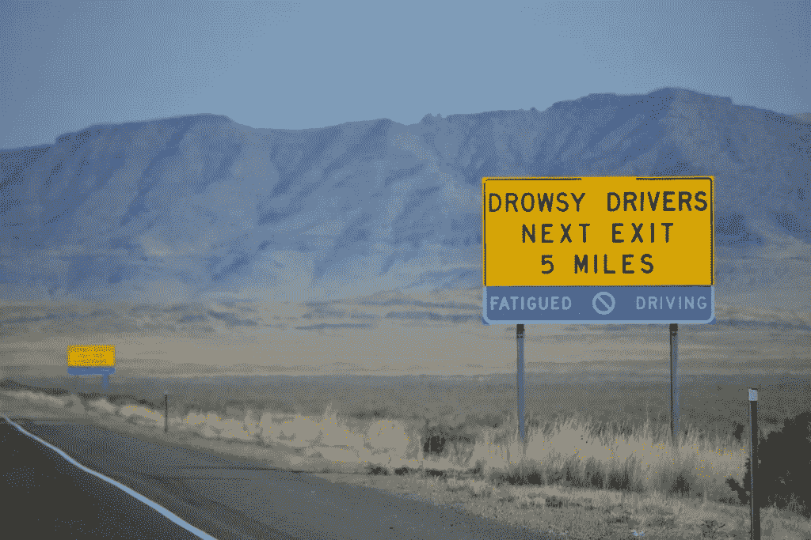
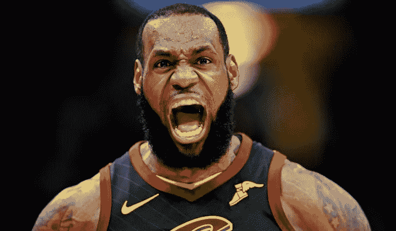

# 称汽车为“自动驾驶”可能会让消费者在驾驶时睡着

> 原文：<https://medium.com/hackernoon/calling-cars-self-driving-may-leave-consumers-asleep-at-the-wheel-53c750a216bc>

Calling a car, “self-driving,” may be the K-car of autonomous vehicle branding, according to a study

技术专家正试图让人们相信自动驾驶汽车是交通领域的下一件大事。但是，对于消费者来说，标有“自动驾驶”或“自动驾驶”的汽车就像漫长、孤独、没有咖啡的中西部州际公路一样令人兴奋。

根据宾夕法尼亚州立大学发表在《科学通讯》上的一项研究，称一辆车为“自动驾驶”实际上会让人们对这辆车不那么兴奋。像“自动驾驶”和“无人驾驶”这样的术语对消费者来说也没什么用。研究人员发现，这些术语甚至会增加消费者对汽车的困惑。例如，“无人驾驶汽车”这个术语，让一些研究参与者认为车上没有司机，但不一定是汽车可以自动驾驶。这对任何人都不会有好结果。

研究人员表示，自动驾驶汽车行业——我希望你没有在那里打瞌睡——可能希望找到一种新的方式来描述自动驾驶汽车，但他们补充说，使用这个术语也可能有助于淡化该技术的宣传。

研究人员写道:“这表明，对于希望让顾客兴奋的公司来说，他们可能想选择一个不同的名字。”“但对于记者或安全倡导者来说，他们希望确保消费者在对新技术的兴奋与对风险的关注之间保持平衡，这个绰号可能会有所帮助。”

为了测试效果，研究人员向 700 多名参与者展示了来自实际自动驾驶汽车公司的真实营销和宣传材料，如丰田、英特尔和优步。

**勒布朗詹姆斯？拒绝。**

研究人员说，名人代言是提高客户兴奋度的旧营销策略，可能也不会将自动驾驶汽车的认知带入 turbo，他们还测试了名人代言对消费者对汽车认知的影响。他们向研究参与者展示了以勒布朗·詹姆斯、马克·库班和尼尔·帕特里克·哈里斯等明星为主角的自动驾驶汽车广告。

整体反应？

咩。

宾夕法尼亚州立大学[唐纳德·P·贝里萨里奥传播学院](https://bellisario.psu.edu)媒体研究副教授、该研究的第一作者杰西卡·迈里克在[新闻发布会](https://news.psu.edu/story/554981/2019/01/18/research/proper-messaging-vital-autonomous-vehicles-technology-emerges)上说:“利用名人只对那些已经真正迷上新技术的人有效。”。“这些名人有效地让我们称之为‘猎奇’的消费者对这些汽车更加兴奋和好奇。”

迈里克强调，一个词就能影响消费者的认知，对于自动驾驶汽车制造商和安全倡导者来说，现在是时候制定精确的术语了。

“你不能等到车辆上路后才突然决定你一直解释的技术不是最好的方式，”迈里克说。“我们的目标是了解在不同类型的媒体和信息曝光下，公众将如何理解这些技术。”

迈里克与宾夕法尼亚州立大学广告-公共关系副教授兼科学传播项目主任 Lee Ahern、贝利萨里奥学院研究生 Ruosi Shao 和 Jeff Conlin 一起参与了这个项目。