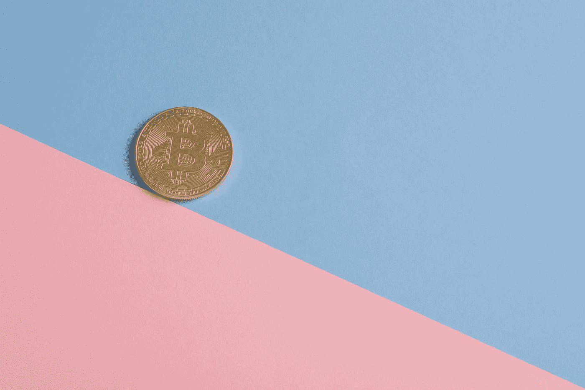

# 区块链能真正帮助贫困社区吗？

> 原文：<https://medium.com/hackernoon/can-blockchain-genuinely-help-impoverished-communities-d1a25b0c79c6>

## 社区货币及其如何帮助贫困社区繁荣发展

掉进加密货币兔子洞是我人生中一个意想不到的转折，它收获了一些意想不到的好处。

其中之一是我无意中获得的关于货币政策和经济学的知识财富。

不管你对区块链和加密货币感兴趣的原因是什么，这种兴趣很可能刺激了很多教育。

一句古老的交易格言是，“永远不要买你不懂的东西”。假设你们大多数人都把这放在心上，这意味着你们大多数人也对区块链概念有很好的理解。

## **我想说的是，我们已经创建了一个庞大的互联网社区，这些人对货币理论和货币概念充满热情——但我们都倾向于展望未来；最前沿。**

> “我们还能在区块链上扔什么？!"

虽然一些人试图找出如何将他们的 2014 款宝马放在区块链上，以获得一些流动性来摆脱汽车贷款，但没有多少人关注最能产生影响的地方:发展中国家。区块链的一些应用可以产生比之前几个月发布的大部分 ICO 更大的影响。这些应用程序的唯一问题是它们不是“性感”的 ICO 或潜在有利可图的项目——所以它们经常被忽视。糟糕的货币系统导致贫困加剧，虽然我不认为 crypto 中的每个人都应该在塑造货币系统方面有发言权，但我确实认为我们应该尽一切努力提高对这些系统当前缺陷的认识。

## **我们应该推动我们的社区专注于创造有影响力的解决方案。**

随着市场的低迷，互联网的加密方面已经变得，嗯，无聊。我已经开始在区块链投资的正常范围之外寻找更多让我感兴趣的项目。最近引起我兴趣的是一个由 Bancor 和一个叫做草根经济学的非盈利组织发起的项目。草根经济学在过去的几年里一直在创造纸币或代金券，分发给肯尼亚的小社区。

Photo by [Benny Jackson](https://unsplash.com/@themightymerlin?utm_source=medium&utm_medium=referral)

在这些小社区中，有大量的商品和服务在他们内部被创造和培养，但是没有足够的纸币在他们的人口中流通来实际支付这些商品和服务。流通供应量太低，但这些人没有资格向政府游说，即使他们可以，增加供应量也可能只会让经济陷入越来越多的麻烦。

草根经济学试图通过引入凭证系统来缓解这种货币停滞，但这也带来了一系列新的问题。很难跟踪整个社区的价值流动，而且当地货币之间也不容易兑换。这使得邻近社区的人们很难相互交换商品和服务:限制了他们的发展潜力。此外，如果不跟踪资金流动和衡量经济的实际规模(在这种情况下，这些小社区经济)，就很难获得关于如何改善其状况的有意义的见解。

这些问题听起来熟悉吗？

他们应该，其中许多可以通过使用区块链缓解。这就是班科尔介入的原因；允许跟踪交易和与邻居交换这些新的数字社区货币的能力。 [Bancor](https://about.bancor.network?utm_source=medium&utm_medium=article&utm_content=community-currencies-hype-or-impact&utm_campaign=blil) 通过引入一个基于区块链的网络和“社区代币”来帮助基层经济学家增强贫困社区的能力，这些代币可以在 Bancor 平台上使用法令或加密进行交易。

## 简单来说；他们将原有的共同体货币数字化，放在区块链上，并使它们可以相互兑换。

虽然我看到的许多乱七八糟的社区外展项目看起来像是在熊市中拼命抓住积极的注意力，但我看到了 Bancor &草根为贫困社区所做的许多真正的价值。除了积极的影响之外，我还喜欢这项举措如何教育新一波加密用户如何使用加密货币——从头开始扩大市场及其用户群。

## 为了消除误会…

我写这篇文章不是为了给 Bancor 一个回报的鼓励。回馈不是我们首先应该寻求的荣誉。

我写这封信是希望你们当中一些无聊的密码爱好者会看到这一点，并理解你可以很好地利用你的时间和围绕区块链技术的知识(尽管市场条件)，即使是一点点的诚意和努力也可以带来巨大的积极变化。

— — — — — — — —