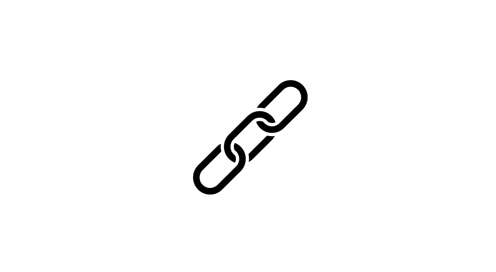

# 中心化的业务可以实现区块链属性吗？

> 原文：<https://medium.com/hackernoon/can-centralised-businesses-implement-blockchain-properties-c0f15b50b780>

一个集中化的公司在不实际使用区块链的情况下，能有多接近拥有区块链属性(无许可、不可变、抵制审查等)？

Let there be chains

我们已经看到 Ripple 和 TRON 宣布投资 1 亿美元进入区块链游戏领域。利息和资本都在这里。集中化的现任者将如何应对？如果开发者和玩家都想拥有一个支持区块链的世界，他们可以使用大量正在开发的协议。但是，如果现任者决定在保持其中心地位的同时合并类似区块链的资产会怎么样呢？在区块链的技术和法律能力范围内，集中的现任者不能做什么？这些现任者能在不使用区块链的情况下获得同样的好处吗？在这篇文章中，我将比较 Steam 的集中式[点对点游戏项目市场](https://support.steampowered.com/kb_article.php?ref=2178-QGJV-0708)与区块链的游戏资产市场(如 RareBits 和 OpenSea)的特性，并讨论集中式公司如何在不使用区块链的情况下成为区块链。

注意:这里的很多讨论都是探索性的。仅仅因为一家公司可以分散某个特定的组件，并不意味着它会成为最引人注目的业务用例或最有财务意义的。

# 动机

我想知道，集中化的实体将如何应对他们业务中感知到的区块链风险。如果分散的基础设施提供 xyz 的属性，那么集中的现任者会用 xyz 的属性来响应吗？消费者是想要 Snapchat，还是仅仅想要短暂的视频，所以 Instagram stories 是一个替代选择——虽然不完全一样，但也足够接近。对于区块链来说，这也是集中化公司可以做的吗？

# 集中化公司

就本文的目的而言，我将把重点放在基于集中式云的公司上，这些公司都是闭源和追求利润的。更具体地说，我的分析只适用于以下公司:

*   不要创建任何人都可以免费部署和运行的软件(即他们不是自由/开源软件公司)
*   服务需要网络连接(如基于云的服务)
*   通过广告、出售订阅(SaaS)或收费来赚钱

Valve 创建了 Steam，这是一个基于云的集中市场，用于销售物品。交换的最流行的游戏项目或数字资产之一是游戏 CSGO 的皮肤。目前，Steam marketplace 的盈利方式是从每笔交易中抽取一部分，包括新皮肤的销售和玩家之间的皮肤交易。Steam 垄断了市场，玩家不通过 Steam 交易皮肤没有其他方法。

一个支持区块链的平台首先需要游戏物品存在于区块链上，想想以太坊的 Cryptokitties 吧。构建在其上的平台，如 OpenSea 或 Rarebits，既提供了 UI，也提供了拍卖和交易机制。虽然这两个市场是托管的，但是也有可能有像 OpenBazaar 这样的自托管市场。

# 区块链属性

区块链是一个抵制审查、不可改变和无许可的账本。这三个属性反映了该系统的高级属性。它们是分布式共识机制、应用密码术和网络激励的表现。我们将会看到，这些特性并不是区块链独有的。

**抵制审查**——实体审查网络上的个人是昂贵的。

**不可变** —状态仅追加。先前的状态不能被覆盖[3]

**无权限** —任何人都可以运行网络。

*   这意味着代码是开源的
*   任何人都可以进入网络

## 微观属性

*   可验证的执行/状态转换规则—对于区块链如何从状态 A 转换到状态 B，存在加密实施的规则
*   维护网络的激励措施——对那些在电脑上运行网络的人有激励措施
*   容错—系统很难关闭
*   数据主权—用户可以控制自己的数据

**集中式实体可以具备这些属性吗？**

# 集中化的公司能做什么

在这里，我们深入探讨了集中化公司可以采取的潜在措施，以拥有更多区块链地产。

**抵制审查/匿名**

从伪匿名到零知识证明，构建具有不同隐私级别的系统是可能的。一个交易所实现了一个零知识系统，在这个系统中，物品可以转手，而对于外部观察者来说，他们不知道交易的是什么手，交易的金额是多少。即使交易可以匿名，游戏仍然能够识别用户拥有什么物品，因为这些资产必须呈现给玩家(尽管可能有一个聪明的方案，但情况并非如此)。注:如果系统中有资金流动，匿名是一个敏感的话题。

**不可变**

区块链是不可改变的，这意味着一旦国家对区块链作出承诺，就不能再改变。公司可以用前一天晚上的散列来散列他们每晚的数据快照，并在公共场所发布结果，如 [OpenTimestamps](https://opentimestamps.org/) 或报纸。然后为任何用户创建工具来验证数据的完整性。

早在 1992 年，Bellcore Labs 就对他们的[研究人员](https://www.anf.es/pdf/Haber_Stornetta.pdf)的工作进行了哈希处理，并将哈希结果发布在 [NYT 日报上。Steam 可以为他们的所有客户及其项目余额创建一个数据结构，并在区块链和/或多个公共来源中发布散列。](https://archive.nytimes.com/www.nytimes.com/library/tech/99/01/cyber/articles/10notary.html)

**可验证的数据**

为什么要相信一个平台，一个进程真的是随机的，或者只有 100 个这样的特殊项目存在，当它可以用密码术来完成的时候。不确定的日子将一去不复返。

**可验证的执行/智能合同**

尽管传统的业务逻辑不符合区块链意义上的[智能合约的加密保证](https://firstmonday.org/article/view/548/469)。有没有可能在一个中央集权的公司中实现类似的功能。与可验证数据类似，可以构建系统来验证状态转换是否发生，以及输出是否确定和正确。用户可以验证交易已经完成，他的帐户中有一个新项目。如果公司想变得有趣，他们可以使用诸如李嘉图合同这样的工具，它将传统的法律合同统一到加密合同中。

**运营网络/社区治理的激励措施**

区块链允许网络维护者(矿工)和令牌持有者对协议的未来做出管理决策。一些协议允许这些利益相关者改变参数，如通货膨胀率或接受新的协议更新。集权公司以股东的形式进行治理。他们不一定是最终用户，可能有相互竞争的利益。为了避免这种情况，平台可以尝试一种合作模式，在这种模式下，所有玩家都是所有者。

**容错**

尽管 51%对区块链的攻击确实发生了，但是对于最安全的链来说，这些攻击是极其昂贵的，并且在实践中很少发生。即使发生了攻击，只要用户在这段时间内没有进行交易，他们就不必担心交易被重放。集中式系统可以被设计成非常容错的方式，使得通过黑客攻击或正常的服务器故障使它们瘫痪变得非常困难。

**数据主权**

用户提交给区块链的任何数据，她都可以提取。即使在隐私区块链上，只要他保持他的查看键，历史交易就可以被私下查看。集中化的公司也可以做同样的事情，建立工具让用户提取他们自己的数据。虽然这通常不是出于慈善目的，但像 [GDPR 第 20 条:数据可移植权](https://gdpr.algolia.com/gdpr-article-20)这样的法规迫使公司允许用户导出他们的数据。

# 集权公司不能做什么？

技术可以极大地推动公司模仿区块链的特性。然而，当涉及到法律套利和分叉能力时，这只能带我们到此为止。技术或许能够消除一些法律顾虑，但能否消除所有法律顾虑还有待观察。

**合法套利**

虽然公司可以通过设立子公司和在不同的司法管辖区注册来进行各种形式的合法套利，但公司可以参与的范围是有法律限制的。例如，不存在合法的谋杀市场。即使该公司运行隐私保护基础设施，并且不知道他们的服务器内部正在运行什么(可能使用可信的执行环境)，停止和终止也会停止他们的操作。因为有一个单一的目标要追求，中央集权的公司很难逃避当局。在最好的情况下，公司可以声称对其技术的使用进行合理的否认。[但是区块链不用](http://www.arijuels.com/wp-content/uploads/2013/09/Gyges.pdf)。如果开发商不经营网络，就很难追究他们。Steam 不得不取缔他们的 API，因为他们发现了促进未成年人赌博的第三方平台。而分散的市场没有能力审查他们的匿名用户。

**无权限运行**

几乎所有的云公司都有在内部或云中运行的集中式基础设施。试着举出一家让用户运行核心基础设施的集中化公司。是的，应用程序通常会在本地运行人工智能模型，但这不是核心基础设施。这些公司必须拥有自己的基础设施，以保持对流向它们的所有数据的控制。大多数市场都有评论系统，这些评论是为买家策划的。精确排序不仅仅是按时间排序，而是按质量、相关性和删除欺诈性评论排序。这需要的不仅仅是对产品 A 的审查，而是从 A 到 Z，检测所有产品的模式。也许联邦机器学习的创新将在未来改变这一点，但在那之前这是不可能的。这是一个困扰 P2P 市场的问题。例如，OpenBazaar 在搜索和评论方面没有最好的监管层，也没有个性化。他们将如何有效地抵御像 Steam 这样的集中式平台发生的“评论轰炸”？简而言之，没有快速的解决方案。

**分叉能力**

因为集中化的公司不能让外人来运营核心基础设施，所以这些公司不能被分割。没有人能在一夜之间决定他们不喜欢 Valve 的服务条款，并不仅将他们的历史，而且将其他人的历史迁移到该平台的分叉版本。即使市场的代码是开源的，数据仍然会丢失，而这可能是最有价值的部分。相比之下，在一个分散的市场中，任何人都可以在任何时候分支整个网络。

尽管实际上这可能是集中化公司的优势，因为它们是不可预测的，没有用户体验的分配和不同派系之间的政治冲突。

**永久互操作性(通过 API)**

分散式协议让我兴奋的是它们的无许可性质，任何人都可以建立在网络之上，不会受到审查。在另一个平台上构建最大的恐惧是 API 访问的中断。恐怖故事比比皆是，Zynga 依靠脸书的用户群起家，当他们的独家关系结束时，Zynga 首先倒下了。Twitter 对第三方应用也做了同样的事情，[切断了事件流](https://www.theverge.com/2018/5/16/17362138/twitter-api-third-party-apps-changes-explained)。 [LinkedIn too](https://www.theverge.com/2018/5/16/17362138/twitter-api-third-party-apps-changes-explained) 。为什么开发人员应该相信他们构建的平台是仁慈的，为什么他们应该相信平台不会任意改变他们的 API，甚至更糟的是切断访问？也许法律合同可能是一种权宜之计，但囤积数据的动力太强了，一家公司获得的数据越多，算法越好，推荐就越有粘性，为什么要分享呢？

# 激励

尽管一家集中化的公司可以做很多事情来获得更多的区块链资产，但它们的动机是什么？如果拿 Valve 这样的公司来说，更开放(除了监管干预)的倒逼因素是什么？

*   提供可证明的稀缺性增加了对平台的信任
*   通过让其他开发者在他们的基础设施上构建，它免费有效地增加了他们的分布。
*   认为他们的平台更加开放，这增加了信任
*   拥有拥有强大品牌的区块链房产是一种很好的营销方式

# 集中化的优势

或许，采用区块链资产的集中化现有企业，会让它们领先于只在区块链上市的竞争对手。与区块链独有的公司不同，这些平台在个性化和内容监管方面将有更好的用户体验。平台知道玩家是谁，他们想看什么，而不是必须看到所有可以购买或交易的物品。而不是区块链市场提供的未经删节的数据。

# 集中化的优势

我猜想未来将会是分散协议和集中接口之间的一个愉快的媒介。尽管 Steam 100%垄断了皮肤市场，但如果所有的数字资产都是基于一个开放的协议发行的，并且围绕转让和费用的规则都被编码在资产中，那会怎么样呢？Steam 作为原始资产发行者，可以从每一笔交易中分得一杯羹，从而增加收入。他们可以运营一个集中的以用户为中心的数据监管层，提供比其他平台更好的 UX，并为此收费。还会有其他市场。Cryptokitties 有自己的拍卖接口，但小猫主人可以通过 0x 之类的协议或 OpenSea 和 Rarebits 之类的 DApps 进行交易。不仅增加了消费者的选择，而且增加了分销。

# 集中式在位者 vs 区块链新贵

*   Valve vs Forte
*   Ticketmaster vs Tari
*   亚马逊 vs OpenBazaar(分布式技术，不是区块链·珀赛)
*   推特 vs 乳齿象(分布式技术，不是区块链·珀赛)

只有时间能告诉我们，开发商是想建立在区块链协议的基础上，还是想使用拥有类似区块链地产的集中化公司。但事实上，集中化的公司可以非常接近区块链，这应该让区块链的竞争对手感到担忧。我预计，我们将最终看到两个世界最终融合在一起的未来，分散的协议和集中的实体在它们之上运行，它们甚至可能是以前的现任者。

**脚注**

[1]销售数字皮肤的成本为零，分销成本为零，交易费用也为零。尽管人们担心系统膨胀并抑制公开市场上的价格。

[2]在这种情况下，托管服务意味着用户只需尝试一个 URL 就可以访问网络。这与自托管服务形成鲜明对比，在自托管服务中，用户必须下载与网络交互的软件，要求用户在线等。

[3]实际上，区块链并不像他们所说那样一成不变。有些攻击可以导致链的重组，但是在工作证明系统中进行这些攻击的成本往往非常高。