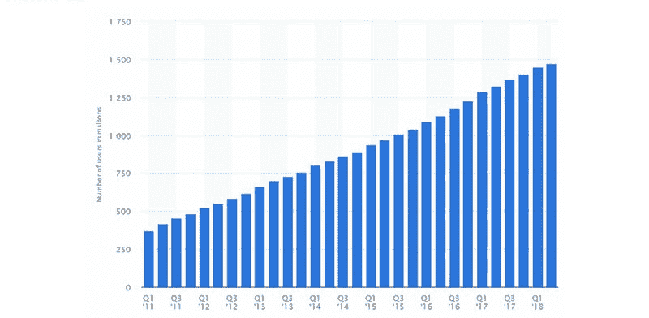
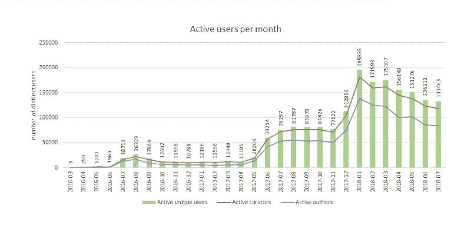
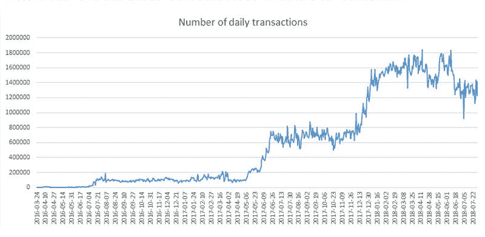

# 脸书的“赋予人民权力”使命能通过区块链完成吗？

> 原文：<https://medium.com/hackernoon/can-facebooks-give-people-the-power-mission-be-accomplished-through-the-blockchain-2294f06ea95d>

当你最后一次尝试在任何网络服务上注册时，你可能会在某个地方看到一个“用脸书登录”的按钮。这个小细节比任何统计数据都更好地强调了这个社交网络在现代信息空间中的巨大影响力。脸书的用户群几乎占世界人口的四分之一，长期以来，它一直被称为“社交网络之王”

看着区块链科技的崛起，马克·扎克伯格最近写了一篇关于“分散力量，让更多的权力掌握在人们手中”的文章

请记住，脸书使命的前四个字一直是“赋予人民权力”这是否意味着脸书将转向去中心化的方向，或者它将永远保持区块链社交网络世界的中心化遗迹？

# 分散社交网络:我们现在在哪里？

有没有可能将去中心化应用到社交网络中？许多平台的目标是取代脸书、Instagram 或 YouTube，因为它们试图提供集中式网络所缺乏的东西:安全性，以及获得奖励和为上传内容付费的可能性。

[https://steemit.com/steem/@steemitblog/1-000-000-steem-accounts](https://steemit.com/steem/@steemitblog/1-000-000-steem-accounts)

在积极的项目中，我们可以挑选出以下几个:

*   [斯蒂米特](https://steemit.com/)。最受欢迎的分散式内容创建网络。这是一个博客平台，非常类似于 Reddit 或 Medium.com，主要区别在于 Steemit 用户因被投票支持而获得 Steem 代币。向上投票者还会收到代币，支付额取决于每日活跃用户的数量——用户越多，支付额越少。根据官方统计，该网络拥有超过 6 万名日活跃用户的[。](https://cryptocoinspy.com/steem-announces-1-millionth-account-and-more-daily-traffic-than-all-other-blockchains-combined/)
*   [螺栓](https://www.bolt.global/)。一个分散的内容创建平台，使用现有的移动内容平台构建。其独特之处在于，它面向的是带宽较低的新兴市场，这些市场受到技术难题的制约，但仍渴望消费新内容。除了他们的[原创内容](https://www.youtube.com/watch?v=y6dhnh6GDtE)，每个人都可以为网络做出贡献，成为内容创作者，并获得 BOLT tokens 奖励。与此同时，用户被激励使用相同的令牌支付流媒体服务，从而在 BOLT 生态系统内保持健康的经济。目前，他们已经与探索频道、半岛电视台、公民电视台、亚洲新闻频道合作，最近一次与[国际板球理事会](/bolt-global/unlimited-sixers-for-the-next-6-billion-the-icc-cricket-world-cup-2019-on-bolt-3206a7d5875b)合作，授予他们 2019 年板球世界杯的转播权。
*   [Contentos](https://www.contentos.io/subject/home/dist/dapp.html#/?dt=0) 。视频和音乐的分散内容平台，类似于 YouTube，但不受任何实体控制。用户上传视频会获得奖励。该平台已经启动并运行。这个项目得到了币安实验室、近地天体和星云的支持。
*   [REOS](https://reos.me/) 。一个内容符号化的平台，每个人都可以不受限制地分享、喜欢和评论任何内容。内容令牌化允许像任何其他加密货币一样交易内容。该平台还包括一个用于许可和验证内容的系统。联想是它的合作伙伴之一。

# 脸书统治

那么，区块链革命呢？脸书害怕来自分散的弟弟们的竞争，这值得吗？

让我们来看看脸书和斯蒂米特用户数量的动态，作为项目“去中心化家族”的最大代表。

脸书每月活跃用户数(百万)。数据:[statista.com](https://www.statista.com/statistics/264810/number-of-monthly-active-facebook-users-worldwide/)

每月活跃的 Steemit 用户。数据:[steemit.com](https://steemit.com/statistics/@arcange/steemit-statistics-20180730-en)

这个简单的参数清楚地显示了两个平台之间受众规模的惊人差异。虽然脸书每月有大约 15 亿独立活跃用户，但 Steemit 只能拥有大约 15 万用户。这里的差异是令人印象深刻的，看着它，人们可以很容易地理解这将是一件多么困难的事情把“脸书国王”从它的宝座上。

我再举一个例子来说明这两个平台上用户参与度的巨大差异。根据同一个 Steemit 的统计，反映 Steemit 网络上用户总活跃度的平台每天交易总数超过百万。

Steemit 平台上的每日交易次数。数据:[steemit.com](https://steemit.com/statistics/@arcange/steemit-statistics-20180730-en)

这是一个巨大的数字吗？如果我们考虑到一天中的每一分钟(！)脸书用户推赞了大约[400 万条帖子。](http://wersm.com/how-much-data-is-generated-every-minute-on-social-media/)

因此，脸书是一个庞然大物，而像 Steemit 这样的分散式项目是打算杀死它的小渔船。

造成如此巨大差异的原因是什么？围绕社交媒体的区块链项目有机会吗？

# 马太效应:赢家通吃

首要原因与脸书的内部优势无关。它甚至与分散解决方案的问题无关。我坚信 facebook 优先的主要原因是它似乎是第一个进入社交网络市场的。

马克·扎克伯格是[第一个应用发展中的互联网技术创建大学社交网络的人，因此显然成为满足周围需求的先驱。上线一年后，脸书的用户已经超过 600 万。](https://en.wikipedia.org/wiki/History_of_Facebook)

由于一个好的想法，这种快速上升是可能的，但随后正反馈循环开始生效。跟随领导者的平台必须征服人们的注意力，而脸书之所以获得这种关注，只是因为新的潜在用户首先听说了它。因此，网络越大，发展越快。这被称为[马太效应](https://en.wikipedia.org/wiki/Matthew_effect)，或者赢家通吃模式。“这种现象得名于《圣经》中的一段引文:

我告诉你们，凡有的，还要加给他。没有的，连他所有的也要夺过来。」

— [卢克](https://en.wikipedia.org/wiki/Gospel_of_Luke) 19:26， [RSV](https://en.wikipedia.org/wiki/Revised_Standard_Version) 。

新用户不会从一些假设的列表中选择不同的平台，他们只是从朋友那里听说了脸书并加入了这个网络。在科学文献中，这种效应被称为[“优先依附](https://en.wikipedia.org/wiki/Preferential_attachment)”

如今，较小的平台发现自己正在迎头赶上，不得不与获胜的平台争夺观众的注意力。

应该知道,[林迪效应](https://en.wikipedia.org/wiki/Lindy_effect)对脸书也有效，随着时间的推移只会加强它的领导地位。

# 分散社交网络的问题

这不仅仅是因为脸书是社交网络市场的第一名，而且全球有近四分之一的人在使用它。这是关于分散平台的一般概念。看看比特币——这是一个安全和去中心化网络的标准，但在它的内部有着显著影响事件进程的整合过程(例如，比特大陆今天控制着超过 40%的网络哈希表[。有理由相信，这种过程在所有分散的系统中都是常见的。](https://bitcoinmagazine.com/articles/bitmain-nears-51-network-hash-rate-why-matters-and-why-it-doesnt/)

正如《连线》杂志所说，“现实是，大多数人不想运行自己的网络服务器或社交网络节点。他们希望通过更友好的平台参与网络，而这些平台将受到今天推动整合的同样力量的制约。”

# 安全问题

在与安全有关的问题上，分散解决方案比集中解决方案更有优势，这一问题是有争议的。一方面，如果脸书权力下放，最新的脸书数据泄露事件可能会避免。管理网络的单个服务器或一组服务器的缺乏极大地增加了系统对攻击的抵抗力，除非区块链代码有漏洞(最近[发现](https://cointelegraph.com/news/bitcoin-core-update-fixes-vulnerability-that-reportedly-could-crash-network-for-80-000)关键漏洞没有被根除，即使是在比特币代码中)。

如果围绕脸书数据泄露的丑闻继续下去，人们迟早会转向自己个人信息的安全问题。如果去中心化的平台证明自己在这方面是完美的，它可以成为观众移动的额外激励。然而，[要实现真正的分权](https://decentralize.today/the-ugly-truth-behind-steemit-1a525f5e156)并不容易。

# 需要做些什么？

尽管分权的总体理念可能会吸引一些人，但在自己的战场上很难与脸书直接竞争。它深深地融入了普通互联网用户的生活，成为互联网上许多网站的数字标识。它拥有与任何对手竞争的所有必要资源，普通观众购买去中心化的想法还为时过早。

与此同时，在这个星球上的一些地区，脸书仍然没有渗透——比如新兴市场。当仍有未开发的利基市场时，试图从脸书这块馅饼上切下一块有什么意义呢？超过 20 亿互联网用户生活在新兴市场，这对任何项目来说都是一个巨大的受众群体。这就是新的去中心化社交网络，如之前提到的 BOLT，能够成功的地方。

主要重点应该是为发展中国家的用户提供访问社交网络和新内容的机会，而这些国家通常技术过时，带宽低，并且通常财务状况不佳。这些是应该解决的问题。BOLT 试图通过削减订阅付费流程的成本来解决这些问题，为低带宽用户提供一种新的视频格式，并为这些地区的内容创作者提供一种因其贡献而获得奖励的方式。有了这个解决方案，以前无法接触娱乐内容、新闻和体育的用户现在可以访问这些内容，这可能是赢得这些市场的一个很好的卖点。

# 结论

与行业领导者相比，我们还没有看到分散式社交网络的受欢迎程度出现爆炸性增长。也许关键因素是我们加入社交网络是出于其他原因:脸书是因为我们的朋友在那里，Reddit 是因为它很有趣，LinkedIn 是因为我们可以找到新的职业联系人……只有少数人加入社交网络是出于技术原因，例如，为了去中心化。

社交媒体市场如此巨大，去中心化的项目肯定会在其中找到一席之地，但前面还有很长的路要走。新兴市场是开始增长的好地方。如果任何分散的项目能够利用区块链的优势，满足这些地区用户的需求，他们将有机会成为该领域的领导者。

## 关于作者:

基里尔·希洛夫——geek forge . io 和 Howtotoken.com 的创始人。采访全球 10，000 名顶尖专家，他们揭示了通往技术奇点的道路上最大的问题。加入我的**# 10k QA challenge:**[geek forge 公式](https://formula.geekforge.io/)。