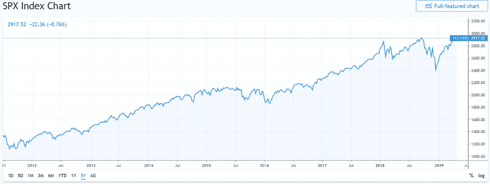

# 一块牛排能重振整个行业吗？

> 原文：<https://medium.com/hackernoon/can-one-steak-revive-the-whole-industry-df5c17f207d1>

自 2018 年初以来，绝大多数有影响力的经济学家都预测股市将不可避免地崩盘。他们中的许多人被一条著名的规则所驱使:“上升的必然下降”。不幸的是，人们习惯于低估不确定性，因此不应该相信任何关于未来的预测。有人曾开玩笑说，“经济学家的存在是为了让天气预报员好看。”

交易者或投资者应该学会的第一件事是时刻准备着惊喜。有些人可能会认为所有的预测都实现了，提到 2018 年道琼斯指数下跌 5.6%，标准普尔 500 指数下跌 6.2%，纳斯达克指数下跌 4%。的确，今年是自 2008 年以来股市表现最糟糕的一年，也是过去十年道指和标普 500 指数连续第二年下跌。但人们也不应该忘记，自今年秋天以来，标准普尔 500 多次打破了几个历史高点…

然而，专家和金融“大师”们一直在说，危机即将到来。从理论上讲，他们可能是对的，因为 T2 目前的经济扩张和股市上涨(直到最近)已经持续了很长时间。此外，看起来全球和国内事件的结合正开始说服华尔街，现在是时候了。

1.川普与中国的[贸易战](https://www.vox.com/2018/10/9/17955106/imf-economy-trump-trade-war-growth)正引发各种担忧，从其对美国农民的[影响](https://www.vox.com/policy-and-politics/2018/11/27/18114566/trump-trade-war-china-farm-bankruptcy)到其提高消费者价格的[潜力](https://www.vox.com/policy-and-politics/2018/11/29/18117792/trump-china-tariffs-xi-g20-trade-war)到其对中国和美国的经济影响。

2.欧洲的经济增长已经放缓，预计明年中国的经济增长也会放缓。

3.英国退出欧盟的戏剧性事件也引起了连锁反应，正如[来自美联储的信号](https://www.vox.com/policy-and-politics/2018/11/28/18116652/trump-fed-jay-powell)它将继续提高利率，潜在地抑制了股票市场和经济。

4.在美国，来自共和党税收法案的[财政刺激](https://www.vox.com/policy-and-politics/2018/12/3/18118225/republican-tax-cut-bill-economic-stimulus)，加上政府支出的增加，很可能很快就会耗尽。国会预算办公室估计，2018 年 GDP 增长率将为 3.1%，2019 年将降至 2.4%。然后，它预计从 2020 年到 2022 年，GDP 增长将放缓至每年 1.6%，从 2023 年到 2028 年，每年 1.7%。

乍一看，有人可能会说，IPO 市场证实了全球经济走下坡路的想法。根据[普华永道跟踪数据](https://www.pwc.com/us/en/services/deals/capital-markets-watch-quarterly.html)，2019 年第一季度美国 IPO 市场定价 30 宗 IPO，融资 76 亿美元，略低于 Q1 过去五年 35 宗 IPO 融资 90 亿美元的平均水平。这一下降主要是由于 1 月份政府关闭持续了 3 周，加上围绕贸易、英国退出欧盟和领先经济指标放缓的政策辩论所导致的更广泛的投资者不确定性，这可能会降低未来的 GDP 增长。

我们甚至还记得最近 Lyft IPO 的失败，当时这只高高在上的股票在纳斯达克上市仅一天后就暴跌了。更准确地说，仅仅几天后，Lyft 的每股价格就跌破了该公司 3 月 28 日首次公开发行时设定的 72 美元。目前，它的交易价格为每股 61-62 美元，比 83 美元的历史高点低了近 25%。

这种极端下降的原因可能在于 [Lyft 的](https://www.tradingview.com/symbols/NASDAQ-LYFT/)报告称，2018 年亏损 9.11 亿美元，比上一年多 32%。尽管在同一时期其收入翻了一番，达到 22 亿美元，这使得投资者重新思考他们对该公司未来增长前景的看法。

看起来一切都很清楚:恐惧、缺乏稳定性和高波动性只能对即将到来的金融危机发出警告。然而，意想不到的事情发生了——Beyond Meat 突然出现在市场上，其股价翻了一倍多。

据[路透社](https://www.reuters.com/article/us-beyondmeat-ipo/beyond-meats-share-price-more-than-doubles-in-vegan-burger-makers-ipo-idUSKCN1S81P4)报道，该股开盘报 46 美元，远高于其 25 美元的 IPO 价格。股票在开始交易几分钟后飙升，由于波动性而暂停交易。在收盘于 65.75 美元之前，他们在一天内交易高达 72 美元。

Beyond Meat 曾警告称可能永远不会盈利，收盘时的市值约为 38 亿美元，这是基于包括承销商期权在内的已发行股票。

接下来的问题是，这是一次性的事情，还是大型银行、对冲基金和私人投资者渴望新的有利可图的机会？当然，这个问题没有办法定论，只有时间会告诉我们真相。