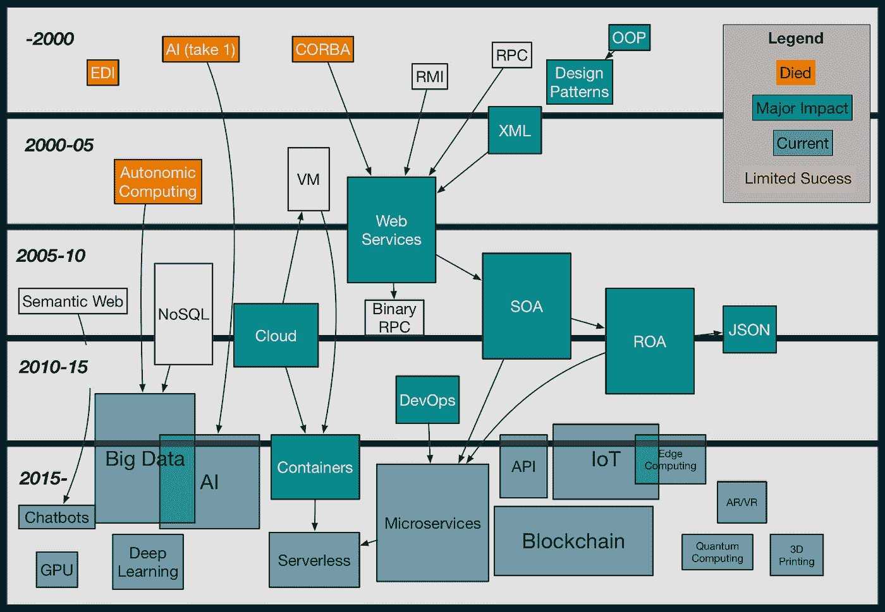
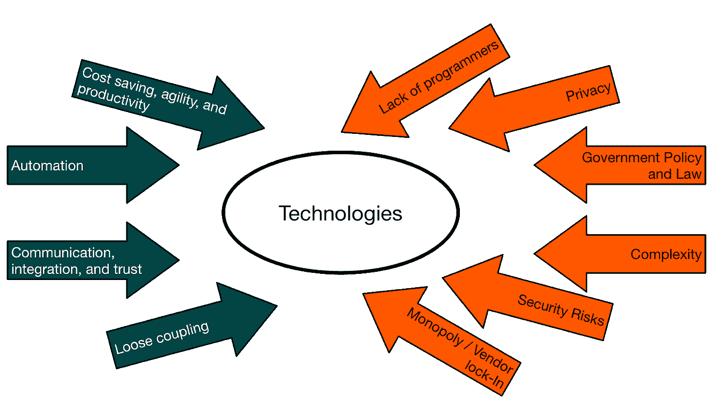

# 催化剂、抑制剂和变压器:塑造技术的十大主导力量

> 原文：<https://medium.com/hackernoon/catalysts-inhibitors-and-transformers-ten-governing-forces-shaping-technology-57a793bfbf0>

新兴技术塑造了技术格局。他们创造新的细分市场，如自动驾驶汽车，摧毁现有的细分市场，如 GPS 追踪器，并改造一些细分市场，如汽车。柯达、诺基亚、百科全书布列塔尼卡和 Sun 等公司的命运生动地证明，新兴技术可以成就组织，也可以毁灭组织。为了生存，组织需要识别、利用、有时塑造新兴技术。具有讽刺意味的是，就像在战争中一样，一个组织所能做的最糟糕的事情就是停滞不前，犹豫不决，什么都不做。

新兴技术的出现引起了轰动，通常伴随着承诺改变世界、巨大财富和解决世界饥饿的大肆宣传，因此很难错过它们。不幸的是，判断他们的命运要困难得多。

下图描绘了过去几十年的新兴技术及其命运。

不幸的是，所有这些炒作既不总是有影响，也不兑现他们的承诺。有些不相关；有些人死了，有些人只是活了下来。然而，有些人把自己很好地融入了这个世界，隐藏在平凡的视线中。早期发现其中一个，塑造它，并拥有它是每个企业家的梦想。

因此，组织和从业者必须仔细选择，考虑长远，决定后，果断行动。

这是一个令我们着迷的问题。在构建“[新兴技术分析画布(ETAC)](https://github.com/wso2/ETAC/blob/master/ETAC.md) ”这一旨在分析新兴技术的框架时，我们考察了许多新兴技术、它们的特征以及它们的影响。我们看到了许多决定新兴技术命运的因素。我们在它们中间看到了原则，一套塑造、推动或抑制它们的力量。这些力量代表了人类的长期愿望和恐惧，通过技术的应用，包括他们的成功和失败。

在研究了许多新兴技术及其命运之后，在比较、对比和分析了原因和结果之后，我们确定了十种力量。让我们讨论一下这些力。

有四种积极力量和六种消极力量，前者帮助新兴技术，而后者居于新兴技术。

让我们探索每一种力量。

## 积极的

*   *财务收益、敏捷性和生产力* —利润是组织的关键目标之一，财务收益无需多加解释。生产率也转化为成本节约。敏捷性提供了竞争优势，进而可以转化为成本节约或更多利润。
*   *自动化*——正如在人工智能领域广泛讨论的那样，人力成本持续上升，自动化用软件或机器人取代了这些成本。
*   *沟通、整合和信任* —在构建系统时，我们面临的主要挑战是分散在世界各地的分布式信息和分布式决策者。一些信息存储在非数字媒体或人类记忆中。有些决定是由人类做出的。通信(例如 Web 服务、EDI、XML)、集成(例如 ESB)、信任(例如区块链)和人类交互相关技术的改进增强了我们构建连接分布式信息和决策者的系统的能力。
*   实体之间的松散耦合——系统不是孤立存在的。他们服务的世界在进化，系统也必须进化。系统各部分之间的耦合越紧密，随着时间的推移，系统的进化就越困难。因此，我们已经看到一波又一波的新兴技术(例如，通过 SOA、通过消息传递、通过微服务、通过 API Economy)试图改善我们系统的松散耦合特性。

## 否定的；消极的；负面的；负的

*   缺少程序员——计算机无法理解人类，需要精确的指令。在这个问题解决之前，给计算机编程和维护这些程序需要训练有素的人来预测计算机会如何出错。寻找程序员是大多数技术面临的关键挑战。例如，大数据技术的采用受到缺乏数据科学家的限制。
*   隐私——现代人类文明建立在个人的理念之上。因此，我们对隐私很敏感，这是一种控制自己信息的能力。许多新兴技术(如人工智能、大数据、物联网、云)与隐私相互作用，这仍然是塑造技术的主要力量。
*   政府政策和法律——正如在 GDPR 看到的那样，政府有权力通过监管、禁止或帮助新兴技术来塑造这些技术。
*   复杂性——科学致力于创造简单的模型来驯服世界的复杂性。复杂性是系统的敌人，使系统变得脆弱、昂贵，有时甚至失败。固有的复杂性抑制了新兴技术。例如，罗杰斯的五个因素直接分析了采用率，将复杂性确定为一个因素，甚至两个因素可试验性和可观察性是与复杂性相关的扩展。另一方面，如果技术能够降低预先存在的复杂性，它们就具有显著的优势。
*   安全问题——安全是人类的基本需求，恐惧通常被认为是人类最强烈的情绪之一。举个例子，*《马斯洛需求层次论》*把安全放在基础。如果技术引起了安全问题，它们将面临激烈的摩擦，而减少安全问题的技术有着天然的吸引力。
*   垄断/供应商锁定—我们都听说过这样的故事:一个组织在扼杀或收买竞争对手的同时获得市场，计划接管市场，然后在降低质量和客户服务的同时提高价格。最近的历史显示了许多垄断，但这种退化并不常见。尽管对垄断的担忧起了作用，但这很可能是十种力量中最弱的一种。举个例子，尽管存在垄断和厂商锁定的担忧，云还是成功了。

有时，如果一种新兴技术可以减少负面力量的影响，即使是负面力量也可以成为正面力量。例如，区块链在隐私和安全方面得到了帮助，而区块链则减少了这些问题。

以上十种力量为审视新兴技术提供了一个强有力的视角。举个例子，用它们作为一个清单来思考一项新兴技术，可以显著增加我们对这项技术的理解。

希望这有用。如果你喜欢这篇文章，你可能也会喜欢“[新兴技术分析画布(ETAC)](https://github.com/wso2/ETAC/blob/master/ETAC.md) ”和“[无服务器分析”](https://github.com/wso2/ETAC/blob/master/outlooks/serverless_outlook.md)。我们感谢您通过评论或 [Github 问题](https://github.com/wso2/ETAC/issues)提出的想法和反馈。