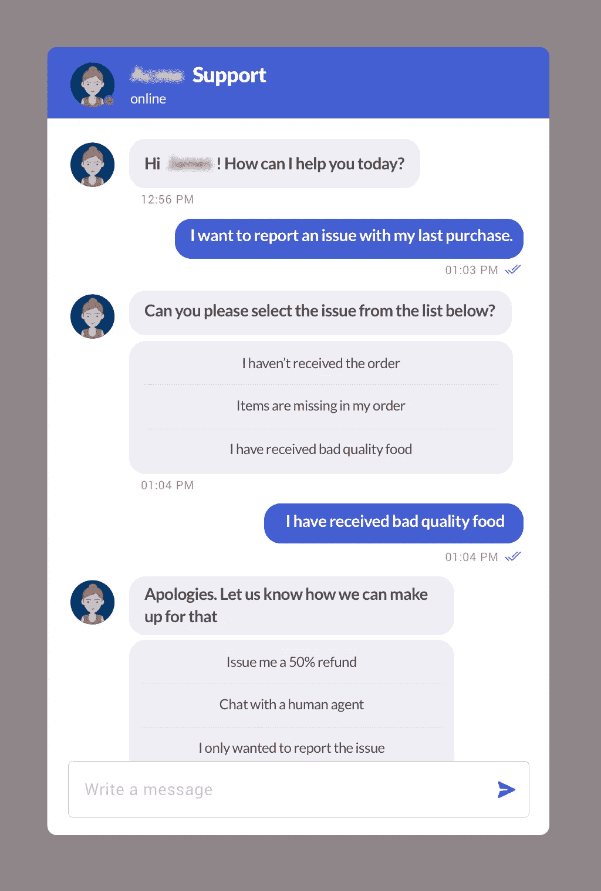
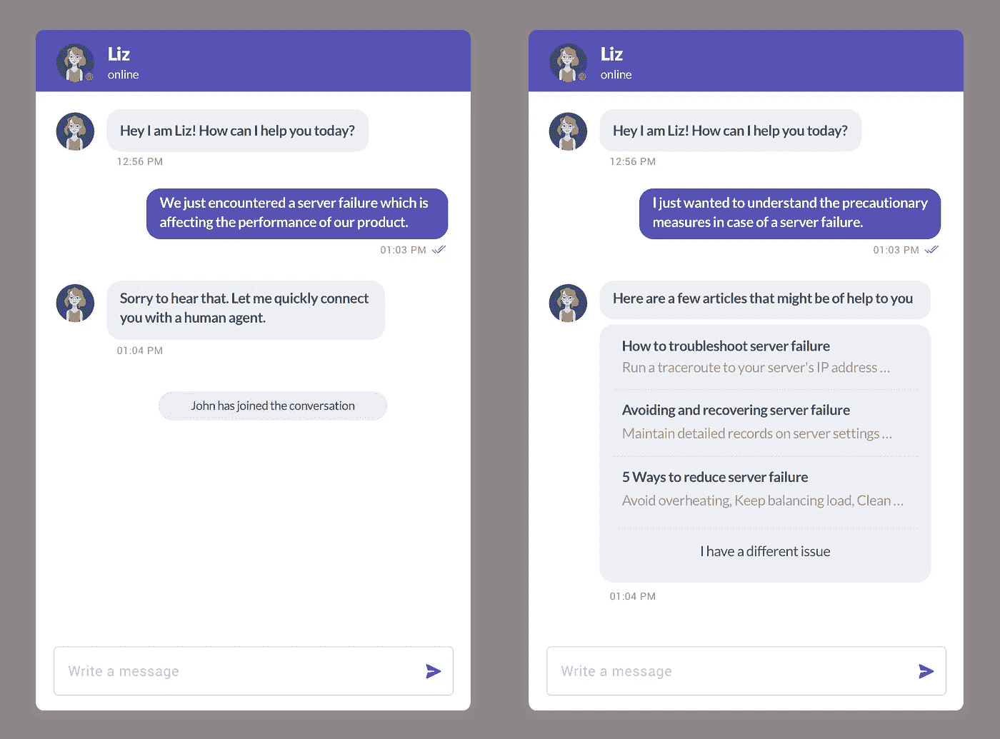
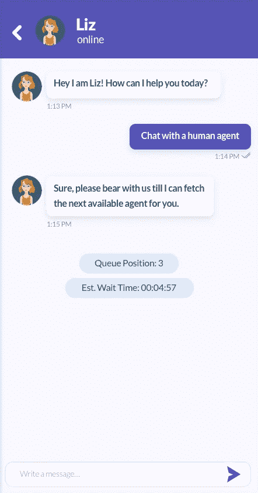
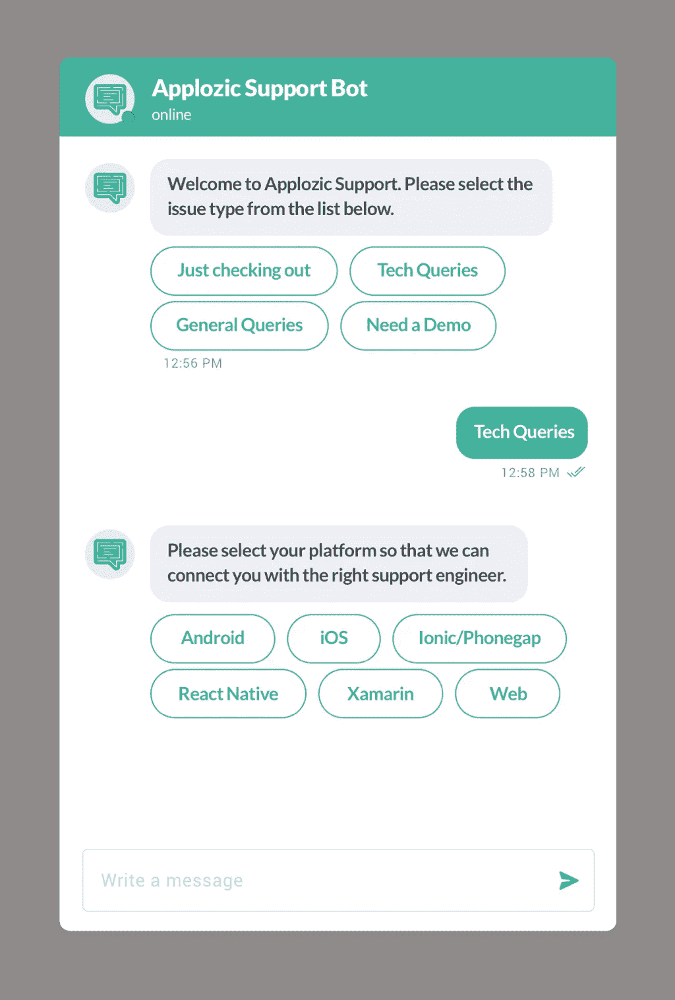

# 聊天机器人人工交接:混合解决方案中的无缝人工接管

> 原文：<https://medium.com/hackernoon/chatbot-human-handoff-seamless-human-takeover-in-a-hybrid-solution-18f3be6f0bcf>

聊天机器人和实时代理的共存一直是一个有争议的话题。为了解决这个问题，最近我们采访了 13 位聊天机器人专家，他们的发现显然支持机器人+人类的混合模式。

专家认为，尽管 AI & NLP 有所进步，但聊天机器人仍然非常原始。它们的智能取决于它们被编程的程度。所以机器人会有犯错的时候。这就是需要人类代理的同理心和智能的地方。

因此，在[机器人+人类混合解决方案](https://www.kommunicate.io/)中，聊天机器人是你的第一道防线，当这道防线被突破时，人类代理人就会发挥作用。现在，对于像我们这样的混合解决方案，确保用户体验到从机器人到人工代理的平稳过渡变得至关重要。

没有得到正确的平衡会让你的用户沮丧，当赌注很高时，这可能意味着厄运。

为了保护您的用户免受这种情况的影响，系统应该知道何时将对话移交给代理。

# 应该触发人工接管机器人的场景:

# 1)复杂性:

如前所述，聊天机器人的智能取决于它们被编程的程度。所以会有用户查询超出聊天机器人范围的情况。

所以在这样的情况下，谈话应该交给人类代理人。因此，机器人必须足够聪明，知道自己能力的极限，并提出替代方案。这是大多数聊天机器人失败的地方。你经常会发现机器人在问同样的问题，即使在多次无法理解意图之后。

你更喜欢和这些机器人中的哪一个聊天？我推测第二个是当它失败时，它提供了切换到人类代理的选项。

# 2)用户偏好:

从用户驱动的菜单启动聊天机器人人工切换可能是最简单和最安全的技术。为此，您可以对您的机器人进行编程，在每条消息后为用户提供一个预定义选项的菜单。

每个菜单通常都有一组机器人可以独立处理的任务，以及一个“与代理聊天”的附加选项。这种移交不需要人工智能或自然语言处理，只要选择了“与代理聊天”选项，机器人就会将控制转移给人类代理。

这里的缺点是，有时用户会希望与代理聊天，询问本可以由机器人处理的问题。因此，拥有一个机器人来解放代理人的时间进行复杂查询的基本目的是徒劳的。

# 3)基于用户情绪:

自然语言理解和情感分析使得聊天机器人足够聪明，可以推断用户的情绪。这有助于了解对话是否朝着正确的方向发展。

因此，每当聊天机器人感觉到用户感到沮丧时，它可以简单地将“与人类代理聊天”作为一个选项。如果终端用户认为聊天机器人无法解决他的问题，他可以选择该选项。

# 4)问题的关键程度:

并非所有的支持问题都同样重要，因此应该相应地处理。最好的方法是训练机器人根据对话中的商业术语理解情况的危急程度。

例如，请看下图:

在这两种情况下，触发关键字都是“服务器故障”。在第一种情况下，用户仅仅想要关于在服务器故障的情况下的预防措施的信息，而在第二种情况下，用户想要报告服务器故障的发生。

聊天机器人通过提供上下文答案来处理第一种情况是有意义的，但在第二种情况下，最好是交给人类代理。智能机器人将能够区分这两种情况，并采取相应的行动。

# 5)管理员/代理监管:

即使是最有经验的支持代理也经常需要第二意见，你的聊天机器人也不例外。因此，允许人类代理人监控聊天机器人的对话是有意义的。对于复杂的问题。这种协作对于技术故障排除非常有用。

例如，考虑一个场景，其中用户已经联系了一家电子公司的支持台来报告设备的故障。先进的机器学习模型有助于机器人破坏可能的原因，并提出最佳解决方案。然而，在向客户建议之前，与人工代理进行交叉检查是有意义的。

在这种情况下，只要可信度低，聊天机器人就可以向人工代理寻求指导和授权的内部监控系统会非常有用。代理只需查看建议的解决方案，然后点击按钮就可以开始了。因此，机器人仍然在做大部分的工作，但最终的权力仍然属于人类代理。

# 完善聊天机器人人类交接时刻:

前面的部分有一些场景，其中帮助台机器人需要将支持票交给人工代理。这就把我们带到了下一个问题，**“机器人应该如何处理这种转变？”**。

对于用户的整体体验来说，无缝切换非常重要。请记住，当用户联系您的支持人员时，他可能已经感到沮丧了，您不想再增加这种沮丧。

为了更好地理解如何将聊天机器人固定到人工交接过程中，让我们将其分为 3 个阶段，并讨论每个阶段的最佳实践:

# 预切换阶段:

这是出现上述任何一种情况的第一阶段，机器人需要将控制权转移给人类代理。

这个阶段包括两个要素:

**切换触发:**正如在第一部分中简要讨论的，机器人需要了解其能力的限制。每当用户查询超出机器人的范围时，应该激活切换触发器，机器人应该为用户提供“与人工代理聊天”的选项。

呈现此选项的最佳实践是通过一个可操作的按钮，用户只需单击它就可以连接到一个人工代理。

另一种方式是，机器人询问用户是否愿意连接到人类代理，然后根据他的响应来连接。

**致谢:**让用户了解正在发生的转变也很重要。这将设置一个预期，即在移交过程中，票证是未分配的，在此期间发送的问题只有在分配代理后才会得到回答。

# 等待阶段:

这是将支持票证放入队列的中间阶段。在这个阶段，管理用户期望非常重要，因为等待时间可能会很长。

一个好的做法是显示用户在队列中的位置，并在这段时间内用一个默认的响应来回答所有进来的问题，比如“在队列中等待”。另一个有用的特性是，当等待时间比预期的长时，向用户提供一个选项来确认他们是否愿意“等待”或提交电子邮件问题。

在等待阶段要考虑的另一个方面是指定如何将代理分配给等待的用户。通常有两种方法来处理这个问题:

**先进先出(循环法):**这是一个相当简单的模型，队列中的第一张票被分配给下一个可用的代理，也就是说，票是按照提交的顺序分配的。

**上下文分配:**这种分配涉及复杂的逻辑，根据上下文因素分配代理。这些因素可以是任何东西，例如用户的地理或语言。在 [Applozic](https://www.applozic.com/) ，我们将查询的性质作为一个因素，即基于平台类型(Android、iOS、web 等..)我们将其分配给合适的支持工程师。

# 移交后阶段:

聊天机器人人工交接过程的最后阶段是人工代理最终接管机器人的对话。这一阶段是三个阶段中最容易被忽略的，因此在设计切换流程时也容易被忽略。

理解这一点很重要，当代理人刚刚加入对话时，用户已经在那里很久了，并且已经共享了很多信息。因此，用户不会愿意再次经历相同的过程并回答重复的问题。

一个设计良好的移交流程可以确保机器人与代理共享整个对话文本。这可以在代理的聊天窗口中以文本消息的形式完成，也可以通过电子邮件作为附件发送。我们推荐前者，因为它更实时。

仅仅有一个适当的流程来有效地处理聊天机器人人工交接是不够的。同样重要的是，要有一个反馈回路，以确定任何改进的范围，将人的参与降到最低。

# 追溯到原点:

分析任何问题的第一步是追根溯源。在机器人-人类交接的情况下，这是用户请求人类代理的点。因此，能够追踪每个求助电话，追溯到它发生的对话步骤，会非常有帮助。

它将帮助您寻找趋势，以了解可能的原因。也许有些问题机器人无法回答，或者有些答案让用户难以理解。另一个可能的原因是，用户在找到想要的解决方案之前可能不得不经历太多的对话点。深入分析可以帮你揭开很多这样的原因。

这些发现将帮助你改进聊天机器人的对话设计。这将有助于减少用户需要人工代理的频率。毕竟，这不就是建立一个机器人的原因吗？

# 通信中的聊天机器人人工切换；

有两种分配方法，如上面的**等待阶段**最佳实践一节所述。您可以使用 Kommunicate 来启用这两者。

下面的代码示例显示了与 Kommunicate 集成的 Dialogflow 机器人的聊天机器人人工切换方法

1.  在 Dialogflow 中设置操作 input.unknown。如果启用了默认回退意图，Dialogflow 会自动添加此操作作为响应。这意味着每当触发回退意图时，会话将被分配给代理。这将根据您首选的对话路由设置来完成。
2.  当检测到意图时，将对话分配给座席。将下面的 json 设置为 Dialogflow 中的自定义有效负载。在 KM_ASSIGN_TO 参数中指定代理的电子邮件 id。如果 KM_ASSIGN_TO 参数为空，将应用对话路由规则。

Bot-Human Handoff

更多详情[此处](https://docs.kommunicate.io/docs/web-conversation-assignment#bot-to-human-handoff)。

*原载于 2019 年 2 月 11 日*[*www . komunicate . io*](https://www.kommunicate.io/blog/chatbot-human-handoff/)*。*