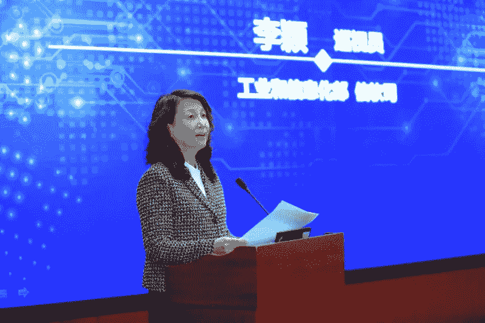
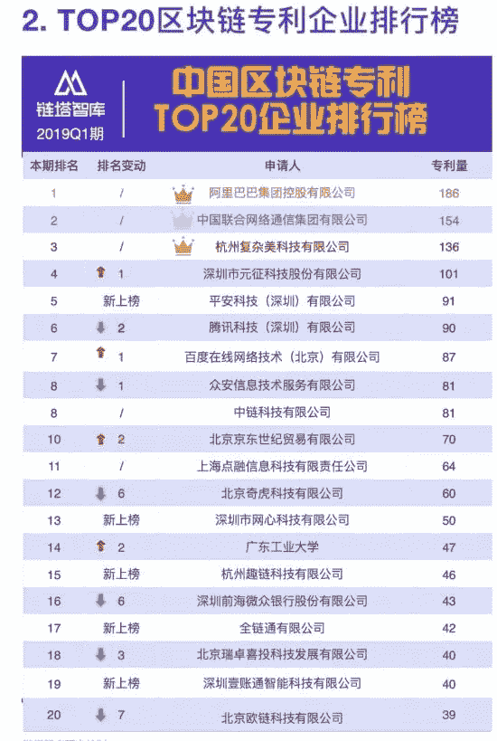
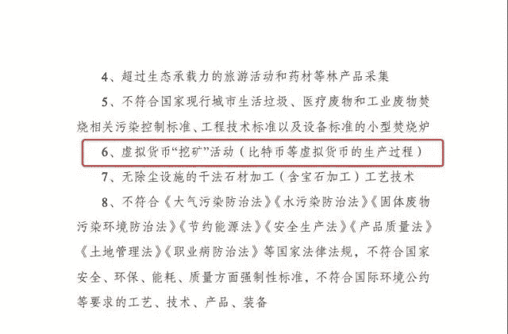
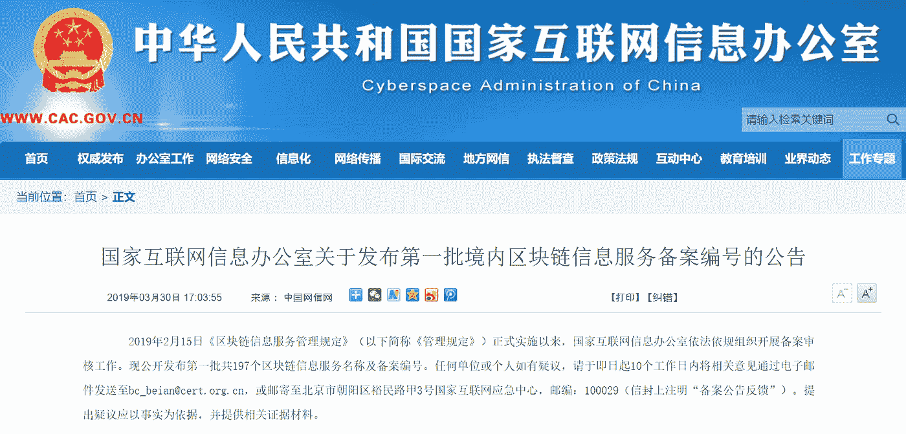

# 中国监管机构:“数字经济的新引擎是区块链，而不是采矿。”

> 原文：<https://medium.com/hackernoon/china-regulators-new-engine-of-digital-economy-is-blockchain-not-mining-65b731ae049c>

[4 月 9 日，中国中央政府和国有公司的高级官员在北京举行了“2019 区块链技术和数据治理高峰论坛”](http://www.enicn.com/meet/2019/0411/44222.html)。

最近一段时间，在 mainland China 总是有很多与区块链/密码相关的会议和活动，但与其他会议相比，这次会议有点不同。

中国中央政府的管理部门之一，工业和信息化部主持了会议，并领导了关于区块链和中国数字经济的讨论。

[http://www.enicn.com/meet/2019/0411/44222.html](http://www.enicn.com/meet/2019/0411/44222.html)

[工业和信息化部(MIIT)执行委员会主任之一的李颖参加了论坛，并提到了中国政府和 MIIT 在未来将关注区块链和该行业的 4 个亮点；](http://www.enicn.com/meet/2019/0411/44222.html)

1.继续 R&D 对区块链技术和行业本身的趋势。

2.加强技术能力，支持区块链的核心技术。

3.为区块链工业建立一个官方基线。

4.继续推动区块链技术在工业互联网平台中的创新应用。

事后得出的结论是，我们需要关注的最关键的一点是:

认识到区块链的趋势和技术力量，中国政府将把他们的精力投入到 R&D 地区，以确保技术力量和建立区块链的标准体系。
此外，为了防止来自中国政府的“非法”筹款，如 ICO、STO 或 IEO，相关的地方部门和协会将实施一定的控制，即使它没有法律权力或执行力。

许多人都有疑问，中国政府是否执行了这些规定并对区块链工业进行 R&D，或者这只是说说而已？

Graphic by Amy Kang

据区块链知名数据提供商 Blockdata 统计，[约 263 个区块链相关项目来自中国，约占全球分布的 25%。令人惊讶的是，中国遥遥领先。](http://www.chinaz.com/2019/0412/1008350.shtml)

Left)Blockchain patent ranking for 2018, RIght) Blockchain patent ranking for 2019 Q1 [http://www.chinaz.com/2019/0412/1008350.shtml](http://www.chinaz.com/2019/0412/1008350.shtml)

[4 月 12 日，中国国家知识产权局报告称，中国区块链专利数量达到 4351 项，2019 年第一季度](http://www.chinaz.com/2019/0412/1008350.shtml)注册专利约 2041 项。其中，阿里巴巴继去年之后仍位居第一，其专利数量是 2018 年底的两倍多(阿里巴巴在 2018 年获得了 90 项区块链专利)。此外，中国的大公司，如大型保险公司平安和中国的 IT 巨头腾讯都在前十名之列。

中国政府已经知道，数字经济和金融的核心将是区块链和 DLT，因此地方政府一直在中央政府的指导下“清理”其区块链产业和生态系统。它又快又安静。

Graphic by Amy Kang

总的来说，大多数受到行政撤职处分的目标是采矿公司，这些公司似乎对政府的计划没有多大帮助，而且浪费了大量的国家资源，如电力。

比特大陆是中国第一代矿业公司，也是区块链和【】crypto 的领导者，他面临着一个巨大的财务问题，并正式宣布由汪海超取代其首席执行官，其 IPO 申请已经到期。他们已经为赴港上市准备了一年，但由于中国内地的严格监管和对采矿设备的低需求，他们成为区块链和密码行业首家 IPO 公司的梦想刚刚破灭。

[不久后，中国中央政府于 4 月 8 日宣布，中国国家发展和改革委员会发布了《2019 年产业结构调整指导目录》，将该地下采矿公司列入“淘汰的浪费和危险活动”。](http://www.cac.gov.cn/1124305122_15539349948111n.pdf)

[put the crypto mining company in the “wasteful and hazardous activities slated for elimination”](http://www.cac.gov.cn/1124305122_15539349948111n.pdf): [http://www.cac.gov.cn/1124305122_15539349948111n.pdf](http://www.cac.gov.cn/1124305122_15539349948111n.pdf)

区块链最大的矿业公司和世界上最大的密码产业已经停止了，政府领导的区块链企业项目在他们的保护下发展很快。

[3 月 30 日，据国家互联网信息局消息，自 2 月 15 日起，共有 197 家区块链信息服务企业及其注册号根据《区块链信息服务管理条例》首次公布。](http://www.cac.gov.cn/2019-03/30/c_1124305122.htm)

CAC’s announcement about the [Block Chain Information Service Management Regulations](http://www.cac.gov.cn/2019-03/30/c_1124305122.htm): [http://www.cac.gov.cn/2019-03/30/c_1124305122.htm](http://www.cac.gov.cn/2019-03/30/c_1124305122.htm)

在榜单中，我们不难看到阿里巴巴和 VeChain 的蚂蚁金服、腾讯、万向集团、百度等行业大佬。

根据这份公告，该名单上的公司和项目将受到监管机构的监督，并指出这并不意味着该公司的产品或服务得到许可或授权。

中国中央政府越来越试图通过政府权力控制的方式将区块链工业掌握在自己手中。

通过中央银行和政府机构，他们倾向于组织一个“混乱”的区块链产业和生态系统，政府支持并试图主要与内地的全球企业建立产业。此外，他们倾向于禁止所有与他们无法控制的加密和数字资产相关的行为。

我们一直很好奇一件事:“中国政府什么时候会承认 Crypto 并授权交换？”

没人知道。我目前的看法是，没有办法预测政府的调控，如果我们找到政府无法跟踪的利基，这是可能的，但这也是不可持续的。

2019 年第一季度已经过去了。

**第二、第三季度中国会有什么样的态度？**