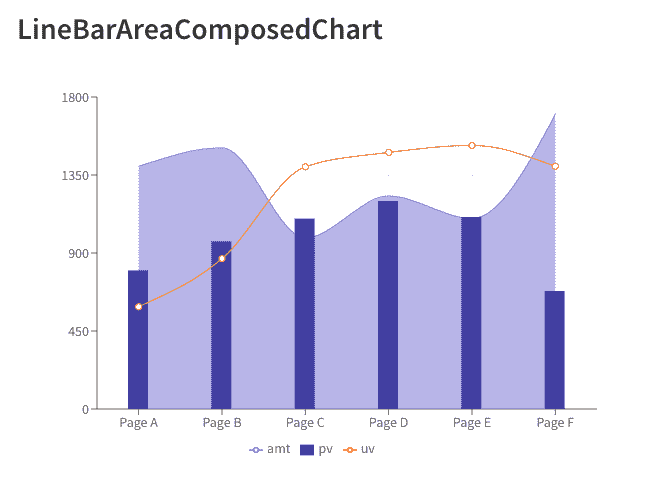
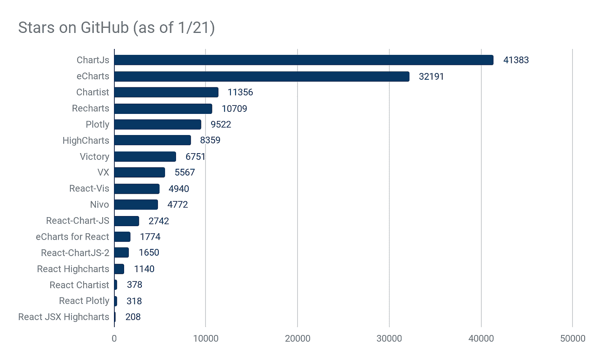
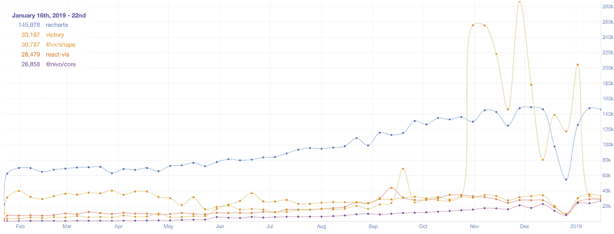

# 为 React 选择数据可视化库

> 原文：<https://medium.com/hackernoon/choosing-a-data-visualization-library-for-react-444263a41f98>

在我苹果职业生涯的早期，我学到了很多关于制造产品的知识。我接触到了世界一流的制造流程，这些流程使苹果能够按时保质地交付硬件产品，并在后来将自己转变为世界上最有价值的公司。

我在苹果的经历也教会了我如何将制造优化背后的原则应用于软件工程和架构设计。

软件开发继续趋向于可重用和可互操作的组件，而不是为一切定制工程。就像优化制造业的流程一样，选择正确的框架和库是快速、高效开发的关键。

如果您正在构建一个具有数据可视化的应用程序，那么您必须做出的早期决定是使用 D3 还是 React 图表库。

如果您不熟悉 D3，它是一个 Javascript 库，通过操纵 SVG 和 HTML 提供了构建数据可视化的必要构件。它已经成为最受欢迎的可重用数据可视化库的支柱，如 ChartJS、eCharts、C3、NVD3 和 Plotly，这些库使生成基于 D3 的图表变得更容易，同时编写的代码更少。这些库中的大多数都有一个包装器库，用于流行的框架，如 Ember、React、Vue 或 Angular。

如果你想尽量减少编写自定义代码和时间，我建议使用 React 图表库，而不是在 D3 中创建自己的图表。

但是，在您决定使用现有的图表库之后，投入时间和精力开发新的图表库的决定可能会让人难以承受。你从哪里开始？

React 是一个相对较新的生态系统，它的图表库选项可能比 Javascript 要少，这可能会让你觉得有点受限。作为起点，我建议您查看这些特定于 React 的库:

*   [充值](http://recharts.org/en-US/)
*   [胜利](https://formidable.com/open-source/victory/)
*   [反作用](https://uber.github.io/react-vis/)
*   [Nivo](https://nivo.rocks/)
*   [VX](https://vx-demo.now.sh/)

也有一些很棒的包装器，比如 [react-chartjs-2](http://jerairrest.github.io/react-chartjs-2/) 和 [React Highcharts](https://github.com/kirjs/react-highcharts) 。但是在您权衡每个库的利弊之前，我将在下面列出我认为对您的决定最重要的标准。

# 选择库的首要标准

你的第一步应该是**清楚地定义你的用例**。这听起来显而易见，但知道你在寻找什么是你决策中最重要的标准。

您的应用程序需要哪些图表类型？根据您正在构建的应用程序的类型，您可能需要简单的图表而不是复杂的图表。通常，折线图/面积图、组合/堆积条形图和饼图/圆环图足以满足大多数应用。

在您的设计中，您需要什么样的定制、格式和交互性？你需要能够自定义刻度线吗？如何显示或隐藏网格和轴？您需要自定义工具提示、图例和边距吗？您是否需要大幅调整图表的格式和样式？这些都是你应该问的重要问题。

在您具体定义了您的需求之后，以下是您应该考虑的四个首要问题:

1.  项目**是否有据可查**有实例？
2.  项目**活跃程度**如何？
3.  项目**是免费**还是**商业许可**？
4.  图表组件**有多容易** **可定制**像工具提示和图例？

## 文档和示例

一个好的图表库应该有一个专用的文档站点，这个站点是交互式的，并且包含许多例子。拉斐尔·贝尼特在为 Nivo 建立文档网站方面做得非常出色。它允许您定制属性，并直接在文档站点 UI 中查看每个带有随机数据的图表的实时模拟，这使得原型设计和迭代设计的速度提高了 10 倍。Nivo 和 React-Vis 都使用 [Storybook](https://uber.github.io/react-vis/website/dist/storybook/index.html?knob-X%20Axis=true&knob-Y%20Axis=true&knob-vertical%20gridlines=true&knob-horizontal%20gridlines=true&selectedKind=Series%2FAreaSeries%2FBase&selectedStory=Single%20Area%20chart&full=0&addons=1&stories=1&panelRight=0&addonPanel=storybooks%2Fstorybook-addon-knobs) 来演示他们的各种例子，这可以极大地缩短构建图表的时间。

The [Nivo](https://nivo.rocks/bar) documentation site allows you to easily customize attributes from the UI.

## 项目活动

在您投入太多时间之前，您应该检查以确保该库得到了积极的维护。大多数图表库有 1 到 2 个活跃的维护者。您应该检查项目的更新时间和频率。GitHub 中最后一次提交的日期是一个很好的指标。专门为 React 构建的图表库通常比 Javascript 库更新得更频繁。

Chart libraries ranked by the number of days since their last commit during a snapshot in January.

## 免费与商业

虽然有许多很棒的免费库，但有些人会认为付费许可证可能值得您节省时间，尤其是如果您正在构建一个商业产品。带有 React 包装器的三个流行的付费图表库是 HighCharts(有几种风格，但[这个](https://github.com/highcharts/highcharts-react)是官方包装器)、[zing charts](https://github.com/zingchart/ZingChart-React)和 [FusionCharts](https://fusioncharts.github.io/react-fusioncharts-component/) 。Highcharts 的许可证以其广度和灵活性而闻名，对于 Highcharts 套件的单个开发人员来说，起价为 1510 美元。

## 可定制性

花足够的时间研究该库的全部功能是很重要的。具体来说，一定要查看工具提示、图例、轴和标题的文档。代码库的可读性在这里很重要，以防你需要去 GitHub 找到你想要定制的代码。

正如我之前提到的，您应该密切关注所支持的图表类型，尤其是如果您需要超越折线图、条形图、饼图、散点图和其他标准图表。需要一个折线图和条形图吗？Recharts 有一个[组成的线条和条形图](http://recharts.org/en-US/examples/LineBarAreaComposedChart)。需要分组堆叠条形图？Recharts 也有一个[混合条形图](http://recharts.org/en-US/examples/MixBarChart)。如果您希望有一个视觉上一致的应用程序，并使您的代码可重用，您将希望选择一个支持您需要的所有图表类型的图表库。

[Recharts](http://recharts.org) is good for charts composed of multiple chart types.

您可能会遇到的一个限制是图表的数量和种类。在我看来，chord、sankeys 和其他复杂的图表可能会令人困惑，大多数应用程序通常不需要它们。

如果你想找一个离金属博物馆更近的图书馆，我推荐 VX。形状是 VX 背后的核心元素(主包导入[是`@vx/shape`)。如果您观察包中代码的构造，Harrison Hoff 也使用了基本的 D3 组件，如`xScale`和`yScale`。](https://www.npmjs.com/package/@vx/shape)

# 要考虑的其他标准

选择库时，还有许多其他重要的比较标准。就受欢迎程度而言，你还应该在 GitHub 上查看每个库的 stars、forks 和 contributors。在 React 特定的库中，截至 1 月下旬，Recharts 拥有最多的 star(10.7k)，其次是 Victory (6.7K)，VX (5.6K)，React-Vis (4.9K)和 Nivo (4.8K)。

GitHub stars for popular chart libraries

另一个衡量受欢迎程度的好指标是 NPM 上的包下载量。

Chart generated using [NPM Charts](http://npmcharts.com/compare/recharts,react-vis,victory,@vx/shape,@nivo/core)

我还想看看拉请求打开和合并的速度，这是新特性请求速度的一个很好的指标。GitHub Insights 中的提交频率是活动的一个很好的代理，尽管您可能会发现更新频率较低的维护者非常有用且响应迅速。

[VX](https://github.com/hshoff/vx/graphs/commit-activity) is an actively maintained repo with weekly commits

选择付费产品的一个好处是您可以获得支持。如果你选择一个免费的开源库，你将不得不依靠其他愿意帮助和分享例子的人。虽然您通常会从更大的社区中找到更多关于堆栈溢出的帮助，但我也考虑了该库是否有活跃的社区论坛。例如，Nivo 有一个活跃的话语社区，Victory 在 Gitter 上也有一个。

如果您在 React 中工作，能够对图表库进行主题化是另一个巨大的成功。例如，Chartist 使用高度可定制的 Sass 文件，而 Nivo 允许您在所有图表中创建自己的主题常量，如下例所示。

[Example](https://stackblitz.com/edit/work-life-balance) using Nivo theming

您还应该调查您的库是否支持服务器端呈现。一些库假设您的代码只能在客户端环境中执行。如果您想在应用程序用户界面之外生成图表，比如在电子邮件客户端或博客嵌入中，您需要能够在服务器端呈现图表。有些库支持以 SVG、HTML 和 Canvas 格式呈现图表，这可以为您提供更大的灵活性和对图表显示位置的控制。

不要忘记浏览器和设备的兼容性。如果你正在构建一个桌面应用程序，并计划使用 React Native 构建一个移动应用程序，目前 [Victory](https://github.com/FormidableLabs/victory-native) 是唯一一个为 React Native 制作组件的库。此外，如果你的应用程序反应灵敏，那么一些图表库可能会比其他的运行得更好。Nivo 带有现成的响应组件，而 React-Vis 可能需要一个带有断点的自定义包装器。

我想考虑的最后一个标准是代码分割，这使得您的导入更易于管理和维护。一些图表库(如 VX 和 Nivo)被捆绑到多个较小的包中，允许您加载单个图表组件而不是整个库，这样可以获得更好的性能。如果您只需要一个折线图，那么导入整个库就太可惜了。例如，Nivo 让您使用`import { line } from @nivo/line`而不是导入整个包。

# 选择 Nivo

在我正在做的项目中( [**代码时间**](https://www.software.com/) )，我们从 [React-Chartist](https://github.com/fraserxu/react-chartist) 开始，因为文档清晰简单。然而，我们最终决定切换到 Nivo，因为它符合我们所有的用例，并且有一个完整的文档站点。

尝试一个新的库最令人沮丧的部分是做出一个属性改变，并且不能检测这个改变是否有效。Nivo 允许您在 UI 中调整属性并快速查看效果，这有助于加快我的开发。有一些事情仍然可以改进，比如能够在 UI 中看到自己的数据，以及为格式创建变量，但是这些都是次要的细节，我希望在将来随着库的增长看到改进。