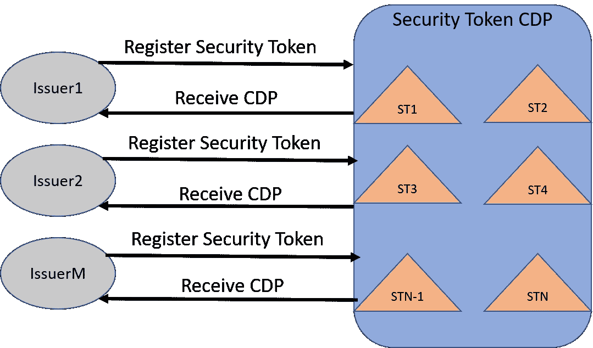
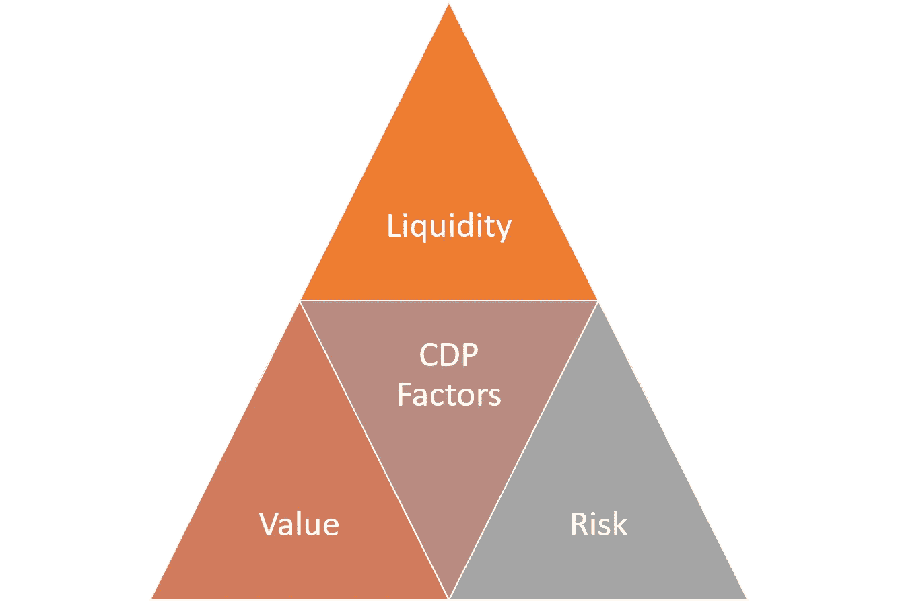
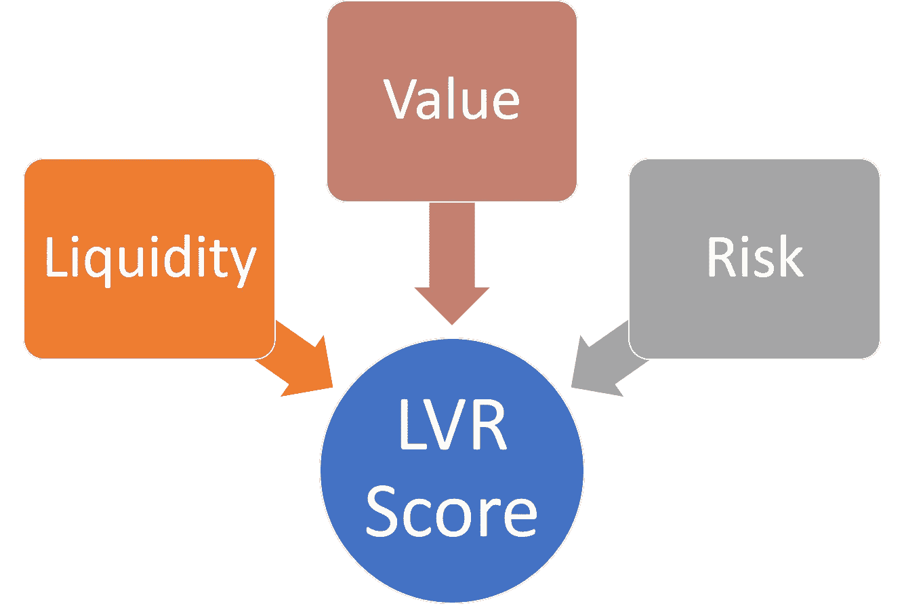

# 证券证券的抵押债务头寸

> 原文：<https://medium.com/hackernoon/collateralized-debt-positions-for-security-tokens-28b7ec8f5522>

安全令牌领域的转型时刻之一将是我们从单一资产向多资产加密证券过渡的时候。目前，绝大多数安全令牌都是单个基础资产的令牌化表示。随着这个领域的发展，我们将会看到代表复杂的基础资产池的新形式的安全令牌。我在关于抵押多资产证券的文章中概述了这个概念的一些初步想法([第一部分](https://hackernoon.com/some-ideas-about-collateralized-multi-asset-security-tokens-part-i-7dea880d79bf)和[第二部分](https://hackernoon.com/some-ideas-about-collateralized-multi-asset-security-tokens-part-ii-101da5b28211))。今天，我想深入探讨多资产证券的一种形式，我认为这种形式很可能在不久的将来出现:债务抵押债券(CDPs)。

CDP 的概念是臭名昭著的金融市场衍生品(如债务抵押债券(CDO))的加密变体。这个概念是由 MakerDAO 这样的项目率先提出的，但其中一些原则已经在其他加密协议上实现了。从根本上说，CDP 代表的是由基础资产池支持的债务头寸。在证券代币的上下文中，CDP 代表由一组加密证券担保的债务合同。CDP 代表了[我的抵押多资产证券代币论文](https://hackernoon.com/some-ideas-about-collateralized-multi-asset-security-tokens-part-i-7dea880d79bf)的一种专门化，代币本身就是一种债务头寸。

在我们深入研究 CDP 的概念之前，让我们试着把这个想法放在安全令牌市场的大背景下。我发现有三个维度非常有助于对安全令牌进行分类。在其最简单的形式中，安全令牌可以表示现有安全的令牌化表示，或者全新的形式或安全。第二个维度基于安全令牌是由单个资产支持还是由一组资产支持。最后，安全令牌可以与基础资产完全相关，也可以代表一种衍生品。CDP 是一种新形式的证券，是一组基础资产价值的衍生品。形象化这些不同的维度，我们可以清楚地确定 CDP 在总体安全令牌格局中的位置。

# 了解安全令牌 CDP

安全令牌 CDP 的概念是应用于加密证券的 [MakerDAO](https://makerdao.com/en/whitepaper) 实现的变体。我们可以使用简单的三因素标准来定义 CDP:

I .安全令牌 CDP 是债务令牌。

二。安全令牌 CDP 的价值由基础数字证券池担保。

三。证券代币 CDP 持有者可以用代币交换基础抵押品

在 CDP 模式中，用户注册一组现有的安全令牌，并收到另一个安全令牌，其价值由基础证券担保。CDP 可以作为稳定币的一种形式用于交易活动。最终，可以通过支付 CDP 智能合约中的未偿债务来收回基础资产。

像许多衍生产品一样，构建安全令牌 CDP 可能相当复杂。然而，任何安全令牌 CDP 的基本结构都可以用三个基本因素来概括:

## 流动性因素

流动性是维持证券代币 CDP 价格稳定的重要因素。与其他债务工具一样，基础资产的流动性是对冲贷款风险的重要因素。由相对流动性较高的资产(如令牌化公司债券或房地产租赁)支持的证券令牌 CDP，比由艺术品或房地产股权等非流动性资产担保的 CDP 更容易管理。

## 价值因素

安全令牌 CDP 背后的资产可以从现金流或市场升值中获得价值。现金流 CDP 衍生工具是一种传统的债务衍生工具，其价值实质上是基础资产现金流的信用。市值 CDO 的价值来自担保资产的增值。至少对于第一代安全令牌 CDP 来说，现金流资产似乎是比令牌化股权更可行的工具。

## 风险因素

风险是安全令牌 CDP 中应该考虑的另一个因素。一些证券代币代表高质量资产，可能达到或超过市场预期，而其他代币则与较低质量的抵押品相关联。在安全令牌 CDP 模型中，风险应该影响加密安全行为的不同方面，例如估价或现金流分配。

# 安全令牌 CDP 的 LVR 分数

构造安全令牌 CDP 的挑战在于，单个加密安全令牌可以由不同质量水平的资产来抵押。如前一节所述，安全令牌 CDP 的行为会受到与其基础资产相关的三个主要因素的影响:流动性、价值和风险。在这种情况下，我们如何使用这些动态来构建一个安全令牌 CDP，它对不同类型的资产和令牌持有者表现公平？

我一直在考虑的一个有趣的想法是，根据基础资产的相应流动性、价值和风险水平，设计一个 CDP 评分。让我们称这个想法为 LVR 分数。具体的公式超出了本文的范围，可能取决于 CDP 的类型，但需要注意的重要一点是，分数将提供一个可量化的指标来帮助分析特定安全令牌的质量。在这种模型中，具有强劲现金流和低风险的高流动性证券令牌将比其他具有较高风险或较差价值增值动态的证券令牌具有更高的 LVR 分数。

然后，LVR 分数将用于将安全令牌 CDP 分割成多个部分，每个部分代表基础安全令牌的不同质量级别。这些份额也可作为赎回基础证券代币的优先列表。假设安全令牌 CDP 被构造成 N 个不同的部分 *T1，T2…TN* 从最高的 LVR 分数到较低的 *(LVR1 > LVR2 > …)排序。> LVRN)。*在这种模式下，如果至少有一个发行人保持偿付能力，由 *T1* 的安全令牌抵押的安全令牌 CDP 的持有人将能够赎回他们的加密证券。类似地，由 *T2 级*安全令牌担保的 CDP 持有人将能够赎回至少 2 个发行人的加密证券，并保持偿付能力，以此类推，直到份额 N，只有在所有发行人保持偿付能力的情况下才能赎回。

之前的模型借鉴了 CDO 结构的思想，之前以太坊社区[已经对其进行了探索。主要思想是以与基础安全令牌的质量相关联的方式来平衡安全令牌 CDP 持有者的风险。显然，这种类型的算法需要大量的优化，以便适用于现实世界的场景。例如，份额模式可能需要一种机制来补偿愿意押注高风险资产的 CDP 投资者。以利率为基础的机制应该可以在这方面有所帮助。](https://ethresear.ch/t/collateralized-debt-obligations-for-issuer-backed-tokens/525)

我发现 CDP 背后的一些原则与下一波安全令牌极其相关。首先，这个概念已经被 MakerDAO 这样的协议在相当大的规模上验证了。此外，很明显，security token 将很快需要从当前的“一个资产一个令牌”模式发展为更复杂的金融结构。CDP 似乎在简单性和财务激励之间提供了正确的平衡，成为安全令牌领域的重要工具。