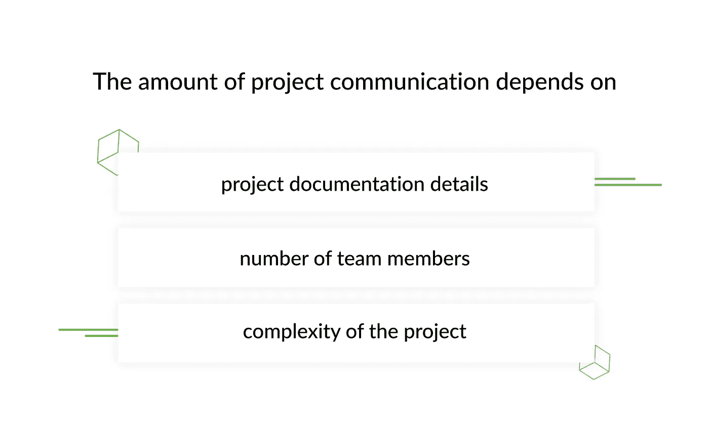
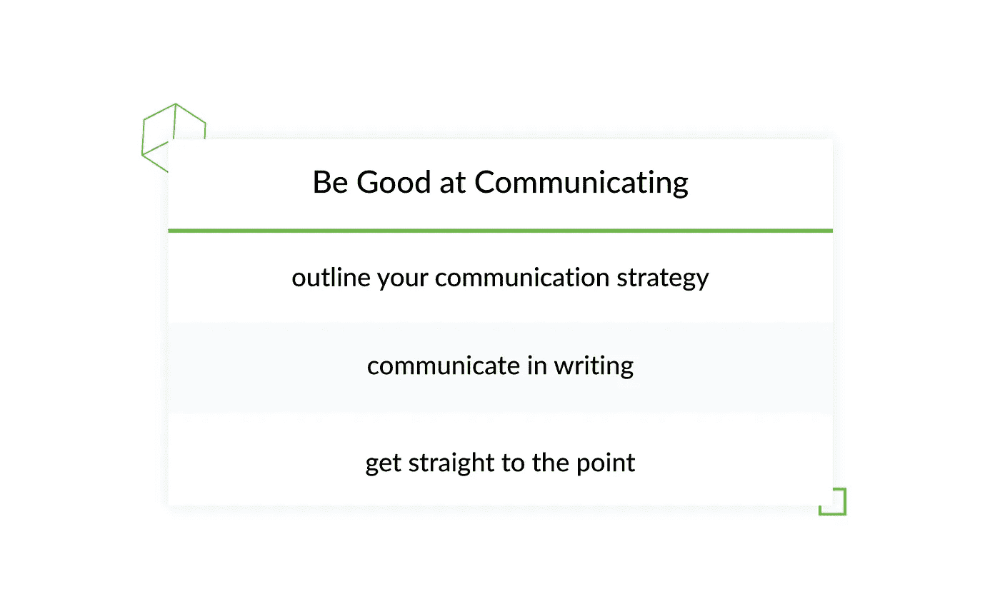

# 项目期间的团队沟通:为什么它很重要并且值得你花钱

> 原文：<https://medium.com/hackernoon/communication-in-team-during-the-project-why-its-important-and-worth-your-money-3443c90f7684>

> 这篇关于 [**项目沟通**](https://djangostars.com/blog/why-project-communication-is-important-and-worth-your-money/#utm_source=medium&utm_medium=hackernoon.com&utm_campaign=Why%20Project%20Communication%20is%20Important&utm_content=originally%20posted%20on%20ds%20blog) 的文章最初发布在 **Django Stars 博客上。**

在[项目](https://hackernoon.com/tagged/project)规划期间，沟通经常被忽视。大多数项目计划只考虑实际的开发——但是讨论和解释手头的任务呢？你知道他们怎么说的吗，“真理诞生于争论”？讨论团队应该做什么不仅可以揭示真相，而且实际上可能减少项目的持续时间(和成本)并改进产品，只要每个人都理解对他们的期望，并有权提出建议和想法。

# 定义项目沟通

首先，项目沟通是有助于实现项目目标的信息交换。沟通包括关于产品及其特性、项目进展、想法和想法的说明和讨论。通讯网络越好，项目越成功。这基本上意味着投资于沟通就是投资于你的产品质量。但是请注意，即使项目经理理解沟通的重要性，有时也无法保持沟通。确保你和他们交谈，并很好地沟通你的优先事项。

正确的交流需要发送者、接收者和媒介来交流信息的内容。此外，团队合作中的良好沟通需要诚实的反馈。确保项目经理考虑到所有这些，以及环境或背景对沟通结果的影响。

有效的沟通需要发送方和接收方理解彼此的角色和责任，其他参与方也是如此。信息必须是结构化的和明确的。每个人都必须意识到共同的目标、截止日期和规模，但也要准备好在需要时调整过程。

# 明智地规划项目

一个项目通常由冲刺组成。假设一个 sprint 补 200 个小时，纯粹是为了开发。一般只有 10%的时间是计划用来交流的。但事实是，适当的沟通需要更多的时间——如果团队在成长，或者产品的真实需求没有被适当地解释给团队，这就需要更多的时间。并且可能出现意想不到的因素。但并不是每个人都为此做好了准备。

 [## Scrum 中有效工作计划的秘密

### 我们的经历造就了我们。本指南是一套开发团队和我个人的发现和经验…

djangostars.com](https://djangostars.com/blog/secrets-effective-work-planning-scrum/#utm_source=medium&utm_medium=hackernoon.com&utm_campaign=Why%20Project%20Communication%20is%20Important&utm_content=you%20may%20also%20like) 

我见过一些人，他们生活和工作的准则是“少说话，多行动”这种方法可能适用于一些企业，但是在开发过程中，团队中的沟通是至关重要的。我们来看看为什么。如果一项任务得到了很好的解释和讨论，那么很快找到最优解的几率会非常高。当您作为一个客户与开发团队讨论所有的风险时，包括具有不同资格的团队成员，每个人都可以从不同的角度看到任务——以及整个产品。所有这些提高了对过程的全面理解，并减少了将来不得不重新做一些工作或修复 bug 的机会。但是即使你得到了一项任务的所有细节，团队仍然需要时间来组织工作。我们需要多少后端或前端开发？谁做什么，持续多长时间？这些问题总是需要时间来解决。

# 把沟通考虑进去

回到我之前提到的 10%，这个数字是从哪里来的呢？通常，企业希望这是真的，当沟通占用了比这多得多的项目时间时，他们会感到惊讶。当然，这增加了冲刺的价格。你可能遇到过这种情况——你指望一个价格，然后你得到一个比估价高 X 倍的账单。但有一点我是肯定的:**沟通是一个项目中最大的部分之一，所以不要犹豫为此付出**。

***我们是怎么做到的。*** *在我们的团队生涯中，我们的客户会问我们需要多少时间来完成他们小小的项目。但是，嗯，定义“非常小”，对不对？不可能找到一个公式来计算每个项目需要多少沟通。然而，没有办法，我们必须给客户一个估价。我们花了每个 sprint 5-7%的时间进行团队内部交流。这是一个由 4 名软件工程师、1 名经理和 2 名 QA 工程师组成的最小团队的平均项目时间的统计证明量。*

我和我的团队试图尽可能精确地计算估计值。团队实现目标所需的沟通比例取决于许多因素。

糟糕的文档或解释不清的需求会增加工作时间。如果开发团队获得了他们开始规划 sprint 所需的所有信息，他们将能够马上这样做。一定要提供完整的信息并组织好，确保团队理解了你的意思。

**越大的团队说话越多。**大型团队不是坏事。但是要记住，一个团队里的人越多，意见就越多，讨论也就越多。因此，沟通时间会更长，账单也会更大。家庆！

**更复杂的项目需要更长的解释和开发时间。如果是一个多层的项目，即使是最简单的变更请求也会引起很多冗长而激烈的讨论。客户并不总是意识到改变一个小按钮或功能的简单请求会干扰产品的整个机制或导致错误。**

计算交流时间不是一门精确的科学。也就是说，下面我们提供了一个 sprint 所需沟通的粗略估计——但是几乎不可能对整个项目进行估计。显然，这取决于每个 sprint 中有多少人被分配了任务，也取决于我上面提到的因素。

# 你为什么付钱？

我想每个人都想知道软件开发的账单中的沟通部分到底包括什么。所以我们来揭秘一下，看看开发者把他们的沟通时间和客户的钱都花在了什么地方。

# 修饰

梳理(或待办事项细化)是讨论客户给出的所有任务的过程。风险是什么，相关性是什么，业务优先级是什么？所有的任务都被分配给不同的团队成员，他们对这些任务进行剖析和彻底的研究。他们利用准备时间向客户提问，思考可能的实施方案，并在冲刺前会议上报告结果。这样，不仅每个团队成员都知道他们将要完成的任务，包括所有的细节和细节，还知道可能的解决方案和实现它们的方法。

***我们是如何做到的。*** *比方说，我的开发团队从一个客户那里收到一组十个任务，然后马上开始工作。突然，发现少了一条至关重要的信息。接下来会发生什么？我们应该等待客户提供额外的信息和意见。为此，我们要么停止开发过程，要么将这个特定的任务转移到下一个 sprint，这也是已经计划好的。任务像滚雪球一样越滚越大，结果，整个开发过程比我们和客户期望的要长得多。*

然而，梳理可以防止团队过早地承担任务。他们在开发之前讨论任务，仔细检查每个细节，并就实现方法达成一致。这样，他们可以保证更高的产品质量，并提供更精确和可预测的时间估计。

打扮有不同的方法。团队经理可以与整个团队讨论任务，如果是小型团队(三到四个人)，或者是中型团队(六到七个人)。此外，如果团队有八个或更多成员——后端、前端、QA 等，任务可以在小组中准备..梳理时间取决于团队成员的数量。

例如，一个后端开发人员得到一个任务，研究这个任务，找出缺少的东西，并把它呈现给团队的其他成员，加上他们对如何解决这个问题的建议。现在，团队中的每个人都可以讨论它们。还是那句话，讨论的人越多，交流的时间就越长。**为了预先计算未来项目的准备时间，我们采用历史数据，即团队过去在准备任务上花费了多少时间。或者，如果团队是新的，有可能采用平均值。**

# 规划

规划是为下一个冲刺阶段定义任务范围的过程。这是团队成员应该打扮的时候。规划的精确性很大程度上依赖于团队的经验。如果团队在这个特定的星座中进行过大量的短跑，他们就会知道自己的速度以及他们通常在沟通上花费多少时间。因此，团队越年轻，他们的估计和实际数字之间的差异就越大。

***我们是如何做到的。*** *如下图所示，从一次冲刺到另一次冲刺，我们变得更容易预测，并减少了我们花在沟通上的时间。让我们更仔细地看看时间规划和估计的准确性之间的依赖关系。沟通越好，接下来的冲刺就越精准。随着每一次冲刺，估算变得越来越精确。通常，我们在当前的 sprint 中计划下一个 sprint 的范围。这里你可以看到 Sprint 0 中的计划/内部会议是如何影响 Sprint 1 的。*

一旦团队在计划方面变得更好，他们就会更好地掌握任务分配和完成。规划任务提高了可预测性，改善了对任务的理解，并最小化了时间估计的偏差。在 sprint 中，每个团队成员的计划时间大约为 2-3 小时，但这仍然取决于团队的经验。

# 每日站立

每日立会是每日召开的团队会议，讨论已经完成的工作、将要完成的工作以及团队成员需要倾诉的其他事情。平均每人需要 15 分钟左右。因此，为了计算每天站立所需的时间，用团队成员的数量乘以 15 分钟的**,再乘以短跑的天数。**

*重要提示:为了发展，最好所有团队成员都必须出席这样的会议。每个人都必须了解他们的同事在做什么，因为这可以提高参与度，激励每个团队成员。因此，不要认为计划只是经理的事。*

# 你不能计划一切

说实话，沟通过程的某些部分我们无法用持续时间来精确评估。请记住这一点:如果沟通评估不等于实际结果，也就是说，它们超出了最初的计算，这完全没关系。

**演示**。当然，产品的演示是至关重要的，但是在项目开始的时候，我们几乎不可能知道要做多少次。演示时间是团队向客户展示 sprint 期间完成的工作的时候。通常需要 90 分钟左右。

***我们是如何做到的。我们通常在整个团队在场的情况下做演示。客户经常感到惊讶，但我们认为这样更有效。这样，每个人都参与进来，并直接听到客户的反应和反馈。他们感受到了责任和项目的“真实性”。无论如何，花 90 分钟，甚至更多的时间在这种演示上，比单独向每个人解释客户的想法要好。最重要的是，从一个演示到另一个演示，我们要求不同的团队成员展示产品——这样，每个人都可以感受到他们所做的事情的重要性，以及他们的部分是如何与他人相互依赖的。***

**回顾**。这是团队回顾在冲刺阶段已经完成的工作、好的方面、可以改进的方面、学到的东西，或者制定改进的行动计划的时候。团队成员可以表达他们的关注点，对架构或流程变化的想法，或者澄清他们对业务方面的疑问。团队在当前回顾中得到的答案越多，下一次就越顺利。总的来说，这样的会议提高了整个 sprint 的团队精神。

除此之外，有些事情不仅会增加交流时间，还会大大增加开发时间，这是意料之外的。首先，这些可能是**故事错误**——它们需要立即修复，这需要时间。当有人误解了任务时，就会出现这样的错误。正如你所看到的，如果一个人事先没有花足够的时间研究和讨论任务，像故事 bug 这样的意外会在后来赶上他们。

另一件可能导致问题的事情是**在冲刺阶段引入新的任务。从技术上讲，任务的数量保持不变，这可能会给人留下时间或成本没有变化的印象。但是回到我之前说的，每项任务都需要沟通、研究、培训，在这种情况下，所有这些都必须在冲刺阶段完成。**

# 通信规则

我想我们已经确立了沟通的重要性。但事实是，如果沟通没有效率和逻辑规划，它就没有多大价值。

首先，你应该**概述你的沟通策略**。这意味着应该有一个关于如何互动，如何与开发团队沟通，多久一次，以什么形式的计划。当人们知道该期待什么时，他们往往会感到更加舒适和自信。

我的第二个建议是:**书面交流**。你不必把所有的事情都写下来，当然你也可以和开发团队进行开放式的讨论。但是你可以随意用电子邮件发送重要的信息，或者保存特定过程的详细文档，这样就不会丢失任何东西。

最后，要简洁。**开门见山**。在商业中，通常没有时间通读一长串文本。当阅读电子邮件时，团队成员会浏览邮件内容，寻找与他们相关的信息。关键项目包括:

*   关于这个问题，他们需要知道什么？
*   这对他们或他们的工作有影响吗？
*   期望他们做什么吗？
*   如果是，什么时候？

当交流任务时，不要忘记提及谁对任务负责，何时以及如何完成和交付任务，以及接下来会发生什么。只提供关键信息会帮助你节省时间，提高工作效率。

尽管这似乎是一件困难的事情，但在结构良好的沟通上投入足够的时间总是比由于缺乏沟通而修复已经完成(或没有完成)的事情要好。正如您所看到的，很难计算整个项目的沟通时间，但是，通过一步一步地进行，团队可以考虑团队成员的数量和 sprint 的持续时间，对 sprint 进行估计。每个团队成员都应该确切地知道该做什么，如何去做，以及他们的工作结果如何与其他人正在做的事情相关联。这样，他们将高效地工作并保持动力，而不会浪费时间在额外的问题和解释上。

如果客户和软件开发团队之间，甚至团队内部的沟通不充分，当团队开始工作时，问题就会出现。时间被浪费在解释或等待解释不清的任务完成上。所以请记住:你计划得越好，你实现预期目标和期限的机会就越大。

