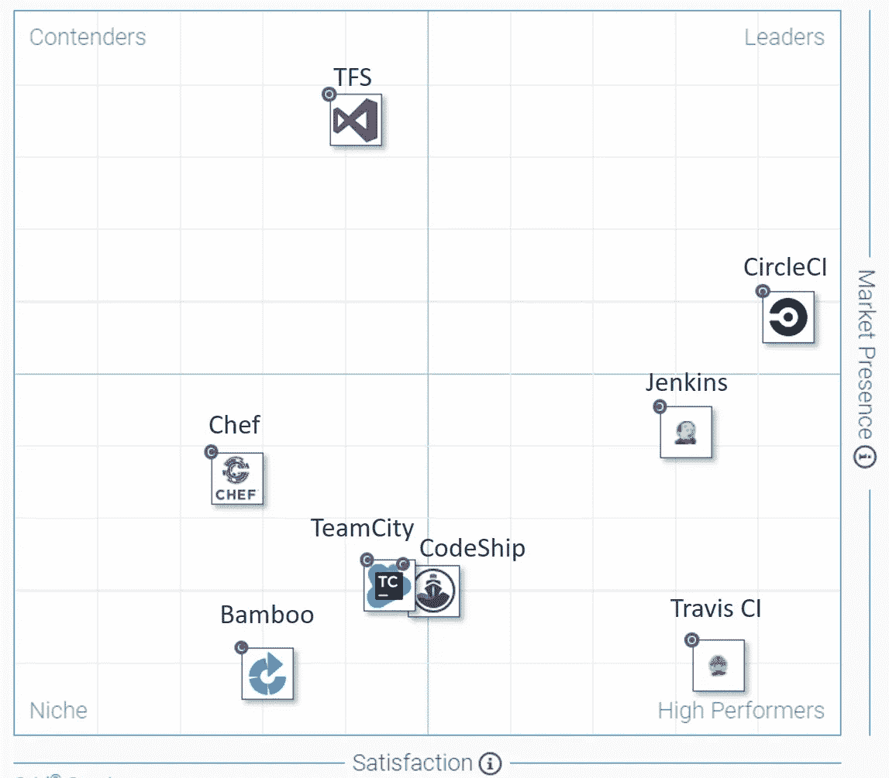
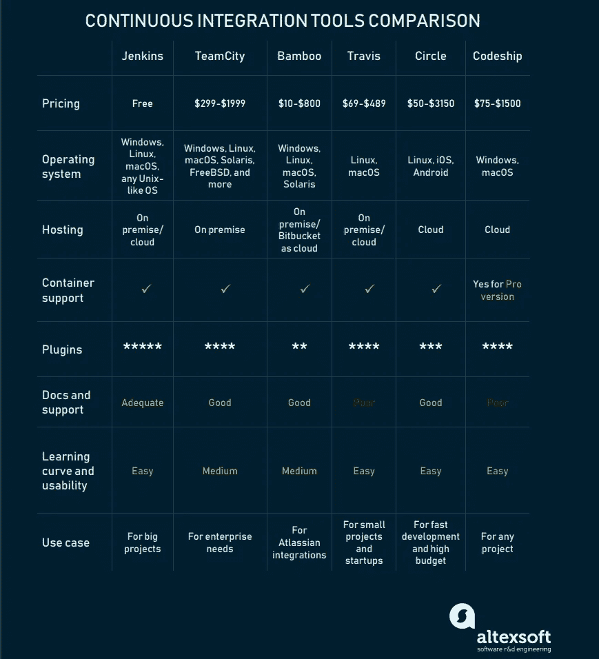
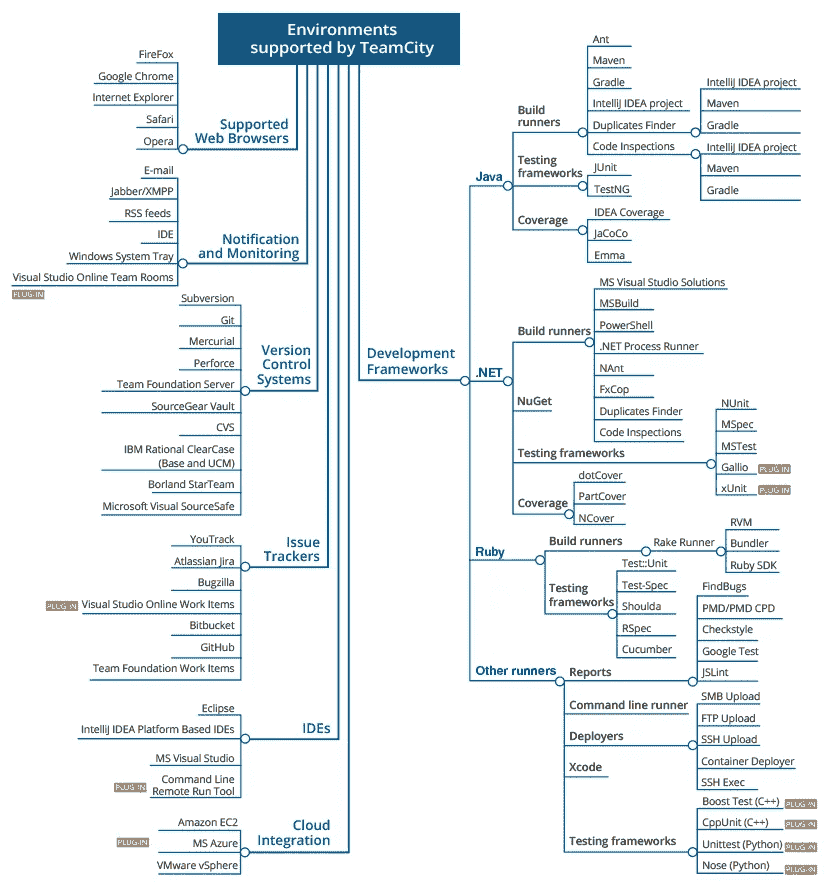
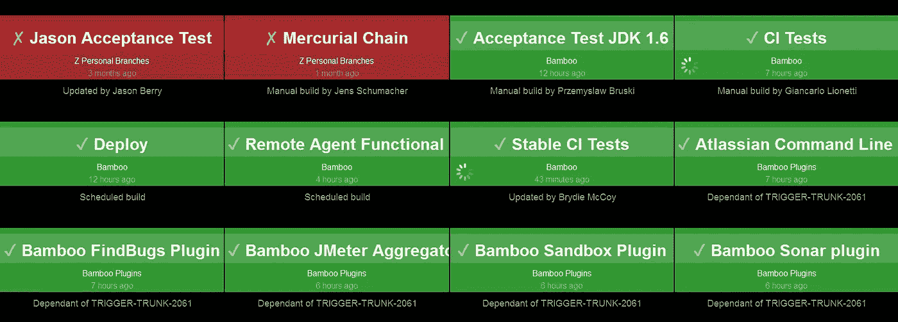
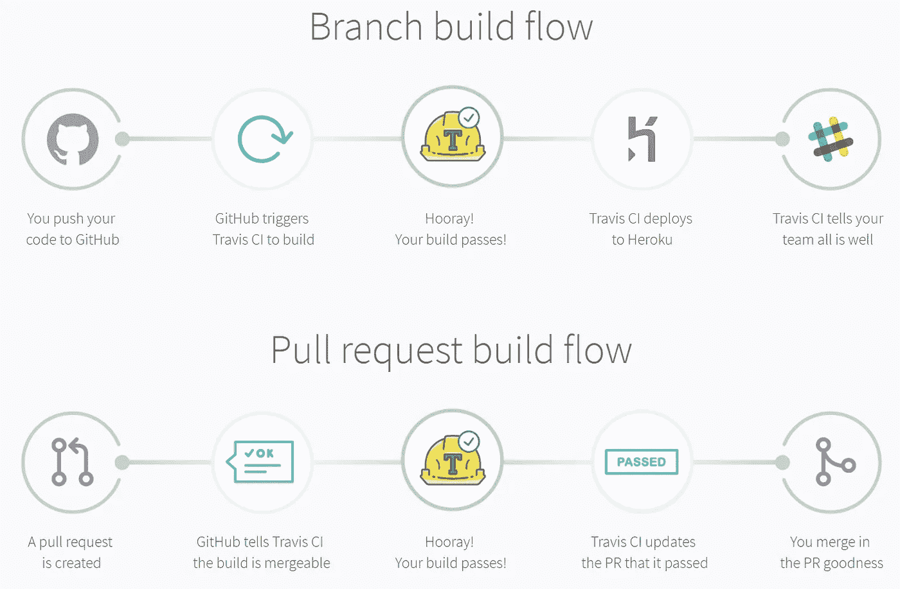
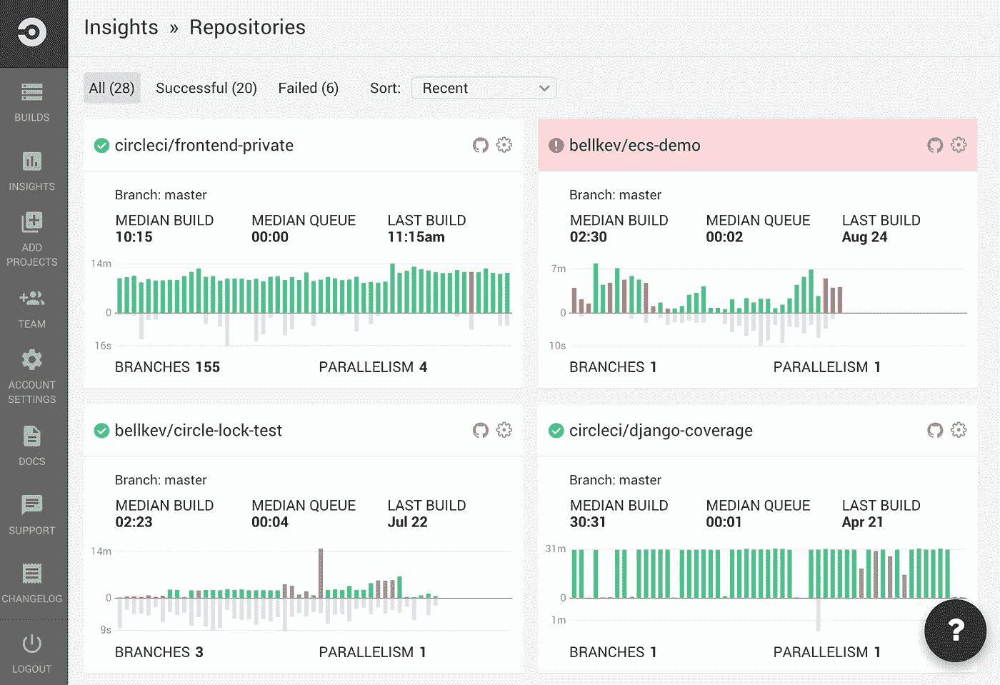
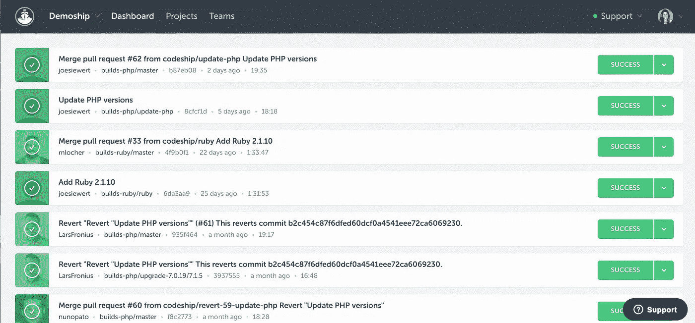
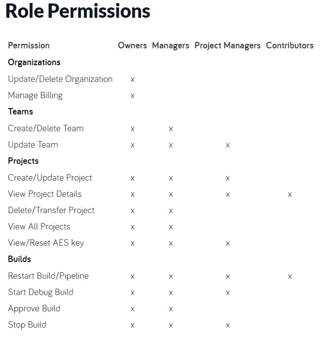

# 比较最流行的持续集成工具:Jenkins、TeamCity、Bamboo、Travis CI 等等

> 原文：<https://medium.com/hackernoon/comparison-of-most-popular-continuous-integration-tools-jenkins-teamcity-bamboo-travis-ci-and-a4135d6e8c7f>

当您构建一个产品时，您的代码库会不断增长，除非管理得当，否则会成为未来开发人员要解决的虚拟魔方。过去，当瀑布方法占主导地位时，交付一个产品的第一个可发布版本可能需要几个月甚至几年。

切换到[敏捷方法](https://www.altexsoft.com/whitepapers/agile-project-management-best-practices-and-methodologies/?utm_source=MediumCom&utm_medium=referral)有助于将编程周期减少到数周，并引入了稳定的交付间隔。今天的持续集成(CI)实践推出程序更新甚至更快，在几天或几小时内。这是频繁将代码提交到共享存储库中的结果，这样开发人员可以使用自动化测试轻松跟踪缺陷，然后尽快修复它们。在我们的专题文章中，我们详细解释了[持续集成](https://www.altexsoft.com/blog/business/continuous-delivery-and-integration-rapid-updates-by-automating-quality-assurance/?utm_source=MediumCom&utm_medium=referral)的好处，如何采用它，以及在此过程中会遇到哪些挑战。

*How Continuous Integration works, starting from triggering a build in a version control system (VCS) Source:* [*Django Stars*](https://hackernoon.com/continuous-integration-circleci-vs-travis-ci-vs-jenkins-41a1c2bd95f5)

现在，CI 不是自动修复您的工作流程的魔棒，您将需要一个相应的工具。因此，让我们通过提出实际问题来深入了解细节:*我需要什么样的 CI 工具？学起来有多难？我要花多少钱？它能与我的基础设施兼容吗？哪种工具最适合我？*

今天的市场充斥着许多持续集成工具，因此选择正确的工具可能很困难。即使有些工具似乎比其他工具更受欢迎，它们也不一定对你有用。走一条简单的路线，阅读这篇文章，清楚地了解一流的 CI 工具:它们的功能和许可比较。然后，您将看到哪种工具最能满足您的业务需求。

# 如何选择持续集成工具

为了指导您在众多选项中做出选择，我们建议使用以下标准:

**托管选项。**软件工具的基础设施管理各不相同。基于云的工具托管在提供商端，需要最少的配置，并且可以根据您的需求按需调整。还有自托管解决方案。部署和维护它们的责任完全落在你的肩上，或者说落在你的内部 [DevOps 团队](https://www.altexsoft.com/blog/engineering/devops-principles-practices-and-devops-engineer-role/?utm_source=MediumCom&utm_medium=referral)身上。虽然内部服务有利于构建流程的灵活性，但托管解决方案避免了设置的困难，提供了更大的可扩展性。

**集成和软件支持。**CI 工具与开发中使用的其他软件的集成程度如何？集成示例可能包括项目管理软件(如吉拉)、事件填充工具(如 PagerDuty 和 Bugzilla)、静态分析工具、法律合规工具等。CI 工具必须足够灵活，以支持各种类型的构建工具(Make、Shell 脚本、Ant、Maven、Gradle)和版本控制软件或 VCS (Subversion、Perforce、Git)等。

**可用性。鉴于一些工具清晰、直接的 GUI 和 UX，它们可以使构建过程比其他工具容易得多。一个设计良好的界面可以节省你在入职阶段的时间。**

**集装箱支架。**拥有 Kubernetes 和 Docker 等容器编排工具的部署插件或配置，可以让 CI 工具轻松连接到应用程序的目标环境。

**可复用代码库。**当一个解决方案有各种各样的公共存储的各种插件、可用的构建步骤时，它是首选的，这些插件可以是开源的或商业上可用的。

*G2 Crowd Grid of the mid-market CI tools divided into leaders (CircleCI), high performers (Travis CI and Jenkins), niche (CodeShip, TeamCity, Bamboo, and Chef), and contenders represented by TFS*

现在，我们选择了 CI 市场中表现最好的公司进行进一步分析:Jenkins、TeamCity、Bamboo、Travis CI、CircleCI 和 CodeShip。为了理解他们的受欢迎程度，我们比较了来自 [StackShare](https://stackshare.io/continuous-integration) 、 [G2 人群](https://www.g2crowd.com/categories/continuous-integration?segment=mid-market)和[Slant.co](https://www.slant.co/topics/799/~best-continuous-integration-tools)的评分。

*Comparing the most popular CI tools by price, integrations, support, and main use cases*

要获得 CI 工具的简要概述，请看下面的比较表。请继续阅读每个工具的详细分析。

# Jenkins:最广泛采用的 CI 解决方案

[Jenkins](https://jenkins.io/) 是一个用 Java 编写的开源项目，可以在 Windows、macOS 和其他类似 Unix 的操作系统上运行。它是免费的，受社区支持，可能是您持续集成的首选工具。Jenkins 主要部署在内部，也可以在云服务器上运行。它与 Docker 和 Kubernetes 的集成利用了容器的优势，并执行更频繁的发布。

# 主要卖点

**不需要费用。** Jenkins 是一款免费的 CI 工具，可以为您的项目节省资金。

**无限整合**。Jenkins 可以集成几乎任何用于开发应用程序的外部程序。它允许您使用 Docker 和 Kubernetes 等现成的容器技术。G2 大众评审员[声称](https://www.g2crowd.com/products/jenkins/reviews#survey-response-816942)::*没有比这更好的工具来将您的存储库和代码库与您的部署基础设施集成在一起了。”*

Jenkins 提供了丰富的插件库:Git、Gradle、Subversion、Slack、吉拉、Redmine、Selenium、Pipeline 等等。Jenkins 插件涵盖了五个领域:平台、UI、管理、源代码管理，以及最常见的构建管理。尽管其他 CI 工具提供了类似的特性，但它们缺乏 Jenkins 所拥有的全面的插件集成。此外，Jenkins 社区鼓励其用户通过提供教学资源来扩展新功能。

**活跃社区。**Jenkins 社区为[提供了一个介绍基础知识的导游](https://jenkins.io/doc/pipeline/tour/getting-started/)和[高级教程](https://jenkins.io/doc/tutorials/)用于更复杂地使用该工具。他们还举行年度会议。

**在多台机器上分配构建和测试负载。** Jenkins 使用主从架构，其中主服务器是监控从服务器的主服务器，从服务器是用于分发软件构建和测试负载的远程机器。

# 主要弱点

文档并不总是足够的。例如，它缺少关于管道创建的信息。这增加了耗时的任务，因为工程师必须完成这些任务。

*Jenkins dashboard*

**UI 差。它的界面似乎有点过时，因为它没有遵循现代设计原则。没有留白会使视图显得拥挤和混乱。许多进度功能和图标都是超级像素化的，作业完成后不会自动刷新。**

监控 Jenkins 服务器及其从属服务器需要**的人工努力，以了解插件之间的相互依赖关系，并不时地升级它们。**

总而言之，Jenkins 最适合大型项目，在这些项目中，您需要通过使用各种插件来进行大量定制。你几乎可以改变这里的一切，但这个过程可能需要一段时间。但是，如果您计划以最快的速度启动 CI 系统，请考虑不同的选项。

# 团队城市:另一个主要的竞争情报参与者

JetBrains 的 [TeamCity](https://www.jetbrains.com/teamcity/) 是一款可靠的高质量 CI 服务器。团队经常选择 TeamCity 来获得大量现成的认证、部署和测试特性，以及 Docker 支持。它是跨平台的，支持所有最新版本的 Windows、Linux 和 macOS，可以与 Solaris、FreeBSD、IBM z/OS 和 HP-UX 一起工作。TeamCity 在安装后立即工作，不需要额外的设置或定制。它拥有许多独特的功能，如详细的历史报告，对测试失败的即时反馈，以及重用设置，这样您就不必重复您的代码。

**定价模式。** TeamCity 提供了一个免费版本，可以完全访问所有产品特性，但它仅限于 100 个构建配置和三个构建代理。目前，增加一个构建代理和 10 个构建配置需要花费 299 美元。TeamCity 提供 60 天的云试用，绕过内部安装。

还有一个[付费企业版。其价格因包含的代理数量而异。TeamCity 为初创公司提供 50%的折扣，并为开源项目提供免费许可。](https://www.jetbrains.com/teamcity/buy/#license-type=new-license)

# 主要卖点

**。净支持。** TeamCity 整合了。NET 工具比这里的任何其他 CI 工具都要好。有许多重要的。NET 工具，比如代码覆盖率分析，几个。NET 测试框架和静态代码分析。

*Platforms and environments supported by TeamCity*

**广泛的 VSC 支持。** TeamCity 允许仅从 VCS 存储库 URL 创建项目。该工具支持所有流行的 VCS: AccuRev、ClearCase、CVS、Git、Gnu bazaar、Mercurial、Perforce、Borland StarTeam、Subversion、Team Foundation Server、SourceGear Vault、Visual SourceSafe 和 IBM Rational ClearCase。许多[外部插件](https://plugins.jetbrains.com/search?pr=teamcity&headline=93-version-control-systems-support&pr_productId=teamcity&canRedirectToPlugin=false&showPluginCount=false&tags=Version+Control+Systems+Support)可用于帮助支持其他版本控制系统。

**主管文书。**通过阅读提供的[用户指南，](https://www.jetbrains.com/teamcity/documentation/)可以很容易地理解整体功能，该指南既全面又详尽。

**易于设置。** TeamCity 易于安装，安装后即可投入使用。它为构建项目提供了一系列现成的功能。

**内置功能。** TeamCity 为构建项目提供了一套很好的开箱即用的功能:构建、失败和任何附加变更的详细历史报告，源代码控制和构建链工具。TeamCity 最好的特性之一是“发布工件”,它允许在任何环境中部署代码甚至直接构建。它显示了每个步骤的构建进度，以及在构建完成之前需要通过的测试数量。它还允许您在夜间执行后立即重新运行任何失败的测试，因此您不必在第二天早上浪费时间。

# 主要弱点

**难学曲线。**虽然 TeamCity 以其视觉美学的用户界面而闻名，但它仍然有点复杂，让新手难以招架，同时提供了广泛的配置选项。在开发人员准备将该工具用于生产之前，他们可能需要进行一些认真的研究。

**手动升级流程。从一个主要版本转移到另一个主要版本是一个漫长的过程，必须在服务器上手动完成。**

鉴于其复杂性和价格，TeamCity 将最适合企业需求和准备在需要时构建自己的插件的自助团队。

# Bamboo:与 Atlassian 产品的开箱即用集成

除了协助集成， [Bamboo](https://www.atlassian.com/software/bamboo) 还具有部署和发布管理的特性。虽然 Bamboo 的开箱即用选项较少，但它可以与其他 Atlassian 产品进行本机集成:Bitbucket、吉拉和 Confluence。事实上，同样的集成需要 Jenkins 一个庞大的插件方案。就像前两个工具一样，Bamboo 可以在 Windows、Linux、Solaris 和 macOS 上运行。对于那些在 Linux 上运行 Bamboo 的人来说，他们坚持创建一个专门的用户来防止任何潜在的滥用。

**定价模式。**竹子免费试用 30 天。之后，其用户层选项包括无限的本地代理和 10 个作业，并相应地扩展到 1000 个远程代理，价格从 10 美元到 126，500 美元不等。包括 12 个月的维护期。这个时间可以增加一倍或两倍，因为[会赚更多的钱](https://www.atlassian.com/purchase/product/bamboo)。Atlassian 软件对任何符合他们定义的标准的开源项目都是免费的。

# 主要卖点

**Bitbucket 管道。**在 Atlassian 于 2016 年停止使用竹云后，该工具只能在内部使用。然而，Atlassian 生产了 [Bitbucket Pipelines，](https://confluence.atlassian.com/bitbucket/get-started-with-bitbucket-pipelines-792298921.html)bit bucket 内置的云替代方案——Git 存储库管理解决方案。管道可以和竹子完全融为一体。作为一个定制配置的系统，Bitbucket Pipelines 支持基于存储库中的配置文件自动构建、测试和部署代码。通过利用 Docker 的能力，Bitbucket Pipelines 提供了非常高效和快速的构建。最终，Bamboo 服务器仍然可用于本地安装，并且可以托管在基于云的容器或 VM 中。

*Bamboo* *wallboard displays the status of all the branches and the plan that the branches belong to*

**多种通知方式。** [竹墙板](https://confluence.atlassian.com/bamboo/using-plan-branches-289276872.html#Usingplanbranches-wallboard)在专用显示器上显示构建结果，并将构建结果发送到您的收件箱或开发人员聊天室(例如 HipChat、Google Talk)。

**丰富而简单的整合。** Bamboo 支持大多数主要的技术栈，如 CodeDeply、Ducker、Maven、Git、SVN、Mercurial、Ant、AWS、亚马逊 S3 桶。此外，它识别这些技术中的新分支，并自动应用触发器和变量的定制。Bamboo 的基于环境的权限特性允许部署到他们的环境中。

文档和支持。竹书文献丰富详实。Atlassian 提供技术支持。然而，社区规模远远达不到詹金斯的用户范围。

# 主要弱点

**可怜的插件支持。**与 Jenkins 和 TeamCity 相比，Bamboo 不支持那么多插件。目前只有 [208 款应用](https://marketplace.atlassian.com/addons/app/bamboo/newest)被列入了 Atlassian 知识库。

**复杂的第一次工作经历。**一些用户[抱怨](https://www.g2crowd.com/products/bamboo/reviews)第一个部署任务的设置过程不太直观，并且需要时间来理解所有不同的选项以及如何使用它们。

Bamboo 非常适合那些寻求与 Atlassian 产品进行开箱即用集成的人。

# Travis CI:简单集成 GitHub 的成熟 CI 解决方案

作为最古老的 CI 解决方案之一， [Travis](https://travis-ci.org/) 赢得了众多用户的信任。它有一个大而有用的社区，欢迎新用户并提供大量的教程。

Travis CI 可以在 Linux 和 macOS 上测试。同时，它的文档警告说，启用多操作系统测试可能会导致一些工具或语言变得不可用，或者由于每个文件系统行为的特殊性而导致测试失败。

Travis 提供许多自动化 CI 选项，无需专用服务器，因为它托管在云中。但是，它也有一种内部产品，适用于希望继续使用 CI 工具的相同功能并满足现场安全需求的公司。

**定价模式。**前 100 个版本是免费的。另外，爱好项目有四种定价方案(69 美元/月)，小型、成长期和大型团队有四种定价方案(从 129 美元到 489 美元/月)。它们[在可以运行的并发作业数量上](https://travis-ci.com/plans)有所不同。您也可以联系 Travis CI 获得定制计划。

# 主要卖点

**易于设置和配置。** Travis CI 不需要安装，您只需注册并添加一个项目即可开始测试。该软件可以用一个简单的 YAML 文件进行配置，您可以将它放在开发项目的根目录下。用户界面非常灵敏，大多数用户说它方便监控构建。

*Travis CI branch build flow and pull request build flow with GitHub*

**与 GitHub 的直接连接。** Travis CI 可以与流行的版本控制系统无缝协作，特别是 GitHub。而且，该工具对于 GitHub 开源项目是免费的。CI 工具注册每个对 GitHub 的推送，并默认自动构建分支。

**最近构建的备份**。每当您运行新的构建时，Travis CI 都会将您的 GitHub 存储库克隆到一个新的虚拟环境中。这样你总是有一个备份。

# 主要弱点

**没有光盘。**与列表中的其他 CI 工具不同，Travis CI 不支持持续交付。

**仅 GitHub 托管。**由于 Travis 只为 GitHub 托管的项目提供支持，使用 GitLab 或任何其他替代工具的团队被迫依赖另一个 CI 工具。

综上所述，Travis CI 是需要在不同环境下测试的开源项目的最佳解决方案。此外，它还是小型项目的合适工具，小型项目的主要目标是尽快开始集成。

# CircleCI:一个用于早期项目的简单而有用的 CI 工具

[CircleCI](https://circleci.com/) 是一款灵活的 CI 工具，可提供高达 16 倍的并行性。它通过电子邮件、HipChat、Campfire 和其他渠道智能地通知用户只提供相关信息。CircleCI 提供了简单的设置和维护。

CircleCI 是一个基于云的系统，它还提供一个具有安全性和配置的本地解决方案，用于在您的私有云或数据中心运行该工具。

**定价模式。CircleCI 有一个为期两周的免费 macOS 试用版，允许你在 Linux 和 macOS 上进行构建。免费的 Linux 包包括一个容器。在添加更多容器时(每个 50 美元/月)，您还可以选择并行化的级别(从一个到 16 个并发作业)。 [MacOS 计划](https://circleci.com/pricing/)从每月 39 美元的 2 倍并发到每月 249 美元的 7 倍并发和电子邮件支持不等。**

如果您的企业有特殊需求，您可以[直接联系 CircleCI】讨论基于个人使用的价格计划。对于开源项目，CircleCI 分配了 4 个免费的 Linux 容器，以及 1 倍并发的免费 macOS Seed 计划。](https://circleci.com/enterprise/)

# 主要卖点

*CircleCI dashboard*

**简单的 UI。CircleCI 因其管理构建/作业的用户友好界面而得到认可。它的单页 web 应用程序简洁易懂。**

**高质量的客户支持。** StackShare 的社区成员强调了 CircleCI 的快速支持:他们在 12 小时内响应请求。

CircleCI 运行所有类型的软件测试，包括网络、移动和容器环境。

**需求安装和第三方依赖的缓存**。CircleCI 可以使用粒度检出键选项从多个项目中提取数据，而不是安装环境。

**无需手动调试。** CircleCI 有调试功能*通过 SSH* 调试，但是 Jenkins 用户必须通过点击作业手动调试。

# 主要弱点

**过度自动化。** CircleCI 在没有警告的情况下改变环境，这可能是一个问题。有了 Jenkins，它将只在用户指示时运行更改。

(编者注:这是 CircleCI 1.0 的一个问题，但在 2.0 中，你可以完全控制你的图像。更多详情请见此处:[*https://circle ci . com/docs/2.0/custom-images/# section = configuration*](https://circleci.com/docs/2.0/custom-images/#section=configuration)*)*

**不缓存 Docker 图像。**例如，在 Jenkins 中，我们可以使用私有服务器缓存 Docker 图像；在 CircleCI，这是不可能的。

*(编者注:Docker 图片缓存作为付费功能提供:*[*https://circleci.com/docs/2.0/docker-layer-caching/*](https://circleci.com/docs/2.0/docker-layer-caching/)*)*

**在 Windows 操作系统中没有测试。CircleCI 已经支持构建大多数运行在 Linux 上的应用程序，更不用说 iOS 和 Android 了。然而，CI 工具还不允许在 Windows 环境中进行构建和测试。**

总而言之，如果您需要快速构建，并且资金不是问题，CircleCI 及其并行化特性是您的首选 CI 工具。

# CodeShip:一个基于云的 CI 工具，可以快速构建

*CodeShip dashboard*

CloudBees 的 CodeShip 完全控制 CI 和 CD 工作流程的定制和优化。这个 CI 工具有助于管理团队和简化项目。通过并行管道、并发构建和缓存，CodeShip 允许建立强大的部署管道，使您能够每天轻松部署多次。

**定价模式。** CodeShip 有两个版本:基础版和专业版。基本版通过简单的 web 界面提供预配置的 CI 服务，但不支持 Docker。CodeShip Basic 有几个[付费软件包](https://codeship.com/pricing/basic?hsCtaTracking=35b2d6a6-6c9c-49c0-b222-671b3a4e32d5%7Ce359ef0b-8218-48af-8100-dea7a6269a96)，从每月 49 美元到 399 美元不等:软件包的并行能力越强，价格就越高。Pro 版支持 Docker，更加灵活。您可以选择您的[实例类型](https://codeship.com/pricing/pro?hsCtaTracking=2b8b0b79-0e4d-4daf-9d2e-f6dc5fca443a%7Cf11f7729-a383-46f2-b4fb-7aa1f5b08d4e)和高达 20 倍的并行化。

还有一个免费计划，限制为每月 100 个构建，一个并发构建，和一个并行测试管道。教育项目和非营利组织可以享受 50%的折扣。开源项目总是免费的。

# 主要卖点

**集中团队管理。CodeShip 允许为您的组织和团队成员设置团队和权限。目前，他们提供以下角色:所有者、管理者、项目经理和贡献者。**

**平行测试。CodeShip 有一个特殊的并行 CI 特性，用于并行运行测试。**

**简化的工作流程。**直观的用户界面可轻松进行配置和文件管理，让工作流程快速进行。几乎所有的 G2 人群评论都指出，CodeShip 设置非常快，容易上手。他们说在 CodeShip 中，所有事情都比在 Jenkins 中简单得多，部署过程也简单得多。

**一键编码发货。** CodeShip 使得一次点击就能持续地将代码推送到所有环境变得很容易。

**原生 Docker 支持。** CodeShip 是高度可定制的，具有对 Docker 实例的本地支持。

# 主要弱点

**缺少文档。**根据评论，缺少文档，尤其是与 Jenkins 相比，应该扩展。

**窄操作系统支持。** CodeShip 运行在 Windows、macOS 和基于 web 的设备上，而大多数 CI 工具也支持 Linux、Android 和 iOS。

由于其灵活的计划，CodeShip 可以为小型团队和企业工作。尽管如此，许多人还是更喜欢代码制，因为它的可靠性:“T20 代码制让我们在每次推送时都能安心，以确保所有的测试和任何其他必要的预处理每次都能完成，”在[G2 Crowd](https://www.g2crowd.com/products/cloudbees-codeship/reviews)上的一篇评论中说。

# 关于选择 CI 工具的最终建议

如何从众多 CI 解决方案中选择一个不仅能满足您当前的集成需求，还能随着您的[产品的未来路线图](https://www.altexsoft.com/blog/business/product-roadmap-key-features-common-types-and-roadmap-building-tips/?utm_source=MediumCom&utm_medium=referral)发展的解决方案？仔细阅读以下清单将使您的选择更容易:

**倾听你团队的需求**。重要的是团队能够快速学会如何使用选择的工具，并开始利用其优势开发产品。根据您团队的专业水平和他们已经使用的编程软件，CI 工具的范围可以缩小。

**记住你需要的功能。** Jenkins 是持续集成的一个很好的解决方案，但是如果你已经有了一个 CI 系统并在寻找一个 CD 工具，它就没有意义了。像 [Spinnaker](https://www.spinnaker.io/) 这样的小工具非常适合测试和交付，但是不适合集成。这些例子表明每个工具都擅长某些特定的功能。因此，首先你必须弄清楚你的主要业务目标，以及什么功能可以满足它。

**了解你公司的数据存储规则。**尽管利用托管服务和工具非常方便，但有时将基础设施管理交给第三方可能并不合理。如果您的公司需要对严格管理数据访问的流程进行严格控制，法律法规要求可能会成为决定性的标准。在这种情况下，您唯一的选择是将数据存储在本地服务器上。

**确保解决方案符合您的预算。**考虑你的项目规模，选择一个价格合理、满足需求的方案。例如，初创公司可以更好地利用基于云的竞争情报解决方案，因为它包含了少量用户以最低或免费使用的基本功能。

开源 CI 工具大多由社区驱动，通过在线教程、博客、聊天和论坛提供插件和支持。但是，如果需要管道维护支持，并且没有预算限制，那么选择专有选项。或者，您可以坚持使用开源工具，只要有组织为其提供商业支持。

**用不同的 CI 工具测试工作流** **。**很少有一个 CI 工具能够满足所有场景的需求。即使是我们文章中提到的著名的 CI 工具也很难满足 80%的自动化需求，因为项目范围从单片的、庞大的软件系统到基于微服务的架构。

一个好的策略是针对不同的需求使用多种 CI 工具，而不是努力将所有工具都放在一个工具中。这种方法还将有助于业务连续性，在 CI 工具停止使用或其支持不够的情况下保护项目。

*原载于 AltexSoft Tech 博客“* [*最流行的持续集成工具对比:Jenkins、TeamCity、Bamboo、Travis CI 和 more*](https://www.altexsoft.com/blog/engineering/comparison-of-most-popular-continuous-integration-tools-jenkins-teamcity-bamboo-travis-ci-and-more/?utm_source=MediumCom&utm_medium=referral)