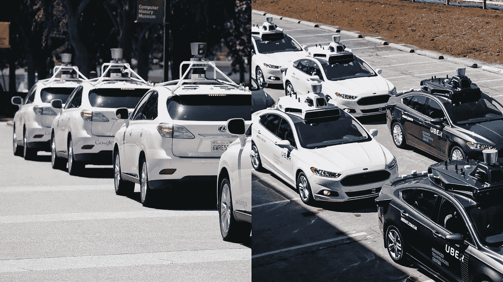
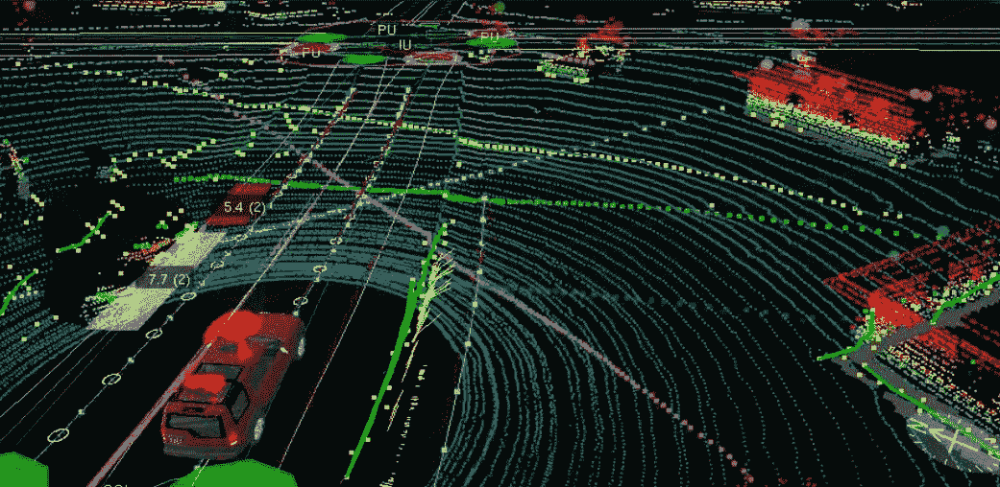
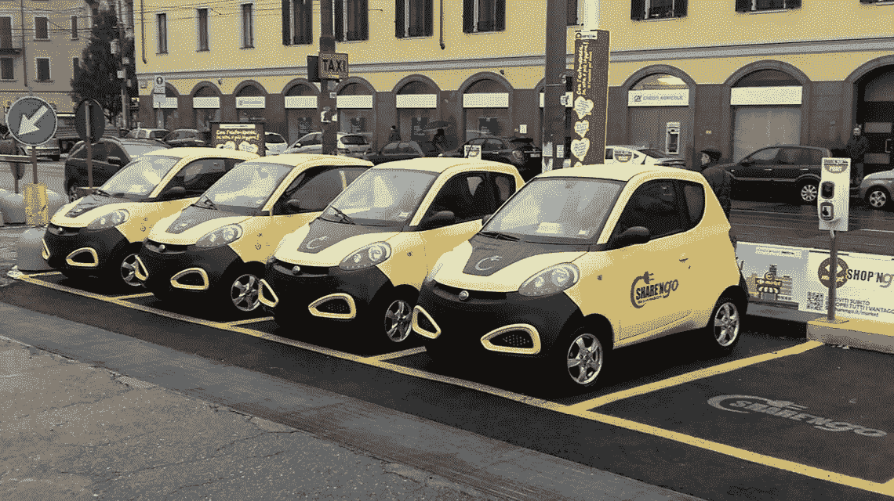

# 自动驾驶汽车行业的竞争正在升温

> 原文：<https://medium.com/hackernoon/competition-in-the-autonomous-vehicle-industry-is-heating-up-22524d71ca5>

在过去的几年里，关于自动驾驶汽车和无人驾驶不可避免的未来的新闻越来越多。今年 2 月 15 日，亚马逊宣布对特斯拉的竞争对手 Rivian 投资[7 亿美元](https://www.cnbc.com/2019/02/15/rivian-announces-700-million-investment-round-led-by-amazon.html)，对独立汽车初创公司 Aurora 投资[5 . 3 亿美元](https://www.forbes.com/sites/alanohnsman/2019/02/07/amazon-eases-into-self-driving-tech-by-joining-auroras-530-million-funding-surge/)。各种技术公司之间的这场竞赛将受到密切关注，它将决定这个快速增长的行业中的赢家。

[据研究公司 Altimeter 的](https://www.slideshare.net/Altimeter/the-race-to-2021-the-state-of-autonomous-vehicles-and-a-whos-who-of-industry-drivers?qid=a94eebab-e99c-4d36-8158-c6700a436b48&v=&b=&from_search=1)称，第一辆完全自动驾驶的汽车可能会在 2021 年左右出现。这是一个现实的预测，基于对现有技术及其近期发展前景的分析，而不是基于消费者对市场的准备程度。部分自动驾驶和完全自动驾驶汽车将在更接近 2035 年的时候实现大众市场渗透。

专家们对无人驾驶汽车的销售潜力及其市场渗透率有不同的看法。例如，[根据一份 IHS 报告的](https://ihsmarkit.com/country-industry-forecasting.html?ID=10659115737)，在 2035 年，渗透率将达到近 17%(其中 7%将是完全自动驾驶)。与此同时，到那时，无人驾驶汽车的年销量将达到 2100 万辆(相比之下，2025 年这一数字预计为 60 万辆左右)。

很明显，从现在到 2035 年，不会有神奇的飞跃，自动驾驶车辆也不会在一夜之间成为大众市场产品。

首先，制造商必须积累大量数据，才能让与无人驾驶系统相关的机器学习技术发挥作用。只有通过积累数百万潜在的真实世界驾驶情况的潜在变化，汽车才能扩展这些知识，并确保高水平的交通安全。

其次，市场参与者将致力于发展自己的专业知识，这将同时发生在两个领域:辅助驾驶部分(高级驾驶员辅助系统(ADAS))，即允许一些驾驶过程自动化而无需驾驶员放弃完全控制的基本技术，以及自动驾驶运输部分。

公司将提升其软件工程能力，特别是在合并原始数据和机器学习、建立战略合作伙伴关系、吸引人才、参与 M&A 活动以及在市场上寻找更便宜或更先进的解决方案等领域。

现在，一些初创企业进入了这个领域，专门致力于帮助大型无人驾驶汽车制造商。我有机会在与[杰·达瓦尼](https://www.linkedin.com/in/jay-dawani-570176109/)、[利莫里安实验室](https://www.linkedin.com/company/lemurian-labs/)的创始人的对话中亲自验证了这一点，这是一家人工智能初创公司，正在秘密准备一种新的数据处理方法，这种方法将有助于实现第四级自主，并已经着眼于第五级。

他认为，如果我们要达到第四级自主，就不能试图模仿人类的驾驶方式，因为这让我们兜了一圈，自动驾驶汽车需要更好。

杰伊·达瓦尼强调:

> 我们需要考虑到这些限制来解决这个问题，不要把它看作是机器人或多智能体系统的问题，而是一个交流的问题

第五级自主是无条件的(即无限制的)自动驾驶，不期望驾驶员会参与。换句话说，第 5 级系统必须在合格驾驶员能够驾驶的任何地方，在驾驶员会遇到的任何条件下，完全靠自己行驶。

一旦足够数量的第四级连接车辆在道路上行驶并被充分教导，第五级系统就有可能产生。日常运行中部署在数千辆汽车上的系统会收集海量数据，会遇到很多新情况；他们将很快自行发展，最终进化到第五级。

在汽车行业市场的技术供应商需要解决的问题中，至少有两个问题对于 ADAS 和无人驾驶汽车的进一步发展至关重要。首先是确保智能汽车内部所有系统和软件的兼容性，智能汽车可以思考并与其他车辆通信。解决这一问题将使 V2V(车对车)交互成为可能，这将显著提高无人驾驶期间的安全水平。第二，将配备 ADAS 和无人驾驶汽车的最终成本保持在仅略高于标准汽车现有定价的水平。

得益于新技术，智能汽车零部件的成本将至少降低一个数量级。根据波士顿咨询集团[的一份报告](https://www.slideshare.net/TheBostonConsultingGroup/the-road-to-autonomous-driving)，在完全自动驾驶汽车出现的最初几年(2021 年至 2025 年)，它们的系统成本大约为 1 万美元。十年后，类似的设备将花费 3000 美元或更少。

即使在今天，也有因新技术而大幅降价的例子。例如，几年前激光雷达传感器(一种光学传感器)的成本为 8 万美元，这使其成为自动驾驶汽车中最昂贵的部件之一。

Similar to sonar, LIDAR sensors create a 3D map of its surroundings using a collection of lasers — [Source](http://thesantaclara.org/hands-free-vehicles/#.XHebpiMueUk)

今天，它的价格约为 8000 美元，去年年底，激光雷达制造商威力登宣布，它正在研究一种新的设计，这种设计可能会使最终产品的成本低至 50 美元。2016 年 8 月，该公司获得了来自百度和福特的 1.5 亿美元投资，他们显然有兴趣让大众市场的自动驾驶汽车更接近现实。今天，威力登与其他高科技公司和汽车制造商一起，正在无人驾驶汽车领域开展 19 个不同的项目。在使全球定位系统、雷达、超声波传感器、摄像机和车载计算机变得更加经济实惠方面，也存在着巨大的潜力。

在 2020 年至 2035 年之间，不仅无人驾驶汽车的技术会有所改进，生产成本也会大幅降低，而且预计司机的心态甚至整个社会都会发生重大转变。汽车制造商首先必须从议程中删除许多问题(不仅是消费者的谨慎，还有监管机构的谨慎，这将得到大量确认无人驾驶安全性的统计数据的帮助)，以及为他们的司机创造新的需求，这些司机在这一点上仍然更喜欢具有半自动功能的汽车(ADAS 将使司机习惯于自动驾驶的汽车)。

我认为，无人驾驶技术的首批追随者将是那些业务与大型车队管理直接相关的公司——在物流、商业运输和农业领域。在这些行业中，购买昂贵的无人驾驶车辆将是合理的，并将通过更便宜的业务成本来收回成本。这将来自于事故率和其他风险的降低，人员成本的降低，以及由此产生的更小的税基。在这个领域，预计在 5 到 10 年内会出现完全自动驾驶汽车的市场。

使用无人驾驶车辆的第一条客运路线将在范围上受到限制。例如，在基础设施和交通法规适合安全无人驾驶的地方，可以考虑在大学或商业校园范围内和城市的其他地方的专用公共交通路线。

影响自动驾驶汽车大众市场发展的一个重要趋势是共享移动性。平均而言，城市车主 95%的时间都不使用自己的汽车，这使得汽车的拥有和维护在经济上非常低效，并且是考虑替代方案的好理由。关注城市交通和环境问题的大城市交通部门也将促进共享移动服务的使用。

自动驾驶汽车非常符合这一趋势，可以成为本地化运输的便捷个性化服务，这将由拼车市场的领先提供商提供。在消费者的行为中，对汽车的认知很可能从仅仅是汽车本身转变为汽车即服务。而且，可以肯定的是，在几年的时间里，一些价值数十亿美元的巨头将会出现，他们将会成为相当于交通工具的 ClassPass 服务。

如今，汽车行业是一个前所未有的技术突破和巨额投资的市场。该行业逐渐认识到，未来的盈利能力将取决于驾驶过程本身的货币化，而不是经典的汽车销售模式，市场参与者将不得不创造一种消费者愿意长期支付的服务。在 ADAS 和无人驾驶系统领域拥有专业知识的公司开始对汽车制造商的商业议程产生显著影响。这适用于他们的业务采购、收购和战略联盟。这方面的例子有很多，其中包括价值数十亿美元的交易。英特尔以 153 亿美元收购了以色列 ADAS 系统制造商 Mobileye。

三星宣布计划以 80 亿美元收购美国公司哈曼，这将使这家韩国公司在互联技术市场获得重要地位。丰田在优步投资，大众向 Gett 投资 3 亿美元，通用汽车向私人 Lyft 司机的搜索服务投资 5 亿美元，这样的例子不胜枚举。该行业在所有领域都火了，这是因为每个人都明白市场正在发生巨大的变化。理解什么不该做也很重要，这样今天的超级明星就不会在明天成为局外人。

无人驾驶技术仍然远非完美，但它正在不断地积极改进，并且在可预见的未来将继续如此。根据高盛的估计，robotaxis 将在未来 12 年内将共享出行服务收入从 50 亿美元增加到 2850 亿美元。因此，风险相当高，许多公司希望尽快将其产品推向市场也就不足为奇了。