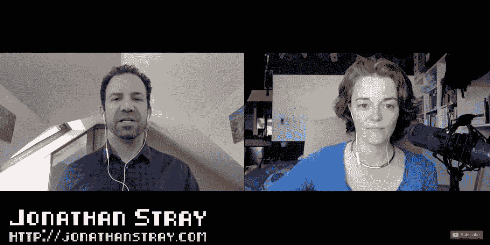

# 计算新闻学:乔纳森·斯特兰德故事背后的数据

> 原文：<https://medium.com/hackernoon/computational-journalism-the-data-behind-the-stories-with-jonathan-stray-7b49aa6045f4>

# 黑客午间播客第 45 集:采访[乔纳森·斯特雷特](http://jonathanstray.com/me)，哥伦比亚大学新闻学院的计算记者和研究员。

没有 T4 的支持，黑客正午播客是不可能的。

## 在 [iTunes](https://podcasts.apple.com/us/podcast/computational-journalism-data-behind-stories-jonathan/id1436233955?i=1000438980131) 上听采访，或者[谷歌播客](https://play.google.com/music/m/Dmdgqfugr5jwxczevvo7q6uimv4?t=Computational_Journalism_The_Data_Behind_the_Stories_with_Jonathan_Stray-Hacker_Noon_Podcast)，或者在 [YouTube](https://www.youtube.com/watch?v=xDRnG08je4E) 上看。

在这一集[中，克里斯·比斯利](https://hackernoon.com/@crisbeasley)采访了[乔纳森·斯特兰德](http://jonathanstray.com/me)，他是计算记者、数据科学家、哥伦比亚新闻学院的研究员，也是未来研究所的研究员。

您将见到 [Workbench](http://workbenchdata.com/) 的创建者，这是一款无需任何编码经验就能分析大数据的工具。

> “我认为自己是一名计算记者，我告诉人们这是两件事。它使用计算技术来做报道，讲述计算和算法如何影响社会。”
> 
> “一个方向可能是将数据科学用于调查性新闻报道。另一个方向可能是，例如，研究如何使用机器学习来决定谁必须在审判前呆在监狱里。”

***——****乔纳森流浪*

 [## 计算新闻学:乔纳森·斯特兰德故事背后的数据

### 黑客正午播客第 45 集:采访乔纳森·斯特雷，计算记者和…

www.podbean.com](https://www.podbean.com/media/share/pb-hrbmv-b1f480) 

制作和音乐德里克·伯纳德—[haberdasherband.com/production](http://haberdasherband.com/production?fbclid=IwAR2d8t0cNGHRm1ajmUNWKZ-TMUMawREhvIHSy54LKcOElf7v_TOvkAjZ78Y)

主持人:克里斯·比斯利—[https://hackernoon.com/@crisbeasley](https://hackernoon.com/@crisbeasley)

*附:如果你喜欢新的* [*黑客午间播客*](http://podcast.hackernoon.com/) *，可以考虑在 iTunes 上给我们一个 5 星评价。*

## 还可以查看[五月头条](https://hackernoon.com/archive/2019/05)、[最新报道](https://hackernoon.com/latest-tech-stories/home)和[今日首页](http://hackernoon.com/)。