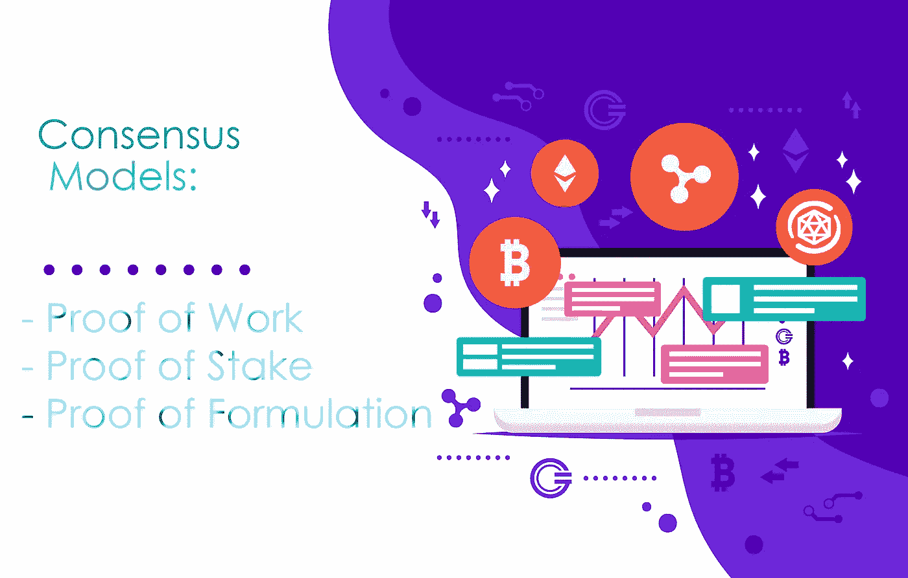
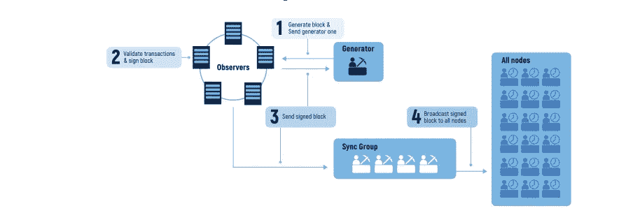
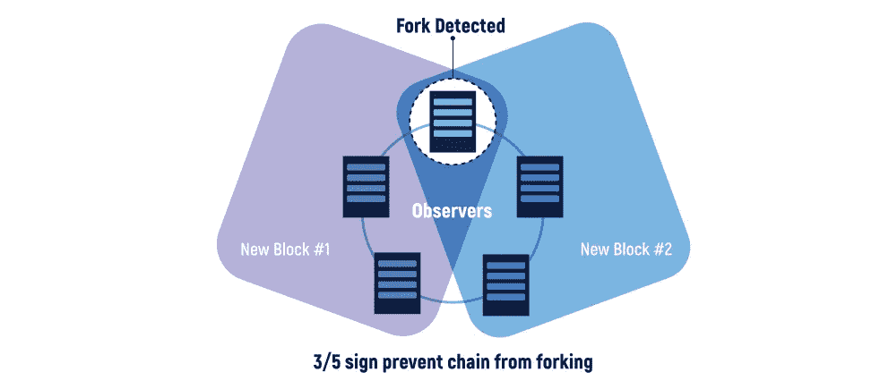

# 共识模型:PoW、PoS 和新先锋，PoF

> 原文：<https://medium.com/hackernoon/consensus-models-pow-pos-and-new-pioneer-pof-702fa2f55d49>

区块链的工作方式经常被混淆。因为人们对这个系统如何取代银行犹豫不决。因为银行从他们的交易中收取很高的佣金。对于银行和 PayPal 等第三方来说，这些佣金率从 10%到 20%不等。

然而，用区块链技术，这个比例几乎是千分之一。当我们在区块链交换加密货币时，需要有人帮助实现这些交易。通过这种方式，我们向促成这些交易的见证人支付佣金。

银行和见证人之间的区别是交易的速度和可靠性，以及他们收到的佣金之间的区别。区块链比银行快得多，可靠得多，便宜得多。那么这些证人是如何通过批准这些交易来获得奖励的呢？

到目前为止有两种方法。第一个是中本聪在他的著名文章中提出的战俘制度。第二个是 2013 年在一个论坛上讨论出来的 PoS 系统。最后，Fleta 的 PoF(美国专利申请号:62717695)系统，这是一个韩国项目。

让我们仔细看看这些共识模型。

工作证明:第一个解决谜题的人将获得奖励。

**先锋** : *比特币*

**追随者** : *以太坊，莫内罗，涟波，EOS，恒星，卡尔达诺等。*

为分布式丛上的设备之间成功达成共识创建工作证明协议，可以说是比特币创始人中本聪的最高成就。这样做，他为区块链的革命性技术奠定了基础。

of Proof of Work 的缩写)是由 pioneer，Bitcoin 引入的共识协议，并被许多其他区块链项目广泛使用..这个过程通常被称为“挖掘”，因此网络上的节点被称为“矿工”。这种能力是以一个数学问题的答案的形式出现的，这个问题需要大量的工作才能得到，但是一旦得到了答案，就很容易被验证是正确的。

回溯一点，我们来谈谈“节点”。节点是运行比特币软件的强大计算机，通过参与信息的中继来帮助保持比特币的运行。任何人都可以运行一个节点，你只需下载比特币软件(免费)并打开某个端口(缺点是它消耗能量和存储空间——编写本文时的网络占用约 145GB)。节点在网络中传播比特币交易。一个节点将信息发送给它知道的几个节点，这些节点将信息转发给它们知道的节点，等等。这样，它最终会很快传遍整个网络。

有些节点是挖掘节点(通常称为“矿工”)。这些将未完成的交易分组并添加到区块链中。他们是怎么做到的？通过解决作为比特币程序一部分的复杂数学难题，并将答案包含在区块中。需要解决的难题是找到一个数字，当它与块中的数据组合并通过哈希函数传递时，会产生一个在某个范围内的结果。这比听起来难多了。

该过程包括确保链中的每个确认的区块通过为在网络上发送货币而收取的交易费以及任何预定的奖励来奖励矿工他们正在开采的加密货币。它确保矿工有动力继续维持区块链，因为他们这样做是有回报的。

由于要解决的谜题的复杂性，这些奖励尤其重要，因为这个过程在时间和计算能力方面都非常昂贵。激励这些矿工是协议的关键功能，因为在某种意义上，他们是保持系统运行的基础。采用了工作证明等系统，因此交易无法伪造，因为伪造交易所需的数据极难产生，但很容易核实。

**赌注证明:你必须参与其中才能赢得比赛**

**先锋** : *贵族*

**追随者** : *Dash，NEO，Pivx 等。*

当试图解释复杂的想法时，一句话的描述往往是一个很好的起点。简而言之:

> 利害关系证明算法通过要求用户对他们的令牌进行一定数量的赌注来达成共识，以便有机会被选中验证交易块，并因此获得奖励。

与工作证明系统不同，在工作证明系统中，用户通过执行一定量的计算工作来验证交易并创建新块，利益证明系统要求用户出示一定数量的加密货币单位的所有权。

新区块的创建者以伪随机方式选择，取决于用户的财富，也定义为“赌注”。在标桩证明制度中，区块被称为“伪造”或“铸造”，而不是开采。在该系统中验证交易并创建新区块的用户被称为伪造者。

利益证明协议不仅能有效地鼓励个人参与系统，还能防止任何个人控制网络。为了实现 51%的攻击，个人或团体需要拥有[网络](https://lisk.io/academy/blockchain-basics/technologies-of-blockchain/what-is-a-peer-to-peer-network)上的大多数硬币。

我认为，在许多方面，利害关系证明(PoS)优于工作证明(PoW ):

1.  PoS 是节能的。由于上述原因，您不需要太多的计算能力来创建新的块，因此 PoS 对环境更好。
2.  PoS 被认为更便宜，因为它需要更少的计算能力或电力。
3.  PoS 似乎更分散，因为串通没有好处。然而，参与组织确实偏爱较大的利益相关者。
4.  PoS 应消除 PoW 带来的 51%的攻击风险。如果你想要 51%的控制权，你需要购买大量的加密货币。

然而，PoS 并不完美。

**配方验证:防止块状物分叉**

**先锋**:弗莱塔

共识是指对块生成的共同理解，特别是，它表示谁生成下一个块或谁在链过程中从已生成的块中选择块。先前的共识使用了一种方法，该方法在整个网络中散布块以供任意用户挖掘。然而，这需要确认或块时间的高恢复，因为只有当新块在整个网络中传播时，矿工才能够生成后续块。作为处理这个问题的一种方法，只挑选了一定数量的矿工，以实现更低的轮挡时间。

FLETA 提出了一个 PoF (Proof-of Formulator)，通过使用 Formulator 奖励序列来指定挖掘目标并缩小传播范围，从而允许快速生成和传播块。此外，观察者节点的存在允许立即认证并防止块分叉。任何人都可以成为制定者，所以大门向所有人敞开。由于公式器的挖掘顺序是固定的，使得新块的传播范围非常小，因此可以实现低块时间。

在达成这一共识的过程中，有两个角色脱颖而出:

1.  **配方师**

制定者代表了达成共识的一个非常重要的部分。谁将被选为配方师取决于几个算法。RankTable 计算所有 FormulationAccount 的分数，并对分数进行排名。生成新块的权限授予最高级别的配方设计师:

**分数:uint64(相位)< < 32 + uint64(二进制。littenen Dian . uint 32(hash[:4])**

“Hash”用作前一个块的散列值，而“Phase”是一个与时间相关的值，它显示了 RankTable 已经“转向”或通过所有用于块生成的公式器的次数。

这样做的目的是为了确保每个配方师在每个阶段至少有一个开采机会，因此将为区块生成的每个阶段制定不同的配方师序列(或等级)。这防止了任何恶意配方师的潜在攻击和勾结。

2.**观察者**

观察员的主要目的是帮助防止针对区块链的 DDoS 攻击。这样，平台的安全性得到了保证和认证。

为了维持系统的顺序和过程，每个制定者都会访问观察者节点，以隐藏自己的 IP。这防止了对配方师的任何形式的有针对性的 DDoS 攻击。此外，观察者节点的存在允许立即认证
并防止块分叉。任何人都可以成为制定者，所以大门向所有人敞开。

**防止滑车分叉**

当最高等级的制定者生成块并接收到观察节点的签名时，观察节点签名并存储该块。当同步组对签名进行签名时，它会接收到该块，并且区块链会继续进行，这样，如果发生分叉块，它将无法通过观察点节点，从而通过设计防止分叉的发生。

该概念是，当公式器顺序被正确配置时，第一级节点仅具有生成和签署块的权利，在该阶段，使两个或更多个块分叉区块链将被观察节点停止。因此，如果公式化器等级顺序是同步的，则仅通过验证块生成器和观察器节点签名，就可以仅接收未分叉的块。

> 因此，生成的块是决定性的，观察节点批准的所有事务都会立即得到确认。

通过 observer 节点的实现，攻击者无法创建 fork 块来诱导双重支付。此外，由于块生成的主体是配方者，所以区块链维护也由创建配方者的个体来完成，并且由于观察节点不需要补偿，所以奖励仅给予拥有配方者的个体。

**丢弃有缺陷的块**

如果块生成器发送了不正确的块，接收节点将丢弃该块并准备接收新的块。在这种情况下，生成器有 1 秒钟的时间来产生一个正常的块，否则排名第二的制定者将开始创建一个新的块，如果最初的制定者仍然没有提出一个新的块，该新的块将在 3 秒钟后被传播。

观察节点将确认初始生成器未能在 3 秒内创建块，并因此继续进行来自排名第二的制定者的块的签名过程。

**TLDR；**

用于块验证的特定组是观察点节点。如果 5 个观察节点中有 3 个确认了块，则可以生成块。一开始，观察者节点由 FLETA 控制，但是我们将把这些节点操作委托给第三方，比如超级公式验证器。

观察节点的作用只是确保双倍支出。因此，与 PoW 或 PoS 不同，拥有操作挖掘节点的每个人都提议生成块，等级是根据算法指定给他们的——例如，公式化操作的持续时间——他们将创建块，并根据等级顺序获得块奖励

**注**:除此之外，观察者节点将委托给名为*超级配方师网络*的第三方

**结论**

利害关系的证明无疑是一种过时的共识。当使用这种模式的项目价格很低时，这是相当昂贵的。因为它消耗大量的电力和时间。作为消耗更少能量和更有效的算法，

但是…

PoF 共识比 PoS 共识更安全、更快捷。毫无疑问，随着区块链的发展，它的技术也在发展。但我们目前的印象是，PoF 系统正为一个非常有价值的目的发挥带头作用。

与 PoW consensus 不同，PoF 不需要过多的计算资源，也不依赖于某人拥有的“股份”数量。正因为如此，当每个人都有机会时，它减少了关于谁挖矿和造块的竞争。PoF 也有内置的机制，以防止任何类型的叉子的可能性。你可以在 FLETA 的 [**白皮书**](https://fleta.io/download/181028_fleta_whitepaper_EN_Web.pdf) 、 [**科技论文**](https://fleta.io/download/181024-TechWhitepaper_EN_V2-web.pdf) 、 [**Alpha Testnet 报告**](https://fleta.io/download/181214_fleta_ATRReport_EN.pdf) 中了解更多关于 PoF 的信息。

> **法律免责声明**:本文仅供一般指导，不构成法律投资建议。
> 
> **披露**:我不是任何加密货币或 Fleta 的成员。我也没有被 Fleta 雇佣。投资时所有的风险都是你的责任。

# 来源

1.  [https://www . coin desk . com/information/how-bit coin-mining-works](https://www.coindesk.com/information/how-bitcoin-mining-works)

2.[https://lisk . io/academy/区块链-基础知识/区块链-工作原理/工作证明](https://lisk.io/academy/blockchain-basics/how-does-blockchain-work/proof-of-work)

3.[https://medium . com/na kamo-to/what-is-proof-of-stage-pos-479 a 04581 f3a](/nakamo-to/what-is-proof-of-stake-pos-479a04581f3a)

4.[https://hackernoon.com/what-is-proof-of-stake-8e0433018256](https://hackernoon.com/what-is-proof-of-stake-8e0433018256)

5.[https://lisk . io/academy/区块链-基础知识/区块链-工作原理/利害关系证明](https://lisk.io/academy/blockchain-basics/how-does-blockchain-work/proof-of-stake)

6.[https://www . Forbes . com/sites/forbestechcouncil/2019/01/28/proof-of-work-and-proof-stage-how-reaches-consensus/# ba 636 af 68 c 82](https://www.forbes.com/sites/forbestechcouncil/2019/01/28/proof-of-work-and-proof-of-stake-how-blockchain-reaches-consensus/#ba636af68c82)

7.[https://medium . com/fleta-first-chain/breaking-down-fletas-proof-of-formulation-2860 c6cb 7178](/fleta-first-chain/breaking-down-fletas-proof-of-formulation-2860c6cb7178)

8.[https://www.fleta.io/](https://www.fleta.io/)

9.[https://fleta . io/download/190426 _ buis ness _ white paper _ EN _ web . pdf](https://fleta.io/download/190426_Buisness_Whitepaper_EN_web.pdf)