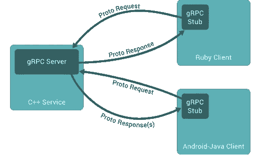
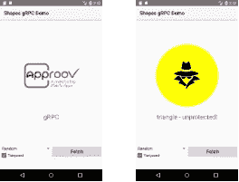
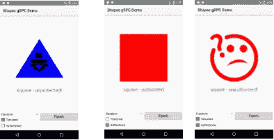

# 考虑移动 API 的 gRPC

> 原文：<https://medium.com/hackernoon/consider-grpc-for-mobile-apis-2f0a8552ec23>

## **评估 gRPC 请求-响应、认证和流式传输**

gRPC 是一个开源的远程过程调用(RPC)框架，它运行在许多不同的客户端和服务器平台上。它通常使用协议缓冲区(protobufs)来有效地序列化通信的结构化数据，并且广泛用于分布式和基于微服务的系统中。

根据 [grpc.io](https://grpc.io/) 的说法，grpc 和 Protobuf 提供了一种简单的方法来精确定义服务，并为 iOS、Android 和提供后端的服务器自动生成可靠的客户端库。客户端可以利用先进的流和连接功能，帮助节省带宽，通过更少的 TCP 连接做更多的事情，并节省 CPU 的使用和电池寿命。

听起来很有希望，我们将通过几个初始场景来感受使用基于 gRPC 的 API 在 Android 上开发移动应用程序是多么容易。特别是，我们将检查:

*   一个基本的请求-响应 API 调用
*   基于令牌的认证
*   单个请求、流响应 API 调用

# gRPC 概念

表述性状态转移(REST)是最终用户应用程序使用的主要 API 风格，包括 web 和移动应用程序。RESTful APIs 使用 HTTP 1.x 请求-响应模型，并围绕资源构建，作为由标准 HTTP 动词(get、post、put……)操作的端点。大多数 RESTful API 实现并不严格遵守所有 REST 原则，但是随着 API 使用的激增，这种范式已经证明了它的灵活性和良好性能。

远程过程调用(RPC)系统是面向功能的，围绕一组强类型消息构建服务，这些消息自动从您的编程语言的表示形式转换为网络格式，然后再转换回来。gRPC 充分利用了 HTTP/2 的二进制协议和多路复用流。

**Source:** [**grpc.io**](https://grpc.io/docs/guides/)

在客户端，gRPC *存根*充当 gRPC 服务的接口。客户端向存根发出一个 *rpc 调用*，存根通过*通道*向服务器发送一个或多个 proto 请求消息，并从服务器接收一个或多个响应消息。在 rpc 调用期间，可以在客户机和服务器之间发送额外的键值元数据。呼叫状态和错误(如未知的呼叫方法、超时或取消)将与响应一起报告。

RPC 调用类型包括:

*一元*:这是一个简单的单个请求、单个响应流。当客户端调用服务器方法时，服务器接收客户端元数据和方法名。服务器可以用自己的元数据进行响应，或者等待客户端的请求消息。一旦接收到请求，服务器将执行该方法，然后向客户端发送响应和状态代码。

*服务器端流*:服务器收到客户端请求消息后，发回一个响应流。一旦客户机得到所有服务器的响应，它就完成了。

*客户端流*:客户端向服务器发送多个请求的流。服务器发回单个响应、其状态细节和可选的尾部元数据。

*双向流*:客户端发起呼叫，客户端和服务器通过独立的流互相发送信息。客户端最终会关闭连接。

# 形状演示 API

像大多数 RPC 系统一样，gRPC 使用接口定义语言(IDL)来定义功能服务契约。对于 gRPC，使用的 IDL 是[协议缓冲区](https://developers.google.com/protocol-buffers/)。服务在一个 *proto* 文件中定义，该文件包括调用方法及其请求和响应消息结构。

可选的特定于语言的信息被添加到 proto 文件中，以帮助为特定语言目标生成客户机和服务器界面。

我们简单的演示 API 将被一个用 Java 编写的 Android 客户端使用。shapes API 使客户端能够请求和接收特定或随机形状的单个或流。下面是基本的原型文件:

Shapes 服务定义了两个调用，FetchShape 和 StreamShapes。两者都发送 ShapeRequest 消息。fetch 调用接收单个 ShapeResponse，stream 调用接收 shape response 流。

消息由类型化字段组成。标量类型包括典型的语言类型，如字符串或各种固定宽度的整数。消息还可以包含其他嵌套的消息类型。每个字段都有一个默认值，例如字符串字段为" "。未显式设置的消息字段将具有默认值，这些默认值不会通过网络发送。字段是单数(零或一个值)或重复的(零到多个值)。每个字段都有一个整数 ID (field = ID ),这有助于在某些字段可能丢失或重复时对消息进行有效编码。

协议缓冲语言指南包含了更多的信息。

稍后将使用元数据进行身份验证，但是元数据没有被定义为服务描述的一部分。

Android 客户端和后端服务器使用相同的 proto 文件。出于演示目的，后端 shapes 服务器被实现为一个简单的 node.js gRPC 服务器。在这种情况下，proto 文件在服务器启动时被读取，gRPC API 接口被生成并映射到实现一元和流响应的本地服务函数。

# 获取形状

我们首先创建一个新的 android 项目，并将 gRPC 插件和依赖项添加到顶级 build.gradle 文件中:

以及应用程序的 build.gradle 文件:

gRPC 插件将为 proto 文件中定义的 shapes 服务生成 java 接口类。对于简单形状 API，这些是用于生成存根的`ShapesGrpc`类，以及`ShapeRequest`和`ShapeResponse`类。

我们将使用一个`ManagedChannel`来管理客户机-服务器连接。它是随着`Activity`号的发射而建立的:

应用程序启动并显示形状选择器(圆形、正方形、矩形、三角形或随机)和获取按钮。按下获取按钮会返回四种形状之一:

**Shapes Demo: initial launch screen and fetched shapes**

阻塞的 FetchShape RPC 调用是在主 UI 线程的`AsyncTask`内部进行的:

后台任务首先创建一个阻塞存根，构建 shape 请求，并通过存根进行 fetch shape 调用，这将一直阻塞，直到收到响应或出错时抛出异常。在 java 框架中，基本的请求-响应流程是非常自然的。

# 认证应用程序

为了准备演示身份验证，我们添加了一个被篡改的复选框。单击时，它会破坏 API 调用，导致服务器返回不正确的形状。

**Shapes Demo: tampered app and resulting incorrect fetched square**

gRPC 元数据作为键值对传递，类似于普通 HTTP 请求和响应中的头。为了演示 gRPC 中的身份验证，我们将使用[approv app 完整性检查](https://approov.io/)。Approov 是一种第三方服务，用于证明应用程序没有被篡改，并且正在安全的环境中运行。Approov 服务返回一个短期的 JWT 令牌，该令牌由 gRPC 服务器已知的秘密签名。

在获取形状后台任务中，我们获取一个 Approov 令牌，并在进行 RPC 调用之前将其添加到元数据中。添加了一个保护复选框，以启用/禁用添加 Approov 令牌。

以下是启用了身份验证的未篡改应用程序与被篡改应用程序的对比结果:

**Shapes Demo: unprotected, authorized, and unauthorized shape fetch requests**

向元数据添加“头”与向 REST API 调用添加头没有什么不同。其他认证技术，如用于用户认证的 OAuth2，将遵循与使用[approv](https://approov.io/)演示的流程相似的流程。

像许多网络软件包一样，gRPC 也有一个*拦截器*的概念。这些可以用作中间件来修饰每个请求或响应。在生产应用程序中，将身份验证检查重构到拦截器中将简化每个 API 调用的代码。

# 获取形状流

gRPC 很好地支持请求和响应流。服务器端流非常容易实现，其中一个请求后面跟着多个响应。在我们的演示中，我们添加了一个`streamShapes`调用，并使用迭代器循环处理可变数量的响应:

通常，该请求将返回五个逐渐变暗的形状；但是，检测篡改的受保护应用程序将返回一个无效的形状图像:

**Shapes Demo: stream of five fetched shapes and an unauthorized stream request**

与单响应情况一样，多响应情况非常自然地符合 Java 语言语义。

# 更进一步

我有点怀疑 gRPC 对于移动 API 的使用是否有效，但是 RPC 函数调用范例感觉比设计和实现一个完全 RESTful 的 T2 API 实现更自然。能够从单个原型文件中为许多目标语言生成客户机和服务器 API 接口是非常有吸引力的。当 API 是静态的并且很好理解时，我会毫不犹豫地从移动客户端使用 gRPC。

gRPC 中我想进一步探讨的主题:

*证书锁定*:虽然 gRPC 使用 TLS，但这并不能阻止中间人攻击，因为攻击者可以在客户端设备上安装自己的证书。在 Android 上，gRPC 中的[证书锁定](https://hackernoon.com/hands-on-mobile-api-security-pinning-client-connections-ebee4d82a911)应该可以通过进入底层 OKHTTP 服务来实现。

*客户端拦截器*:拦截器便于从每个 API 调用中分解出常见的动作。要测试的两个移动场景是认证和[请求签名](https://blog.approov.io/practical-api-security-walkthrough-part-3)。

*双向流媒体*:在 Android 中，服务器端流媒体几乎太容易了。下一步应该是构建一个完全双向的流，看看它如何转化为 Java。

当 API 用法不太为人所知，并且在单个 API 调用中形成返回的数据非常重要时，我可能会犹豫是否直接使用 gRPC 实现。在这些情况下，GraphQL 似乎更适合客户端 API 接口。用映射到一个或多个 gRPC 后端服务的解析器来实现 GraphQL API 网关，似乎可以提供两个世界的最佳选择。这也是一个有趣的探索。

要了解更多关于 API 安全性和相关主题的信息，请访问[approv . io](https://www.approov.io/)或在 twitter 上关注 [@critblue](https://twitter.com/critblue) 。