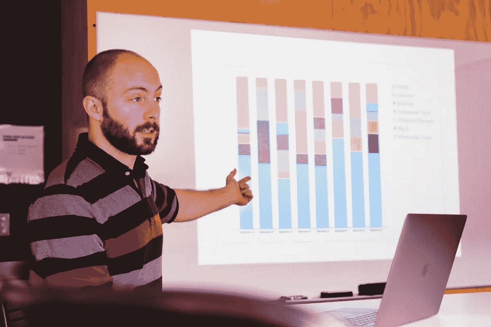
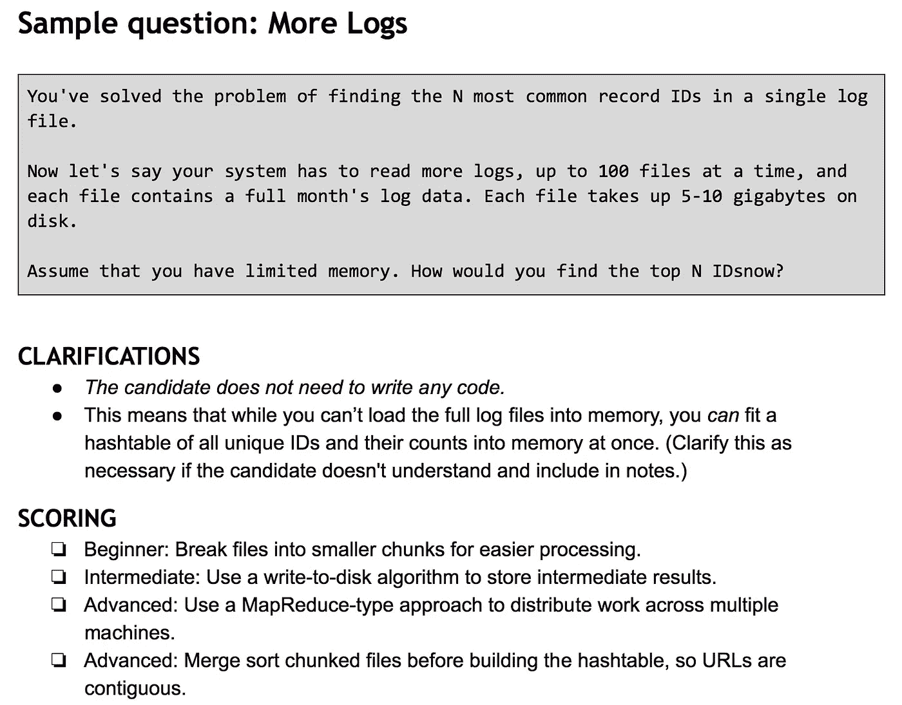
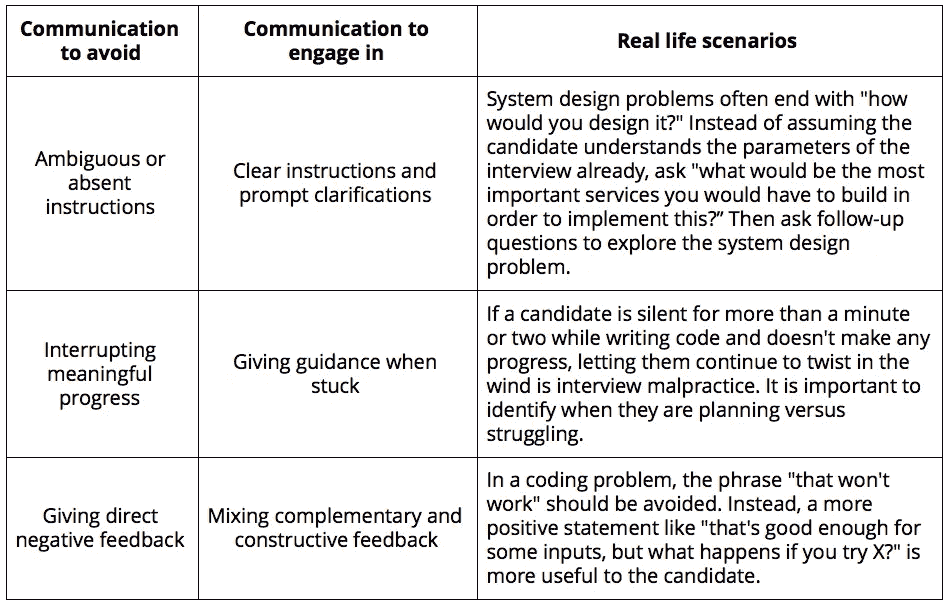

# 一致性是关键:预测性技术面试初学者指南

> 原文：<https://medium.com/hackernoon/consistency-is-key-the-beginners-guide-to-predictive-technical-interviews-4477e2aaf741>

My colleague, Director of Alignment Engineering Josh Lawrence

*由扎克·范·肖文负责采访内容。*

技术面试是每个公司在招聘软件工程师时都会做的事情，但结果往往喜忧参半。不幸的是，错误的雇佣很常见。负责进行技术访谈的团队成员可能会使用他们熟悉的方法，但其他人不了解这种方法，也没有测试过这种方法预测绩效的能力。

什么会出错？采访者可以:

*   假设候选人知道成功的标准(当他们不知道的时候)
*   无意中高估了一个不相关问题的答案
*   以不同的方式与每个候选人交流

以上只是几个会造成面试不一致的动作。这将减少最有能力预测潜力的因素的信号——或者根本无法测量它们。优秀的候选人可能最终被拒绝，而他们本可以为组织增加重要的价值。

在问题、候选人的背景知识和面试官的沟通风格等变量中创造一致性，可以大大有助于确保面试中唯一的变量是你试图评估的那个人——候选人。

作为 Karat 的面试内容总监，我与我们的客户一起准确定位每个职位中哪些能力对成功至关重要。这引导我们选择合适的问题来提问。同样多的工作用于决定*如何*以最准确地确定候选人潜力的方式向他们提问。

为了准确识别最有可能在软件工程角色中取得成功的候选人，我们在第一轮技术面试中控制了几十个甚至几百个变量。以下四种方法可以极大地影响技术面试预测现场和工作表现的能力。

## 通过向面试官和候选人提供成功的标准来降低误判的风险。

如果西蒙娜·比尔斯不知道那些颁发奖牌的人眼中的成功是什么样的，她就不可能一直赢得金牌。面试一份需要特殊技能的工作其实没什么不同。

候选人和参加面试的人应该充分了解与该职位相关的技能和能力。这些应该在整个组织内达成一致，并且在面试过程中可以衡量。比如，你关心候选解在时间/空间复杂度上的最优性吗？如果是，你如何衡量这种技能，它对未来工作表现的预测性如何？当面试官和应聘者都知道哪些标准是成功的决定因素时，应聘者会在面试中表现得更好。这降低了假阴性的风险。

为了确保标准清晰，建立成功的样子以及如何衡量它。这应该由所有团队成员进行沟通并达成一致。对某些行为或技能进行分类，然后使用描述性陈述来确定初级、中级和高级工作是什么样的。

下面是一个带评分指南的样题。对于上下文，这是一系列问题中的第三个问题。

The candidate and interviewer see the question, while clarifications and scoring categories are seen by the interviewer.

这个问题为候选人提供了清晰的背景和说明。同样，它也为面试官提供了清晰的评分标准。任何面试官、招聘经理或招聘人员在审查应聘者的面试结果时，都会清楚地知道“初级”和“高级”的区别。

## 成功的标准应该基于与工作相关的任务。

2017 年，软件工程师和数据科学家 Tikhon Jelvis 在 [Quora](https://www.quora.com/What-is-the-future-of-software-engineering-interviews-Behavioral-interviews-and-brainteasers-have-fallen-out-of-favor-Nowadays-software-engineering-interviews-seem-to-revolve-around-algorithmic-problem-solving-and-some-software-design) 上回答了“软件工程面试的未来是什么？”他说，“我不知道接下来会发生什么，但我知道接下来应该发生什么:仔细校准和标准化的工作样本测试。”

技术面试应该预测现场和工作中的表现。因此，技术面试必须依赖于在现实生活中的相关问题和挑战中表现出来的表现。如果你的公司似乎经历了很高比例的误判(即在技术筛选后拒绝候选人)，但后来发现候选人去了一个高标准的竞争对手，你的技术面试可能没有准确评估与工作相关的技能。

例如，我见过一些优秀的候选人在没有正确回答以下问题后被 Java 开发人员拒绝:“给定四个点的(x，y，z)坐标，确定它们是否都在一个平面上。”这可能与一些游戏设计师有关，但不是典型的后端开发人员。

在确定哪些问题和标准与你要招聘的职位真正相关的过程中要严格。那些不相关的问题可能会让你拒绝一个原本很棒的候选人。

## 面试中的交流和问正确的问题同样重要。

你可能会问，语言和非语言交流与一致性和预见性有什么关系？在技术面试中，沟通是一个非常重要的控制变量。面试令人伤脑筋。面试官的交流和行为会加剧应聘者的压力，扼杀他们解决问题和创造性思维的能力。这对公司和候选人都没有好处。如果那些负责面试的人没有接受过培训，那么很有可能面试官的沟通在你的组织中是不一致的。

下面是一些面试官应该避免的交流方式的例子，而是他们应该参与的交流方式。

Examples of three communication styles interviewers should avoid and three to engage in.

仔细思考面试中的交流和行为是不够的。参与技术面试的团队应该在很长一段时间内练习角色扮演，并有明确的指导方针，以便真正做到正确。在 Karat，面试工程师从未真正停止实践和改进——他们被要求在代表客户进行技术面试之前完成 25 小时的实践。随着时间的推移，他们不断进行质量检查。

## 问责制是必须的。

创造一致的问题，定义你的成功标准(并保持透明)，以及加强适当的面试官沟通都很重要，但如果这些标准没有在一个连续的反馈循环中进行评估，面试就有变得不一致的风险，并且无法预测。经验不足的面试官需要具备结构化和基于数据的最佳实践来进行技术面试。如果不加以检查，即使是强有力的面试官也会养成坏习惯。

为了使技术访谈在一段时间内保持一致性和可预测性，技术访谈应该被完整地记录(当然是在允许的情况下),并由更有经验的访谈者进行评估，以检查导致不一致的偏差。

随着时间的推移，这种反馈帮助面试官变得更加一致，更不容易出现这些偏差——许多人甚至能够完全避免这些偏差。

## 最后的想法

一致的技术面试是确保候选人的潜力得到真正评估并向招聘团队提供准确的潜力评估的唯一方法。我个人看到过不一致和不相关的面试导致太多优秀候选人被拒绝(这种行为不成比例地影响了代表不足的少数群体)。在 Karat，我的工作就是确保这不会发生。这种专注的宣传对求职者有明显的好处，但它也有助于招聘公司，因为他们发现更多的求职者正在进入正确的角色，更快地变得更有效率——并有良好的面试体验让他们达到目的。

*要了解更多关于 Karat 的信息，请访问 Karat.com***。**