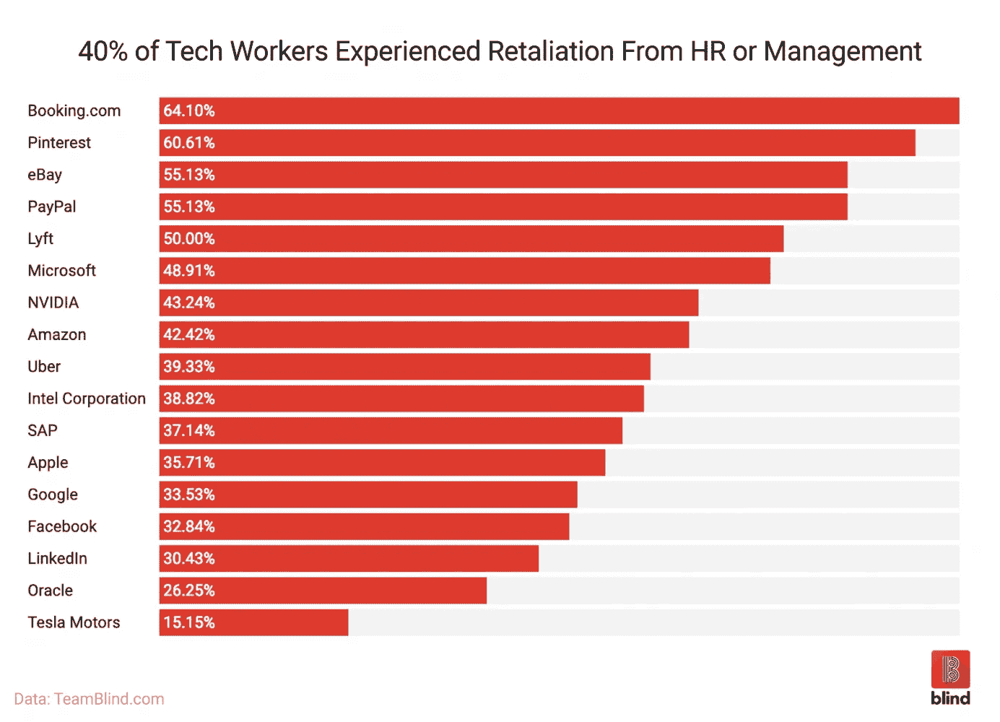

# 企业自相残杀

> 原文：<https://medium.com/hackernoon/corporate-cannibalism-e024fe4246c9>

在优步、T2、谷歌和微软的人力资源部门和领导团队一连串的违规行为之后，这些违规行为包括歧视、虐待、煽风点火、裙带关系、反对异见、压制和报复自己的员工，这些公司内外的 Stans 们似乎都满足于这种企业规模的自相残杀。尽管没有道德基础，同时与企业媒体保持公然与这种行为相反的叙事相矛盾，但这些相同的标准似乎证明了这种行为及其结果是人力资源的核心职能，损害控制。这几乎是不言而喻的，但这在几个方面存在根本性的缺陷。

首先，值得强调的是，对员工有利的事情对企业也有利，这并不是什么秘密；尤其是当你雇佣他们在行业最高水平上进行创新的时候。没有先例或商业理由以牺牲受害者、反对者和称职的雇员为代价来保护无能者和施虐者；尤其是在一个颠覆是游戏的名字的行业。甚至没有一门哲学或学术学科能让人们明白这些策略，更不用说建议在一家价值 10 亿美元的科技公司的任何规模上应用它们了。

尽管看起来有些陈词滥调和理想化，但公司是员工的宏观状态，而不仅仅是其领导层，为了保护公司，你必须首先保护员工的整体利益；包括领导力。事实上，与此相反的做法普遍遭到反对，其中一些是非法的，这很可能是为什么利用它们的部门似乎竭尽全力隐藏它们的应用。即使这并不违法，但在违背员工最佳利益的情况下使用这些同类相残的策略对企业来说是如此可笑的自我毁灭，以至于没有一个人力资源主管敢公开建议在任何情况下利用它们。

也就是说，保护一家公司和保护公司内部滥用职权的人是有明显区别的。除了完全违法之外，不需要同行审查研究就可以预测违法的长期影响，以便让有才华的人保持沉默并将其驱逐出公司，其中许多人都是他们所在领域的佼佼者。尤其是当所有这些都有利于那些无法控制自己情绪和/或性欲的经理，需要一个优秀的法律和人力资源团队来让他们继续工作的时候。

保护现状和保护公司也有明显的区别；尤其是在科技公司。变革是科技公司的核心，仅仅是现状的存在对变革的影响有限，就像生活中的其他地方一样。保护旧的习惯和过时的领导似乎只是在牺牲整个公司的变化和发展。要想知道这种方法会多么停滞不前，只需看看微软的领导层，以及他们无法超越相同的旧 Windows、Office 和服务器产品

不用说，很难看出这种行为有什么理由符合公司的最大利益，包括公司内部的保守领导层。除了目前的领导层和他们雇佣的法律/人力资源部门来利用这些压制策略，谁会对公司保护员工和受害者(re:公司)免受虐待者的伤害而不是像天主教牧师一样为虐待者做损害控制而感到愤怒？投资人？没有员工呢。号码

总之，虽然有些人似乎认为压制这些员工有利于公司，但现实是，这些公司将受到所有法令保护言论的员工的欢迎，同时公平透明地受理滥用和异议的索赔。这种愤怒似乎与其说是源于虐待，不如说是源于人们对虐待的不作为和无情反应，这些人假装好像很在乎，以及随后在他们监督下发生的虐待。

Source: [https://www.teamblind.com/blog/index.php/2019/03/12/40-of-tech-workers-experienced-workplace-retaliation/](https://www.teamblind.com/blog/index.php/2019/03/12/40-of-tech-workers-experienced-workplace-retaliation/)

按照法律顾问的解释，这种性质的公司自相残杀是法律的负面形象。但是法律和最佳实践之间是有区别的，就像保护领导和保护公司之间有区别一样，特别是当保护领导导致排斥世界上最好的公司时。这种方法在战略上是前所未有的，对任何规模的公司都没有记录在案的好处。事实上，这种行为似乎只对施虐者和受雇保护他们的人有利，而那些延续这种行为的人似乎只是在为自己的不作为辩护。尽管如此，世界上一些最大的公司似乎参与了公司自相残杀，好像这是教条，充分说明了他们领导的真实性质。