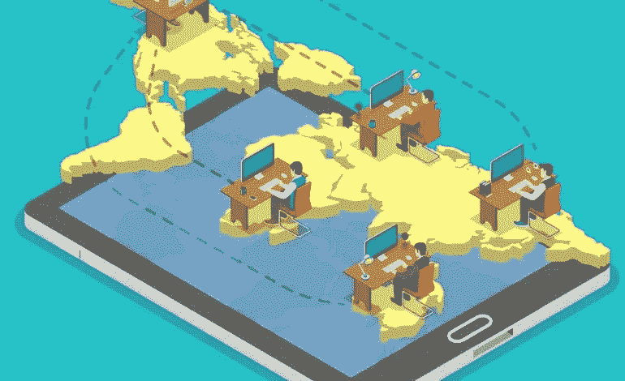

# 科技会让办公室过时吗？

> 原文：<https://medium.com/hackernoon/could-technology-make-offices-obsolete-9efc1be747c4>

我经常想到这个问题:技术会让办公室过时吗？如果按照目前的趋势，答案似乎是肯定的。我们不是在谈论那些难以满足运营支出的小型家庭企业和初创公司。相反，这是关于大公司正在远离雇员每天向办公室报告的传统要求。

从各种渠道获得的事实和数据只能证实我的断言，即技术将使办公室变得过时。事实上，它已经在这样做了。

# 准确的情报

这些事实和数据最终证明，技术正在让办公室变得过时——至少目前是部分过时。

*   领先的办公空间提供商 IWC 2018 年的一项研究显示，全球超过 70%的员工每周至少在家工作一次。
*   关于[5730 万美国人作为自由职业者在家工作。其中，47%是千禧一代。](https://www.upwork.com/press/2017/10/17/freelancing-in-america-2017/)
*   自 2017 年以来，零工经济为[美国经济贡献了超过 1.4 万亿美元](https://www.statista.com/topics/4891/gig-economy-in-the-us/)。
*   包括美国运通、亚马逊、戴尔、苹果和 Glassdoor.com 在内的大公司越来越多地允许现有员工和新员工在家工作。
*   不断上涨的房地产价格甚至迫使大公司重新考虑租用办公空间。相反，他们提供在家工作的机会。

这五点表明，办公室确实正在过时，而技术正日益推动这一趋势。

然而，这还不是全部。科技会让办公室变得多余，还有其他原因。

# 技术和更高的生产力

员工更高的生产率是公司雇佣远程办公或远程员工的最大决定因素。更高的生产率、更好的工作满意度和员工更健康的生活方式是公司允许员工工作的优势之一。[研究充分证明了这个事实](https://www.inc.com/scott-mautz/a-2-year-stanford-study-shows-astonishing-productivity-boost-of-working-from-home.html)。

此外，远程工作人员的收入也比传统办公室工作人员高出约 7，000 至 10，000 美元。因为他们获得了更多与生产率挂钩的奖金和其他激励。此外，远程员工也享受更幸福的家庭生活，这是每个员工都追求的。

由于互联网技术的进步，远程工作本身成为可能:它允许灵活的工作时间。

# 云计算

将[运营迁移到云技术](/the-crossover-cast/the-drive-to-not-drive-whats-behind-the-remote-work-revolution-d9ee5c28dd99)是技术如何淘汰办公室的一个很好的例子。

以前，容纳服务器及其支持基础设施是大多数公司头疼的问题。主要原因是——它们的维护成本很高，容易因为各种原因而频繁崩溃，并且需要大量的支持基础设施，如空调。进入云技术，服务器很快就会灭绝。

云计算使位于世界任何地方的员工都可以联系他们的雇主开展任何业务。而且云软件的成本远低于服务器和维护。通常，云软件开发者会免费或通过订阅提供必要的更新。一些公司声称，在转向基于云的平台后，他们节省了超过 15%的运营成本。

# 区块链

几年来，区块链是一项不太为人所知的技术。其主要目的是交易包括比特币在内的加密货币。多年来，这种情况正在发生变化。银行和其他组织现在将[区块链视为一种有效的解决方案](https://www.blockchain-council.org/blockchain/blockchain-technology-encouraging-freelancers-to-work-remotely/)，以满足日益增长的更快交易和商业交易的需求。

区块链技术的进步及其被金融公司采用正在全球范围内创造远程就业机会。区块链及其流程在世界大部分地区都可以轻松访问。随着企业越来越多地采用区块链，我们将看到传统办公室变得过时。

# 远程工作应用

脸书的 Workplace、TeamViewer、[、微软 Remote](https://play.google.com/store/apps/details?id=com.microsoft.rdc.android) 都是使用智能手机实现远程工作的应用。有些是免费的，有些则需要订阅。它们的成本只是建立一个完整的、设备齐全的办公室的一小部分。这些应用程序使公司能够跟踪员工绩效，同时支持远程员工之间的协作。

同时，移动技术也有相应的进步。我们已经在世界一些地方拥有了高速的第五代(5G)和第四代(4G)移动互联网。

智能手机制造商，包括那些使用 Android 平台和苹果的制造商，正在升级设备，以适应移动技术的进步。这意味着远程员工可以更加灵活地在移动中工作。这意味着传统办公室的末日即将来临。

# 物联网

世界经济论坛称，预计到 2020 年，全球将有超过 2000 万台物联网设备投入使用。不是没有原因的。物联网正以冰箱、空调和其他电器的[形式稳步进入家庭。同样的推论是，物联网也在企业界稳步前进。](https://bestproductslist.in/best-refrigerators-in-india/)

物联网是实现在家工作或远程工作的关键之一。它允许远程工作者与他们的办公室联系，不受时间和地点的限制。作为回报，这转化为更好的生产力和更高的利润。与之形成鲜明对比的是，传统办公室的情况很糟糕:它们在固定时间办公，需要昂贵的员工和基础设施。

# 结论

这些事实表明，技术将使办公室过时。远程工作与技术相结合，使各种规模的企业能够在世界任何地方雇佣到拥有急需技能的员工。此外，它将消除地理边界。未来几年，我们将会看到更多的新技术出现，让办公室变得多余。